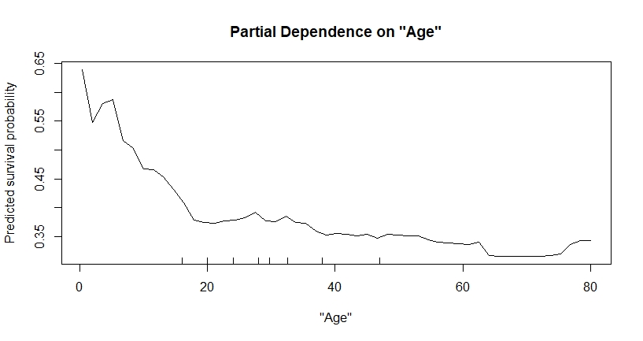
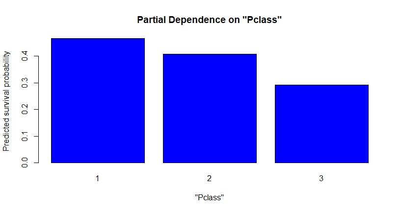
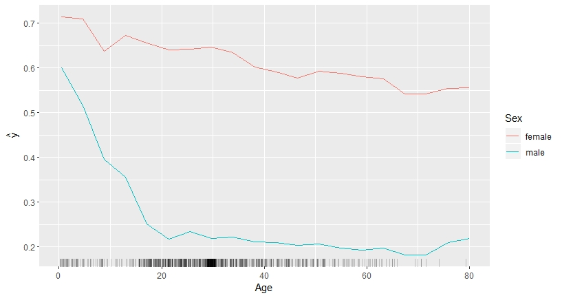
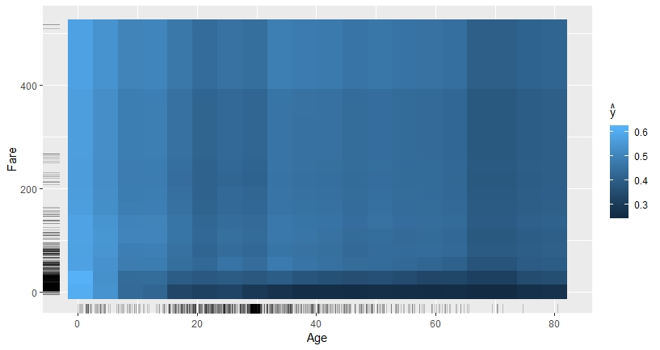
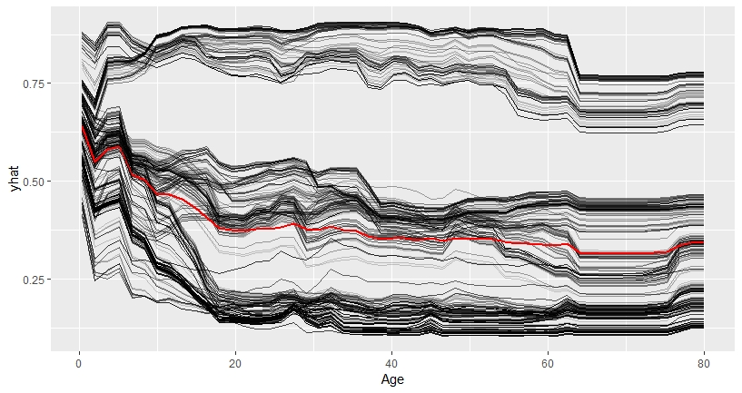
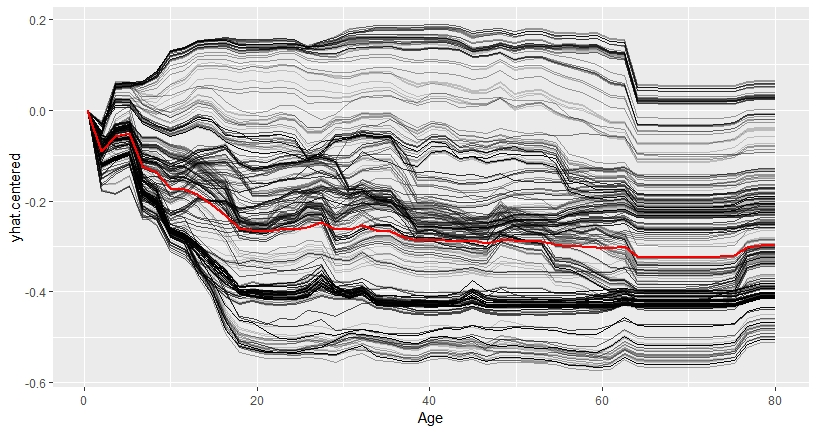

# Introduction to Partial Dependence Plots (PDP) and Individual Conditional Expectation (ICE)

## Partial Dependence Plots (PDP)

The Partial Dependence Plot (PDP) is a rather intuitive and easy-to-understand visualization of the features' impact on the predicted outcome. If the assumptions for the PDP are met, it can reveal the nature of dependence structure. More precisely, mapping the marginal effect of the selected variable(s) uncovers the linear, monotonic or nonlinear relationship between predicted response and individual feature variable.\citep{molnar2019}

The underlying function can be described as follows:

Let $x_S$ be the set of features of interest for the PDP and $x_C$ the complement set which contains all other features.
While the general model function $f(x) = f(x_S, x_C)$ depends on all input variables, the partial dependence function marginalizes over the feature distribution in set C \citep{hastie2013elements}:

$$f_{x_S}(x_S) = \mathbb{E}_{x_C}[f(x_S, x_C)]$$


The partial dependence function can be estimated by averaging the actual feature values of $x_C$ in the training data at given values of $x_S$ or, in other words, it computes the marginal effect of $x_S$ on the prediction. An exemplary plot - based on the 'Titanic' data set which contains information on 2224 passengers and crew members - is given in figure \@ref(fig:plot1). In order to derive realistic results, a major assumption of the PDP is that the features in $x_S$ and $x_C$ are independent and thus uncorrelated.\citep{hastie2013elements}

$$\hat{f}_{x_S}(x_S)=\frac{1}{n}\sum_{i=1}^{n}f(x_S, x^{(i)}_{C})$$


```{r plot1, echo=FALSE, out.width='90%', fig.cap="The PDP shows that the survival probability is sharply dropping until age 18 and more moderately afterwards."}

```

In classification problems with probability outputs, such as the probability to survive the sinking of the Titanic in 1912 depending on the passenger class as shown in \@ref(fig:plot2), the partial dependence function is modeled separately for all of the K different classes. It shows the probability for each respective class at given feature values of $x_S$.\citep{hastie2013elements} 

```{r plot2, echo=FALSE, out.width='90%', fig.cap="The classification PDP reveals that passengers in lower classes had a lower probability to survive than those in a higher class."}

```


**Advantages and Limitations of Partial Dependence Plots**

Partial Dependence Plots are easy to compute and a poular way to explain insights from black box Machine Learning models. With their intuitive character, PDPs perfectly qualify for the communication to non-technical audience. However, due to limited visualization techniques and the restriction of human perception to a maximum of three dimensions, only one or two features can reasonably be displayed in one PDP.\citep{molnar2019} \@ref(fig:plot3) shows that the combination of one numerical (Age) and one categorical (Sex) feature still allows rather precise interpretation. The combination of two numerical features (Age & Fare) already degrades the interpretability with its colour intensity scale as shown in \@ref(fig:plot4). 

```{r plot3, echo=FALSE, out.width='100%', fig.cap="The two-dimensional PDP for the numerical feature Age and the categorical feature Sex shows that while the survival probability for both genders declines as age increases, that there is a difference between genders an that the decrease is much steeper for males."}

```

```{r plot4, echo=FALSE, out.width='100%', fig.cap="The two-dimensional PDP for the numerical features Age and Fare illustrates that survival probability of younger passengers is fairly uniform, while from age 20 onwards, passengers travelling at a lower fare also had a much lower probability to survive than those that paid a high fare."}

```


Drawing a PDP with one or two feature variables allows a straight-forward interpretation of the marginal effects. This holds true as long as the features are not correlated. Should this assumption be violated, the partial dependence function will produce unrealistic data points. Furthermore, opposite effects of heterogeneous subgroups might remain hidden through averaging the marginal effects, which could lead to wrong conclusions.\citep{molnar2019}


## Individual Conditional Expectation Curves
While partial dependence plots provide the average effect of a feature, Individual Conditional Expectation (ICE) plots disaggregate this average and plot the functional relationship between the predicted response and the feature for individual instances. Thus, a PDP is the average of the lines of an ICE plot.\citep{molnar2019}


A formal definition: consider the response function $\hat{f}$, for each instance in ${(x^{(i)}_S, x^{(i)}_C)}^N_{i=1}$, the curve $\hat{f}_S^{(i)}$ is plotted against the observed values of $x^{(i)}_S$, while $x^{(i)}_C$ remains fixed.\citep{molnar2019}\citep{Goldstein2013}

In ICE plots, each line represents separately one instance and shows what would happen to the model’s prediction if the feature of a particular instance varied, holding all other features the same (c.p.). An ICE plot can highlight the variation in the fitted values across the range of a feature. This suggests where and to what extent heterogeneities might exist.

```{r plot5, echo=FALSE, out.width='80%', fig.cap="The ICE plot indicates that there is underlying heterogeneity in the complement set."}

```


###Centered ICE Plot###
Heterogeneity in the model can be difficult to distinguish when the curves have a wide range of intercepts and “stacked” on each other. The so called centered ICE plot (c-ICE) is a simple solution which removes level effects. The curves are centered at a certain point in the feature and display only the difference in the prediction to this point. \citep{molnar2019} After anchoring a location $x^a$ in the range of $x_s$ and connecting all prediction lines at that point, the new curves are defined as:

$$\hat{f}^{(i)}_{cent} = \hat{f^{(i)}} - \mathbf{1}\hat{f}(x^a,x^{(i)}_C)$$
Experience has shown that the most interpretable plots occur when the anchor point $x^a$ is chosen as minimum or maximum of the observed values.
It is recommended that the most interpretable plots occur when the minimum or the maximum observed value is chosen.


```{r plot6, echo=FALSE, out.width='80%', fig.cap="Centered ICE plot."}

```


###Derivative ICE Plot###
Another way to explore the heterogeneity is to show plots of the partial derivative
of $\hat{f}$ with respect to $x_s$. Assume that $x_s$ does not interact
with the other predictors in the fitted model, the prediction function can be written as:

$$\hat{f}(x) = \hat{f}(x_s,x_C) = g(x_s) + h(x_C),$$ 

so that $$\frac{\partial{\hat{f}(\mathbf{x})}}{\partial x_s} = g'(x_s)$$

When no interactions are present in the fitted model, all curves in the d-ICE plot are equivalent, and the plot shows a single line. When interactions do exist, the derivative lines will be heterogeneous. As it can be difficult to visually assess derivatives from ICE plots, it is useful to plot an estimate of the partial derivative directly.\citep{Goldstein2013}


###Advantages and Limitations of ICE Plots###
**Advantages**
ICE plots are more intuitive than PDPs and enable data scientists to drill much deeper to explore individual differences and identify subgroups and interactions between model inputs. 

**Disadvantages**
Firstly, only one feature can be plotted in an ICE plot meaningfully. Otherwise, there will be a problem of overplotting and you would see nothing. Secondly, ICE plots have the same problem as PDPs that some data points in the lines might be invalid. Finally, it might be difficult to see the average in ICE plots.\citep{molnar2019}


