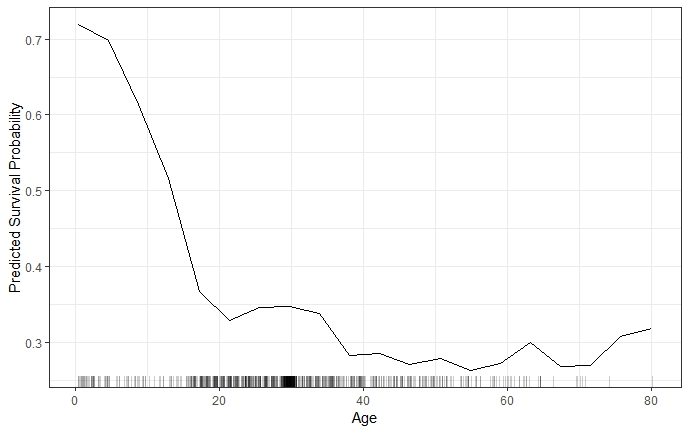
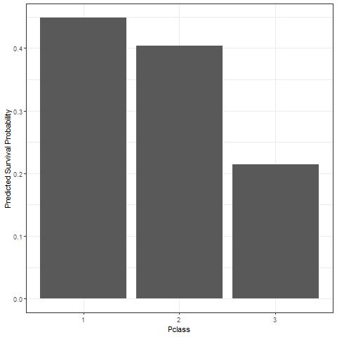
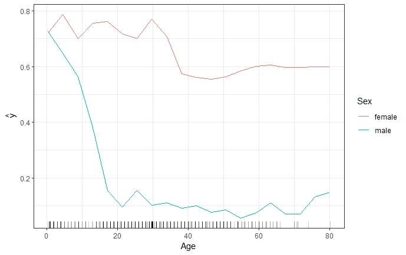
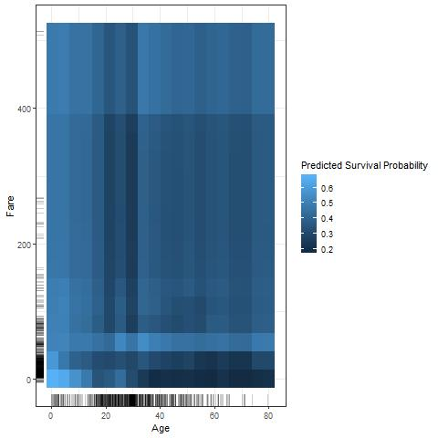
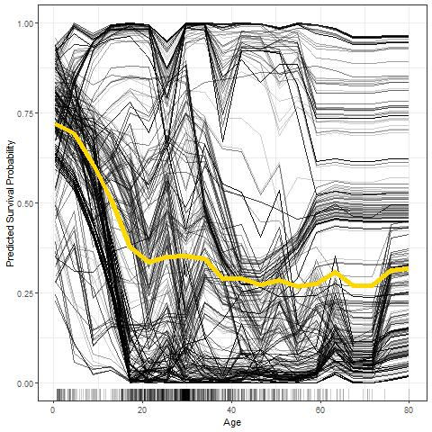
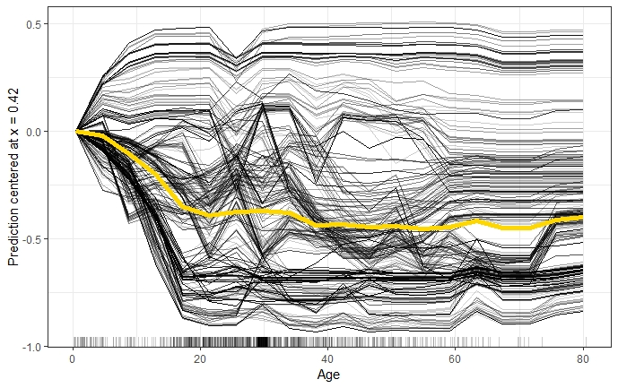

# Introduction to Partial Dependence Plots (PDP) and Individual Conditional Expectation (ICE)

## Partial Dependence Plots (PDP)

The Partial Dependence Plot (PDP) is a rather intuitive and easy-to-understand visualization of the features' impact on the predicted outcome. If the assumptions for the PDP are met, it can reveal the nature of dependence structure. More precisely, mapping the marginal effect of the selected variable(s) uncovers the linear, monotonic or nonlinear relationship between the predicted response and the individual feature variable(s).\citep{molnar2019}

The underlying function can be described as follows:

Let $x_S$ be the set of features of interest for the PDP and $x_C$ the complement set which contains all other features.
While the general model function $f(x) = f(x_S, x_C)$ depends on all input variables, the partial dependence function marginalizes over the feature distribution in set C \citep{hastie2013elements}:

$$f_{x_S}(x_S) = \mathbb{E}_{x_C}[f(x_S, x_C)]$$

The partial dependence function can be estimated by averaging the actual feature values of $x_C$ in the training data at given values of $x_S$ or, in other words, it computes the marginal effect of $x_S$ on the prediction. In order to obtain realistic results, a major assumption of the PDP is that the features in $x_S$ and $x_C$ are independent and thus uncorrelated.\citep{hastie2013elements}

$$\hat{f}_{x_S}(x_S)=\frac{1}{n}\sum_{i=1}^{n}f(x_S, x^{(i)}_{C})$$

An example of a PDP based on the 'Titanic' data set, which contains information on the fate of 2224 passengers and crew members during the Titanic's maiden voyage, is given in figure \@ref(fig:plot1).

```{r plot1, echo=FALSE, out.width='80%', fig.cap="PDP for predicted survival probability and numeric feature variable 'Age'. The probability to survive sharply drops at a young age and more moderately afterwards. The rug on the x-axis illustrates the distribution of observed training data.", fig.align= 'center'}

```

When a feature is categorical, rather than continuous, the partial dependence function is modeled separately for all of the K different classes of said feature. It maps the predictions for each respective class at given feature values of $x_S$.\citep{hastie2013elements} 

For such categorical features, the partial dependence function and the resulting plot are produced by replacing all observed $x_S$-values with the respective category and averaging the predictions. This procedure is repeated for each of the features' categories.\citep{molnar2019} As an example, \@ref(fig:plot2) shows the partial dependence for the survival probability prediction for passengers on the Titanic and the categorical feature 'passenger class'.

```{r plot2, echo=FALSE, out.width='80%', fig.cap="The PDP for survival probability and categorical feature ' passenger class' reveals that passengers in lower classes had a lower probability to survive than those in a higher class.", fig.align= 'center'}

```


## Advantages and Limitations of Partial Dependence Plots

Partial Dependence Plots are easy to compute and a popular way to explain insights from black box Machine Learning models. With their intuitive character, PDPs are perfect for communicating to a non-technical audience. However, due to limited visualization techniques and the restriction of human perception to a maximum of three dimensions, only one or two features can reasonably be displayed in one PDP.\citep{molnar2019} \@ref(fig:plot3) shows that the combination of one numerical (Age) and one categorical (Sex) feature still allows rather precise interpretation. The combination of two numerical features (Age & Fare) still works, but already degrades the interpretability with its colour intensity scale as shown in \@ref(fig:plot4). 

```{r plot3, echo=FALSE, out.width='90%', fig.cap="Two-dimensional PDP for predicted survival probability and numerical feature 'Age', together with the categorical feature 'Sex'. The PDP shows that while the survival probability for both genders declines as age increases, there is a difference between genders. It is clear that the decrease is much steeper for males.", fig.align= 'center'}

```

```{r plot4, echo=FALSE, out.width='100%', fig.cap="Two-dimensional PDP for predicted survival probability and numerical features 'Age' and 'Fare'. The PDP illustrates that the survival probability of younger passengers is fairly uniform for varying fares, while adults travelling at a lower fare also had a much lower probability to survive compared to those that paid a high fare.", fig.align= 'center'}

```

Drawing a PDP with one or two feature variables allows a straight-forward interpretation of the marginal effects. This holds true as long as the features are not correlated. Should this independence assumption be violated, the partial dependence function will produce unrealistic data points. For instance, correlation between height and weight leading to a data point for someone taller than 2 meters weighing less than 50 kilos. Furthermore, opposite effects of heterogeneous subgroups might remain hidden through averaging the marginal effects, which could lead to wrong conclusions.\citep{molnar2019}


## Individual Conditional Expectation Curves
While partial dependence plots provide the average effect of a feature, Individual Conditional Expectation (ICE) plots are a method to disaggregate these averages. ICE plots visualize the functional relationship between the predicted response and the feature separately for each instance. In other words, a PDP averages the individual lines of an ICE plot.\citep{molnar2019}

More formally, ICE plots can be derived by considering the estimated response function $\hat{f}$ and the observations ${(x^{(i)}_S, x^{(i)}_C)}^N_{i=1}$. The curve $\hat{f}_S^{(i)}$ is plotted against the observed values of $x^{(i)}_S$ for each of the observed instances while $x^{(i)}_C$ remains fixed at each point on the x-axis.\citep{molnar2019}\citep{Goldstein2013}

In ICE plots, each line represents one instance and visualizes the effect of varying the feature value $x^{(i)}_S$ of a particular instance on the model’s prediction, given all other features remain constant (c.p.). An ICE plot can highlight the variation in the fitted values across the range of a feature. This suggests where and to what extent heterogeneities might exist.

```{r plot5, echo=FALSE, out.width='100%', fig.cap="ICE plot of survival probability by Age. The yellow line represents the average of the individual lines and is thus equivalent to the respective PDP. The individual conditional relationships indicate that there might be underlying heterogeneity in the complement set.", fig.align= 'center'}

```


###Centered ICE Plot###
It can be difficult to observe heterogeneity in the model if the curves are stacked or have a wide range of intercepts. The so called centered ICE plot (c-ICE plot) is a simple solution to this problem. The curves are centered at a certain point in the feature and display only the difference in the prediction to this point.\citep{molnar2019} After anchoring a location $x^a$ in the range of $x_s$ and connecting all prediction lines at that point, the new curves are defined as:

$$\hat{f}^{(i)}_{cent} = \hat{f^{(i)}} - \mathbf{1}\hat{f}(x^a,x^{(i)}_C)$$
Experience has shown that the most interpretable plots occur when the anchor point $x^a$ is chosen as minimum or maximum of the observed values.


```{r plot6, echo=FALSE, out.width='100%', fig.cap="Centered ICE plot of survival probability by Age. All lines are fixed to 0 at the minimum observed age of 0.42. The y-axis shows the survival probability difference to age 0.42. Centrered ICE plot shows that compared to age 0.42, the predictions for most passengers decrease as age increases. However, there are quite a few passengers with opposite predictions.", fig.align= 'center'}

```


###Derivative ICE Plot###
Another way to explore the heterogeneity is to show plots of the partial derivative
of $\hat{f}$ with respect to $x_s$. Assume that $x_s$ does not interact
with the other predictors in the fitted model, the prediction function can be written as:

$$\hat{f}(x) = \hat{f}(x_s,x_C) = g(x_s) + h(x_C),$$ 

so that $$\frac{\partial{\hat{f}(\mathbf{x})}}{\partial x_s} = g'(x_s)$$

When no interactions are present in the fitted model, all curves in the d-ICE plot are equivalent and the plot shows a single line. When interactions do exist, the derivative lines will be heterogeneous. As it can be difficult to visually assess derivatives from ICE plots, it is useful to plot an estimate of the partial derivative directly.\citep{Goldstein2013}


###Advantages and Limitations of ICE Plots###
**Advantages**
ICE plots are more intuitive than PDPs and enable data scientists to drill much deeper to explore individual differences. This may help to identify subgroups and interactions between model inputs. 

**Disadvantages**
Firstly, only one feature can be plotted in an ICE plot meaningfully. Otherwise, there would be a problem of overplotting and it would be hard to distinguish anything in the plot. Secondly, just like PDPs, ICE plots for correlated features may produce invalid data points. Finally, without additionally plotting the PDP it might be difficult to see the average in ICE plots.\citep{molnar2019}
