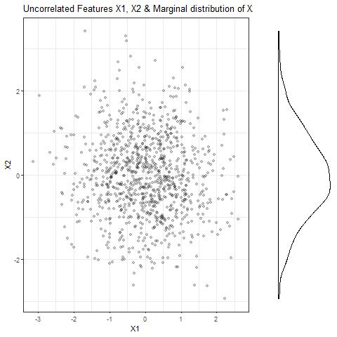
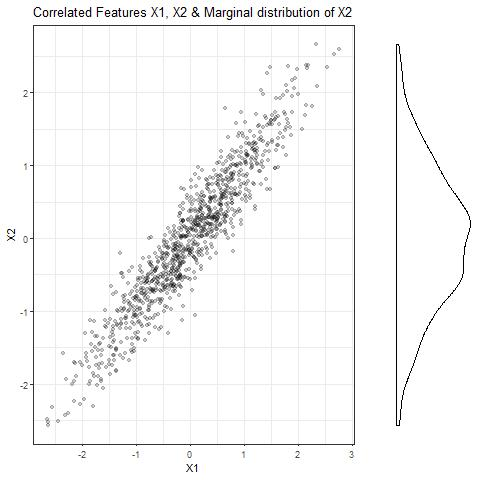
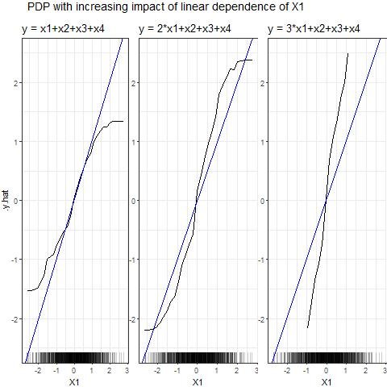
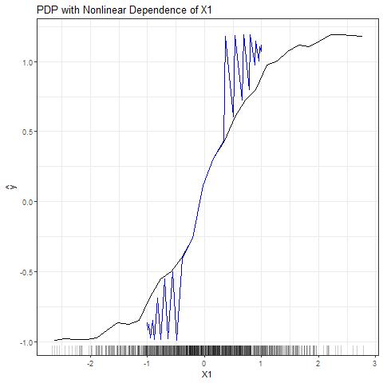
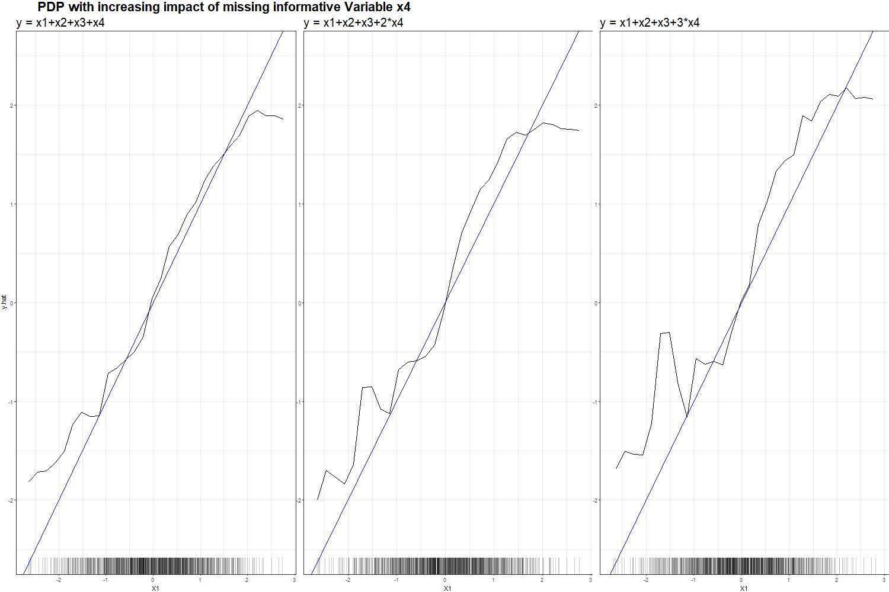

---
output:
  pdf_document: default
  html_document: default
  keep_tex: true
---
# PDP and Correlated Features

*Author: Veronika Kronseder*

##	Problem Description 
-	Black box algorithms use training data to generate a model that maps the features to the fitted values. However, it is often difficult to understand how exactly the model uses x to generate predictions. \citep{Goldstein2013} 
-	PDP and ICE plots are graphical tools to visualize the impact of individual features, which helps to investigate the underlying mechanisms. 
\newline

###	Correlated Features
-	Partial dependence function as such represents the effect of $x_S$ on $f(x)$ after accounting for the average effects of the variables in $x_C$ on $f(x)$ and NOT the effect of $x_S$ ignoring the effects of $x_C$. The latter is given by the conditional expectation $\tilde{f}_S(x_S) = \mathbb{E}_{x_C}[f(x_S, x_C)|x_S]$ which will only be the same as the estimation of the partial dependence function if the features $x_S$ and $x_C$ are independent. \citep{hastie2013elements}
-	Major assumption to produce meaningful PDPs: independence of features. A violation of the assumption means that the features are correlated. 
-	Effect of $x_S$ can be additive or multiplicative; conditional expectation will not produce the effect in either case. \citep{hastie2013elements} 
-	Computation of PDP with correlated features may lead to unrealistic data points. Example: … 
\newline

###	Extrapolation
-	Computation of PDP by evaluating the model $\hat{f}(x)$ at the observed data points for $x_S$, calculating the mean and then joining the points by lines. Parts between the observed points are extrapolations. \citep{Goldstein2013}
-	Extrapolation is not necessarily realistic for unobserved areas. 
-	Nature of black-box modelling makes it impossible to retrace what the extrapolation looks like. \citep{Goldstein2013} 

##	Demonstration 
###	Simulated Data

```{r echo=FALSE, eval=FALSE, warning=FALSE}
library(mvtnorm) 
library(ggplot2)
library(ggcorrplot)
library(ggpubr)
library(iml)
library(randomForest)
library(cowplot)

################################# Null case: no correlation between features ################################# 
set.seed(123)
# specify entries for covariance matrix
sigma_0 <- diag(1, nrow = 4)
# simulate data from normal distribution 
data_0 <- as.data.frame(rmvnorm(n = 1000, 
                              mean = rep(0, times = 4), 
                              sigma = sigma_0))
colnames(data_0) <- c("X1", "X2", "X3", "X4")
# check covariance and correlation matrices 
cov(data_0)
cor(data_0)
# visualize correlation of X1 and X2
p <- ggplot(data = data_0, aes(x = X1, y = X2)) + geom_point(alpha = 0.2) + labs(title = "Uncorrelated Features X1, X2 & Marginal distribution of X2") + theme_bw()
d <- ggdensity(data_0$X2)+ geom_density() + rotate() + clean_theme() + rremove("legend") 
#jpeg("Plots/PDP_Sim_Plot1.jpeg")
plot_grid(p, d, ncol = 2, align = "hv", rel_widths = c(3, 1), rel_heights = c(1, 3))
#dev.off()

############################ Simulate highly correlated numerical features X1 and X2 ##########################
set.seed(123)
# specify entries for covariance matrix
sigma <- diag(1, nrow = 4)
sigma[1,2] <- sigma[2,1] <- 0.95
# simulate data from normal distribution 
data <- as.data.frame(rmvnorm(n = 1000, 
                              mean = rep(0, times = 4), 
                              sigma = sigma))
colnames(data) <- c("X1", "X2", "X3", "X4")
# check covariance and correlation matrices 
cov(data)
cor(data)

# visualize correlation of X1 and X2
p <- ggplot(data = data, aes(x = X1, y = X2)) + geom_point(alpha = 0.2) + labs(title = "Correlated Features X1, X2 & Marginal distribution of X2") + theme_bw()
d <- ggdensity(data$X2)+ geom_density() + rotate() + clean_theme() + rremove("legend") 
#jpeg("Plots/PDP_Sim_Plot2.jpeg")
plot_grid(p, d, ncol = 2, align = "hv", rel_widths = c(3, 1), rel_heights = c(1, 3))
#dev.off()

################################# Simulation Setting 1: Linear Dependence #####################################
# a)
sd_1 <- mean(data$X1 + data$X2 + data$X3 + data$X4)*0.1
y1 <- data$X1 + data$X2 + data$X3 + data$X4 + rnorm(n = 1, mean = 0, sd = sd_1) #linear
rf1 = randomForest(y1 ~ ., data = data, ntree = 50)
mod1 = Predictor$new(rf1, data = data)
eff1 = FeatureEffect$new(mod1, feature = "X1", method = "pdp", grid.size = 30)

p1 <- plot(eff1)+theme_bw()+labs(title = "y = x1+x2+x3+x4")+geom_abline(slope = 1, col = "blue")+theme(plot.margin = unit(c(1,0,0,0), "cm"))+ylim(-2.5,2.5)

# b)
sd_1 <- mean(2*data$X1 + data$X2 + data$X3 + data$X4)*0.1
y1 <- 2*data$X1 + data$X2 + data$X3 + data$X4 + rnorm(n = 1, mean = 0, sd = sd_1) #linear
rf1 = randomForest(y1 ~ ., data = data, ntree = 50)
mod1 = Predictor$new(rf1, data = data)
eff1 = FeatureEffect$new(mod1, feature = "X1", method = "pdp", grid.size = 30)

p2 <- plot(eff1)+theme_bw()+labs(title = "y = 2*x1+x2+x3+x4")+geom_abline(slope = 1, col = "blue")+theme(plot.margin = unit(c(1,0,0,0), "cm"))+ylim(-2.5,2.5)+rremove("ylab")

# c)
sd_1 <- mean(3*data$X1 + data$X2 + data$X3 + data$X4)*0.1
y1 <- 3*data$X1 + data$X2 + data$X3 + data$X4 + rnorm(n = 1, mean = 0, sd = sd_1) #linear
rf1 = randomForest(y1 ~ ., data = data, ntree = 50)
mod1 = Predictor$new(rf1, data = data)
eff1 = FeatureEffect$new(mod1, feature = "X1", method = "pdp", grid.size = 30)

p3 <- plot(eff1)+theme_bw()+labs(title = "y = 3*x1+x2+x3+x4")+geom_abline(slope = 1, col = "blue")+theme(plot.margin = unit(c(1,0,0,0), "cm"))+ylim(-2.5,2.5)+rremove("ylab")


#jpeg("Plots/PDP_Sim_Plot3.jpeg")
fig <- ggarrange(p1, p2, p3, ncol=3)
annotate_figure(fig, fig.lab = "PDP with increasing impact of linear dependence of X1")
#dev.off()

################################ Simulation Setting 2: Nonlinear Dependence ###################################
# a) All variables equally important
sd_2 <- mean(sin(data$X1) + data$X2 + data$X3 + data$X4)*0.1
y2 <- sin(data$X1) + data$X2 + data$X3 + data$X4 + rnorm(n = 1, mean = 0, sd = sd_2) #nicht-linear
rf2 = randomForest(y2 ~ ., data = data, ntree = 50)
mod2 = Predictor$new(rf2, data = data)
eff2 = FeatureEffect$new(mod2, feature = "X1", method = "pdp", grid.size = 30)

p1 <- plot(eff2)+theme_bw()+labs(title = "y = sin(x1)+x2+x3+x4")+geom_abline(slope = 1, col = "blue")+theme(plot.margin = unit(c(1,0,0,0), "cm"))+ylim(-2.5,2.5)

# b) 
sd_2 <- mean(2*sin(data$X1) + data$X2 + data$X3 + data$X4)*0.1
y2 <- sin(data$X1) + data$X2 + data$X3 + data$X4 + rnorm(n = 1, mean = 0, sd = sd_2) #nicht-linear
rf2 = randomForest(y2 ~ ., data = data, ntree = 50)
mod2 = Predictor$new(rf2, data = data)
eff2 = FeatureEffect$new(mod2, feature = "X1", method = "pdp", grid.size = 30)

p2 <- plot(eff2)+theme_bw()+labs(title = "y = 2*sin(x1)+x2+x3+x4")+geom_abline(slope = 1, col = "blue")+theme(plot.margin = unit(c(1,0,0,0), "cm"))+ylim(-2.5,2.5)+rremove("ylab")

# c) 
sd_2 <- mean(3*sin(data$X1) + data$X2 + data$X3 + data$X4)*0.1
y2 <- 3*sin(data$X1) + data$X2 + data$X3 + data$X4 + rnorm(n = 1, mean = 0, sd = sd_2) #nicht-linear
rf2 = randomForest(y2 ~ ., data = data, ntree = 50)
mod2 = Predictor$new(rf2, data = data)
eff2 = FeatureEffect$new(mod2, feature = "X1", method = "pdp", grid.size = 30)

p3 <- plot(eff2)+theme_bw()+labs(title = "y = 3*sin(x1)+x2+x3+x4")+geom_abline(slope = 1, col = "blue")+theme(plot.margin = unit(c(1,0,0,0), "cm"))+ylim(-2.5,2.5)+rremove("ylab")

#jpeg("Plots/PDP_Sim_Plot4.jpeg")
fig <- ggarrange(p1, p2, p3, ncol=3)
annotate_figure(fig, fig.lab = "PDP with increasing impact of nonlinear dependence of X1")
#dev.off()

########################### Simulation Setting 3: Missing informative Feature X4 ##############################
# a) All variables equally important
sd_3 <- mean(data$X1 + data$X2 + data$X3 + data$X4)*0.1
y3 <- data$X1 + data$X2 + data$X3 + data$X4 + rnorm(n = 1, mean = 0, sd = sd_3) #Variable X4 ist zur Generierung von y relevant, wird aber im ML Modell nicht berücksichtigt
rf3 = randomForest(y3 ~ . -X4, data = data, ntree = 50)
mod3 = Predictor$new(rf3, data = data)
eff3 = FeatureEffect$new(mod3, feature = "X1", method = "pdp", grid.size = 30)
p1 <- plot(eff3)+theme_bw()+labs(title = "y = x1+x2+x3+x4")+geom_abline(slope = 1, col = "blue")+theme(plot.margin = unit(c(1,0,0,0), "cm"))+ylim(-2.5,2.5)

# b) 
sd_3 <- mean(data$X1 + data$X2 + data$X3 + 2*data$X4)*0.1
y3 <- data$X1 + data$X2 + data$X3 + 2*data$X4 + rnorm(n = 1, mean = 0, sd = sd_3) #Variable X4 ist zur Generierung von y relevant, wird aber im ML Modell nicht berücksichtigt
rf3 = randomForest(y3 ~ . -X4, data = data, ntree = 50)
mod3 = Predictor$new(rf3, data = data)
eff3 = FeatureEffect$new(mod3, feature = "X1", method = "pdp", grid.size = 30)
p2 <- plot(eff3)+theme_bw()+labs(title = "y = x1+x2+x3+2*x4")+geom_abline(slope = 1, col = "blue")+theme(plot.margin = unit(c(1,0,0,0), "cm"))+ylim(-2.5,2.5)+rremove("ylab")

# c) 
sd_3 <- mean(data$X1 + data$X2 + data$X3 + 3*data$X4)*0.1
y3 <- data$X1 + data$X2 + data$X3 + 3*data$X4 + rnorm(n = 1, mean = 0, sd = sd_3) #Variable X4 ist zur Generierung von y relevant, wird aber im ML Modell nicht berücksichtigt
rf3 = randomForest(y3 ~ . -X4, data = data, ntree = 50)
mod3 = Predictor$new(rf3, data = data)
eff3 = FeatureEffect$new(mod3, feature = "X1", method = "pdp", grid.size = 30)
p3 <- plot(eff3)+theme_bw()+labs(title = "y = x1+x2+x3+3*x4")+geom_abline(slope = 1, col = "blue")+theme(plot.margin = unit(c(1,0,0,0), "cm"))+ylim(-2.5,2.5)+rremove("ylab")

#jpeg("Plots/PDP_Sim_Plot5.jpeg")
fig <- ggarrange(p1, p2, p3, ncol=3)
annotate_figure(fig, fig.lab = "PDP with increasing impact of missing informative Variable X4")
#dev.off()

```

```{r plot1, echo=FALSE, out.width='80%', fig.cap="Scatterplot of uncorrelated features x1 and x2 and marginal distribution of x2."}

```

```{r plot2, echo=FALSE, out.width='80%', fig.cap="Scatterplot of higly correlated features x1 and x2 (rho = 0.95) and marginal distribution of x2."}

```

```{r plot3, echo=FALSE, out.width='80%', fig.cap="Simulation of linear dependencies."}

```

```{r plot4, echo=FALSE, out.width='80%', fig.cap="Simulation of nonlinear dependencies."}

```

```{r plot5, echo=FALSE, out.width='80%', fig.cap="Simulation of nonlinear dependencies."}

```

###	Real Data
-	Home Insurance Data
-	Boston/Melbourne Housing
- Bike Rental Data

##	Discussion of solutions 
###	Correlated Features
-	M-Plots: average over conditional distribution of the feature. Problem: avoids predictions of unlikely data instances, BUT mixes the effect of a feature wit effects of all correlated features \citep{molnar2019}
-	ALE Plots: average over changes in predictions (based on conditional distribution) and accumulate them over the grid leads to pure effects (not mixed with effect of correlated features) \citep{molnar2019}
-	
###	Extrapolation
-	ICE Plot: marking each curve at observed point helps to assess presence and nature of extrapolations \citep{Goldstein2013}
-	PDP: indicators for data points on the x-axis \citep{molnar2019}


