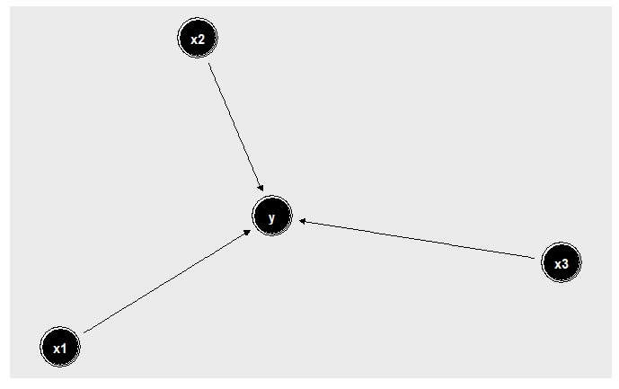
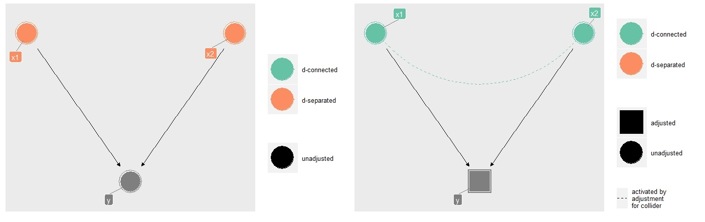
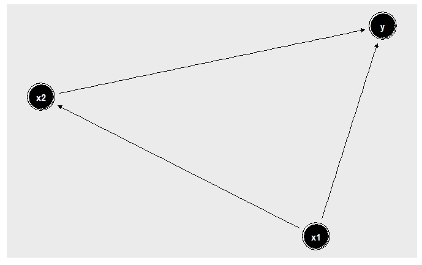
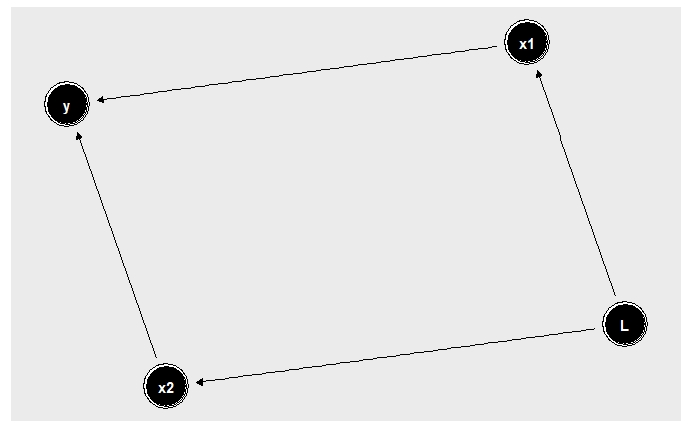

# PDP and Causal Interpretation
```{r eval=FALSE, include=FALSE}
library(iml) # for pdp and ice
library(ggdag) # for structural causal graphs
library(randomForest) # for modeling
library(caret) # for creating train and test set
library(pdp) # for pdp and ice plots

# set the number of data points to be created
N <- 1000
set.seed(107)

```


*Author: Thommy Dassen*

## Introduction

In this chapter an attempt will be made to evaluate the merits of a causal interpretation of Partial Dependance Plots (PDPs). In order to do so, Directed Acyclical Graphs (DAGs) will be used to visualize various causal relationships. Judea Pearl's framework of do-calculus will be used to intervene on simulated data. The goal is to observe differences in the curves of PDPs before and after interventions. In order to do so, each scenario will consist of a simulation with and without an intervention. 

## Partial Dependence Plots and Directed Acyclical Graphs

A DAG is a representation of relationships between variables in graphical form. Each variable is represented as a *node* and the lines between these nodes, or *edges*, show the direction of the causal relationship through arrowheads. In addition to being directed, these graphs have to be acyclical. This means that a relationship $X \rightarrow Y \rightarrow Z \rightarrow X$ can not be represented as a DAG. Several examples of DAGs follow in the rest of the chapter.


*briefly explain do-calculus*

*pdp as intervention*

A path is any consecutive connection of edges, regardless of the direction of the edges. A "back-door" path, on the other hand, is any path containing an arrow into a subset of variables $X_S$ [@zhaohastie]. These back-door paths can be seen as a common cause of both $X_S$ and $Y$ and would need to be adjusted for in order to compute the causal effect of $X_S$ on $Y$.

An important formula introduced by  [@pearl1993] is that of the back-door adjustment. This formula stipulates that the causal effect of $X_S$ on $Y$ can be identified if the causal relationship between the variables can be visualized in a graph and $X_C$, the complementary set to $X_S$, adheres to what he called the back-door criterion. The back-door adjustment formula is:


$$P(Y|do(X_S = x_S)) = \int P(Y |X_S = x_S, X_C = x_C) dP(x_C)$$
As [@zhaohastie] pointed out, this formula is basically the same as the formula for the partial
dependence of $g$ on a subset of variables $X_S$ given output $g(x)$:

$$ g_S(x_S) = \mathbb E_{x_C}[g(x_S, X_C)] = \int g(x_S, x_C)dP(x_C)  $$
If we take the expectation of Pearl's adjustment formula we get:
$$ E[Y |do(X_S = x_S)] = \int E[Y |X_S = x_S, X_C = x_C] dP(x_C) $$
These last two formulas thus seem to be the same, if $C$ is the complement of $S$. 

[@pearl1993] defined a back-door criterion that needs to be fulfilled in order for the adjustment formula to be valid. It holds that:

1. No node in $X_C$ can be a descendant of $X_S$ in the DAG $G$.

2. Every "back-door" path between $X_S$ and $Y$ has to be blocked by $X_C$.


## Interventions on simulated data
The complexity of scenarios will increase throughtout this chapter.

**Scenario 1: Direct Effect**

The simplest scenario one can think of is that of a single direct effect between a feature $x_1$ and an outcome $Y$. This can be visualized by the DAG in \@ref(fig:directeffect).

```{r eval=FALSE, include=FALSE}
###############################################
# Scenario 1: Direct Effect
###############################################
# x1 causes y
dagify(y ~ x1
       ) %>% 
  ggdag() 
```

```{r directeffect, fig.cap='(ref:directeffect)', echo=FALSE, out.width='60%'}

```
(ref:directeffect) A DAG with a direct effect.

A very basic linear regression on simulated data with the relationship as seen in this DAG leads naturally to a linear relationship in the PDP. Since in this scenario we know there are no other variables, either known or unknown, impacting our outcome variable $Y$ a causal interpretation of this PDP seems reasonable. No additional intervention is needed. It is clear there is no back-door path and furthermore $X_C$ does not exist.

```{r}
# simulate data 
b1 <- 1
x1 <- rnorm(N, 10, 5) 
y <- b1 * x1 + rnorm(N, 1,1)
#create a dataframe
df <- data.frame(x1, y)

#linear regression
lm.direct <- lm(y~x1, data = df)
partial(lm.direct, pred.var="x1", plot = TRUE, rug = TRUE, plot.engine = "ggplot2")
```

**Scenario 2: Collider**
*explain colliders, both d-separated and d-connected. run simulations*

```{r eval=FALSE, include=FALSE}
###############################################
# Scenario 2: Collider
###############################################
collider_dag <- collider_triangle(x = "x1", 
                               y = "x2", 
                               m = "y") 

ggdag(collider_dag, text = FALSE, use_labels = "label")

ggdag_dseparated(collider_dag, text = FALSE, use_labels = "label")

ggdag_dseparated(collider_dag, controlling_for = "m", 
                 text = FALSE, use_labels = "label")
```
```{r collider, fig.cap='(ref:collider)', echo=FALSE, out.width = "100%"}


```
(ref:collider) A d-separated and d-connected collider.

**Scenario 3: Confounding**

In the case of a confounding variable, the outcome $Y$ is again impacted by the features $x_1$ and $x_2$, as in the collider example before. However, this time the value of $x_2$ is dependent on the value of $x_1$ as well. As such $x_1$ does not only impact $Y$ directly, but also throught its impact on $x_2$. \@ref(fig:confounding) shows such a relationship.
```{r eval=FALSE, include=FALSE}
###############################################
# Scenario 3: Confounding Variables
###############################################
# create structural graph of what the data set looks like
dagify(y ~ x2,
       x2 ~ x1,
       y ~ x1) %>% 
  ggdag() 
```
```{r confounding, fig.cap='(ref:confounding)', echo=FALSE, out.width='70%'}

```
(ref:confounding) A DAG with a confounding effect.

```{r}
# simulate 
b1 <- 0.1
b2 <- 0.9

x1 <- rnorm(N, 10, .5) #confounding variable for x and y
x2 <- x1 + rnorm(N, 3, 2)
y <- b1 * x1 + b2 * x2 + rnorm(N, 2,1)
#create a dataframe
df <- data.frame(x1, x2, y)

# create random forest model
rf.Confound <- randomForest(y ~ x1 + x2, data = df, importance = TRUE, do.trace = FALSE, keep.forest = TRUE)

partialPlot(rf.Confound, pred.data = df, x.var = "x2", ylab='Predicted Y') 


```

*Describe how an intervention can be managed here and simulate*

**Scenario 4: Latent Variable**

Imagine an unmeasured latent variable $L$ exists that affects both $x_1$ and $x_2$, but not $Y$ directly. Such a scenario can be seen in \@ref(fig:latent).

```{r eval=FALSE, include=FALSE}
###############################################
# Scenario 4: Latent Variable
###############################################
# create structural graph of what the data set looks like
dagify(y ~ x2,
       y ~ x1,
       x1 ~ L,
       x2 ~ L
       ) %>% 
  ggdag() 
```
```{r latent, fig.cap='(ref:latent)', echo=FALSE, out.width='70%'}

```
(ref:latent) A DAG with a latent variable.

If in this scenario we would want to intervene and see the effect of $x_1$ on $Y$ we have to find a variable in $X_C$ that adheres to the back-door criterion. $x_2$ meets this standard. It is not a descendant of $x_1$ and it can block the back-door path from $Y$ to $x_1$ ($Y \leftarrow x_2 \leftarrow L \rightarrow x_1$). Intervening on $x_2$ should thus give the causal effect of $x_1$ on $Y$. Using Pearl's adjustment formula, this can be estimated.

## Discussion

## Conclusions


## To Do

1. Finish simulations+interventions for all scenarios, discuss differences between PDPs 

2. Is it possible to evaluate the differences in PDP curves in a more formal way, rather than just a visual approach?