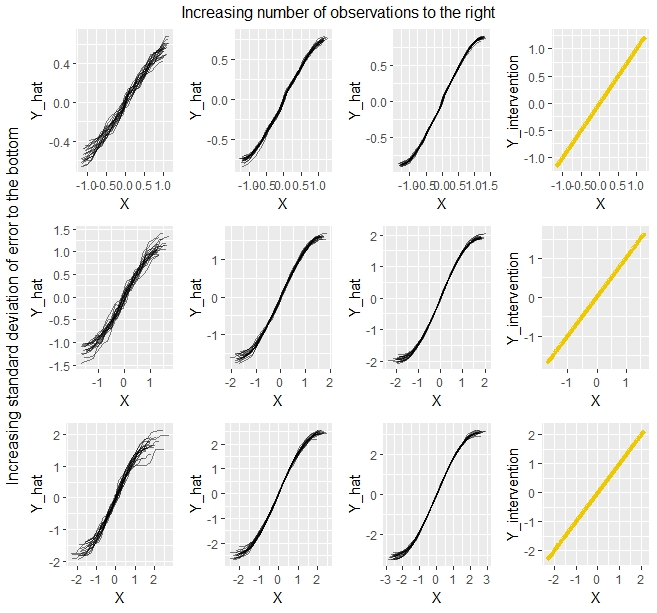
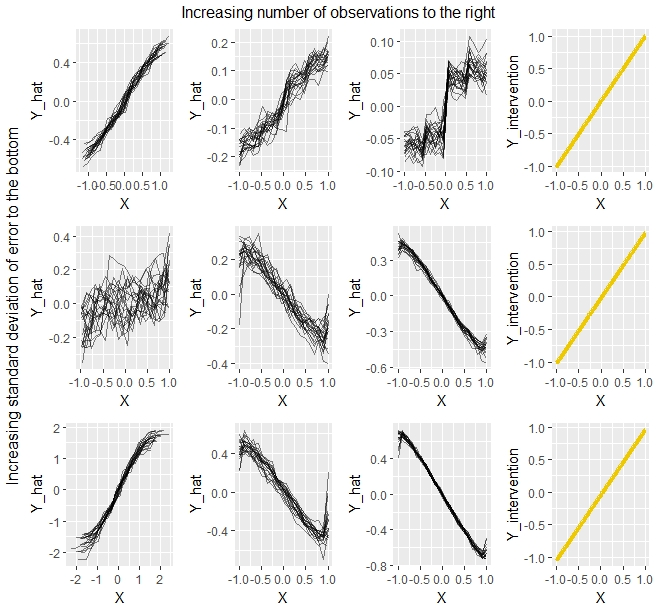

# PDP and Causal Interpretation

*Author: Thommy Dassen*

## Introduction

```{r}
library(dplyr) # for group by
library(Ecdat) # icecream datasets
library(ggpubr) # ggarrange
library(iml)  # pdp
library(randomForest)
```


[@zhaohastie] formulated 3 elements that are needed for a causal interpretation:
1. A good predictive model which closely approximates the real relationship.
2. Domain knowledge to ensure the causal structure makes sense and the backdoor criterion, explained below, is met.
3. A visualization tool like a PDP (or an Individual Conditional Expectation plot)

** Backdoor Criterion **

When we make an intervention, it means we fix the value of a variable [@pearl1993]. We change every instance of a particular variable to a specific value chosen by us. This can be done to see the effect a variable has when at a specific value. When we intervene, values of a variable no longer vary in response to other variables. This usually means that the values for other variables change as well as a result. In a graphical sense an intervention means removing an edge that is directed towards the variable we fix. 
The difference between a variable $X$ taking a value $x$ naturally and having a fixed value $X=x$ is reflected in the notation. The latter is denoted by $do(X=x)$. As such, $P(Y=y|X=x)$ is the probability that $Y=y$ conditional on $X=x$. $P(Y=y|do(X=x))$ is then the population distribution of $Y$ if the value of $X$ was fixed at $x$ for the entire population.

An important formula introduced by  [@pearl1993] is that of the back-door adjustment. This formula stipulates that the causal effect of $X_S$ on $Y$ can be identified if the causal relationship between the variables can be visualized in a graph and $X_C$, the complementary set to $X_S$, adheres to what he called the back-door criterion. The back-door adjustment formula is:


$$P(Y|do(X_S = x_S)) = \int P(Y |X_S = x_S, X_C = x_C) dP(x_C)$$
As [@zhaohastie] pointed out, this formula is basically the same as the formula for the partial
dependence of $g$ on a subset of variables $X_S$ given output $g(x)$:

$$ g_S(x_S) = \mathbb E_{x_C}[g(x_S, X_C)] = \int g(x_S, x_C)dP(x_C)  $$
If we take the expectation of Pearl's adjustment formula we get:
$$ E[Y |do(X_S = x_S)] = \int E[Y |X_S = x_S, X_C = x_C] dP(x_C) $$
These last two formulas thus seem to be the same, if $C$ is the complement of $S$. 

[@pearl1993] defined a back-door criterion that needs to be fulfilled in order for the adjustment formula to be valid. It holds that:

1. No node in $X_C$ can be a descendant of $X_S$ in the DAG $G$.

2. Every "back-door" path between $X_S$ and $Y$ has to be blocked by $X_C$.


## Reverse Causality

Before we have a look at various scenarios and settings, let's look at an example that shows the need for domain knowledge. Let's say we have a dataset containing data on the amount of ice-cream consumption per capita and the temperature outside. Intuitively, we know in this case that there will be a relationship between the two: People eat more ice-cream when temperatures are high than when temperatures are low. Just looking at the data, however, the direction of the relationship is not as evident. Below are two PDPs, showing the effect of one variable on the other.
```{r echo=FALSE, message=FALSE, warning=FALSE}
data("Icecream")
 rf.icecream = randomForest(cons ~ temp
                         , data = Icecream, importance = T)
  mod = Predictor$new(rf.icecream, data = Icecream)
  pdp.obj = Partial$new(mod, feature = c("temp"))  
  p1 <- plot(pdp.obj) 
  
    rf.icecream_reverse = randomForest(temp ~ cons
                             , data = Icecream, importance = T)
  mod_reverse = Predictor$new(rf.icecream_reverse, data = Icecream)
  pdp.obj_reverse = Partial$new(mod_reverse, feature = c("cons"))  
  p2 <- plot(pdp.obj_reverse) 
  grid.arrange(p1, p2, ncol = 2)
```

Clearly it would be wrong to interpret the second plot causally. While it would be ok to say that higher consumption of icecream is associated with higher temperatures, no one would ever say that higher icecream consumption *causes* higher temperatures. This example illustrates the need for domain knowledge about the causal structure between variables in order to be able to interpret PDPs causally. Blindly plotting a PDP and interpreting it causally is problematic. Directionality is only one aspect that can be solved by domain knowledge. As discussed above, domain knowledge is also a necessity in order to determine whether the backdoor criterion is met.


## Scenarios

In each scenario nine settings will be simulated for PDP creation, consisting of three standard deviations for the error term (0.1, 0.3 and 0.5) and three magnitudes of observations (100, 1000, 1000). Furthermore, each setting for the PDP was simulated across twenty runs. Each of the nine plots will therefore show twenty PDPs in order to give a solid view of the relationship the PDPs capture for each setting. In addition to the plots of the PDPs, which will be the first three columns in each figure, the actual effect under intervention will be shown in a fourth column as a single yellow line. The interventions were all run with a thousand observations. Initial tests saw a large increase in computation time with a higher number, but with results that hardly differed from those obtained with one thousand observations.

**Scenario 1: ladieda**

```{r echo=FALSE}
set.seed(18)
dagify(Y ~ X,
       X ~ Z
) %>% 
  ggdag() 
```

In the first scenario, we have a chain DAG. Our variable $X$ is impacted by $Z$ and has a direct effect on $Y$. $Z$, however, does not. $X_C$ consists of $Z$, which is not a descendant of $X$. There is also no backdoor path between $X$ and $Y$. The backdoor criterion is met. In this scenario the expectation is thus that the PDPs should be overall equal to the true intervention. The initial simulation settings for this scenario is as follows:

$$ Y = X + \epsilon  $$
$$ \epsilon ~ \sim \mathcal{N}(0, 0.1), \ \ \ \ \ Z \sim \mathcal{U}(-1,1), \ \ \ \ \ X \sim Z + \epsilon, \ \ \ \ \ N = 100 $$


```{r echo=FALSE}
set.seed(18)
dagify(Y ~ X,
       X ~ Z
) %>% 
  ggdag() 
```

As will be done in all scenarios, both standard deviaton for $\epsilon$ and $N$ were varied across 3 levels leading to 9 settings.  




```{r eval=FALSE, include=TRUE}
# pdp
pdp_simulation <- function(runs, N, error_std){ 
  pdp_simulations <- setNames(data.frame(matrix(ncol = 2, nrow = 0)),  c("X1", "y_hat"))
  
  for(i in 1:runs){
    e <- rnorm(N,0, error_std)
    Z <- runif(N, -1, 1)
    X <- Z + e
    Y <- X + e
    df <- data.frame(X, Z, Y)
    
    rf.basic = randomForest(Y ~ . , data = df, importance = T)
    mod = Predictor$new(rf.basic, data = df)
    pdp.obj = FeatureEffect$new(mod, feature = c("X"), method = "pdp") 
    p_pdp_mod <- plot(pdp.obj)
    
    simulation <- as.data.frame(pdp.obj$results[,1:2])
    simulation$run <- i
    colnames(simulation) <- c("X", "Y_hat", "run_number")
    pdp_simulations <- rbind.data.frame(pdp_simulations, simulation)
  }
  ggplot(data = pdp_simulations) + geom_line(data = pdp_simulations,aes(x = pdp_simulations[,1], y = pdp_simulations[,2], group = pdp_simulations[,3]), alpha = 0.5)
}
# standard deviation eq 0.1
scen1_plot_1 <- pdp_simulation(runs=20, N = 100, error_std=0.1)
scen1_plot_1 <- scen1_plot_1 + labs(x = "X", y = "Y_hat")
scen1_plot_2 <- pdp_simulation(runs=20, N = 1000, error_std=0.1)
scen1_plot_2 <- scen1_plot_2 + labs(x = "X", y = "Y_hat")
scen1_plot_3 <- pdp_simulation(runs=20, N = 10000, error_std=0.1)
scen1_plot_3 <- scen1_plot_3 + labs(x = "X", y = "Y_hat")
# standard deviation eq 0.3
scen1_plot_4 <- pdp_simulation(runs=20, N = 100, error_std=0.3)
scen1_plot_4 <- scen1_plot_4 + labs(x = "X", y = "Y_hat")
scen1_plot_5 <- pdp_simulation(runs=20, N = 1000, error_std=0.3)
scen1_plot_5 <- scen1_plot_5 + labs(x = "X", y = "Y_hat")
scen1_plot_6 <- pdp_simulation(runs=20, N = 10000, error_std=0.3)
scen1_plot_6 <- scen1_plot_6 + labs(x = "X", y = "Y_hat")
# standard deviation eq 0.5
scen1_plot_7 <- pdp_simulation(runs=20, N = 100, error_std=0.5)
scen1_plot_7 <- scen1_plot_7 + labs(x = "X", y = "Y_hat")
scen1_plot_8 <- pdp_simulation(runs=20, N = 1000, error_std=0.5)
scen1_plot_8 <- scen1_plot_8 + labs(x = "X", y = "Y_hat")
scen1_plot_9 <- pdp_simulation(runs=20, N = 10000, error_std=0.5)
scen1_plot_9 <- scen1_plot_9 + labs(x = "X", y = "Y_hat")

# intervention

intervention <- function(runs, N, error_std){ 
  df_intervention_all <- setNames(data.frame(matrix(ncol = 3, nrow = 0)), c("X", "Z", "Y"))
  for(i in 1:runs){
    
    e <- rnorm(N,0, error_std)
    Z <- runif(N, -1, 1)
    X <- Z + e
    Y <- X + e
    df <- data.frame(X, Z, Y)
    for(j in 1:length(unique(df$X))){
      X <- unique(df$X)[j]
      Y <- X + e
      df_intervention <- data.frame(X, Z, Y)
      df_intervention_all <- rbind.data.frame(df_intervention_all, df_intervention)
    }
  }
  
  df_intervention_group <- df_intervention_all %>%
    group_by(X) %>%
    summarise(Y_intervention = mean(Y),
              n = n()) %>%
    
    arrange(X)
  
  ggplot(aes(X, Y_intervention), data = df_intervention_group) + geom_line(colour="gold2", size = 1.5)
}
# standard deviation eq 0.1
scen1_int_plot_2 <- intervention(runs=1, N = 1000, error_std=0.1)
# standard deviation eq 0.3
scen1_int_plot_5 <- intervention(runs=1, N = 1000, error_std=0.3)
# standard deviation eq 0.5
scen1_int_plot_8 <- intervention(runs=1, N = 1000, error_std=0.5)


scenario_1_all <- ggarrange(scen1_plot_1, # N = 100,  std = 0.1
                            scen1_plot_2, # N = 1000, std = 0.1
                            scen1_plot_3, # N = 2000, std = 0.1
                            scen1_int_plot_2,
                            
                            scen1_plot_4, # N = 100,  std = 0.3
                            scen1_plot_5, # N = 1000, std = 0.3
                            scen1_plot_6, # N = 2000, std = 0.3
                            scen1_int_plot_5,
                            
                            scen1_plot_7, # N = 100,  std = 0.5
                            scen1_plot_8, # N = 1000, std = 0.5
                            scen1_plot_9, # N = 2000, std = 0.5
                            scen1_int_plot_8,
                            
                            nrow= 3, ncol = 4)
annotate_figure(scenario_1_all,
                top = text_grob("Increasing number of observations to the right", color = "black"),
                left = text_grob("Increasing standard deviation of error to the bottom", color = "black", rot = 90),
                 fig.lab.face = "bold")

```


**Scenario 2: Chain DAG**

```{r echo=FALSE}
set.seed(18)
dagify(Y ~ Z,
       Z ~ X
) %>% 
  ggdag() 
```

In this scenario the DAG again looks like a chain. $X$ has an effect on $Y$ through $Z$, but no direct relationship between $X$ and $Y$ exists. The initial simulation settings for this scenario were as follows: 
$$ Y = Z + \epsilon  $$
$$ \epsilon ~ \sim \mathcal{N}(0, 0.1), \ \ \ \ \ X \sim \mathcal{U}(-1,1), \ \ \ \ \ Z \sim X + \epsilon, \ \ \ \ \ N = 100 $$




```{r eval=FALSE, include=FALSE}
# pdp
pdp_simulation <- function(runs, N, error_std){ 
  pdp_simulations <- setNames(data.frame(matrix(ncol = 2, nrow = 0)),  c("X1", "y_hat"))

  for(i in 1:runs){
    e <- rnorm(N,0, error_std)
    X <- runif(N, -1, 1)
    Z <- X + e
    Y <- Z + e
    df <- data.frame(X, Z, Y)
  
    rf.basic = randomForest(Y ~ . , data = df, importance = T)
    mod = Predictor$new(rf.basic, data = df)
    pdp.obj = FeatureEffect$new(mod, feature = c("X"), method = "pdp") 
    p_pdp_mod <- plot(pdp.obj)
  
    simulation <- as.data.frame(pdp.obj$results[,1:2])
    simulation$run <- i
    colnames(simulation) <- c("X", "Y_hat", "run_number")
    pdp_simulations <- rbind.data.frame(pdp_simulations, simulation)
    }
  ggplot(data = pdp_simulations) + geom_line(data = pdp_simulations,aes(x = pdp_simulations[,1], y = pdp_simulations[,2], group = pdp_simulations[,3]), alpha = 0.5)
}
# standard deviation eq 0.1
scen2_plot_1 <- pdp_simulation(runs=20, N = 100, error_std=0.1)
scen2_plot_1 <- scen2_plot_1 + labs(x = "X", y = "Y_hat")
scen2_plot_2 <- pdp_simulation(runs=20, N = 1000, error_std=0.1)
scen2_plot_2 <- scen2_plot_2 + labs(x = "X", y = "Y_hat")
scen2_plot_3 <- pdp_simulation(runs=20, N = 10000, error_std=0.1)
scen2_plot_3 <- scen2_plot_3 + labs(x = "X", y = "Y_hat")
# standard deviation eq 0.3
scen2_plot_4 <- pdp_simulation(runs=20, N = 100, error_std=0.3)
scen2_plot_4 <- scen2_plot_4 + labs(x = "X", y = "Y_hat")
scen2_plot_5 <- pdp_simulation(runs=20, N = 1000, error_std=0.3)
scen2_plot_5 <- scen2_plot_5 + labs(x = "X", y = "Y_hat")
scen2_plot_6 <- pdp_simulation(runs=20, N = 10000, error_std=0.3)
scen2_plot_6 <- scen2_plot_6 + labs(x = "X", y = "Y_hat")
# standard deviation eq 0.5
scen2_plot_7 <- pdp_simulation(runs=20, N = 100, error_std=0.5)
scen2_plot_7 <- scen2_plot_7 + labs(x = "X", y = "Y_hat")
scen2_plot_8 <- pdp_simulation(runs=20, N = 1000, error_std=0.5)
scen2_plot_8 <- scen2_plot_8 + labs(x = "X", y = "Y_hat")
scen2_plot_9 <- pdp_simulation(runs=20, N = 10000, error_std=0.5)
scen2_plot_9 <- scen2_plot_9 + labs(x = "X", y = "Y_hat")

# intervention

intervention <- function(runs, N, error_std){ 
  df_intervention_all <- setNames(data.frame(matrix(ncol = 3, nrow = 0)), c("X", "Z", "Y"))
    for(i in 1:runs){
  
    e <- rnorm(N,0, error_std)
    X <- runif(N, -1, 1)
    Z <- X + e
    Y <- Z + e
    df <- data.frame(X, Z, Y)
      for(j in 1:length(unique(df$X))){
        X <- unique(df$X)[j]
        Z <- X + e
        Y <- Z + e
        df_intervention <- data.frame(X, Z, Y)
        df_intervention_all <- rbind.data.frame(df_intervention_all, df_intervention)
      }
    }

  df_intervention_group <- df_intervention_all %>%
    group_by(X) %>%
    summarise(Y_intervention = mean(Y),
    n = n()) %>%
    
    arrange(X)

  ggplot(aes(X, Y_intervention), data = df_intervention_group) + geom_line(colour="gold2", size = 1.5)
}
# standard deviation eq 0.1
scen2_int_plot_2 <- intervention(runs=1, N = 1000, error_std=0.1)
# standard deviation eq 0.3
scen2_int_plot_5 <- intervention(runs=1, N = 1000, error_std=0.3)
# standard deviation eq 0.5
scen2_int_plot_8 <- intervention(runs=1, N = 1000, error_std=0.5)


scenario_2_all <- ggarrange(scen2_plot_1, # N = 100,  std = 0.1
                            scen2_plot_2, # N = 1000, std = 0.1
                            scen2_plot_3, # N = 2000, std = 0.1
                            scen2_int_plot_2,
                            
                            scen2_plot_4, # N = 100,  std = 0.3
                            scen2_plot_5, # N = 1000, std = 0.3
                            scen2_plot_6, # N = 2000, std = 0.3
                            scen2_int_plot_5,
                            
                            scen2_plot_7, # N = 100,  std = 0.5
                            scen2_plot_8, # N = 1000, std = 0.5
                            scen2_plot_9, # N = 2000, std = 0.5
                            scen2_int_plot_8,
                            
                        nrow= 3, ncol = 4)
annotate_figure(scenario_2_all,
                top = text_grob("Increasing number of observations to the right", color = "black"),
                left = text_grob("Increasing standard deviation of error to the bottom", color = "black", rot = 90),
                 fig.lab.face = "bold")
```

** Scenario 3 **

```{r echo=FALSE}
dagify(Y ~ X,
       Y ~ Z,
       Z ~ X
) %>% 
  ggdag() 
```


```{r eval=FALSE, include=FALSE}
# pdp
pdp_simulation <- function(runs, N, error_std){ 
  pdp_simulations <- setNames(data.frame(matrix(ncol = 2, nrow = 0)),  c("X1", "y_hat"))
  
  for(i in 1:runs){
    e <- rnorm(N,0, error_std)
    X <- runif(N, -1, 1)
    Z <- X + e
    Y <- X + Z + e
    df <- data.frame(X, Z, Y)
    
    rf.basic = randomForest(Y ~ . , data = df, importance = T)
    mod = Predictor$new(rf.basic, data = df)
    pdp.obj = FeatureEffect$new(mod, feature = c("X"), method = "pdp") 
    p_pdp_mod <- plot(pdp.obj)
    
    simulation <- as.data.frame(pdp.obj$results[,1:2])
    simulation$run <- i
    colnames(simulation) <- c("X", "Y_hat", "run_number")
    pdp_simulations <- rbind.data.frame(pdp_simulations, simulation)
  }
  ggplot(data = pdp_simulations) + geom_line(data = pdp_simulations,aes(x = pdp_simulations[,1], y = pdp_simulations[,2], group = pdp_simulations[,3]), alpha = 0.5)
}
# standard deviation eq 0.1
scen3_plot_1 <- pdp_simulation(runs=20, N = 100, error_std=0.1)
scen3_plot_1 <- scen3_plot_1 + labs(x = "X", y = "Y_hat")
scen3_plot_2 <- pdp_simulation(runs=20, N = 1000, error_std=0.1)
scen3_plot_2 <- scen3_plot_2 + labs(x = "X", y = "Y_hat")
scen3_plot_3 <- pdp_simulation(runs=20, N = 10000, error_std=0.1)
scen3_plot_3 <- scen3_plot_3 + labs(x = "X", y = "Y_hat")
# standard deviation eq 0.3
scen3_plot_4 <- pdp_simulation(runs=20, N = 100, error_std=0.3)
scen3_plot_4 <- scen3_plot_4 + labs(x = "X", y = "Y_hat")
scen3_plot_5 <- pdp_simulation(runs=20, N = 1000, error_std=0.3)
scen3_plot_5 <- scen3_plot_5 + labs(x = "X", y = "Y_hat")
scen3_plot_6 <- pdp_simulation(runs=20, N = 10000, error_std=0.3)
scen3_plot_6 <- scen3_plot_6 + labs(x = "X", y = "Y_hat")
# standard deviation eq 0.5
scen3_plot_7 <- pdp_simulation(runs=20, N = 100, error_std=0.5)
scen3_plot_7 <- scen3_plot_7 + labs(x = "X", y = "Y_hat")
scen3_plot_8 <- pdp_simulation(runs=20, N = 1000, error_std=0.5)
scen3_plot_8 <- scen3_plot_8 + labs(x = "X", y = "Y_hat")
scen3_plot_9 <- pdp_simulation(runs=20, N = 10000, error_std=0.5)
scen3_plot_9 <- scen3_plot_9 + labs(x = "X", y = "Y_hat")

# intervention

intervention <- function(runs, N, error_std){ 
  df_intervention_all <- setNames(data.frame(matrix(ncol = 3, nrow = 0)), c("X", "Z", "Y"))
  for(i in 1:runs){
    
    e <- rnorm(N,0, error_std)
    X <- runif(N, -1, 1)
    Z <- X + e
    Y <- X + Z + e
    df <- data.frame(X, Z, Y)
    for(j in 1:length(unique(df$X))){
      X <- unique(df$X)[j]
      Z <- X + e
      Y <- X + Z + e
      df_intervention <- data.frame(X, Z, Y)
      df_intervention_all <- rbind.data.frame(df_intervention_all, df_intervention)
    }
  }
  
  df_intervention_group <- df_intervention_all %>%
    group_by(X) %>%
    summarise(Y_intervention = mean(Y),
              n = n()) %>%
    
    arrange(X)
  
  ggplot(aes(X, Y_intervention), data = df_intervention_group) + geom_line(colour="gold2", size = 1.5)
}
# standard deviation eq 0.1
scen3_int_plot_2 <- intervention(runs=1, N = 1000, error_std=0.1)
# standard deviation eq 0.3
scen3_int_plot_5 <- intervention(runs=1, N = 1000, error_std=0.3)
# standard deviation eq 0.5
scen3_int_plot_8 <- intervention(runs=1, N = 1000, error_std=0.5)


scenario_3_all <- ggarrange(scen3_plot_1, # N = 100,  std = 0.1
                            scen3_plot_2, # N = 1000, std = 0.1
                            scen3_plot_3, # N = 2000, std = 0.1
                            scen3_int_plot_2,
                            
                            scen3_plot_4, # N = 100,  std = 0.3
                            scen3_plot_5, # N = 1000, std = 0.3
                            scen3_plot_6, # N = 2000, std = 0.3
                            scen3_int_plot_5,
                            
                            scen3_plot_7, # N = 100,  std = 0.5
                            scen3_plot_8, # N = 1000, std = 0.5
                            scen3_plot_9, # N = 2000, std = 0.5
                            scen3_int_plot_8,
                            
                            nrow= 3, ncol = 4)
annotate_figure(scenario_3_all,
                top = text_grob("Increasing number of observations to the right", color = "black"),
                left = text_grob("Increasing standard deviation of error to the bottom", color = "black", rot = 90),
                fig.lab.face = "bold")

```
