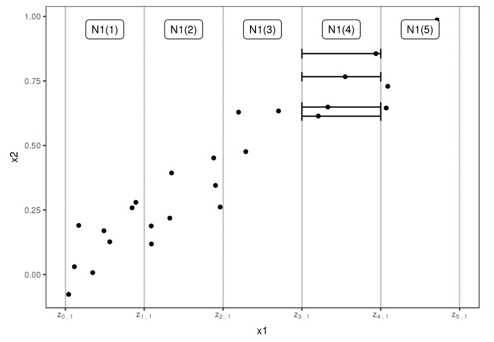
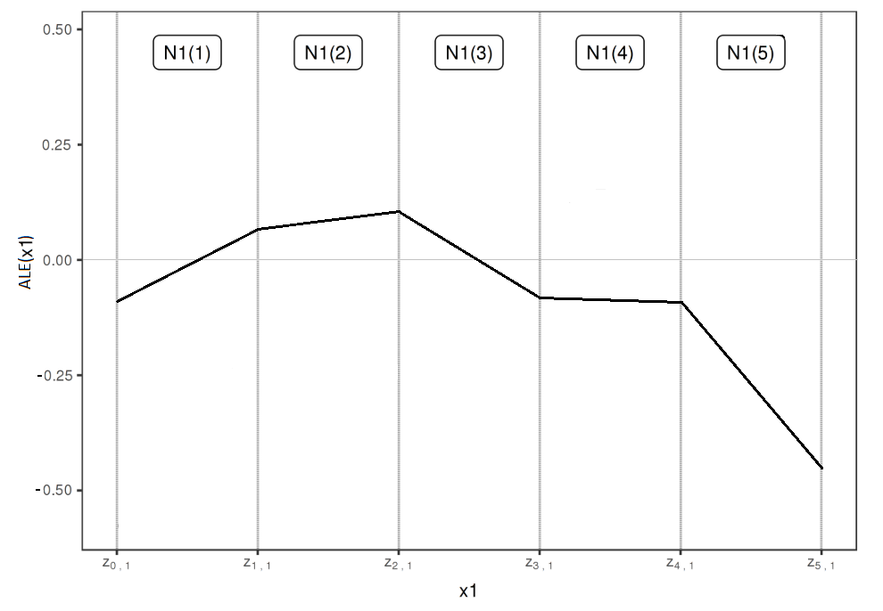

# Introduction to Accumulated Local Effects (ALE) {#ale}

*Authors: Jakob Bodensteiner, Nikolas Fritz*

*Supervisor: Christian Scholbeck*

## Motivation

As seen in section 2 PDPs don't work well as soon as two or more features are correlated. This gives rise to the definition of ALEs. Although their definition makes sense for high dimensional feature spaces including categorical features, within this section we only treat a space with two continuous features. 

## The Theoretical Formula {#ale-intro-formula}

The uncentered ALE with respect to a starting point $z_{0, j}$ is defined by [@Apley2016] as

$$  \widetilde{ALE}_{\hat{f},~j}(x) = \hat{f}_{x_j,ALE}(x) = \int_{z_{0,~j}}^{x} E_{X_c \mid X_j} [\hat{f}^j(X_j,~X_c)\mid X_j = z_j]~dz_j,$$
where $\hat{f}$ is an arbitrary prediction function, as well as $\hat{f}^j(*,*)$ its j-th partial derivative. In this context $X_j$ is the feature of interest while $X_c$ represents the other features.

### Centering

The ALE (centered ALE) is defined as

$$  ALE_{\hat{f},~j}(x) = \widetilde{ALE}_{\hat{f},~j}(x) - E_{X_j}[\widetilde{ALE}_{\hat{f},~j}(X_j)]$$ 

The centering makes sense as it helps to interpret the ALE in a reasonable way. This will be explained in section \@ref(ale-intro-interpret).


## Estimation Formula 

Since this theoretical formula is of no use for a black box model with unknown or even non-existing gradients, an approximative approach will be used.
The uncentered ALE can be approximated by the formula 

$$ \widehat{\widetilde{ALE}}_{\hat{f},~j}(x) = \int_{z_{0,~j}}^{x} \sum_{k=1}^{K}    \frac{1_{I_k}(x_j)}{n_j(k)}\sum_{i:x_j^{(i)}\in N_j(k)} \frac{[\hat{f}(z_{k,~j}, x_{\setminus j}^{(i)})-\hat{f}(z_{k-1,~j}, x_{\setminus j}^{(i)})]}{z_{k,~j}-z_{k-1,~j}}~dx_j~.  $$

In a first step the relevant dimension of the feature space is divided into K intervals beginning with the starting point $z_{0, j}$. As it is not clear how to exactly divide the feature space, section \@ref(ale-misc) deals with that question. The upper boundary of the k-th interval is denoted by $z_{k, ~j}$ as well as the lower boundary by $z_{k-1, ~j}$. The half-open interval $]z_{k-1,~j},~z_{k,~j}]$ is defined as $I_k$. $N_j(k)$ denotes the k-th interval, i.e. $]z_{k-1,~j}, z_{k,~j}]$ and $n_j(k)$ the total number of observations having the j-value within this interval. $x_j^{(i)}$ is the j-value of the i-th observation and correspondingly $x_{\setminus j}^{(i)}$ the values of the other features. The term on the right approximates the expected partial derivative within each interval. 
Therefore each instance within an interval is shifted to the upper and lower limit of the interval and the total difference of the prediction is calculated. Divided by the length of the interval this is a reasonable approximation for the "local" effect on the prediction, if the feature of interest changes (cet. par.).
By averaging these approximations over all observations within the k-th interval, we receive a rough estimator for the term $E_{X_c \mid X_j} [\hat{f}^j(X_j,~X_c)\mid X_j \in N_j(k)]$, which we take as constant effect for the k-th interval. 
By integrating over this step function, which represents the locally estimated derivatives, the (local) changes are accumulated. That's why the name Accumulated Local Effects is quite reasonable.
The approximative formula for the centered ALE follows directly as

$$ \widehat{ALE}_{\hat{f},~j}(x) = \widehat{\widetilde{ALE}}_{\hat{f},~j}(x) - \frac{1}{n} \sum_{i=1}^{n} \widehat{\widetilde{ALE}}_{\hat{f},~j}(x_j^{(i)})~. 
 $$


### Implementation Formula

As both the centered and the uncentered ALE estimations are piecewise linear functions (integration over a step function), one can first calculate the ALE at the interval boundaries and interpolate in a second step. Therefore the following formula proposed by [@Apley2016, page 11] with slightly changed notation will be useful. The definitions of its components are as above. Additionally $k_j(x)$ is defined as the number of the interval that contains $x$, i.e. $x \in ~]z_{k_j(x)-1,~j},~z_{k_j(x),~j}]$.  

$$  \widehat{\widetilde{ALE}}_{steps,~\hat{f},~j}(x) =  \sum_{k=1}^{k_j(x)}   \frac{1}{n_j(k)}\sum_{i:~x_j^{(i)}\in N_j(k)} [\hat{f}(z_{k,~j}, x_{\setminus j}^{(i)})-\hat{f}(z_{k-1,~j},~x_{\setminus j}^{(i)})].  $$
This formula returns a step function. The values in each interval are the accumulated values of the averaged total differences in each interval. To transfer this formula into the correct estimator of the uncentered ALE one has to linearely interpolate the points $(z_{k-1,~j},~\widehat{\widetilde{ALE}}_{steps,~\hat{f},~j}(z_{k-1,~j}))$ with $( z_{k,~j},\widehat{\widetilde{ALE}}_{steps,~ \hat{f},~j}(z_{k,~j}))$ for $k \in \{1, ..., K \}$ and $\widehat{\widetilde{ALE}}_{steps, \hat{f},j}(z_{0,~j}) = 0$.


Since in this formula there is no integral, it is easier to implement.


## Intuition and Interpretation {#ale-intro-interpret}

As the former sections introduced the theoretical basics for the ALE, this section shall provide an intuition as well for the calculation method as for the interpretation. As described above, the local behavior of the model with respect to the variable of interest is estimated by moving the existing data points to the boundaries of their interval and evaluating the total difference of the prediction for the "new" data points. Figure \@ref(fig:dataALE) first offered by [@molnar2019] gives a good intuition for this procedure. 


```{r dataALE, fig.cap='(ref:aleIntuition)', out.width='100%', echo=FALSE}


```
(ref:aleIntuition) The data points within the 4-th interval are shifted to the interval boundaries $z_{3,~1}$ and $z_{4,~1}$.

First one splits the total range of the variable of interest (in this case $x_1$) to intervals of suitable size.  
For each interval the contained data points are moved to the interval boundaries. One gets twice as much "simulated" new data points as originally contained in each interval. The prediction function is now evaluated at these simulated points and the total difference of the prediction (for the given interval) is estimated as the mean change. Divided by the length of the interval one gets an estimation for the partial derivative within this interval. Theoretically one receives the uncentered ALE by integration over this step function. Technically in a first step the total change per interval is accumulated. In a second step linear interpolation at the interval boundaries simulates a constant change within each interval. Both variants lead to the same result.      


As the evaluation is ideally done on relatively small intervals, on the one hand the local behavior of the model is estimated. On the other hand the covariance structure of the features is taken into account, as only "realistic" data points are simulated. This is in accordance with sampling from the conditional distribution.

In a last step the uncentered ALE is centered, i.e. shifted by a constant such that the expectation of the centered ALE is zero.  

Figure \@ref(fig:aleEx) shows an example ALE which could match the data situation of Figure \@ref(fig:dataALE).

```{r aleEx, fig.cap='(ref:aleExample)', out.width='100%', echo=FALSE}


```
(ref:aleExample) ALE on basis of 5 intervals

To understand the interpretation of the ALE it can be useful to first have a look at the intuition behind the uncentered ALE.
If the value of the uncentered ALE at $x_1 = 2$ equals $1$, this means that if one samples a data point from the joint distribution of both features but only knows that $x_1 = 2$, one would expect the prediction to be 1 higher than the average prediction for  realistic data points at $x_1 = z_{0,1}$ (i.e. data points sampled from the conditional distribution at $x_1 = z_{0,1}$). This expectation strongly depends on the reference point $z_{0,1}$, which per definition is smaller than the smallest $x_1$-value of the data.
By subtracting the expectation of the uncentered ALE - which is the mean difference of the prediction of a data point from the joint distribution to the prediction of a realistic data point(i.e. from the conditional distribution) at $x_1 = z_{0,1}$ - the interpretation becomes a lot easier. If the value of the (centered) ALE at $x_1 = 2$ equals for example $2$, this means that, if one samples a data point from the joint distribution of both features and $x_1$ equals 2, one would expect the 1st order effect of feature $x_1$ to be 2 higher than the average 1st order effect of this feature.

So far only the case of 2-dimensional feature spaces with one feature of interest was taken into account. In the following chapters methods and interpretation for ALE with two numeric features (second order effects) or one categorical feature will be in the focus. Furthermore we will have a look on the size of the intervals the data is evaluated on, which can be crucial for the expressiveness of the ALE.
