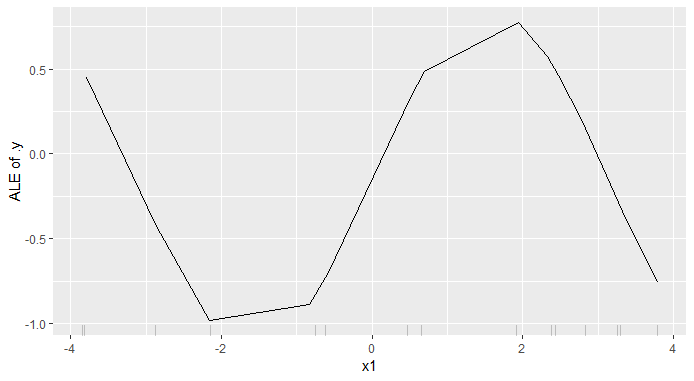
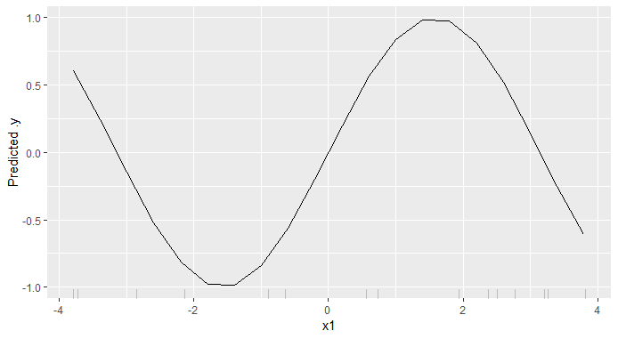

# Comparison of ALE and PDP

*Author: Jakob Bodensteiner*

This subchapter of ALE will focus on the comparison of ALE and PDP, especially on correlated data. At first the interpretation for the regular one dimensional (or 1D) ALE to the 1D PDP will be discussed. Thereafter two dimensional ALEs will be introduced and their difference to PDPs will be explained. At the end there will be a runtime comparison and a example in which a classic PDP might outperform the ALE. 

## Comparison one feature

So far in this book one could already see a few examples of the PDP for one feature and its limitations. The ALE is kind of the solutions for the biggest issue with the PDP. The ALE can interpret models predicting on correlated variables correctly, while the PDP usually fails in this case. Before the two methods will be compared, here comes a short reminder regarding the interpretation. 
Given a value for the feature of interest ...

... the 1D PDP shows the mean prediction value.

... the 1D ALE shows the expected and centered first order effect.

With this interpretations in mind the first example with artifical data will be discussed.

### Example 1: Multiplicative prediction function

The following Problem is constructed: There is a data set consisting of 150 observations with three features ($x_1$, $x_2$, $x_3$) and the target variable $y = x_1 \times x_2 \times x_3$.
The the features of each observation are sampled from the these disrtibutions.
$X_1 \sim \mathcal{U}(0,~0.5)$, $X_2 \sim \mathcal{N}(2,~2)$ and $X_3\mid X_2, X_1 \sim \mathcal{N}(X_2,X_1)$
So features one and two are independent from each other, while $x_3$ is strongly correlated with $x_2$ and not independent from $x_1$, although there is no influence of $x_1$ on the expected value of $x_3$. In this example the prediction function is not fitted but set as the target variable  $f(x_1, x_2, x_3) = y = x_1 \times x_2 \times x_3$.

```{r pdpsx1x2x3, fig.cap='(ref:pdpsx1x2x3Cap)', echo=FALSE}

knitr::include_graphics("images/ale_1_PDPs_x1x2x3_150_0_0p5_2_2.png")
```
(ref:pdpsx1x2x3Cap) PDPs for prediction function $f(x_1, x_2, x_3) = x_1 \times x_2 \times x_3$.

```{r alesx1x2x3, fig.cap='(ref:alesx1x2x3Cap)', echo=FALSE}

knitr::include_graphics("images/ale_1_ALEs_x1x2x3_150_0_0p5_2_2.png")
```
(ref:alesx1x2x3Cap) ALEs for prediction function $f(x_1, x_2, x_3) = x_1 \times x_2 \times x_3$.

Plot \@ref(fig:pdpsx1x2x3) shows the 1D PDP for each of the three features. One can clearly see that the PDP detects a linear influence on the prediction for all 3 of the features.
On the other hand the ALE (figure \@ref(fig:alesx1x2x3)) attests the linear influence to the feature $x_1$ only. This plot exposes a weakness of the ALE compared to the PDP. The ALE depends much more on the sampled data than the PDP does. The result is that the ALE can look a bit shaky. In this special case it is that seriously one almost can't see the linear influence. If there would be more data or less intervals for the estimation, the plot would look more like the PDP for feature $x_1$. The two other features seem to rather have an exponential influence on the prediction. And this is the case indeed, since it is the 'true' link between prediction and the correlated features. Feature $x_3$ has (in expectation) the same value as $x_2$. So especially for a uniform distribution close to zero for feature $x_1$ the last part of the prediction function $x_2 \times x_3$ can be approximated by $x_2^2$ or $x_3^2$. This explains the exponential influence. By changing the prediction formula to $f(x_1, x_2, x_3) = y = x_1 \times x_2^2$ the following PDP and ALE plots are estimated.

```{r pdpsx1x22, fig.cap='(ref:pdpsx1x22Cap)', echo=FALSE}

knitr::include_graphics("images/ale_1_PDPs_x1x22_150_0_0p5_2_2.png")
```
(ref:pdpsx1x22Cap) PDPs for prediction function $f(x_1, x_2, x_3) = x_1 \times x_2^2$.

```{r alesx1x22, fig.cap='(ref:alesx1x22Cap)', echo=FALSE}

knitr::include_graphics("images/ale_1_ALEs_x1x22_150_0_0p5_2_2.png")
```
(ref:alesx1x22Cap) ALEs for prediction function $f(x_1, x_2, x_3) = x_1 \times x_2^2$.

Plots \@ref(fig:pdpsx1x22) and \@ref(fig:alesx1x22) clearly show the linear influence of $x_1$ again. Additionally this time both (ALE and PDP) attest an exponential influence to feature $x_2$ on the prediction. Since $x_3$ does not have any influence on the prediction function, it is correct, that there is no influence detected.
The reason for this is the calculation method for the PDP. With the new prediction formula only depending on uncorrelated features $x_1$ and $x_2$, the PDP works well. Since now the approach of PDP to calculate the mean effect is correct.

### Example 2: Additive prediction function
In this example PDP and ALE will be applied to an additive prediction function.

Again a data set consisting of three features ($x_1$, $x_2$, $x_3$) is constructed. In this case the target variable is $y = x_1 + x_2 - x_3$. Again the prediction function is exactly the same as the target variable.
The distributions are similar to tho ones from example 1 and again 150 observations were sampled.
$X_1 \sim \mathcal{U}(0,~2)$, $X_2 \sim \mathcal{N}(2,~0.5)$ and $X_3\mid X_2 \sim \mathcal{N}(X_2,~0.5)$

```{r pdpsx1px2mx3, fig.cap='(ref:pdpsx1px2mx3Cap)', echo=FALSE}

knitr::include_graphics("images/ale_1_PDPs_x1_plus_x2_minus_x3_150_0_2_0p5.png")
```
(ref:pdpsx1px2mx3Cap) PDPs for prediction function $f(x_1, x_2, x_3) = x_1 + x_2 - x_3$.

```{r alesx1px2mx3, fig.cap='(ref:alesx1px2mx3Cap)', echo=FALSE}

knitr::include_graphics("images/ale_1_ALEs_x1_plus_x2_minus_x3_150_0_2_0p5.png")
```
(ref:alesx1px2mx3Cap) ALEs for prediction function $f(x_1, x_2, x_3) = x_1 + x_2 - x_3$.

For this example one can see that the ALEs (\@ref(fig:alesx1px2mx3)) and PDPs (\@ref(fig:pdpsx1px2mx3)) are basically the same. Ignoring the centering both attest the same linear influence for all three features. And since it is an additive model this is actually correct. But neither the ALE nor the PDP recognise the strong correlation between the features $x_2$ and $x_3$. The real influence of features $x_2$ and $x_3$ is in expectation zero, since it is $x_2 - x_3$ and $E[X_3 \mid X_2] = X_2$. So $E[X_2 - X_3 \mid X_2] = 0$.
This shows a few points one has to be aware of when working with these plots.
In this example if one uses the interpretation of the PDP for feature x_2 and states 'If the value of feature $x_2$ is 2.5, then I expect the prediction to be 1.5' it would be wrong. The problem here is the extrapolation in the estimation of the PDP. 
Regarding the ALE the advantage is that there is just a very small chance of extrapolation in the estimation of the ALE. But this does not mean in general it would recognise any correlation between the features. And it is in general not possible to state something about the prediction with only one 1D ALE. The ALE is just showing the the expected and centered main effect of the feature. In this example an interpretation like 'If feature $x_2$ has value 2.5 then in expectation the prediction will be 0.5 higher than the average prediction' is wrong. If one needs a statement like that the other strongly correlated features have to be taken into account as well. One has to be aware of higher order effects of the ALE, too.
To conclude the analysis of this example 2D ALEs are necessary so it will be continued to analyse later in this chapter.

But before the the 2D ALE is introduced a real world prediction prblem will be discussed.


### Example 3: Real world data - Munich rents

Now a real world problem will be shown. This is an example with data for rents in Munich from 2003. The target variable 'nm' is the rent per month per flat. To predict the rent a random forest was fitted. The features deserving special attention are 'wfl' (size in square meters) and 'rooms' (number of rooms). These two variables are clearly positively correlated, since there will not be an appartment with 15 squaremeters and 5 rooms. The other features are not that strongly correlated as one can see in figure \@ref(fig:correlationMatrixRents):

```{r correlationMatrixRents, fig.cap='(ref:correlationMatrixRentsCap)', echo=FALSE}

knitr::include_graphics("images/ale_1_correlation_munich_rents.png")
```
(ref:correlationMatrixRentsCap) Correlatin matrix for rents in Munich.

<!-- TODO: add ice to to maybe explain difference in area with many squaremeters  -->

```{r pdpaleRents, fig.cap='(ref:pdpaleRentsCap)', echo=FALSE}

knitr::include_graphics("images/ale_1_rf_rent_for_rooms_and_wfl.png")
```
(ref:pdpaleRentsCap) PDP and ALE plots for influence of space on rents in Munich.

Figure \@ref(fig:pdpaleRents) shows a more or less expected influence of space on the rent. The bigger the apartment the more expensive it is. In the area with a lot of data between 0 and 100 the PDP looks more straight then the ALE which is again a bit shaky. In the area with not that much observations it is the other way around. The PDP suddenly breaks down what seems quite unrealistic, while the ALE has a pretty straight trend. Maybe the ICE curve could be helpfull to see why there is such a significant drop in the PDP. So here it seems like the ALE outperforms the PDP. 

So far so good, the one dimensional differences in interpretation and the advantages of the ALE over the PDP should be clear now. In cases with correlated data there usually the ALE is superior to the PDP because it does hardly extrapolate in the estimation. Other cases will be investigated later in the chapter, showing that the PDP still can be worth a look. But before that the 2D ALE will be introduced.


## Comparison two features
Before the 2D ALE and PDP will be applied to the same predictors, the 2D ALE will be derived. In the first place the theoretical formula will be defined. Thereafter the estimation will be explained and then the comparison to the 2D PDP will be made.

### The 2D ALE

#### Theoretical Formula 2D ALE

Similar to one variable of interest there is a theoretical formula for a 2-dimensional ALE. This ALE aims to visualize the 2nd order effect. It means one will only see the additional effect of interaction between those two features. The main effects of the features will not be shown in the 2D ALE. To explain the formula it will be assumed that $j$ and $l$ are the two features of interest and the rest of the features is represented by $c$. So in the following variable $x_c$ can be of higher dimension than 1. As for the 1D ALE there is again the theoretical derivative for the fittet function $\hat{f}$. But this time there is need for a derivative in the direction of both features of interest. So in the following this notation will hold: 
$$ \hat{f}^{(j,~l)}(x_j,~x_l,~x_c) = \frac{\delta\hat{f}(x_j,~x_l,~x_c)}{\delta x_j~ \delta xl}$$

The whole formula would be very long, so it is split in 3 parts:
1. The 2nd order effect (formula xx)
2. 2nd order effect centered for both main effects (formula xx)
3. The 2D ALE; the centered 2D ALE centered for its mean overall effect (formula xx)

Following is the 2nd order effect with no correction for main effects of $x_j$ and $x_l$. So this is not yet the pure 2nd order effect the 2D ALE aims to.

$$  \widetilde{\widetilde{ALE}}_{\hat{f},~j,~l}(x_j, x_l) = \int_{z_{0,~j}}^{x_j}  \int_{z_{0,~l}}^{x_l} E[\hat{f}^{(j,~l)}(X_j,~X_l,~X_c)\mid X_j = z_j,~X_l = z_l]~dz_l~dz_j$$
Now from the uncorrected 2nd order effect the two main effects of both features on the uncorrected 2D ALE are subtracted. In this way the main effects of $x_j$ and $x_l$ on the final ALE $ALE_{\hat{f},~j,~l}(x_j, x_l)$ are both zero (apley). But be carefull, this is not centering by a constant as in the one dimensional ALE. This is a correction for the also accumulated main effects which of course varie in the directions of the features.

$$ \widetilde{ALE}_{\hat{f},~j,~l}(x_j, x_l) = \widetilde{\widetilde{ALE}}_{\hat{f},~j,~l}(x_j, x_l) ~ -  \int_{z_{0,~j}}^{x_j}  E[\frac{\delta\widetilde{\widetilde{ALE}}_{\hat{f},~j,~l}(X_j, X_l)}{\delta X_j}\mid X_j = z_j]~dz_j ~ - \int_{z_{0,~l}}^{x_l}  E[\frac{\delta\widetilde{\widetilde{ALE}}_{\hat{f},~j,~l}(X_j, X_l)}{\delta X_l}\mid X_l = z_l]~dz_l$$

This shows the final (centered) 2D ALE. The subtraction in the formula is now the real centering to shift the 2nd order effect (corrected for the main effects) to zero with respect to the marginal distribution of $(X_j, ~ X_l)$.

$$ ALE_{\hat{f},~j,~l}(x_j, x_l) = \widetilde{ALE}_{\hat{f},~j,~l}(x_j, x_l) ~ -  E[\widetilde{ALE}_{\hat{f},~j,~l}(X_j, X_l)]$$

In the appindex (ref TODO) one can find the calculation of the theoretical ALE for Example 1.


#### Estimation 2D ALE
Analogously to the 1D ALE in most cases it is not possible to calculate the 2D ALE. It has to be estimated. These estimation formulas are pretty long and might be confusing, especially the indices. But there will be a explenation with a visualization as well to clarify the estimation method.

<!-- TODO: first make nice definition of variables and stuff apley seite 12 -->
$$ \widehat{\widetilde{\widetilde{ALE}}}_{\hat{f},~j,~l}(x_j, ~x_l) = \sum_{k=1}^{k_j(x_j)} \sum_{m=1}^{k_l(x_l)}   \frac{1}{n_{\{j,~l\}}(k,m)}\sum_{i:~x_{\{j,~l\}}^{(i)}\in N_{\{j,~l\}}(k,m)} ~ \Delta_{\hat f}^{{\{j,~l\}}, ~k,~m} (x_{\setminus\{j,~l\}}^{(i)}), $$
The $\Delta$ function is:

$$ \Delta_{\hat f}^{{\{j,~l\}}, ~k,~m} (x_{\setminus\{j,~l\}}^{(i)}) = [\hat f(z_{k,~j},~ z_{m,~l}, ~x_{\setminus\{j,~l\}}^{(i)}) - \hat f(z_{k-1,~j},~ z_{m,~l}, ~x_{\setminus\{j,~l\}}^{(i)})]~ - [\hat f(z_{k,~j},~ z_{m-1,~l}, ~x_{\setminus\{j,~l\}}^{(i)}) - \hat f(z_{k-1,~j},~ z_{m-1,~l}, ~x_{\setminus\{j,~l\}}^{(i)})] $$ 

Now the correction for the main effects is estimated:

$$ \widehat{\widetilde{ALE}}_{\hat{f},~j,~l}(x_j, ~x_l) = \widehat{\widetilde{\widetilde{ALE}}}_{\hat{f},~j,~l}(x_j, ~x_l)  $$

$$-  \sum_{k=1}^{k_j(x_j)} \frac{1}{n_j(k)} \sum_{m=1}^{K} ~ n_{\{j,~l\}}(k,m) [\widehat{\widetilde{\widetilde{ALE}}}_{\hat{f},~j,~l}(z_{k,~j}, ~z_{m,~l}) - \widehat{\widetilde{\widetilde{ALE}}}_{\hat{f},~j,~l}(z_{k-1,~j}, ~z_{m,~l})]$$
$$ - \sum_{k=1}^{k_l(x_l)} \frac{1}{n_l(k)} \sum_{m=1}^{K} ~ n_{\{j,~l\}}(k,m) [\widehat{\widetilde{\widetilde{ALE}}}_{\hat{f},~j,~l}(z_{k,~j}, ~z_{m,~l}) - \widehat{\widetilde{\widetilde{ALE}}}_{\hat{f},~j,~l}(z_{k,~j}, ~z_{m-1,~l})] $$
This is the uncentered 2D ALE since it is just corrected for its main effects. And this is not a real centering in the sense of substracting a constant value. Now it will be centered for its estimation $E[\widehat{\widetilde{ALE}}_{\hat{f},~j,~l}(X_j, ~X_l)]$ and this is a constant, so there will be no effect on the shpe. Again this expected value has to be estimated, to complete the 2D ALE. 

$$ \widehat{ALE}_{\hat{f},~j,~l}(x_j, ~x_l) = 
\widehat{\widetilde{ALE}}_{\hat{f},~j,~l}(x_j, ~x_l) -
\sum_{k=1}^{K}\sum_{m=1}^{K} ~ n_{\{j,~l\}}(k,m) ~ \widehat{\widetilde{ALE}}_{\hat{f},~j,~l}(z_{k,~j}, ~z_{m,~l}) $$

In difference to the ALE for one feature of interest, the 2D ALE is a two dimensional stepfunction, so there is no smoothing or something similar to make it a continuous function. 

This formulas are pretty long and a bit confusing, so to get an intuition of the estimation plot TODO will be helpfull.

```{r ale2DEstimation, fig.cap='(ref:ale2DEstimationCap)', echo=FALSE}

knitr::include_graphics("images/ale_1_ALE_2D_estimation.png")
```
(ref:ale2DEstimationCap) Visualisation of the absolut differences for the 2nd order effect TODO vgl apley.

To calculate the delta (gleichung TODO) for the uncorrected and uncentered ALE estimation in each cell the predictions for the data points in that cell will be calculated pretending the $x_l$ and $x_j$ values are cornervalues of the cell they are in. In the case of figure \@ref(fig:ale2DEstimation) these 2 dimensional cornervalues would be a,b,c,d. The delta for point x in this example would be calculated like this:
$$ \Delta_{\hat f}^{{\{j,~l\}}, ~4,~3} (x_{\setminus\{j,~l\}}) = [\hat f(b, ~x_{\setminus\{j,~l\}}) - \hat f(a, ~x_{\setminus\{j,~l\}})]~ - [\hat f(d, ~x_{\setminus\{j,~l\}}) - \hat f(c, ~x_{\setminus\{j,~l\}})]$$
The same would be done for point y and then the deltas would be averaged to get the mean delte for cell $N_{\{j,~l\}}(4,3)$. This would then be accumulated over all cells left or beneath this cell to get the uncorrected and uncentered ALE for the values in $N_{\{j,~l\}}(4,3)$. 

The correction for the main effects extracts the effect of the single features on the ALE so far and substracts it from the raw formula. To stick with this example the correction for the main effect of feature $x_j$ for values in $N_j(4)$ takes into account all cells in the first 4 columns and aggregates the first order effect. In cell $N_{\{j,~l\}}(4,3)$ this would look like this
$$ \widehat{\widetilde{\widetilde{ALE}}}_{\hat{f},~j,~l}(b) - \widehat{\widetilde{\widetilde{ALE}}}_{\hat{f},~j,~l}(a)$$
Correction for $x_l$ would look pretty much the same just from the other direction and it would take into account the first 3 rows. So in cell $N_{\{j,~l\}}(4,3)$ the first order effect would be
$$ \widehat{\widetilde{\widetilde{ALE}}}_{\hat{f},~j,~l}(b) - \widehat{\widetilde{\widetilde{ALE}}}_{\hat{f},~j,~l}(d) $$

Thereafter the corrected ALE is centered for its mean, pretty much the same as in one dimension just aggregating over grid instead of a line.

If there are cells without data points the can either be greyed out or they recieve the same value as their nearest cell with datapoints. In the iml package I actually don't know what happens, for sure none of these two options.
<!-- TODO: was passiert mit leeren zellen im iml? -->


#### Example 1 continued - Theoretical and estimated 2D ALE

Before ALE and PDP will be compared for two features of interest, the analysis of example 1 will be continued in two dimensions, to get a first glance at the 2D ALE.

The data set is basically the same, just for sake of clearness in the 2D ALE the distributions are a bit different.
We still consider a data set consisting of 150 observations with three features ($x_1$, $x_2$, $x_3$) and the prediction function $f(x_1, x_2, x_3) = x_1 \times x_2 \times x_3$.
But this time the three features are sampled from the these disrtibutions.
$X_1 \sim \mathcal{U}(0,~0.5)$, $X_2 \sim \mathcal{N}(5,~1)$ and $X_3\mid X_2, X_1 \sim \mathcal{N}(X_2,X_1)$
So feature $x_2$ is expected to be 5 and has a lower variance than it has in example 1. The rest stays the same. 

With the formulas in the appindex (ref TODO) it is possible to calculate the theoretical 2D ALE.

```{r theo2Dale, fig.cap='(ref:theo2DaleCap)', echo=FALSE}

knitr::include_graphics("images/ale_1_ALE_2D_theo_vs_estim_x1x2x3_150_0_0p5_5_1.png")
```
(ref:theo2DaleCap) Theoretical 2D ALE (left) and estimated ALE (right).

Figure \@ref(fig:theo2Dale) shows the theoretical ALE compared to the estimated one. In this example it looks pretty similar. The interpretation is a bit hard, since one can only see the 2nd order effects, corrected for the main effects, so it is not possible to state something about the prediction with jsut this plot. But this problem will be discussed in the coming up chapter.

### 2D ALE vs 2D PDP
In this Chapter mainly 2D plots for examples will be analysed. To show statement, that there are no main effects in the 2D ALE example 1 will be discussed again.
 
#### Example 2 continued

Just a short reminder of example 2: the prediction function here is $f(x_1, x_2, x_3) = x_1 + x_2 - x_3$ and $x_2$ and $x_3$ are strongly poitive correlated.

```{r x1px2mx3ale2D, fig.cap='(ref:x1px2mx3ale2DCap)', echo=FALSE}

knitr::include_graphics("images/ale_1_2d_comp_x1_plus_x2_minus_x3_150_0_2_0p5.png")
```
(ref:x1px2mx3ale2DCap) 2D PDP (left) vs. 2D ALE (right) for prediction function $f(x_1, x_2, x_3) = x_1 + x_2 - x_3$.

Figure \@ref(fig:x1px2mx3ale2D) shows the direct comparison of 2D PDP and 2D ALE. The ALE is almost completely zero as expected. In this additive example there are main effects only and since the 2D ALE is corrected for the main effects of the features, there is no pure 2nd order effect in this example. The PDP in comparison shows the mean prediction so of course there are the main effects estimated within the 2D PDP as well. So it is hard to compare those two just like this. 

To get a better comparison one can add the main effects (1D ALEs) of the two features of interest to the 2D ALE.

```{r ale2DaddedUp, fig.cap='(ref:ale2DaddedUpCap)', echo=FALSE}

knitr::include_graphics("images/ale_1_2d_ale_plus_x1_plus_x2_minus_x3_150_0_2_0p5.png")
```
(ref:ale2DaddedUpCap) 2D ALE added up with 1st order effects of features $x_2$ and $x_3$ for prediction function $f(x_1, x_2, x_3) = x_1 + x_2 - x_3$. In the right plot the underlying 2 dimensional data points are included.

This plot \@ref(fig:ale2DaddedUp) shows the ALE added up with the corresponding 1st order effects of the features. And now it seems pretty much the same as the PDP in figure \@ref(fig:x1px2mx3ale2D). On the right side the same plot can be seen. This one additionally includes the underlying data points regarding features $x_2$ and $x_3$. Furthermore these two features are independent from feature x_1, so the PDP and ALE yield the same correct interpretation that for realistic data points the influence of these two features is close to zero because of their strong positive correlation and their opposing first order effects (figures \@ref(fig:alesx1px2mx3) and \@ref(fig:pdpsx1px2mx3)).

With this is mind, example 1 deserves another look regarding the 2nd order effect in comparison to the PDP.

#### Example 1 comparison 2D ALE and PDP

To ba able to compare the 2D ALE from the last chapter for prediction function $f(x_1, x_2, x_3) = x_1 \times x_2 \times x_3$ with the 2D PDP one also should add up the 1st order effects. 


```{r ale2DaddedUpx1x2x3, fig.cap='(ref:ale2DaddedUpx1x2x3Cap)', echo=FALSE}

knitr::include_graphics("images/ale_1_comp_2d_1st_orders_added_x1x2x3_150_0_0p5_5_1.png")
```
(ref:ale2DaddedUpx1x2x3Cap) 2D PDP vs 2D ALE with added up 1st order effects of features $x_1$ and $x_2$ for prediction function $f(x_1, x_2, x_3) = x_1 \times x_2 \times x_3$.

This plot \@ref(fig:ale2DaddedUpx1x2x3) shows exactly what happens in this case, when the 1st order effects of the ALE are added up to the 2nd order effects. One can see that although the connection between $x_2$ and $x_3$ has been detected by the 1st order ALEs (figure \@ref(fig:alesx1x2x3)) and has not been by the 1D PDPs (figure \@ref(fig:pdpsx1x2x3)), the comparable 2D plots look pretty much the same.

<!-- TODO: I don't know if I can find an example where 2D ALE outperforms 2D PDP  -->

In this two examples it seems like the 2D ALE is not that much better than the ALE, but for sure there are examples where the 2D ALE outperforms the 2D PDP. One big advantages of the ALE in general over the PDP is, that it hardly extrapolates in the estimation, which is usually the case for the PDP with correlated features. And one can take a look at seperated 1st and 2nd order effects, which can be very helpful, especially for real blackbox models. Furthermore in the next chapter the runtime will turn out to be a strong advocate for the ALE, especially for bigger datasets.

## Runtime comparison 
Here it is the plan to compare the runtime of the two algos with the package microbenchmark. For comparison one small data set (100 points), one bigger (around 1000) and one 'huge' (10000 points) will be used.
The plots to be compared will be PDP vs ALE for:

1. one numerical feature of interest
2. two numerical features of interest
3. one categorical feature of interest

The outcomes will be analysed. It is expected that The ALE is faster.
<!-- TODO: At the moment it seems with my laptop, PDP for 10000 points is just not possible :-( -->

## Weakness of ALE

Compared to PDP ALE is almost always the better choice, at least for one feature of interest. It is faster and unbiased also for correlated features. But in some special cases PDP can be superior to ALE.


``` {r eval=FALSE}
library(crs)
library(iml)

# create data frame with target variable y = sinus(x1)
# x1 uniformely between min_int and max_int 
# x2 has no influence on the target variable
# nor is it correlated with x1
get_sin_df <- function(n, min_int, max_int) {
  x1 <- runif(n, min_int, max_int)
  sinus <- sin(x1)
  x2 <- numeric(n)
  return(as.data.frame(cbind(x1, x2, sinus)))
}

# create example df
sin_df <- get_sin_df(15, -4, 4)

# fit splines on df
spl <- crs(sinus ~ x1, data = sin_df)

# generate predictor set
X = sin_df[which(names(sin_df) != 'sinus')]
predictor = Predictor$new(spl, data = X, y = sin_df$sinus)

# plot ale
ale = FeatureEffect$new(predictor, feature = 'x1')
plot(ale)

# plot pdp on same situation
pdp = FeatureEffect$new(predictor, feature = 'x1', method = 'pdp')
pdp$plot()
```

```{r aleSinusSpline, fig.cap='(ref:aleSinusSplineCap)', echo=FALSE}


```
(ref:aleSinusSplineCap) ALE estimated on a sinus function fitted with splines. Feature x1 is independent of x2.

```{r pdpSinusSpline, fig.cap='(ref:pdpSinusSplineCap)', echo=FALSE}


```
(ref:pdpSinusSplineCap) PDP calculated on the same setting like the ALE above in figure \@ref(fig:aleSinusSpline).

Figure \@ref(fig:pdpSinusSpline) shows a PDP calculated on the data set from the r code above. For the target variable y it holds that y = sinus(x1). Feature x1 is uniformely sidtributed between -4 and 4. Feature x2 has no influence on the target variable nor is it correlated with x1.
Since there is absolutely no connection between x2 and x1 or y, the PDP shows simply the prediction of the fitted spline function. So obviously the spline fits the real sinus pretty well. 
In contrast to that we see that the ALE (\@ref(fig:aleSinusSpline)) struggles to interpret the the fitted spline function. The obvious main problems are:
A: It can be seen that it does not cover the full range of the sinus function (between -1 and 1). 
B: It does not show a smooth curve. One could guess a sinus function but it is absolutely not obvious.
First of all, the most important reason for both problems is the poor data situation in this example. The sample includes just 15 data points.
The point here for problem A is, that in the peek of the sinus function no point was sampled. There was also no point sampled in the lowest region of the sinus function. But just looking at the range of this ALE it is between -1 and about 0.75. So one could conclude that just the upper range was not evaluated well. This would not be correct. For the ALE one always has to be aware of the centering. Since in the example here more points in feature x1 were sampled with low sinus values the centering of the ALE shifts the uncentered ALE downwards. This can be seen by the value at x1. It is below 0 although sinus(0) = 0. So in both directions the ALE does not get the maximal values of the sinus function. For Problem B on of the main assumptions of the ALE estimation is the reason. In the ALE estimation the change of the function in each interval is estimated in a linear way. And if the intervals become too big for the function, in a way that an interval the change is not approximately linear anymore, then the ALE does not deliver smooth results.

If one samples enough points for x1 then the ALE looks basically the same as the PDP. So for enough data the ALE is to be preferable to the PDP. Especially in real data no correlation between the features is not often the case. But if the data is sparse, the prediction function relatively complex and the feature of interest has low correlation with the other features the PDP is absolutely worth a look. 

## Calculation theoretic 2D ALE

Features $x_1$, $x_2$, $x_3$ and the prediction function $\hat{f}(x_1, x_2, x_3) = x_1 \times x_2 \times x_3$ are given.
The features are sampled from the these disrtibutions:
$X_1 \sim \mathcal{U}(a,~b)$, $X_2 \sim \mathcal{N}(\mu,~\sigma)$ and $X_3\mid X_2, X_1 \sim \mathcal{N}(X_2,X_1)$
The theoretical 2D ALE for features $x_1$ and $x_2$ will be calculated.

1. Calculation of uncorrected and uncentered 2nd order effect:
$$  \widetilde{\widetilde{ALE}}_{\hat{f},~1,~2}(x_1, x_2) = \int_{z_{0,~1}}^{x_1}  \int_{z_{0,~2}}^{x_2} E[\hat{f}^{(1,~2)}(X_1,~X_2,~X_3)\mid X_1 = z_1,~X_2 = z_2]~dz_2~dz_1 $$

$$  = \int_{z_{0,~1}}^{x_1}  \int_{z_{0,~2}}^{x_2} E[X_3 \mid X_1 = z_1,~X_2 = z_2]~dz_2~dz_1 = \int_{z_{0,~1}}^{x_1}  \int_{z_{0,~2}}^{x_2} z_2 ~dz_2~dz_1 
$$

$$  = \int_{z_{0,~1}}^{x_1}  \frac{1}{2} (x_2^2 - z_{0,~2}) ~dz_1 = \frac{1}{2} (x_2^2 - z_{0,~2})~(x_1 - z_{0,~1})
$$

2. Calculation of corrected pure 2nd order effect:

$$ \widetilde{ALE}_{\hat{f},~1,~2}(x_1, x_2) = \widetilde{\widetilde{ALE}}_{\hat{f},~1,~2}(x_1, x_2) ~ -  \int_{z_{0,~1}}^{x_1}  E[\frac{\delta\widetilde{\widetilde{ALE}}_{\hat{f},~1,~2}(X_1, X_2)}{\delta X_1}\mid X_1 = z_1]~dz_1 ~ - \int_{z_{0,~2}}^{x_2}  E[\frac{\delta\widetilde{\widetilde{ALE}}_{\hat{f},~1,~2}(X_1, X_2)}{\delta X_2}\mid X_2 = z_2]~dz_2$$
The two terms which are correcting for the main effect of the two features will be calculated seperately.

$$ \int_{z_{0,~1}}^{x_1}  E[\frac{\delta\widetilde{\widetilde{ALE}}_{\hat{f},~1,~2}(X_1, X_2)}{\delta X_1}\mid X_1 = z_1]~dz_1 = \int_{z_{0,~1}}^{x_1}  E[\frac{1}{2}(X_2^2 - z_{0, ~2}^2)\mid X_1 = z_1]~dz_1$$

$$ = \int_{z_{0,~1}}^{x_1}  \frac{1}{2}(\mu^2 + \sigma^2 - z_{0,~2}^2) ~dz_1 = \frac{1}{2}(\mu^2 + \sigma^2 - z_{0,~2}^2)~(x_1 - z_{0,~1}) $$
$$ \int_{z_{0,~2}}^{x_2}  E[\frac{\delta\widetilde{\widetilde{ALE}}_{\hat{f},~1,~2}(X_1, X_2)}{\delta X_2}\mid X_2 = z_2]~dz_2 = \int_{z_{0,~2}}^{x_2}  E[X_2 (X_1 - z_{0, ~1})\mid X_2 = z_2]~dz_2$$

$$ = \int_{z_{0,~2}}^{x_2}  z_2(\frac{a+b}{2} - z_{0, ~1}) ~dz_2 = \frac{1}{2}(\frac{a+b}{2} - z_{0, ~1})(x_2^2 - z_{0, ~2}^2) $$
It follows:

$$ \widetilde{ALE}_{\hat{f},~1,~2}(x_1, x_2) = \widetilde{\widetilde{ALE}}_{\hat{f},~1,~2}(x_1, x_2) -~ \frac{1}{2}(\mu^2 + \sigma^2 - z_{0,~2}^2)~(x_1 - z_{0,~1}) -~ \frac{1}{2}(\frac{a+b}{2} - z_{0, ~1})(x_2^2 - z_{0, ~2}^2)$$
$$ = x_2^2~x_1 + (x_1 - z_{0,1})(\mu^2+\sigma^2) - \frac{a + b}{2}(x_2^2-z_{0,~2}^2) $$

The last part is the centering:

$$ ALE_{\hat{f},~1,~2}(x_1, x_2) = \widetilde{ALE}_{\hat{f},~1,~2}(x_1, x_2) ~ -  E[\widetilde{ALE}_{\hat{f},~1,~2}(X_1, X_2)]$$

$$ = \frac{1}{2} (x_2^2~x_1 + (x_1 - z_{0,1})(\mu^2+\sigma^2) - \frac{a + b}{2}(x_2^2-z_{0,~2}^2) - E[X_2^2~x_1 + (X_1 - z_{0,1})(\mu^2+\sigma^2) - \frac{a + b}{2}(X_2^2-z_{0,~2}^2)] ) $$
$$ = \frac{1}{2} [x_2^2~x_1 - (x_1 - z_{0,1})(\mu^2+\sigma^2) - \frac{a + b}{2}(x_2^2-z_{0,~2}^2) - (z_{0,1}(\mu^2+\sigma^2) + z_{0,~2}^2 \frac{a + b}{2} - (\mu^2+\sigma^2) \frac{a + b}{2}) ] $$
$$ = \frac{1}{2} [x_2^2~x_1 - x_1(\mu^2+\sigma^2) - x_2^2 \frac{a + b}{2} + (\mu^2+\sigma^2) \frac{a + b}{2} ]$$

This formula was used to calculate the theoretical plot in figure TODO.


