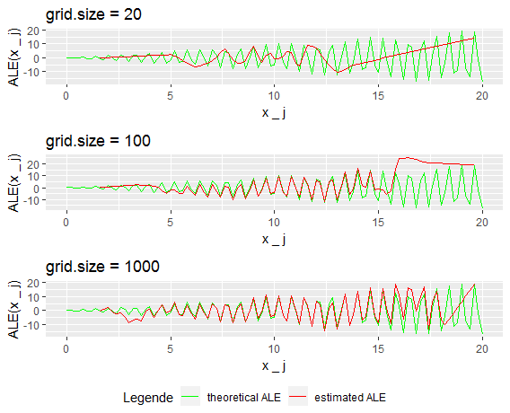
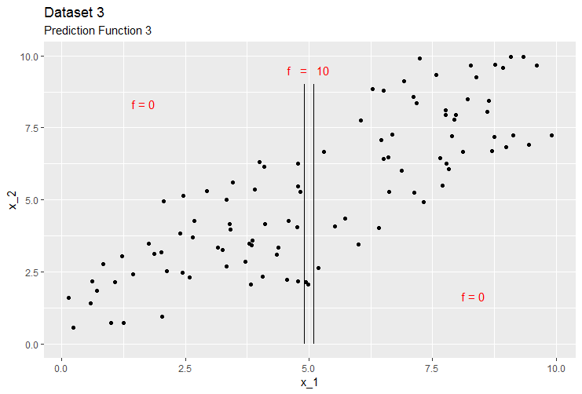
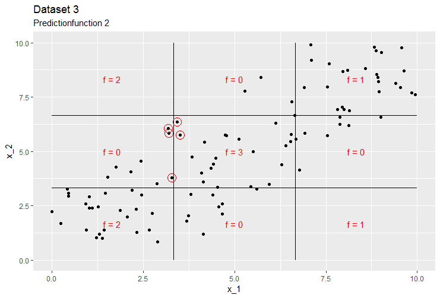

# ALE Intervals, Piece-Wise Constant Models and Categorical Features

*Author: Nikolas Fritz*


As mentioned in the former section the choice of intervals an starting value $z_{0,j}$ have both a certain influence on the estimated ALE - curve. While the main influence of $z_{0,j}$ is canceld out by centering the ALE, the choice of intervals stays crucial. Therefore the next section is dedicated to this topic. 

## How to choose the number and/or length of the intervals

Before investigating the choice of intervals one should be clear about in how far they influence the estimation. On the one hand for a given interval the ALE estimation will be linear due to the expected constant effect within this interval.
Remember that within each interval the local effect within this interval was calculated by the mean total difference of the prediction when shifting the variable of interest from the lower interval boundary to the upper one. This leads by definition to a constant effect within this interval that results in a linear function when integrating over the interval.   
It seems obvious that the ALE estimation (within a grid interval) can only be as good as a linear approximation for the "real" and usually unknown prediction function (TODO: check that!) can be. Therefore it is crucial for a good estimation to have small enough intervals especially in regions where the prediction function is shaky or far from linear (i.e high second derivatives) with respect to the feature of interest.
On the other hand to get stable estimations for a grid interval its important to have a sufficient high number of datapoints within the interval. This means that the intervals shouldn't become too small so that they would contain only a few data points. (Note that this is only true if the other features have an influence on the local effect of the prediction function. If they dont, any data point within the grid interval would lead to the same predictions at the interval boundarys)
Thats why there is a natural trade of between a small interval width and the number of the contained data points. 

  
### State of the art
So the question is how to optimally choose the grid intervals. Should they all be of the same width containing a different number of datapoints? Should they all contain the same or at least a similar number of datapoints, accepting different interval sizes. Or could there even be a better solution in between the two concepts?
Within the iml-package which is one of two implementations of ALE-plots the choosen method is the second one. The quantiles of the distribution of the feature are used as the grid that defines the intervals. That means the length of the intervals depends on the choosen grid size and the given feature distribution.

In the following section some examples with artificial data sets are provided, that should help to get a better feeling for the different deterministic factors that influnce the goodness of the ALE estimation. Within the whole chapter the ALE estimation is conducted via the iml-package implementation.

### ALE Approximations 

In the following section, we only consider two dimensional data sets, of continious features $x_1$ and $x_2$ with a certain correlation. Furthermore we use some exemplary prediction functions which are differentiable such that we can calculate the theoratical ALE (see section XX formula XX) and use it to evaluate the goodness of the estimated ALE-curve. As we want to isolate some of the above mentioned influencial factors, we start with some easy examples adding step by step more complexity to the problem. 

### Example 1: additive feature effects

In the first example we assume a uniform distribution for the feature $x_1$ on the interval $[0, 10]$, i.e.
$X_1 \sim U(0,10)$. Furthermore we assume the conditional distribution of the feature $x_2$ given $x_1$ to be also uniform on the interval $[x_1 - 3, x_1 + 3 ]$, i.e. $X_2 \vert X_1 = x_1 \sim U(x_1 - 3, x_1 + 3 )$. Sampling 100 data points from this distribution yields the first dataset.

```{r eval = FALSE, include = FALSE}
prediction_function_1 <- function(x_1, x_2){
  y <-(x_1-4)*(x_1-5)*(x_1-6) + x_2^3
  return(y)
}


sample_uniform <- function(n, FUN = prediction_function_1, a = -5, b = 5, c = 2, d = 2){
  x_1 <- runif(n = n, min = a, max = b)
  x_2 <- runif(n = n, min = x_1 - c, max = x_1 + d)
  y <- FUN(x_1, x_2)
  return(as.data.frame(cbind(x_1, x_2, y)))
}

set.seed(123)
dataset_1 <- sample_uniform(100, prediction_function_1, a = 0, b = 10, c = 3, d = 3)
p <- ggplot2::ggplot(dataset_1, ggplot2::aes(x_1, x_2))
p + ggplot2::geom_point() +
  ggplot2::labs(title = "Dataset 1", subtitle = "Uniform dist.")

```

```{r DatasetALE1,  out.width='100%', echo=FALSE}

knitr::include_graphics("images/ALE_2_Dataset1.PNG")
```
(ref:DatasetALE1)The correlation is clearly recognizable.

Why we only made assumptions about the conditional distributon of $X_2$ and not on the joint distribution of $(X_1,X_2)$ gets clearer once we take a look on the calculation of the theoratical ALE. Therefore we first asume the prediction function $\hat{f}_1 (x_1, x_2) =  (x_1-4)(x_1-5)(x_1-6) + x_2^3$. Due to the special structure of $f_1$ the partial derivative with respect to $x_1$ is a polynomial of degree 2 which doesn't depend on $x_2$, concretley $\hat{f}^1(x_1,x_2) = 3x_1^2 -30x_1 +74$.  
Now we can calculate the theoratical (uncentered) ALE:

$$(1)~~~~\widetilde{ALE}_{\hat{f},1}(x) = \int_{z_{0,1}}^x E_{X_2\vert X_1= Z_1}[\hat{f}^1(x_1,x_2)]~dz~~~=$$
$$(2)~~~~ \int_{z_{0,1}}^x \int p_{X_2\vert X_1 = z }(x_2)\hat{f}^1(z,x_2)~dx_2~dz~~~=$$
$$(3)~~~~ \int_{z_{0,1}}^x \hat{f}^1(z,x_2)\int p_{X_2\vert X_1=z}(x_2)~dx_2~dz~~~=$$

$$(4)~~~~ \int_{z_{0,1}}^x \hat{f}^1(z,x_2)~dz~~~=$$
$$(5)~~~~ \int_{z_{0,1}}^x  3z^2 -30z +74~dz~~~=$$
$$(6)~~~~ [z^3 -15z^2 +74z + c]_{z_{0,1}}^x~~~=$$

$$(7)~~~~ x^3 -15x^2 +74x - z_{0,1} ^ 3 + 15 z_{0,1}^2 - 74z_{0,1}~~~$$
Herby $p_{X_2\vert X_1=z}(x_2)$ notates the conditional density of $X_2\vert X_1$ for $x_1 = z$.
Step (3) makes use of the fact that $\hat{f}^1(x_1,x_2)$ doesn't depend on $x_2$ and in step (4) the integral over the density gives 1.
To get the centered ALE we have to calculate:

$$(8)~~~~ALE_{\hat{f},1}(x) = \widetilde{ALE}_{\hat{f},1}(x) - E[\widetilde{ALE}_{\hat{f},1}(X_1)] ~~~=$$

$$(9)~~~~ x^3 -15x^2 +74x - z_{0,1} ^ 3 + 15 z_{0,1}^2 - 74z_{0,1}  - $$

$$ E[X_1^3 -15X_1^2 +74X_1 - z_{0,1} ^ 3 + 15 z_{0,1}^2 - 74z_{0,1}] ~~~=$$

$$(10)~~~~ x^3 -15x^2 +74x - E[X_1^3 -15X_1^2 +74X_1] ~~~=$$


$$(11)~~~~ x^3 -15x^2 +74x - E[X_1^3] +15E[X_1^2] -74E[X_1] ~~~=$$

$$(12)~~~~ x^3 -15x^2 +74x - 250 +15 * (100/3) -74* 5 ~~~=$$

$$(13)~~~~ x^3 -15x^2 +74x - 120~~~.$$

In Step (12) the formula for the moments of the uniform distribution which are given by $m_k = \frac{1}{k+1}\sum_{i=0}^k a^i b^{k-i}$ was used.
Knowing the theoretical ALE-curve we can have a look on the behaviour of the estimated ALE for different grid sizes. Plot XX shows the theoretical ALE and the estimations for grid sizes 2, 3, 5, and 10. 
```{r eval = FALSE, include = FALSE}

expected_ALE_1 <- function(x){

  ALE <- x^3 -15*x^2 +74*x  -120
  return (ALE)
}

fun.0 <- function(x) expected_ALE_1(x)

library(crs)
library(iml)

model = crs(y~., data = dataset_1)
predictor_1 = Predictor$new(model, data = dataset_1, y = "y", predict.fun = function(model, newdata){
  #a<-predict(model, newdata)
  a <- numeric(0)
  for (i in 1:nrow(newdata)){
    a[i]<- prediction_function_1(newdata[i, 1], newdata[i, 2])
  }
  return(a)
})

X_1 = dataset_1[which(names(df) != "y")]


ale.1 = FeatureEffect$new(predictor_1, feature = "x_1", grid.size = 2)
fun.1 <- function(x) ale.1$predict(x)

library(ggplot2)
plot1 <- ggplot(data = data.frame(x = 0), mapping = aes(x = x)) +
  stat_function(fun = fun.0, aes(colour = "green")) +
  stat_function(fun = fun.1, aes(colour = "red")) +
  xlim(c(0,10)) +
  scale_colour_manual("Legende", values = c("green", "red"), labels = c("theoretical ALE", "estimated ALE")) +
  labs(title = "grid.size = 2",  x = "x _ j", y = "ALE(x _ j)")

ale.2 = FeatureEffect$new(predictor_1, feature = "x_1", grid.size = 3)
fun.2 <- function(x) ale.2$predict(x)

plot2 <- ggplot(data = data.frame(x = 0), mapping = aes(x = x)) +
  stat_function(fun = fun.0, aes(colour = "green")) +
  stat_function(fun = fun.2, aes(colour = "red")) +
  xlim(c(0,10)) +
  scale_colour_manual("Legende", values = c("green", "red"), labels = c("theoretical ALE", "estimated ALE")) +
  labs(title = "grid.size = 3",  x = "x _ j", y = "ALE(x _ j)")


ale.3 = FeatureEffect$new(predictor_1, feature = "x_1", grid.size = 5)
fun.3 <- function(x) ale.3$predict(x)

plot3 <- ggplot(data = data.frame(x = 0), mapping = aes(x = x)) +
  stat_function(fun = fun.0, aes(colour = "green")) +
  stat_function(fun = fun.3, aes(colour = "red")) +
  xlim(c(0,10)) +
  scale_colour_manual("Legende", values = c("green", "red"), labels = c("theoretical ALE", "estimated ALE")) +
  labs(title = "grid.size = 5",  x = "x _ j", y = "ALE(x _ j)")

ale.4 = FeatureEffect$new(predictor_1, feature = "x_1", grid.size = 10)
fun.4 <- function(x) ale.4$predict(x)

plot4 <- ggplot(data = data.frame(x = 0), mapping = aes(x = x)) +
  stat_function(fun = fun.0, aes(colour = "green")) +
  stat_function(fun = fun.4, aes(colour = "red")) +
  xlim(c(0,10)) +
  scale_colour_manual("Legende", values = c("green", "red"), labels = c("theoretical ALE", "estimated ALE")) +
  labs(title = "grid.size = 10",  x = "x _ j", y = "ALE(x _ j)")


library(ggpubr)

ggarrange(plot1, plot2, plot3, plot4, ncol=2, nrow=2, common.legend = TRUE, legend="bottom")

```


```{r exampleALe1, out.width='100%', echo=FALSE}

knitr::include_graphics("images/ALE_2_example1.PNG")
```
While the estimated ALE with grid size 2 only shows a linear effect over the whole data range, the estimated ALE with grid size 3 already gives a good approximation to the theoretical ALE in the second interval where the theoretical ALE has a low curvature. With grid size 5 only the outer intervals show clearly recognizable deviations to the theoretical ALE and with grid size 10 the approximation looks quite reasonable.
As the partial derivative of the prediction function was independent of $x_2$ there was no risk of getting bad estimations due to too few datapoints within an interval. Thats why we take a look on a second example.

### Example 2: multiplicative feature effects

Now we asume the prediction function $\hat{f}_2 (x_1, x_2) =  (x_1-4)(x_1-5)(x_1-6)x_2^3$. In this case the partial derivative with respect to $x_1$ is a polynomial of degree 2 which clearly depends on $x_2$, concretley $\hat{f}^1(x_1,x_2) = (3x_1^2 -30x_1 +74)x_2^3$. The new structure of the partial derivative yields a new calculation for the theoretical uncentered ALE:

$$(1)~~~~\widetilde{ALE}_{\hat{f},1}(x) = \int_{z_{0,1}}^x E_{X_2\vert X_1= Z_1}[\hat{f}^1(x_1,x_2)]~dz~~~=$$

$$(2)~~~~ \int_{z_{0,1}}^x \int p_{X_2\vert X_1=z}(x_2)\hat{f}^1(z,x_2)~dx_2~dz~~~=$$
$$(3)~~~~ \int_{z_{0,1}}^x \int p_{X_2\vert X_1=z}(x_2)(3z^2 -30z +74)x_2^3~dx_2~dz~~~=$$
$$(4)~~~~ \int_{z_{0,1}}^x (3z^2 -30z +74)\int p_{X_2\vert X_1=z}(x_2)x_2^3~dx_2~dz~~~=$$
$$(5)~~~~ \int_{z_{0,1}}^x (3z^2 -30z +74)~E_{X_2\vert X_1 = z}[X_2^3]~dz~~~=$$

$$(6)~~~~ \int_{z_{0,1}}^x (3z^2 -30z +74)(\frac{1}{4}\sum_{i=0}^{k=3}(z-3)^i(z+3)^{k-i})~dz~~~=$$
$$(7)~~~~ \int_{z_{0,1}}^x (3z^2 -30z +74)(z^3 + 9z)~dz~~~=$$
$$(8)~~~~ \int_{z_{0,1}}^x 3 z^5 - 30 z^4 + 101 z^3 - 270 z^2 + 666 z ~dz~~~=$$

$$(9)~~~~ [ \frac{3}{6} z^6 - \frac{30}{5}z^5 + \frac{101}{4}z^4 - 90 z^3 + 333 z^2]_{z_{0,1}}^x~~~$$
Centering yields

$$(10)~~~~ALE_{\hat{f},1}(x) =  \frac{3}{6} x^6 - \frac{30}{5}x^5 + \frac{101}{4}x^4 - 90 x^3 + 333 x^2 - $$

$$E[ \frac{3}{6} X_1^6 - \frac{30}{5}X_1^5 + \frac{101}{4}X_1^4 - 90 X_1^3 + 333 X_1^2] ~~~$$
Again using the formula for the moments of a uniform distribution we finally obtain

$$(11)~~~~ALE_{\hat{f},1}(x) =  \frac{3}{6} x^6 - \frac{30}{5}x^5 + \frac{101}{4}x^4 - 90 x^3 + 333 x^2 - $$

$$(\frac{3}{6}\frac{10^6}{7}-\frac{30}{5}\frac{10^5}{6} +\frac{101}{4}\frac{10^4}{5}-90\frac{10^3}{4}+333\frac{10^2}{3}) ~~~=$$

$$(12)~~~~ALE_{\hat{f},1}(x) =  \frac{3}{6} x^6 - \frac{30}{5}x^5 + \frac{101}{4}x^4 - 90 x^3 + 333 x^2 - 10528.57~~~.$$
Grafic XX shows the behaviour of the ALE with different grid sizes in this setting.


```{r eval = FALSE, include = FALSE}
prediction_function_2 <- function(x_1, x_2){
  y <-(x_1-4)*(x_1-5)*(x_1-6)* x_2^3
  return(y)
}


sample_uniform <- function(n, FUN = prediction_function_2, a = 0, b = 10, c = 3, d = 3){
  x_1 <- runif(n = n, min = a, max = b)
  x_2 <- runif(n = n, min = x_1 - c, max = x_1 + d)
  y <- FUN(x_1, x_2)
  return(as.data.frame(cbind(x_1, x_2, y)))
}

set.seed(123)
dataset_1 <- sample_uniform(100, prediction_function_2, a = 0, b = 10, c = 3, d = 3)
p <- ggplot2::ggplot(dataset_1, ggplot2::aes(x_1, x_2))
p + ggplot2::geom_point() +
  ggplot2::labs(title = "Dataset 1", subtitle = "Uniform dist.")


expected_ALE_2 <- function(x){

  ALE <- 3/6*x^6 -30/5*x^5 +101/4 * x^4 -90*x^3+333*x^2 -10528.57
  return (ALE)
}

fun.0 <- function(x) expected_ALE_2(x)

library(crs)
library(iml)

model = crs(y~., data = dataset_1)
predictor_2 = Predictor$new(model, data = dataset_1, y = "y", predict.fun = function(model, newdata){
  #a<-predict(model, newdata)
  a <- numeric(0)
  for (i in 1:nrow(newdata)){
    a[i]<- prediction_function_2(newdata[i, 1], newdata[i, 2])
  }
  return(a)
})

X_1 = dataset_1[which(names(df) != "y")]


ale.1 = FeatureEffect$new(predictor_2, feature = "x_1", grid.size = 2)
fun.1 <- function(x) ale.1$predict(x)

library(ggplot2)
plot1 <- ggplot(data = data.frame(x = 0), mapping = aes(x = x)) +
  stat_function(fun = fun.0, aes(colour = "green")) +
  stat_function(fun = fun.1, aes(colour = "red")) +
  xlim(c(0,10)) +
  scale_colour_manual("Legende", values = c("green", "red"), labels = c("theoretical ALE", "estimated ALE")) +
  labs(title = "grid.size = 2",  x = "x _ j", y = "ALE(x _ j)")


ale.2 = FeatureEffect$new(predictor_2, feature = "x_1", grid.size = 5)
fun.2 <- function(x) ale.2$predict(x)

plot2 <- ggplot(data = data.frame(x = 0), mapping = aes(x = x)) +
  stat_function(fun = fun.0, aes(colour = "green")) +
  stat_function(fun = fun.2, aes(colour = "red")) +
  xlim(c(0,10)) +
  scale_colour_manual("Legende", values = c("green", "red"), labels = c("theoretical ALE", "estimated ALE")) +
  labs(title = "grid.size = 5",  x = "x _ j", y = "ALE(x _ j)")


ale.3 = FeatureEffect$new(predictor_2, feature = "x_1", grid.size = 10)
fun.3 <- function(x) ale.3$predict(x)

plot3 <- ggplot(data = data.frame(x = 0), mapping = aes(x = x)) +
  stat_function(fun = fun.0, aes(colour = "green")) +
  stat_function(fun = fun.3, aes(colour = "red")) +
  xlim(c(0,10)) +
  scale_colour_manual("Legende", values = c("green", "red"), labels = c("theoretical ALE", "estimated ALE")) +
  labs(title = "grid.size = 10",  x = "x _ j", y = "ALE(x _ j)")

ale.4 = FeatureEffect$new(predictor_2, feature = "x_1", grid.size = 25)
fun.4 <- function(x) ale.4$predict(x)

plot4 <- ggplot(data = data.frame(x = 0), mapping = aes(x = x)) +
  stat_function(fun = fun.0, aes(colour = "green")) +
  stat_function(fun = fun.4, aes(colour = "red")) +
  xlim(c(0,10)) +
  scale_colour_manual("Legende", values = c("green", "red"), labels = c("theoretical ALE", "estimated ALE")) +
  labs(title = "grid.size = 25",  x = "x _ j", y = "ALE(x _ j)")

ale.5 = FeatureEffect$new(predictor_2, feature = "x_1", grid.size = 50)
fun.5 <- function(x) ale.4$predict(x)

plot5 <- ggplot(data = data.frame(x = 0), mapping = aes(x = x)) +
  stat_function(fun = fun.0, aes(colour = "green")) +
  stat_function(fun = fun.5, aes(colour = "red")) +
  xlim(c(0,10)) +
  scale_colour_manual("Legende", values = c("green", "red"), labels = c("theoretical ALE", "estimated ALE")) +
  labs(title = "grid.size = 50",  x = "x _ j", y = "ALE(x _ j)")

ale.6 = FeatureEffect$new(predictor_2, feature = "x_1", grid.size = 100)
fun.6 <- function(x) ale.4$predict(x)

plot6 <- ggplot(data = data.frame(x = 0), mapping = aes(x = x)) +
  stat_function(fun = fun.0, aes(colour = "green")) +
  stat_function(fun = fun.6, aes(colour = "red")) +
  xlim(c(0,10)) +
  scale_colour_manual("Legende", values = c("green", "red"), labels = c("theoretical ALE", "estimated ALE")) +
  labs(title = "grid.size = 100",  x = "x _ j", y = "ALE(x _ j)")


library(ggpubr)

ggarrange(plot1, plot2, plot3, plot4, plot5, plot6 , ncol=2, nrow=3, common.legend = TRUE, legend="bottom")
#ggarrange(plot3, plot4, plot5, plot6 , ncol=2, nrow=2, common.legend = TRUE, legend="bottom")


```


```{r exampleALe2_6,  out.width='100%', echo=FALSE}

knitr::include_graphics("images/ALE_2_example2_6plots.PNG")
```
While for grid size 5 and bigger the approximations for the region 0 to 7.5 seem quite reasonable it seems that for the region 7.5 to 10 the approximation is best for grid size 10 and gets worse with higher grid sizes. Zooming in for grid sizes 10 and 25 reveals this effect more clearly.


```{r eval = FALSE, include = FALSE}
plot7 <- ggplot(data = data.frame(x = 0), mapping = aes(x = x)) +
  stat_function(fun = fun.0, aes(colour = "green")) +
  stat_function(fun = fun.3, aes(colour = "red")) +
  xlim(c(6,9)) + ylim(c(-10000, 40000))+
  scale_colour_manual("Legende", values = c("green", "red"), labels = c("theoretical ALE", "estimated ALE")) +
  labs(title = "grid.size = 10",  x = "x _ j", y = "ALE(x _ j)")


plot8 <- ggplot(data = data.frame(x = 0), mapping = aes(x = x)) +
  stat_function(fun = fun.0, aes(colour = "green")) +
  stat_function(fun = fun.4, aes(colour = "red")) +
  xlim(c(6,9)) + ylim(c(-10000, 40000)) +
  scale_colour_manual("Legende", values = c("green", "red"), labels = c("theoretical ALE", "estimated ALE")) +
  labs(title = "grid.size = 25",  x = "x _ j", y = "ALE(x _ j)")

ggarrange(plot3, plot4, plot7, plot8 , ncol=2, nrow=2, common.legend = TRUE, legend="bottom")

```


```{r exampleALe2_zoom,  out.width='100%', echo=FALSE}

knitr::include_graphics("images/ALE_2_example2_zoom.PNG")
```

Where does this come from? The structure of the prediction function leads to an increasing effect of $x_2$ on the total differences calculated for the series of intervals. Due to unsuffficient many datapoints within the intervals, there is a high probability of under or over estimating this effect. With grid size 25 only 4 data points are used for the estimation, obviously its quite probable that the x_2 values of those data points are clearly above average in some intervals. If that happens for high $x_1$ - which implies due to the correlation structure high $x_2$ - the total difference will be clearly overestimated as the delta in $x_1$ is multiplied by the average $x_2^3$. As the effect on the intervals is accumulated the error persists for the whole ALE curve from that point on.

To get a deeper insight in this dynamic,for the given context ALE-curves for 50 sampled datasets were estimated with grid.sizes 10, 25, and 50. For each grid.size at each point of the x_1 value the minimal and the maximal ALE estimation was taken as the boundary of the range of estimations. Grafic XX shows this range exemplarilly for gride size 10.

```{r exampleALErange_10,  out.width='100%', echo=FALSE}

knitr::include_graphics("images/ALE_2_ALErange_10.PNG")
```
The vertical lines indicate the absolut delta of the maximal and minimal ALE estimation at x. Plotting these deltas for the gride sizes 10, 25, and 50 yields graffic XX. 


```{r exampleALE2.1_delta,  out.width='100%', echo=FALSE}

knitr::include_graphics("images/ALE_2_example2.1_delta.PNG")
```
It is clearly recognizable that on the one hand for higher x the variance in the ALE estimation increases for all grid sizes. The expected higher variance of the estimations with higher grid sizes is in particular revealed in the region from $x_1 = 7$ to $x_1 = 10$, because the estimation is quite sensible to the absolute value of x_2, which also increases with x_1.  


As the the theoretical ALE in this example was quite smooth grid.size 10 gave reasonable estimates. The following example shows problems that occur once the prediction function is quite shaky especially in regions with only few observations.

### Example 3: Unbalanced datasets and shaky prediction functions

In the 3rd example we assume $X_1 \sim N(10,3)$ as well as $X_2 \vert X_1 = x_1 \sim U(x_1 - 3, x_1 + 3 )$. 

``` {r eval = FALSE, include = FALSE}
prediction_function_3 <- function(x_1, x_2){
  y <-sin(10*x_1)*x_2
  return(y)
}


sample_normal_uniform <- function(n, FUN = prediction_function_3, a = 5, b = 1, c = 3, d = 3){
  x_1 <- rnorm(n = n, mean = a, sd = b)
  x_2 <- runif(n = n, min = x_1 - c, max = x_1 + d)
  y <- FUN(x_1, x_2)
  return(as.data.frame(cbind(x_1, x_2, y)))
}

set.seed(123)
dataset_1 <- sample_normal_uniform(1000, prediction_function_3, a = 10, b = 3, c = 3, d = 3)
p <- ggplot2::ggplot(dataset_1, ggplot2::aes(x_1, x_2))
p + ggplot2::geom_point() +
  ggplot2::labs(title = "Dataset 2", subtitle = "Normal distr.")


```

```{r datasetALE2,  out.width='100%', echo=FALSE}

knitr::include_graphics("images/ALE_2_dataset2.PNG")
```
For this example the sample size was 1000. As expected the correlation is clearly recognizeble, but this time only few data points lay in the outer regions, i.e. between 0 and 2.5 and 17.5 and 20, While there is a high concentration of data around the mean at 10.  
Furthermore we look at the prediction function $\hat{f}_3(x_1,x_2) = sin(10x_1)*x_2$. Calculation of the theoretical uncentered ALE (as before) yields $~~~~\widetilde{ALE}_{\hat{f},1}(x) = xsin(x) + \frac{1}{10}cos(10x)~~~$. For centering the expectation of the uncentered ALE $~~~~E[\widetilde{ALE}_{\hat{f},1}(X_1)] ~~~$was estimated by Monte-Carlo integration to be almost zero. 
As well as the prediction function, the theoretical ALE has lots of extreme points. This leads to some troubles especially for low grid sizes.
The folowing grafic shows the estimated ALE and the theoretical one for three different grid sizes. 


```{r example3_3gs,  out.width='100%', echo=FALSE}


```
For grid size 20 the local effects of the theoretical ALE are absolutley not recognizable. Only one peak left of the mean was estimated resonable this is due to the high data intensity in this region, which leads in this case to some sufficient small intervals that dont smoth out the effects by linear approximation. For the rest of the Plot exactly this happens. The intervals contain two or more peaks and estimate the local effect as linear.  


## Problems with piece-wise constant models

Piece-wise constant models such as for example decision trees and random forests dont have continous prediction functions, which implies they are not differentiable. Thus the concept of theoretical Ale doenst make any sense in this context as the partial derivative doesnt exist. Still it is possible to estimate the ALE as the "jump" will result in a more or less steep linear part, depending on the interval size of the interval containing the step. It is intuitive that the goodness of the estimation highly dependes on if one manages to place the intervals quite narrow around the steps.
As the following examples will show problems can occur due to unlucky data in the region of the steps.

###Example 4


``` {r eval = FALSE, include = FALSE}
sample_uniform_sq <- function(n, FUN = prediction_function_4_1, a = 3, b = 3){
  x_1 <- runif(n = n, min = 0, max = 10)
  x_2 <- runif(n = n, min = pmax(x_1 - a, 0), max = pmin(x_1 + b, 10))
  y <- numeric(0)
  for (i in 1:n){
    y[i] <- FUN(x_1[i], x_2[i])
  }
  return(as.data.frame(cbind(x_1, x_2, y)))
}


library (ggplot2)
prediction_function_4_4 <- function(x_1, x_2){
  if(x_1 < 4.9){
    y = 0
  }else if(x_1> 5.1){
    y = 0
  } else {
    y =10
  }
  return(y)
}
set.seed(1)
dataset_3_3 <- sample_uniform_sq(100, prediction_function_4_4, a = 3, b = 3)

p <- ggplot2::ggplot(dataset_3_3, ggplot2::aes(x_1, x_2))
p + ggplot2::geom_point() +
  ggplot2::labs(title = "Dataset 3")+
  geom_segment(aes(x = 4.9, y = 0, xend = 4.9, yend = 9))+
  geom_segment(aes(x = 5.1, y = 0, xend = 5.1, yend = 9))+
  annotate("text", x = 5, y = 9.5, label = "f   =   10", color = "red") +
  annotate("text", x = 5 - 10/3, y = 5+10/3, label = "f = 0", color = "red") +
  annotate("text", x = 5 + 10/3, y = 5-10/3, label = "f = 0", color = "red")


```


```{r pwc_example4_dataset_predf,  out.width='100%', echo=FALSE}


```

``` {r eval = FALSE, include = FALSE}

library(crs)
library(iml)

model = crs(y~., data = dataset_3_3)
predictor_4_4 = Predictor$new(model, data = dataset_3_3, y = "y", predict.fun = function(model, newdata){
  #a<-predict(model, newdata)
  a <- numeric(0)
  for (i in 1:nrow(newdata)){
    a[i]<- prediction_function_4_4(newdata[i, 1], newdata[i, 2])
  }
  return(a)
})

ale.1 = FeatureEffect$new(predictor_4_4, feature = "x_1", grid.size = 20)
fun.1 <- function(x) ale.1$predict(x)


plot_20 <- ggplot(data = data.frame(x = 0), mapping = aes(x = x)) +
  stat_function(fun = fun.1, aes(colour = "red")) +
  xlim(c(0,10)) +
  ylim(c(-10,10)) +
  scale_colour_manual("Legende", values = c("red"), labels = c( "estimated ALE")) +
  labs(title = "grid.size = 20",  x = "x _ j", y = "ALE(x _ j)")


ale.2 = FeatureEffect$new(predictor_4_4, feature = "x_1", grid.size = 30)
fun.2 <- function(x) ale.2$predict(x)


plot_30 <- ggplot(data = data.frame(x = 0), mapping = aes(x = x)) +
  stat_function(fun = fun.2, aes(colour = "red")) +
  xlim(c(0,10)) +
  ylim(c(-10,10)) +
  scale_colour_manual("Legende", values = c("red"), labels = c( "estimated ALE")) +
  labs(title = "grid.size = 30",  x = "x _ j", y = "ALE(x _ j)")

ale.3 = FeatureEffect$new(predictor_4_4, feature = "x_1", grid.size = 50)
fun.3 <- function(x) ale.3$predict(x)


plot_50 <- ggplot(data = data.frame(x = 0), mapping = aes(x = x)) +
  stat_function(fun = fun.3, aes(colour = "red")) +
  xlim(c(0,10)) +
  ylim(c(-10,10)) +
  scale_colour_manual("Legende", values = c("red"), labels = c( "estimated ALE")) +
  labs(title = "grid.size = 50",  x = "x _ j", y = "ALE(x _ j)")

ale.4 = FeatureEffect$new(predictor_4_4, feature = "x_1", grid.size = 100)
fun.4 <- function(x) ale.4$predict(x)


plot_100 <- ggplot(data = data.frame(x = 0), mapping = aes(x = x)) +
  stat_function(fun = fun.4, aes(colour = "red")) +
  xlim(c(0,10)) +
  ylim(c(-10,10)) +
  scale_colour_manual("Legende", values = c("red"), labels = c( "estimated ALE")) +
  labs(title = "grid.size = 100",  x = "x _ j", y = "ALE(x _ j)")

ggpubr::ggarrange(plot_20, plot_30,plot_50, plot_100, ncol=2, nrow=2, common.legend = TRUE, legend="bottom")


```


```{r pwc_example4_4plots,  out.width='100%', echo=FALSE}

knitr::include_graphics("images/ALE_2_pwc_example4_4plots.png")
```


###Example 5 

``` {r eval = FALSE, include = FALSE}
prediction_function_4_1 <- function(x_1, x_2){
  if(x_1 < 10/3){
    y = 2
  }else if(x_1> 20/3){
    y = 1
  } else {
    y =3
  }
  return(y)
}


sample_uniform_sq <- function(n, FUN = prediction_function_4_1, a = 3, b = 3){
  x_1 <- runif(n = n, min = 0, max = 10)
  x_2 <- runif(n = n, min = pmax(x_1 - a, 0), max = pmin(x_1 + b, 10))
  y <- numeric(0)
  for (i in 1:n){
    y[i] <- FUN(x_1[i], x_2[i])
  }
  return(as.data.frame(cbind(x_1, x_2, y)))
}
set.seed(123)
dataset_3 <- sample_uniform_sq(100, prediction_function_4_1, a = 3, b = 3)


p <- ggplot2::ggplot(dataset_3, ggplot2::aes(x_1, x_2))


p + ggplot2::geom_point() +
  ggplot2::labs(title = "Dataset 3", subtitle = "Predictionfunction 1 ")+
  geom_segment(aes(x = 10/3, y = 0, xend = 10/3, yend = 10))+
  geom_segment(aes(x = 20/3, y = 0, xend = 20/3, yend = 10))+
  geom_segment(aes(y = 10/3, x = 0, yend = 10/3, xend = 10))+
  geom_segment(aes(y = 20/3, x = 0, yend = 20/3, xend = 10))+
  annotate("text", x = 5, y = 5, label = "f = 3", color = "red") +
  annotate("text", x = 5 - 10/3, y = 5, label = "f = 2", color = "red") +
  annotate("text", x = 5 + 10/3, y = 5, label = "f = 1", color = "red") +
  annotate("text", x = 5, y = 5-10/3, label = "f = 3", color = "red") +
  annotate("text", x = 5 - 10/3, y = 5-10/3, label = "f = 2", color = "red") +
  annotate("text", x = 5 + 10/3, y = 5-10/3, label = "f = 1", color = "red")  +
  annotate("text", x = 5, y = 5+10/3, label = "f = 3", color = "red") +
  annotate("text", x = 5 - 10/3, y = 5+10/3, label = "f = 2", color = "red") +
  annotate("text", x = 5 + 10/3, y = 5+10/3, label = "f = 1", color = "red")


```{r pwc_example5_predf_1,  out.width='100%', echo=FALSE}

knitr::include_graphics("images/ALE_2_pwc_example5_predf_1.png")
```
``` {r eval = FALSE, include = FALSE}
prediction_function_4_1 <- function(x_1, x_2){
  if(x_1 < 10/3){
    y = 2
  }else if(x_1> 20/3){
    y = 1
  } else {
    y =3
  }
  return(y)
}


sample_uniform_sq <- function(n, FUN = prediction_function_4_1, a = 3, b = 3){
  x_1 <- runif(n = n, min = 0, max = 10)
  x_2 <- runif(n = n, min = pmax(x_1 - a, 0), max = pmin(x_1 + b, 10))
  y <- numeric(0)
  for (i in 1:n){
    y[i] <- FUN(x_1[i], x_2[i])
  }
  return(as.data.frame(cbind(x_1, x_2, y)))
}
set.seed(123)
dataset_3 <- sample_uniform_sq(100, prediction_function_4_1, a = 3, b = 3)


p <- ggplot2::ggplot(dataset_3, ggplot2::aes(x_1, x_2))


p + ggplot2::geom_point() +
  ggplot2::labs(title = "Dataset 3", subtitle = "Predictionfunction 2 ")+
  geom_segment(aes(x = 10/3, y = 0, xend = 10/3, yend = 10))+
  geom_segment(aes(x = 20/3, y = 0, xend = 20/3, yend = 10))+
  geom_segment(aes(y = 10/3, x = 0, yend = 10/3, xend = 10))+
  geom_segment(aes(y = 20/3, x = 0, yend = 20/3, xend = 10))+
  annotate("text", x = 5, y = 5, label = "f = 3", color = "red") +
  annotate("text", x = 5 - 10/3, y = 5, label = "f = 0", color = "red") +
  annotate("text", x = 5 + 10/3, y = 5, label = "f = 0", color = "red") +
  annotate("text", x = 5, y = 5-10/3, label = "f = 0", color = "red") +
  annotate("text", x = 5 - 10/3, y = 5-10/3, label = "f = 2", color = "red") +
  annotate("text", x = 5 + 10/3, y = 5-10/3, label = "f = 1", color = "red")  +
  annotate("text", x = 5, y = 5+10/3, label = "f = 0", color = "red") +
  annotate("text", x = 5 - 10/3, y = 5+10/3, label = "f = 2", color = "red") +
  annotate("text", x = 5 + 10/3, y = 5+10/3, label = "f = 1", color = "red")

```

```{r pwc_example5_predf_2,  out.width='100%', echo=FALSE}

knitr::include_graphics("images/ALE_2_pwc_example5_predf_2.png")
```
``` {r eval = FALSE, include = FALSE}


prediction_function_4_1 <- function(x_1, x_2){
  if(x_1 < 10/3){
    y = 2
  }else if(x_1> 20/3){
    y = 1
  } else {
    y =3
  }
  return(y)
}


sample_uniform_sq <- function(n, FUN = prediction_function_4_1, a = 3, b = 3){
  x_1 <- runif(n = n, min = 0, max = 10)
  x_2 <- runif(n = n, min = pmax(x_1 - a, 0), max = pmin(x_1 + b, 10))
  y <- numeric(0)
  for (i in 1:n){
    y[i] <- FUN(x_1[i], x_2[i])
  }
  return(as.data.frame(cbind(x_1, x_2, y)))
}

dataset_3 <- sample_uniform_sq(100, prediction_function_4_1, a = 3, b = 3)


library(crs)
library(iml)

model = crs(y~., data = dataset_3)
predictor_4_1 = Predictor$new(model, data = dataset_3, y = "y", predict.fun = function(model, newdata){
  #a<-predict(model, newdata)
  a <- numeric(0)
  for (i in 1:nrow(newdata)){
    a[i]<- prediction_function_4_1(newdata[i, 1], newdata[i, 2])
  }
  return(a)
})

X_1 = dataset_3[which(names(df) != "y")]


ale.1 = FeatureEffect$new(predictor_4_1, feature = "x_1", grid.size = 5)
fun.1 <- function(x) ale.1$predict(x)

library(ggplot2)
plot1 <- ggplot(data = data.frame(x = 0), mapping = aes(x = x)) +
  stat_function(fun = fun.1, aes(colour = "red")) +
  xlim(c(0,10)) +
  ylim(c(-2,2)) +
  scale_colour_manual("Legende", values = c("red"), labels = c( "estimated ALE")) +
  labs(title = "grid.size = 5",  x = "x _ j", y = "ALE(x _ j)")
plot1


prediction_function_4_2 <- function(x_1, x_2){
  if(x_1 < 10/3){
    if(x_2 < 10/3){
      y = 2
    }else if(x_2> 20/3){
      y = 2
    }else{
      y = 0
    }

  }else if(x_1> 20/3){
    if(x_2 < 10/3){
      y = 1
    }else if(x_2> 20/3){
      y = 1
    }else{
      y = 0
    }
  } else {
    if(x_2 < 10/3){
      y = 0
    }else if(x_2> 20/3){
      y = 0
    }else{
      y = 3
    }
  }
  return(y)
}


set.seed(123)
dataset_3 <- sample_uniform_sq(100, prediction_function_4_2, a = 3, b = 3)
p <- ggplot2::ggplot(dataset_3, ggplot2::aes(x_1, x_2))
p + ggplot2::geom_point() +
  ggplot2::labs(title = "Dataset 3", subtitle = "Uniform ")


library(crs)
library(iml)

model = crs(y~., data = dataset_3)
predictor_4_2 = Predictor$new(model, data = dataset_3, y = "y", predict.fun = function(model, newdata){
  #a<-predict(model, newdata)
  a <- numeric(0)
  for (i in 1:nrow(newdata)){
    a[i]<- prediction_function_4_2(newdata[i, 1], newdata[i, 2])
  }
  return(a)
})

X_1 = dataset_3[which(names(df) != "y")]


ale.2 = FeatureEffect$new(predictor_4_2, feature = "x_1", grid.size = 5)
fun.2 <- function(x) ale.2$predict(x)

library(ggplot2)
plot2 <- ggplot(data = data.frame(x = 0), mapping = aes(x = x)) +
  stat_function(fun = fun.2, aes(colour = "red")) +
  xlim(c(0,10)) +
  ylim(c(-2,2)) +
  scale_colour_manual("Legende", values = c("red"), labels = c( "estimated ALE")) +
  labs(title = "grid.size = 5",  x = "x _ j", y = "ALE(x _ j)")

plot2
plot1

gs5<-ggpubr::ggarrange(plot1, plot2, ncol=2, nrow=1, common.legend = TRUE, legend="bottom")

gs5

ale.1 = FeatureEffect$new(predictor_4_1, feature = "x_1", grid.size = 10)
fun.1 <- function(x) ale.1$predict(x)

library(ggplot2)
plot1_10 <- ggplot(data = data.frame(x = 0), mapping = aes(x = x)) +
  stat_function(fun = fun.1, aes(colour = "red")) +
  xlim(c(0,10)) +
  ylim(c(-2,2)) +
  scale_colour_manual("Legende", values = c("red"), labels = c( "estimated ALE")) +
  labs(title = "grid.size = 10",  x = "x _ j", y = "ALE(x _ j)")
plot1_10
ale.2 = FeatureEffect$new(predictor_4_2, feature = "x_1", grid.size = 10)
fun.2 <- function(x) ale.2$predict(x)

library(ggplot2)
plot2_10 <- ggplot(data = data.frame(x = 0), mapping = aes(x = x)) +
  stat_function(fun = fun.2, aes(colour = "red")) +
  xlim(c(0,10)) +
  ylim(c(-2,2)) +
  scale_colour_manual("Legende", values = c("red"), labels = c( "estimated ALE")) +
  labs(title = "grid.size = 10",  x = "x _ j", y = "ALE(x _ j)")

gs10<-ggpubr::ggarrange(plot1_10, plot2_10, ncol=2, nrow=1, common.legend = TRUE, legend="bottom")

gs10
ale.1 = FeatureEffect$new(predictor_4_1, feature = "x_1", grid.size = 20)
fun.1 <- function(x) ale.1$predict(x)

library(ggplot2)
plot1_20 <- ggplot(data = data.frame(x = 0), mapping = aes(x = x)) +
  stat_function(fun = fun.1, aes(colour = "red")) +
  xlim(c(0,10)) +
  ylim(c(-2,2)) +
  scale_colour_manual("Legende", values = c("red"), labels = c( "estimated ALE")) +
  labs(title = "grid.size = 20",  x = "x _ j", y = "ALE(x _ j)")
plot1_20
ale.2 = FeatureEffect$new(predictor_4_2, feature = "x_1", grid.size = 20)
fun.2 <- function(x) ale.2$predict(x)

library(ggplot2)
plot2_20 <- ggplot(data = data.frame(x = 0), mapping = aes(x = x)) +
  stat_function(fun = fun.2, aes(colour = "red")) +
  xlim(c(0,10)) +
  ylim(c(-2,2)) +
  scale_colour_manual("Legende", values = c("red"), labels = c( "estimated ALE")) +
  labs(title = "grid.size = 20",  x = "x _ j", y = "ALE(x _ j)")


gs20<-ggpubr::ggarrange(plot1_20, plot2_20, ncol=2, nrow=1, common.legend = TRUE, legend="bottom")
gs20

ale.1 = FeatureEffect$new(predictor_4_1, feature = "x_1", grid.size = 50)
fun.1 <- function(x) ale.1$predict(x)

library(ggplot2)
plot1_50 <- ggplot(data = data.frame(x = 0), mapping = aes(x = x)) +
  stat_function(fun = fun.1, aes(colour = "red")) +
  xlim(c(0,10)) +
  ylim(c(-2,2)) +
  scale_colour_manual("Legende", values = c("red"), labels = c( "estimated ALE")) +
  labs(title = "grid.size = 50",  x = "x _ j", y = "ALE(x _ j)")
plot1_50
ale.2 = FeatureEffect$new(predictor_4_2, feature = "x_1", grid.size = 50)
fun.2 <- function(x) ale.2$predict(x)

library(ggplot2)
plot2_50 <- ggplot(data = data.frame(x = 0), mapping = aes(x = x)) +
  stat_function(fun = fun.2, aes(colour = "red")) +
  xlim(c(0,10)) +
  ylim(c(-2,2)) +
  scale_colour_manual("Legende", values = c("red"), labels = c( "estimated ALE")) +
  labs(title = "grid.size = 50",  x = "x _ j", y = "ALE(x _ j)")


gs50<-ggpubr::ggarrange(plot1_50, plot2_50, ncol=2, nrow=1, common.legend = TRUE, legend="bottom")
gs50


gs_all1<-ggpubr::ggarrange(gs5,gs10,  ncol=1, nrow=2, common.legend = TRUE, legend="bottom")
gs_all1
gs_all2<-ggpubr::ggarrange(gs20,gs50,  ncol=1, nrow=2, common.legend = TRUE, legend="bottom")
gs_all2

```

```{r pwc_example5_gs5_10,  out.width='100%', echo=FALSE}

knitr::include_graphics("images/ALE_2_pwc_example5_gs5_10.png")
```


```{r pwc_example5_gs20_50,  out.width='100%', echo=FALSE}

knitr::include_graphics("images/ALE_2_pwc_example5_gs20_50.png")

```
``` {r eval = FALSE, include = FALSE}
prediction_function_4_1 <- function(x_1, x_2){
  if(x_1 < 10/3){
    y = 2
  }else if(x_1> 20/3){
    y = 1
  } else {
    y =3
  }
  return(y)
}


sample_uniform_sq <- function(n, FUN = prediction_function_4_1, a = 3, b = 3){
  x_1 <- runif(n = n, min = 0, max = 10)
  x_2 <- runif(n = n, min = pmax(x_1 - a, 0), max = pmin(x_1 + b, 10))
  y <- numeric(0)
  for (i in 1:n){
    y[i] <- FUN(x_1[i], x_2[i])
  }
  return(as.data.frame(cbind(x_1, x_2, y)))
}
set.seed(123)
dataset_3 <- sample_uniform_sq(100, prediction_function_4_1, a = 3, b = 3)


p <- ggplot2::ggplot(dataset_3, ggplot2::aes(x_1, x_2))


p + ggplot2::geom_point() +
  ggplot2::labs(title = "Dataset 3", subtitle = "Predictionfunction 2 ")+
  geom_segment(aes(x = 10/3, y = 0, xend = 10/3, yend = 10))+
  geom_segment(aes(x = 20/3, y = 0, xend = 20/3, yend = 10))+
  geom_segment(aes(y = 10/3, x = 0, yend = 10/3, xend = 10))+
  geom_segment(aes(y = 20/3, x = 0, yend = 20/3, xend = 10))+
  annotate("text", x = 5, y = 5, label = "f = 3", color = "red") +
  annotate("text", x = 5 - 10/3, y = 5, label = "f = 0", color = "red") +
  annotate("text", x = 5 + 10/3, y = 5, label = "f = 0", color = "red") +
  annotate("text", x = 5, y = 5-10/3, label = "f = 0", color = "red") +
  annotate("text", x = 5 - 10/3, y = 5-10/3, label = "f = 2", color = "red") +
  annotate("text", x = 5 + 10/3, y = 5-10/3, label = "f = 1", color = "red")  +
  annotate("text", x = 5, y = 5+10/3, label = "f = 0", color = "red") +
  annotate("text", x = 5 - 10/3, y = 5+10/3, label = "f = 2", color = "red") +
  annotate("text", x = 5 + 10/3, y = 5+10/3, label = "f = 1", color = "red") +
  geom_point(size = 5,data =dataset_3[order(dataset_3$x_1)[31],] , pch = 1, color = "red")+
  geom_point(size = 5,data =dataset_3[order(dataset_3$x_1)[32],] , pch = 1, color = "red")+
  geom_point(size = 5,data =dataset_3[order(dataset_3$x_1)[33],] , pch = 1, color = "red")+
  geom_point(size = 5,data =dataset_3[order(dataset_3$x_1)[34],] , pch = 1, color = "red")+
  geom_point(size = 5,data =dataset_3[order(dataset_3$x_1)[35],] , pch = 1, color = "red")


```


```{r ALE_2_pwc_example5_critical_points 2,  out.width='100%', echo=FALSE}


```
``` {r eval = FALSE, include = FALSE}
prediction_function_4_1 <- function(x_1, x_2){
  if(x_1 < 10/3){
    y = 2
  }else if(x_1> 20/3){
    y = 1
  } else {
    y =3
  }
  return(y)
}


sample_uniform_sq <- function(n, FUN = prediction_function_4_1, a = 3, b = 3){
  x_1 <- runif(n = n, min = 0, max = 10)
  x_2 <- runif(n = n, min = pmax(x_1 - a, 0), max = pmin(x_1 + b, 10))
  y <- numeric(0)
  for (i in 1:n){
    y[i] <- FUN(x_1[i], x_2[i])
  }
  return(as.data.frame(cbind(x_1, x_2, y)))
}
set.seed(123)
dataset_3 <- sample_uniform_sq(100, prediction_function_4_1, a = 3, b = 3)


p <- ggplot2::ggplot(dataset_3, ggplot2::aes(x_1, x_2))


p + ggplot2::geom_point() +
  ggplot2::labs(title = "Dataset 3", subtitle = "Predictionfunction 2 ")+
  geom_segment(aes(x = 10/3, y = 0, xend = 10/3, yend = 10))+
  geom_segment(aes(x = 20/3, y = 0, xend = 20/3, yend = 10))+
  geom_segment(aes(y = 10/3, x = 0, yend = 10/3, xend = 10))+
  geom_segment(aes(y = 20/3, x = 0, yend = 20/3, xend = 10))+
  annotate("text", x = 5, y = 5, label = "f = 3", color = "red") +
  annotate("text", x = 5 - 10/3, y = 5, label = "f = 0", color = "red") +
  annotate("text", x = 5 + 10/3, y = 5, label = "f = 0", color = "red") +
  annotate("text", x = 5, y = 5-10/3, label = "f = 0", color = "red") +
  annotate("text", x = 5 - 10/3, y = 5-10/3, label = "f = 2", color = "red") +
  annotate("text", x = 5 + 10/3, y = 5-10/3, label = "f = 1", color = "red")  +
  annotate("text", x = 5, y = 5+10/3, label = "f = 0", color = "red") +
  annotate("text", x = 5 - 10/3, y = 5+10/3, label = "f = 2", color = "red") +
  annotate("text", x = 5 + 10/3, y = 5+10/3, label = "f = 1", color = "red") +
  geom_point(size = 5,data =dataset_3[order(dataset_3$x_1)[67],] , pch = 1, color = "red")+
  geom_point(size = 5,data =dataset_3[order(dataset_3$x_1)[68],] , pch = 1, color = "red")

```
```{r ALE_2_pwc_example5_critical_points,  out.width='100%', echo=FALSE}

knitr::include_graphics("images/ALE_2_pwc_example5_critical_points.png")
```
###Example 6

WiP

### Outlook 

Ideas how to reslove this problem. Diffrent methods to select the intervals. Adaptive method?


## Categorical Features

Problem with categorical features: ALE accumulates the effects. That implies the feature needs to be ordered. Categorical features dont have a natural order as continuos features. So it is neccesary to first order them before being able to calculate an ALE. 

### Ordering the features

How to order the feature Space?
What is implemented in the iml Package: order categories based on their similarity with respect to the other features. 
1. Komogorov-Smirnoff distance or frequency tables for categorical features
2. multidimensional scaling

### Example of ALE with categorical feature

WIP: find a good real data example and compute the ALE

### Interpretation

WIP: interprete it as this was not done in the ALE _intro Chapter


### Changes of the ALE due to diffrent orders

Problem: Ordering the categories is somehow arbitrary. could weigh different features differentley and obtain different orders.
Ale-Plot will change!
Idea: Use artifical ordinal feature to simulate different orders 

### Example
Example of differnet ALE plots with respect to the same categorical feature but different orders 

