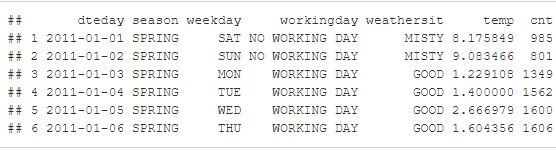
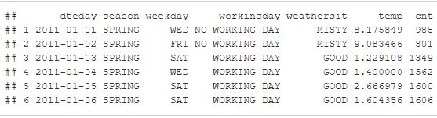
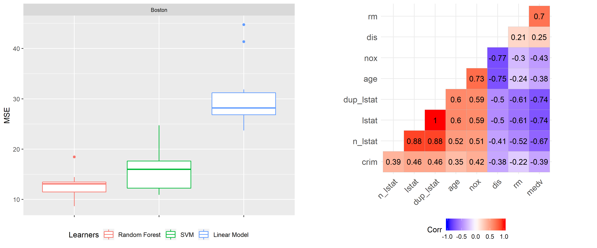

# PFI, LOCO and Correlated Features

The method of Feature Importance is a powerful tool in gaining insights into black box models under the assumption that there in no correlation between features of the given data set. However, this fundamental assumption can often be rejected in reality. As mentioned in Chapter 3, PDPs may suffer in their interpretability, if this assumption is violated. Not only the interpretability of PDPs can be affected, but also the interpretability of Feature Importance can strongly depend on the correlations between the input features. In case of correlated features in the data, which is are very likely to occur in reality, the results of the Feature Importance method do not reflect the individual true Feature Importance anymore. This can lead to a misleading importance ranking of the features and hence to incorrect interpretations of a feature’s relevance in a model. 

There are two main issues when it comes to correlated features, which will be illustrated in the following two examples. The first and most crucial issue is the misleading ranking of correlated features. Adding a correlated feature to the data set can lead to a decrease in Feature Importance. Imagine you want to predict the risk of a heart attack by looking at the weight of a person had yesterday as well as other uncorrelated features. For instances, you choose a random forest model and calculate the corresponding PFI. It is well known that overweight can have an significant influence on the likelihood of heart attacks. Thus, the PFI indicates that weight is the most important feature. What happens if you also add the weight of the person of today which is highly correlated to yesterday’s weight of a person? Usually, one big advantage of a random forest model is the application and predictive accuracy of high dimensional data sets [@strobl2008]. This also holds for cases of correlated features or interaction effects. Hence, adding a new component should cause no issues. Yet, some effects of the Feature Importance can make an interpretation more difficult. This is due to the fact that the PFI can now split between both features. During the training of the random forest some of the decision trees will choose the weight today, the weight yesterday, both or none of these as a split point. Eventually, both features will selected equally, because they are equally beneficial for the performance of the model. [@molnar2019]

The second issue arises only when the PFI is conducted. During the shuffling step of a feature not only the association to the target variable gets broken, but also the association with the correlated features. So in case the features are correlated, unrealistic data points may occur. These new data points range from unlikely all the way up to completely impossible. The central question then becomes: Can we still trust the informative value of the PFI, if it is calculated with data instances that are not observed in reality and therefore biased [@molnar2019]? Figure \@ref(fig:realPFI02) illustrates an example with a possible outcome of unrealistic data instances. 


```{r realPFI01,  eval = TRUE, echo = FALSE, fig.align = "center", out.width = "75%"}

```

```{r realPFI02,  eval = TRUE, echo = FALSE, fig.align = "center", out.width = "75%", fig.cap = "The two tables showing a subset of the bike sharing data set we already know from previous chapters. The one on top shows the first six rows of the original data set using the function `head()` in R. The table below are showing the first six rows of the data set where the feature `weekday` is shuffled. As you can see, some of the new data points appear to make no sense. For example, in observation 1 Wednesday is claimed to be a no working day."}

```

In this chapter, we want to shed light on some issues of correlated features with respect to Feature Importance and present possible reasons for the outcomes. Our purpose is not to list all possible effects, as this would go beyond the scope of this chapter. Rather than that we would like to increase the reader’s awareness of the problem itself, such that mistakes can be avoided in the future. 

## Effect on Feature Importance by Adding Correlated Features

A major part of this chapter will pay attention to the problem of interpreting Feature Importance when adding or observing correlated features in a given data set. Our focus lies on the behavior of Permutation Feature Importance by @breiman2001random as well as of the LOCO Feature Importance by @lei2018distribution, which have been previously introduced. There will be a comparison of these measures applied on different learners namely the random forest, support vector machine (SVM) and linear model. Each of them will be trained on data sets with different correlation intensities between the features. The random forest and the SVM in this context are black box models (hard to interpret), whereas the linear model is a white box model (easy to interpret). These algorithms should show different behaviors. First, we have a look at simulated data sets and later on there is an application to a real data set `Boston`. 


### Simulation 

A good way to visualize the effects of correlated features on the Feature Importance measures is to simulate some data with the desired dependencies of the features. This allows us to show the effects on the PFI and LOCO Feature Importance more precisely than looking on a real data set where additional dependencies between each features exist and may falsify the results. To filter out the real effect, it is necessary to hold the influence of other features as small as possible to prevent misinterpretations. For the complete R Code of these simulations please refer to the R file attached to this chapter. Our simulation design resembles the one from @strobl2008 or @archer2008.

In total, there will be three different scenario settings to investigate the influence of correlated features on  the PFI and LOCO. The following setup is used as a general baseline for the scenarios: 

$$
y_{i} = x_{i1}+x_{i2}+x_{i3}+x_{i4}+\epsilon_{i}
$$
The scenarios differ in the way they represent different dependencies of the features on the target variable. We investigate here a linear dependence as well as a non-linear one. To create a simple fictive data set with these dependencies, four features $x_{i1},...,x_{i4}$ were randomly drawn a thousand times out of a multivariate Gaussian distribution with a mean of 0: $X \sim MVN(0,\Sigma)$. The covariance $\Sigma$ depends on the variance of all features, which were set equally to $\sigma_{j,j}=1$, and the covariances $\sigma_{j,l}$. The covariance for feature $X1$ and $X2$ $\sigma_{1,2}$ were set to either $\rho = 0$; $0.25$; $0.5$; $0.75$ or $0.99$ depending on our correlation intensity of interest whereas the covariances of the other features were set to $\sigma_{j,l} = 0$ which means they are independent. Note: Here the correlation and the covariance are the same, because we set the variance to 1 such that the Pearson correlation coefficient $\rho = \frac{Cov(X_{j},X_{l})}{\sqrt{Var(X_{j})}\sqrt{Var(X_{l})}} =Cov(X_{j},X_{l})$ . The reason behind setting $\rho = 0.99$ and not to $\rho = 1$ is to avoid issues when calculating with matrices. If $\rho$ would be equal to 1, we would have perfect multicollinearity. Thus, the rank of the covariance matrix would not be full. Hence, setting $\rho$ to 0.99 instead simplifies subsequent calculations, especially in terms of
applying the linear model. The choice of the noise $\epsilon_{i}$ and its variance should be hold small in order to clarify the behavior we observe and avoid misinterpretation. In this case, we assume that the mean is zero and the standard deviation is only ten percent of the absolute value of the mean of $y_{i} = x_{i1}+x_{i2}+x_{i3}+x_{i4}$. 

Furthermore, we will also include an uninformative feature ”Uninf” randomly drawn out of a uniform distribution to the data set. This is our benchmark indicating us whether the importance of the features are higher than this random effect. As a consequence, we are eventually generating five data sets with a regression task and five numerical features. Now we are able to run the learning algorithms on the data sets. For the random forest, we use the `randomForest` package [@R-randomForest] and for SVM the `ksvm()` function out of the `kernlab` package [@R-kernlab]. For both functions the default settings for all the parameters were used. 


**How to compare PFI and LOCO?**

As mentioned in the introduction to this chapter, PFI introduced by @breiman2001random, one does not need to refit the model whereas for LOCO it is necessary to refit. In the `iml` package [@molnar2018iml], which we use throughout the entire book, the implementation uses Hold-out for performance evaluation. Typically, Hold-out is not ideal to evaluate the performance of a model unless the data set is sufficiently large. The variance of the performance value can get quite high which means that it can fluctuate a lot. To lower the variance of PFI, the values are calculated by repeatedly shuffling the features in the permutation step. However, Hold-out is definitely not suitable for LOCO, because reshuffling is not possible due to the fact that the interested feature is completely left out of consideration. Thus, the danger of high variance increases tremendously. In contrast to Hold-out, we can make use of Resampling methods which use the data more efficiently by repeatedly dividing the data into train and test data and finally aggregating the results. Therefore, in order to improve the
comparability of two approaches, we decided to use Subsampling (repeated Hold-out) for measuring the performance for PFI. This also means that we use PFI on test data (see also chapter X), so it is necessary to refit our model. In our case a Subsampling with a 20-80% split and 10 iterations were used. In principle we want to compare two models in each iteration step, once without the permuted feature and once with the permuted feature. Therefore we should use the same train-test splits in each iteration. The following visualizations show the Feature Importance values as well as the importance ranks, which are both aggregated by the average over the 10 iterations of Subsampling. Furthermore, we calculate the Feature Importance by taking the ratio $e_{perm}/e_{orig}$ or $e_{-j}/e_{orig}$ depending on the measure.

**1) Linear Dependence:**

In the first scenario setting the dependence of the features $X_i$ on the target value $y$ is a linear one: 


$$
y_{i} = x_{i1}+x_{i2}+x_{i3}+x_{i4}+\epsilon_{i}
$$


In order to get meaningful results, one has to first check, whether the underlying model was proved to be accurate. In case your model does not generalize accurately, the Feature Importance can vary greatly when rerunning the algorithms. Therefore, the resulting effects cannot be seen as significant [@parr2018]. Figure \@ref(fig:bmr01) shows the benchmark result for the learning algorithms used on the simulated data sets with independence, medium and high correlation. As a performance measures we decided showing two. On the one hand, the mean squared error (MSE), since it is also used as a loss measure for evaluating the Feature Importance. On the other hand $R^2$, because it is a common measure for linear models and we have a linear dependence of the features on the target value. $R^2 = 1$ implies that all residuals are zero, so a perfect prediction. Whereas $R^2 = 0$ means that we predict as badly as a constant. As you can see, all learning algorithms have very good up to perfect results, or in other words are accurate for our further investigations. The random forest is considered as the worst of the algorithms at hand. That is not surprising as the random forest learns multiple step function trying to fit a linear prediction function. The linear model is by far the best model to predict this linear dependence on the target value.

```{r bmr01, echo=FALSE, out.width="100%", fig.cap="Benchmark results of scenario 1 for data sets with p = 0, p = 0.5 and p = 0.99 (from left to right). On top the performance measure is the MSE, at the bottom $R^2$. The colour represents the learning algorithm. Red: Random Forest, green: SVW and blue: Linear Model."}
knitr::include_graphics("images/bmr01b.png", auto_pdf = getOption("knitr.graphics.auto_pdf", TRUE))
``` 


```{r PFI01, message = FALSE, echo = FALSE, fig.height = 6, fig.width = 12}
library(ggplot2)
load("data/drfPFI.RData")

prferr <- ggplot(data = drfPFI, aes(x = features, y = importance, colour = Corr, ymin = minimp, ymax = maximp)) + 
  geom_point(fill = "white",size = 0, shape = 21, 
             stroke = 2.5, show.legend = TRUE, position = position_dodge(width = 0.7)) +
  geom_errorbar(width = 0.5, size = 1, position = position_dodge(width = 0.7)) + 
  coord_flip() +
  scale_colour_manual(values = c("0" = "skyblue", "0.25" = "royalblue", "0.5" = "blue",
                               "0.75" = "navy", "0.99" = "black"))+
  scale_fill_manual(values = c("0" = "skyblue", "0.25" = "royalblue", "0.5" = "blue",
                             "0.75" = "navy", "0.99" = "black"))+
  theme(plot.subtitle = element_text(size = 9), text = element_text(size = 14), legend.position = "bottom") +
  labs(y = "PFI (Loss: MSE)", x = "") + 
  ylim(0,10)+
  labs(color="Correlation:") 
```


```{r PFIrank01, message = FALSE, echo = FALSE, fig.height = 6, fig.width = 8}
library(ggplot2)
load("data/drfPFI.RData")

prfrank01 <- ggplot(drfPFI, aes(x = averagerank , y = Corr, colour = features, group = features)) +
  geom_point(size = 2)+
  geom_path(aes(group = features), size = 1)+
  coord_flip() +
  scale_colour_manual(values = c("Uninf" = "#999999", "X1" = "darkred", "X2" = "red",
                               "X3" = "#006600", "X4" = "#33CC33"))+
  scale_x_reverse()+
  geom_vline(xintercept = 2.5, linetype = "dashed")+
  theme(legend.position="bottom", plot.subtitle = element_text(size = 9), text = element_text(size = 14))+
  theme(legend.title = element_blank())+ 
  xlab("Average Rank")+
  ylab("Correlation")
```


```{r arrange01, message = FALSE, echo = FALSE, fig.height = 5, fig.width = 10, fig.cap= "Scenario 1: PFI on the random forest models with different correlations of features $X1$ and $X2$. The left plot shows the PFI values for different correlation intensities. The right plot represents the average rank of the features at a certain correlation intensity. The red lines mark the two correlated features and the green lines the independent ones. The dashed line is used as an indicator of how far away certain features are from the true theoretical importance rank."}
library(ggpubr)
ggarrange(prferr, prfrank01 , ncol = 2, legend = "bottom", widths = c(2, 1))
```

Figure \@ref(fig:arrange01) shows the result of applying the PFI on the random forest model. The plot on the left-hand side shows the average values (in the graph shown as a dot). Moreover, it presents the 0.05- and 0.95 quantiles over the 10 subsampling iterations, respectively. In addition, the plot on the right-hand side shows the average importance rank based on the ten subsampling iterations. It is important to mention that typically the Feature Importance is interpreted in a rank order. One can see that, in case of independence, the PFI of all features are approximately the same except for the uninformative one. Since the uninformative indicated a complete random effect, one can suggest that all features $X_{i}$ have an influence on the performance of the model. Overall, the PFI of the correlated features $X1$ and $X2$ tend to increase more in comparison to the uncorrelated features as $\rho$ increases. Moreover, the span of the quantile bands increases with higher $\rho$. This effect can also be seen in the right plot. For independence, all points are near the average rank of 2.5. The small fluctuations or deviations can be explained by the underlying stochastic. However, for a correlation higher than 0.5 we see a gap between the correlated features in red colour and the uncorrelated in green colour. The correlated features settle down at an average rank of about 1.5 and the uncorrelated ones at about 3.5. Although all features have the same influence on the target value, one can see that PFI can be misleading as it shows a higher PFI rank the higher the correlation between two features.


```{r exp, message = FALSE, echo = FALSE , fig.height = 6, fig.width = 12}
library(ggplot2)
library(mlr)
load("data/exp.RData")
load("data/exptask.RData")

exp <- plotLearnerPrediction(rf_learner, extrapolation_task)+
        geom_segment(aes(x = -2, y = -2, xend = 2.3, yend = -2), color = "white", size = 1.2,
                     arrow = arrow(length = unit(0.5, "cm")))+
        geom_point(aes(x = 2.5, y = -2), colour = "blue")+
        ggtitle("Random Forest on Correlated Data Set")+
        labs(fill = "y")+
        theme(legend.title = element_text(size = 15))
```


```{r exp01, message = FALSE, echo = FALSE ,fig.height = 6, fig.width = 12}
library(ggplot2)
library(mlr)
load("data/exp01.RData")
load("data/exptask01.RData")

exp01 <- plotLearnerPrediction(rf_learner01, extrapolation_task01)+
          geom_segment(aes(x = -2, y = -2, xend = 2.3, yend = -2),color = "white", size = 1.2,
                       arrow = arrow(length = unit(0.5, "cm")))+
          geom_point(aes(x = 2.5, y = -2), colour = "blue")+
          ggtitle("Random Forest on Independent Data Set")+
          labs(fill = "y")+
          theme(legend.title = element_text(size = 15))
```


```{r arrangeexp, message = FALSE, echo = FALSE, fig.height = 6, fig.width = 10, fig.cap = "Extrapolation visualization. On the left, the prediction of the random forest on the simulateded independent data set. On the right, the prediction of the random forest on the simulated high correlated data set. The arrow is indicating a permutation of one observation for feature $X1$."}
library(ggpubr)
ggarrange(exp01, exp, ncol = 2, legend = "bottom")
```

One possible explanation for this effect is given by @hooker2019. They state that the main reason behind this effect is caused by extrapolation which we already mentioned in the context of problems with PDPs. A small recap, extrapolation is the process of estimating beyond the distribution of our original data set. Figure \@ref(fig:arrangeexp) shows on the left the random forest applied on the simulated data set with independent features $X1$ and $X2$. On the right it is applied on the data set where both are highly correlated. At first sight you cannot see a structure in the data distribution for the independent case. Furthermore, the data points fill out much more space in comparison to the correlated case. Here one can see a clear positive correlation between $X1$ and $X2$. For instance, if you permute one observation of $X1$ represented by the white arrow, the permuted observation point is still near the data distribution in the independent case. However, in the correlated case there are absolute no other data points nearby. The data distribution of the training data lies on the diagonal (bisector). The region outside of the point cloud was not learned well enough by the random forest which becomes evident through the less rectangle lines in this area. As a consequence of permuting, the random forest also evaluates points which are far away from training data. Thus, the prediction can be far away from the true value which leads to a large drop in performance. Although the feature is equally important in comparison to the others, it gets indicated as more important. The larger span of the quantile bands can be explained by the random permuting of the data points. If the observation is still close to the data distribution after permuting it, the error made is less severe as in the example shown in the plot. For example, the point is still in the blue shaded are. Hence, the change in error strongly depends on how far away the permuted data is from the real underlying data distribution. To sum up, the extrapolation problem of the random forest is associated with the correlation intensity.


```{r PFI02, message = FALSE, echo = FALSE, fig.height = 6, fig.width = 12}
library(ggplot2)
load("data/dsvmPFI.RData")

psvmerr <- ggplot(data = dsvmPFI, aes(x = features, y = importance, colour = Corr, ymin = minimp, ymax = maximp))+
  geom_point(fill = "white",size = 0, shape = 21 , 
             stroke = 2.5, show.legend = TRUE, position = position_dodge(width = 0.7)) +
  geom_errorbar(width = 0.5, size = 1, position = position_dodge(width = 0.7)) + 
  coord_flip() +
  scale_colour_manual(values=c("0" = "skyblue", "0.25" = "royalblue", "0.5" = "blue",
                               "0.75" = "navy", "0.99" = "black"))+
  scale_fill_manual(values=c("0" = "skyblue", "0.25" = "royalblue", "0.5" = "blue",
                             "0.75" = "navy", "0.99" = "black"))+
  theme(plot.subtitle = element_text(size = 9), text = element_text(size = 14), legend.position = "bottom") +
  labs(y = "PFI (Loss: MSE)", x= "")+
  labs(color = "Correlation:") 
```

```{r PFIrank02, message = FALSE, echo = FALSE, fig.height = 6, fig.width = 8}
library(ggplot2)
load("data/drfPFI.RData")

psvmrank01 <- ggplot(dsvmPFI, aes(x = averagerank , y = Corr, colour = features, group = features)) +
  geom_point(size = 2)+
  geom_path(aes(group = features), size = 1)+
  coord_flip() +
  scale_colour_manual(values = c("Uninf" = "#999999", "X1" = "darkred", "X2" = "red",
                               "X3" = "#006600", "X4" = "#33CC33"))+
  scale_x_reverse()+
  geom_vline(xintercept = 2.5, linetype="dashed")+
  theme(legend.position="bottom", plot.subtitle = element_text(size = 9), 
        text = element_text(size = 14),legend.title = element_blank())+
  xlab("Average Rank")+
  ylab("Correlation")
```


```{r arrange02, message = FALSE, echo = FALSE, fig.height = 5, fig.width = 10, fig.cap = "Scenario 1: PFI on the SVM models with different correlations of features $X1$ and $X2$. The left plot shows the PFI values for different correlation intensities. The right plot represents the average rank of the features at a certain correlation intensity. The red lines mark the two correlated features and the green lines the independent ones. The dashed line is used as an indicator of how far away certain features are from the true theoretical importance rank."}
library(ggpubr)
ggarrange(psvmerr, psvmrank01 , ncol=2, legend = "bottom", widths = c(2, 1))

```

The next Figure \@ref(fig:arrange02) demonstrates the application of the support vector machines on the simulated data sets. Again, we have the same results for the independence case, because the importance values and quantile bands are similar to each other. This is underpinned by the average rank plot, which as you can see fluctuates around the overall average rank. It seems like the importance values drop quite heavily when we are going from $\rho=0$ to $\rho=0.25$. It then rises again slightly the higher the correlation becomes. For the features $X1$ and $X2$ it seems like they are growing more in comparison to the independent ones. The average rank plot indicates the same, since for $\rho > 0.5$ there is a clear change in pattern towards that the highly correlated features being indicated as more important. Furthermore, the quantile bands for the highly correlated features $X1$ and $X2$ are getting larger in comparison to the independent ones. Thus, we recognize kind of similar effects like for random forest, where correlated features are indicated as more important. With the small deviation, that we do not exceed the initial importance value in case of independence and that the effect is less strong. 


```{r PFIlm, message = FALSE, echo = FALSE ,fig.height = 6, fig.width = 12}
library(ggplot2)
load("data/dlmPFI.RData")

plmerr <- ggplot(data = dlmPFI, aes(x = features, y = importance, colour = Corr, ymin = minimp, ymax = maximp)) + 
  geom_point(fill = "white",size = 0, shape = 21 , 
             stroke= 2.5, show.legend = TRUE, position = position_dodge(width = 0.7)) +
  geom_errorbar(width = 0.5, size = 1, position = position_dodge(width = 0.7)) + 
  coord_flip() +
  scale_colour_manual(values = c("0" = "skyblue", "0.25" = "royalblue", "0.5" = "blue",
                               "0.75" = "navy", "0.99" = "black"))+
  scale_fill_manual(values =c ("0" = "skyblue", "0.25" = "royalblue", "0.5" = "blue",
                             "0.75" = "navy", "0.99" = "black"))+
  theme(plot.subtitle = element_text(size = 9), text = element_text(size = 14), legend.position = "bottom") +
  labs(y = "PFI (Loss: MSE)", x= "")+
  labs(color="Correlation:") 
```


```{r PFIrank03, message = FALSE, echo = FALSE, fig.height = 6, fig.width = 8}
library(ggplot2)
load("data/dlmPFI.RData")

plmrank01 <- ggplot(dlmPFI, aes(x = averagerank , y = Corr, colour = features, group = features)) +
  geom_point(size = 2)+
  geom_path(aes(group = features), size = 1)+
  coord_flip() +
  scale_colour_manual(values = c("Uninf" = "#999999", "X1" = "darkred", "X2" = "red",
                               "X3" = "#006600", "X4" = "#33CC33"))+
  scale_x_reverse()+
  geom_vline(xintercept = 2.5, linetype = "dashed")+
  theme(legend.position="bottom", plot.subtitle = element_text(size = 9),
        text = element_text(size = 14), legend.title = element_blank())+
  xlab("Average Rank")+
  ylab("Correlation")
```


```{r arrange03, message = FALSE, echo = FALSE, fig.height = 5, fig.width = 10, fig.cap= "Scenario 1: PFI on the linear models with different correlations of features $X1$ and $X2$. The left plot shows the PFI values for different correlation intensities. The right plot represents the average rank of the features at a certain correlation intensity. The red lines mark the two correlated features and the green lines the independent ones. The dashed line is used as an indicator of how far away certain features are from the true theoretical importance rank."}
library(ggpubr)
ggarrange(plmerr, plmrank01 , ncol = 2, legend = "bottom", widths = c(2, 1))
```

When applying the linear model and calculating the PFI, the ranking of the features varies a lot. The underlying reason is that the importance values for each correlation intensity are very close to each other. The ranking seems to be very random and thus can be explained by stochastic. One interesting effect is that, the higher the correlation, the lower the Feature Importance values get(is there a possible explanation for that?). Figure \@ref(fig:arrange03) shows quite large values of the PFI. As mentioned before (\@ref(fig:bmr01)), the MSE values of the linear model are close to zero. The linear model performs unsurprisingly very well. For the calculation we take the ratio of the estimated error based on the predictions of the permuted data divided by the estimation of the original model error. Here the numerator’s value is very small, and the value of denominator is even smaller
(close to zero) which results in a very large value for PFI. Increasing the error term $\epsilon_{i}$ would lower the PFI value, since the MSE would be higher. All in all, it looks like the PFI of a linear model is quite robust against changes in the correlation intensity. By assigning all features almost the same importance value, it reflects the true theoretical rank quite well.


```{r LOCO01, message = FALSE, echo = FALSE, fig.height = 6, fig.width = 12}
library(ggplot2)
load("data/drfLOCO.RData")

plocoerr <- ggplot(drfLOCO, aes(x = features, y = importance, colour = Corr, ymin = minimp, ymax = maximp))+ 
  geom_point(fill = "white", size = 0, shape = 21 , 
             stroke= 2.5, show.legend = TRUE, position = position_dodge(width = 0.7)) +
  geom_errorbar(width = 0.5, size = 1, position = position_dodge(width = 0.7)) + 
  coord_flip() +
  scale_colour_manual(values=c("0" = "skyblue", "0.25" = "royalblue", "0.5" = "blue",
                               "0.75" = "navy", "0.99" = "black"))+
  scale_fill_manual(values=c("0" = "skyblue", "0.25" = "royalblue", "0.5" = "blue",
                             "0.75" = "navy", "0.99" = "black"))+
  theme(plot.subtitle = element_text(size = 9), text = element_text(size = 14), legend.position = "bottom") +
  labs(y = "LOCO (Loss: MSE)", x = "")+
  labs(color = "Correlation:") 
```


```{r LOCOrank01, message = FALSE, echo = FALSE, fig.height = 6, fig.width = 8}
library(ggplot2)
load("data/drfLOCO.RData")

plocorank01 <- ggplot(drfLOCO, aes(x = averagerank , y = Corr, colour = features, group = features))+
  geom_point(size = 2)+
  geom_path(aes(group = features), size = 1)+
  coord_flip() +
  scale_colour_manual(values = c("Uninf" = "#999999", "X1" = "darkred", "X2" = "red",
                               "X3" = "#006600", "X4" = "#33CC33"))+
  scale_x_reverse()+
  geom_vline(xintercept = 2.5, linetype = "dashed")+
  theme(legend.position="bottom", plot.subtitle = element_text(size = 9),
        text = element_text(size = 14), legend.title = element_blank())+
  xlab("Average Rank")+
  ylab("Correlation")
```


```{r arrange04, message = FALSE, echo = FALSE, fig.height = 5, fig.width = 10, fig.cap = "Scenario 1: LOCO on the random forest models with different correlations of features $X1$ and $X2$. The left plot shows the PFI values for different correlation intensities. The right plot represents the average rank of the features at a certain correlation intensity. The red lines mark the two correlated features and the green lines the independent ones. The dashed line is used as an indicator of how far away certain features are from the true theoretical importance rank."}
library(ggpubr)
ggarrange(plocoerr, plocorank01 , ncol = 2, legend = "bottom", widths = c(2, 1))
```


In contrast to the PFI, there is a drop in LOCO Feature Importance of the two features $X1$ and $X2$ the higher the correlation. In particular for almost perfect multicollinearity, the outcome differs a lot from the theoretical true importance with the value dropping to almost 1. In terms of ratio comparison of the errors, this indicates that there is no influence on the performance prediction of the two features. Here we can see the downside of correlation in regards to LOCO. Both features should generally be considered as equally influential as $X3$ and $X4$. However, in case of almost perfect multicollinearity, if you leave one of the features $X1$ or $X2$ out of consideration to calculate the LOCO Feature Importance, the other feature can kind of "pick up" the effect on the target variable. As a consequence, there is no change in accuracy which means that there is only a small, up to no, increase in the error [@parr2018]. Another noteworthy result is a kind of a compensation effect. The importance values for $X3$ and $X4$ increase as the correlation of $X1$ and $X2$ rises. According to the right-hand side plot of Figure \@ref(fig:arrange04), the average rank till $\rho = 0.5$ fluctuates a lot. For larger $\rho$ values you can recognize a tendency towards higher average rank for uncorrelated features and a lower average rank for correlated features shown by the crossing over of the green and red lines. Basically, this is exactly the opposite to what we observe for PFI on the random forest model.

```{r LOCOsvm, message = FALSE, echo = FALSE , fig.height = 6, fig.width = 12}
library(ggplot2)
load("data/dsvmLOCO.RData")

plocosvmerr <- ggplot(dsvmLOCO, aes(x = features, y = importance, colour = Corr, ymin= minimp, ymax=maximp)) +      geom_point(fill = "white", size = 0, shape = 21 , 
             stroke = 2.5, show.legend = TRUE, position = position_dodge(width = 0.7)) +
  geom_errorbar(width = 0.5, size = 1, position = position_dodge(width = 0.7)) + 
  coord_flip() +
  scale_colour_manual(values=c("0" = "skyblue", "0.25" = "royalblue", "0.5" = "blue",
                               "0.75" = "navy", "0.99" = "black"))+
  scale_fill_manual(values=c("0" = "skyblue", "0.25" = "royalblue", "0.5" = "blue",
                             "0.75" = "navy", "0.99" = "black"))+
  theme(plot.subtitle = element_text(size = 9), text = element_text(size = 14), legend.position = "bottom") +
  labs(y = "LOCO (Loss: MSE)", x = "")+
  labs(color = "Correlation:") 
```

```{r LOCOrank02, message = FALSE, echo = FALSE , fig.height = 6, fig.width = 12}
library(ggplot2)
load("data/dsvmLOCO.RData")

plocorank02 <- ggplot(dsvmLOCO, aes(x = averagerank , y = Corr, colour = features, group = features)) +
  geom_point(size = 2)+
  geom_path(aes(group = features), size = 1)+
  coord_flip() +
  scale_colour_manual(values = c("Uninf" = "#999999", "X1" = "darkred", "X2" = "red",
                               "X3" = "#006600", "X4" = "#33CC33"))+
  scale_x_reverse()+
  geom_vline(xintercept = 2.5, linetype = "dashed")+
  theme(legend.position = "bottom", plot.subtitle = element_text(size = 9), 
        text = element_text(size = 14), legend.title = element_blank())+
  xlab("Average Rank")+
  ylab("Correlation")
```


```{r arrange05, message = FALSE, echo = FALSE, fig.height = 5, fig.width = 10, fig.cap= "Scenario 1: LOCO on the SVM models with different correlations of features $X1$ and $X2$. The left plot shows the PFI values for different correlation intensities. The right plot represents the average rank of the features at a certain correlation intensity. The red lines mark the two correlated features and the green lines the independent ones. The dashed line is used as an indicator of how far away certain features are from the true theoretical importance rank."}
library(ggpubr)
ggarrange(plocosvmerr, plocorank02 , ncol = 2, legend = "bottom", widths = c(2, 1))
```

Figure \@ref(fig:arrange05) presents the LOCO Feature Importance on the simulated data sets within the SVM model. Once again, we can observe a drop in importance of $X1$ and $X2$ the higher the correlation. In comparison to the random forest, you cannot recognize a compensation effect of the uncorrelated features. The plot on the left reveals that under independence the quantile bands for $X1$ and $X2$ are very large whereas under high correlation they are getting smaller and even hardly discernible. In addition to that, for $\rho=0.99$ you can recognize that the average importance rank for the uninformative feature increases due to the fact that $X1$ and $X2$ are also considered as unimportant.


```{r LOCOlm, message = FALSE, echo = FALSE , fig.height = 6, fig.width = 12}
library(ggplot2)
load("data/dlmLOCO.RData")

plocolmerr <- ggplot(dlmLOCO, aes(x = features, y = importance, colour = Corr, ymin = minimp, ymax = maximp)) +
  geom_point(fill = "white", size = 0, shape = 21 , 
             stroke = 2.5, show.legend = TRUE, position = position_dodge(width = 0.7)) +
  geom_errorbar(width = 0.5, size = 1, position = position_dodge(width = 0.7)) + 
  coord_flip() +
  scale_colour_manual(values=c("0" = "skyblue", "0.25" = "royalblue", "0.5" = "blue",
                               "0.75" = "navy", "0.99" = "black"))+
  scale_fill_manual(values=c("0" = "skyblue", "0.25" = "royalblue", "0.5"= "blue",
                             "0.75" = "navy", "0.99" = "black"))+
  theme(plot.subtitle = element_text(size = 9), text = element_text(size = 14), legend.position = "bottom") +
  labs(y = "LOCO (Loss: MSE)", x = "")+
  labs(color = "Correlation:") 
```


```{r LOCOrank03, message = FALSE, echo = FALSE , fig.height = 6, fig.width = 12}
library(ggplot2)
load("data/dlmLOCO.RData")

plocorank03 <- ggplot(dlmLOCO, aes(x = averagerank , y = Corr, colour = features, group = features)) +
  geom_point(size = 2)+
  geom_path(aes(group = features), size = 1)+
  coord_flip() +
  scale_colour_manual(values = c("Uninf" = "#999999", "X1" = "darkred", "X2" = "red",
                               "X3" = "#006600", "X4" = "#33CC33"))+
  scale_x_reverse()+
  geom_vline(xintercept = 2.5, linetype = "dashed")+
  theme(legend.position = "bottom", plot.subtitle = element_text(size = 9), 
        text = element_text(size = 14),legend.title = element_blank())+
  xlab("Average Rank")+
  ylab("Correlation")
```


```{r arrange06, message = FALSE, echo = FALSE, fig.height = 5, fig.width = 10, fig.cap= "Scenario 1: LOCO on the linear models with different correlations of features $X1$ and $X2$. The left plot shows the PFI values for different correlation intensities. The right plot represents the average rank of the features at a certain correlation intensity. The red lines mark the two correlated features and the green lines the independent ones. The dashed line is used as an indicator of how far away certain features are from the true theoretical importance rank."}
library(ggpubr)
ggarrange(plocolmerr, plocorank03 , ncol=2, legend = "bottom", widths = c(2, 1))
```

Apparently, the value of the average importance for LOCO is also very high if applying the linear model on the simulated data sets (Figure\@ref(fig:arrange06)). The same phenomenon occurs for PFI on the linear model. Overall, one of the main similarities we can derive for the all three learning algorithms is that when perfectly multicolinearity is given the LOCO Feature Importance values are dropping to either 1 or 0 depending on whether you take the ratio or the difference of the estimated errors. 


**2) Linear Dependence with a larger coefficient for $X4$:**

In the second scenario the dependence of the features $X_i$ on the target value $y$ is also a linear one, yet with a small change in the coefficient of $X4$ from $1$ to $1.2$. As a result, there is now a larger influence of this feature on the target $y$: 

$$
y_{i} = x_{i1}+x_{i2}+x_{i3}+1.2x_{i4}+\epsilon_{i}
$$

```{r PFI04, message = FALSE, echo = FALSE, fig.height = 6, fig.width = 12}
library(ggplot2)
load("data/drf2PFI.RData")

prf2err <- ggplot(drf2PFI, aes(x = features, y = importance, colour = Corr, ymin = minimp, ymax = maximp)) + 
  geom_point(fill = "white",size = 0, shape = 21 , 
             stroke= 2.5, show.legend = TRUE, position = position_dodge(width = 0.7)) +
  geom_errorbar(width = 0.5, size = 1, position = position_dodge(width = 0.7)) + 
  coord_flip() +
  scale_colour_manual(values=c("0" = "skyblue", "0.25" = "royalblue", "0.5" = "blue",
                               "0.75" = "navy", "0.99" = "black"))+
  scale_fill_manual(values=c("0" = "skyblue", "0.25" = "royalblue", "0.5"= "blue",
                             "0.75" = "navy", "0.99" = "black"))+
  theme(plot.subtitle = element_text(size = 9), text = element_text(size = 14), legend.position = "bottom") +
  labs(y = "PFI (Loss: MSE)", x = "") + 
  ylim(0,10)+
  labs(color = "Correlation:") 
```


```{r PFIrank04, message = FALSE, echo = FALSE, fig.height = 6, fig.width = 8}
library(ggplot2)
load("data/drf2PFI.RData")

prfrank04 <- ggplot(drf2PFI, aes(x = averagerank , y = Corr, colour = features, group = features)) +
  geom_point(size=  2)+
  geom_path(aes(group = features), size = 1)+
  coord_flip() +
  scale_colour_manual(values = c("Uninf" = "#999999", "X1" = "darkred", "X2" = "red",
                               "X3" = "#006600", "X4" = "#33CC33"))+
  scale_x_reverse()+
  geom_vline(xintercept = 3, linetype = "dashed")+
  theme(legend.position="bottom", plot.subtitle = element_text(size = 9), 
        text = element_text(size = 14), legend.title = element_blank())+
  xlab("Average Rank")+
  ylab("Correlation")
```


```{r arrange07, message = FALSE, echo = FALSE, fig.height = 5, fig.width = 10, fig.cap= "Scenario 2: PFI on the random forest models with different correlations of features $X1$ and $X2$. The left plot shows the PFI values for different correlation intensities. The right plot represents the average rank of the features at a certain correlation intensity. The red lines mark the two correlated features and the green lines the independent ones. The dashed line illustrates the true theoretical importance rank of $X1$, $X2$ and $X3$"}
library(ggpubr)
ggarrange(prf2err, prfrank04 , ncol = 2, legend = "bottom", widths = c(2, 1))
```

Figure \@ref(fig:arrange07) underlines the common problem of PFI and random forest in case of high correlation. As noted, $X4$ has a higher impact on the target value i.e. a higher theoretical true importance in comparison to the other features. Nevertheless, one should notice the possibility that the PFI of $X_1$ and $X_2$ are considered as more important than $X_4$. Consequently, there occurs a misleading importance ranking which can result in misinterpretations. This is also confirmed by the right-hand side plot. The average rank of $X_4$ represented by the light green line decreases and finally stays below the average rank of $X_1$ and $X_2$ pictured by the two red curves. 


```{r PFI05, message = FALSE, echo = FALSE, fig.height = 6, fig.width = 12}
library(ggplot2)
load("data/dsvm2PFI.RData")

psvm2err <- ggplot(dsvm2PFI, aes(x = features, y = importance, colour = Corr, ymin = minimp, ymax = maximp)) + 
  geom_point(fill = "white",size = 0, shape = 21 , 
             stroke = 2.5, show.legend = TRUE, position = position_dodge(width = 0.7)) +
  geom_errorbar(width = 0.5, size = 1, position = position_dodge(width = 0.7)) + 
  coord_flip() +
  scale_colour_manual(values = c("0" = "skyblue", "0.25" = "royalblue", "0.5" = "blue",
                               "0.75" = "navy", "0.99" = "black"))+
  scale_fill_manual(values = c("0" = "skyblue", "0.25" = "royalblue", "0.5"= "blue",
                             "0.75" = "navy", "0.99" = "black"))+
  theme(plot.subtitle = element_text(size = 9), text = element_text(size = 14), legend.position = "bottom") +
  labs(y = "PFI (Loss: MSE)", x= "")+
  labs(color= "Correlation:") 
```

```{r PFIrank05, message = FALSE, echo = FALSE, fig.height = 6, fig.width = 8}
library(ggplot2)
load("data/dsvm2PFI.RData")

psvmrank05 <- ggplot(dsvm2PFI, aes(x = averagerank , y = Corr, colour = features, group = features)) +
  geom_point(size = 2)+
  geom_path(aes(group = features), size = 1)+
  coord_flip() +
  scale_colour_manual(values = c("Uninf" = "#999999", "X1" = "darkred", "X2" = "red",
                               "X3" = "#006600", "X4" = "#33CC33"))+
  scale_x_reverse()+
  geom_vline(xintercept = 3, linetype = "dashed")+
  theme(legend.position = "bottom", plot.subtitle = element_text(size = 9), 
        text = element_text(size = 14),legend.title = element_blank())+
  xlab("Average Rank")+
  ylab("Correlation")
```


```{r arrange08, message = FALSE, echo = FALSE, fig.height = 5, fig.width = 10, fig.cap= "Scenario 2: PFI on the SVM models with different correlations of features $X1$ and $X2$. The left plot shows the PFI values for different correlation intensities. The right plot represents the average rank of the features at a certain correlation intensity. The red lines mark the two correlated features and the green lines the independent ones. The dashed line illustrates the true theoretical importance rank of $X1$, $X2$ and $X3$."}
library(ggpubr)
ggarrange(psvm2err, psvmrank05 , ncol = 2, legend = "bottom", widths = c(2, 1))
```


Figure \@ref(fig:arrange08) and Figure \@ref(fig:arrange09) depict that there are no misleading PFI ranking for the SVM as well as for the linear model with respect to $X4$. As expected, $X4$ has a higher overall importance rank; the other features are more or less equally important. There is a clearly defined pattern in the average rank plots where the graph shows a plateau for feature $X4$ at the average rank level of $1$. This can be taken as indication that PFI considers the true theoretical importance rank for feature $X4$. The main difference between SVM and LM is their typical appearance for PFI as described in scenario 1 before.


```{r PFI06, message = FALSE, echo = FALSE , fig.height = 6, fig.width = 12}
library(ggplot2)
load("data/dlm2PFI.RData")

plm2err <- ggplot(dlm2PFI, aes(x = features, y = importance, colour = Corr, ymin = minimp, ymax = maximp)) + 
  geom_point(fill = "white", size = 0, shape = 21 , 
             stroke = 2.5, show.legend = TRUE, position = position_dodge(width = 0.7)) +
  geom_errorbar(width = 0.5, size = 1, position = position_dodge(width = 0.7)) + 
  coord_flip() +
  scale_colour_manual(values=c("0" = "skyblue", "0.25" = "royalblue", "0.5" = "blue",
                               "0.75" = "navy", "0.99" = "black"))+
  scale_fill_manual(values=c("0" = "skyblue", "0.25" = "royalblue", "0.5" = "blue",
                             "0.75" = "navy", "0.99" = "black"))+
  theme(plot.subtitle = element_text(size = 9), text = element_text(size = 14), legend.position = "bottom") +
  labs(y = "PFI (Loss: MSE)", x= "")+
  labs(color = "Correlation:") 
```


```{r PFIrank06, message = FALSE, echo = FALSE, fig.height = 6, fig.width = 8}
library(ggplot2)
load("data/dlm2PFI.RData")

plmrank06 <- ggplot(dlm2PFI, aes(x = averagerank , y = Corr, colour = features, group = features)) +
  geom_point(size = 2)+
  geom_path(aes(group = features), size = 1)+
  coord_flip() +
  scale_colour_manual(values = c("Uninf" = "#999999", "X1" = "darkred", "X2" = "red",
                               "X3" = "#006600", "X4" = "#33CC33"))+
  scale_x_reverse()+
  geom_vline(xintercept = 3, linetype = "dashed")+
  theme(legend.position = "bottom", plot.subtitle = element_text(size = 9), text = element_text(size = 14))+
  theme(legend.title = element_blank())+ 
  xlab("Average Rank")+
  ylab("Correlation")
```


```{r arrange09, message = FALSE, echo = FALSE, fig.height = 5, fig.width = 10, fig.cap= "Scenario 2: PFI on the linear models with different correlations of features $X1$ and $X2$. The left plot shows the PFI values for different correlation intensities. The right plot represents the average rank of the features at a certain correlation intensity. The red lines mark the two correlated features and the green lines the independent ones. The dashed line illustrates the true theoretical importance rank of $X1$, $X2$ and $X3$."}
library(ggpubr)
ggarrange(plm2err, plmrank06 , ncol = 2, legend = "bottom", widths = c(2, 1))
```


```{r LOCO04, message = FALSE, echo = FALSE , fig.height = 6, fig.width = 12}
library(ggplot2)
load("data/drf2LOCO.RData")

ploco2err <- ggplot(drf2LOCO, aes(x = features, y = importance, colour = Corr, ymin = minimp, ymax = maximp)) + 
  geom_point(fill = "white", size = 0, shape = 21 , 
             stroke = 2.5, show.legend = TRUE, position = position_dodge(width = 0.7)) +
  geom_errorbar(width = 0.5, size = 1, position = position_dodge(width = 0.7)) + 
  coord_flip() +
  scale_colour_manual(values = c("0" = "skyblue", "0.25" = "royalblue", "0.5" = "blue",
                               "0.75" = "navy", "0.99" = "black"))+
  scale_fill_manual(values = c("0" = "skyblue", "0.25" = "royalblue", "0.5" = "blue",
                             "0.75" = "navy", "0.99" = "black"))+
  theme(plot.subtitle = element_text(size = 9), text = element_text(size = 14), legend.position = "bottom") +
  labs(y = "LOCO (Loss: MSE)", x = "")+
  labs(color="Correlation:") 
```


```{r LOCOrank04, message = FALSE, echo = FALSE, fig.height = 6, fig.width = 8}
library(ggplot2)
load("data/drf2LOCO.RData")

plocorank04 <- ggplot(drf2LOCO, aes(x = averagerank , y = Corr, colour = features, group = features)) +
  geom_point(size = 2)+
  geom_path(aes(group = features), size = 1)+
  coord_flip() +
  scale_colour_manual(values = c("Uninf" = "#999999", "X1" = "darkred", "X2" = "red",
                               "X3" = "#006600", "X4" = "#33CC33"))+
  scale_x_reverse()+
  geom_vline(xintercept = 3, linetype = "dashed")+
  theme(legend.position = "bottom", plot.subtitle = element_text(size = 9),
        text = element_text(size = 14),legend.title = element_blank())+
  xlab("Average Rank")+
  ylab("Correlation")
```


```{r arrange10, message = FALSE, echo = FALSE, fig.height = 5, fig.width = 10, fig.cap= "Scenario 2: LOCO on the random forest models with different correlations of features $X1$ and $X2$. The left plot shows the PFI values for different correlation intensities. The right plot represents the average rank of the features at a certain correlation intensity. The red lines mark the two correlated features and the green lines the independent ones. The dashed line illustrates the true theoretical importance rank of $X1$, $X2$ and $X3$."}
library(ggpubr)
ggarrange(ploco2err, plocorank04 , ncol = 2, legend = "bottom", widths = c(2, 1))
```


As you can see in Figure \@ref(fig:arrange10) the LOCO Feature Importance remains unchanged throughout
an increase of the $X4$ coefficient. The PFI and LOCO again have opposite effects with regard to the random forest. Generally speaking, the plots show the same main issues of LOCO as we already seen before. A small exception is the higher importance rank for $X_4$. This is depicted again by the plateau of the average importance rank for $X4$ represented by the light green line. Furthermore, in case of high correlation the compensation effect also remains valid for $X4$.

The impact of LOCO on the SVM and the linear model are visualized in Figure \@ref(fig:arrange11) and \@ref(fig:arrange12). Both suggest that $X4$ is more important compared to $X1 - X3$. Other than that, we can observe once more the typical behaviour of LOCO in case of high correlation. At a correlation intensity of around $\rho=0.5$ the two correlated features are incorrectly identified as less important than $X3$.

```{r LOCO05, message = FALSE, echo = FALSE, fig.height = 6, fig.width = 12}
library(ggplot2)
load("data/dsvm2LOCO.RData")

plocosvm2err <- ggplot(dsvm2LOCO, aes(x = features, y = importance, colour = Corr, ymin = minimp, ymax = maximp))+   geom_point(fill = "white", size = 0, shape = 21 , 
             stroke= 2.5, show.legend = TRUE, position = position_dodge(width = 0.7)) +
  geom_errorbar(width = 0.5, size = 1, position = position_dodge(width = 0.7)) + 
  coord_flip() +
  scale_colour_manual(values = c("0" = "skyblue", "0.25" = "royalblue", "0.5" = "blue",
                               "0.75" = "navy", "0.99" = "black"))+
  scale_fill_manual(values = c("0" = "skyblue", "0.25" = "royalblue", "0.5" = "blue",
                             "0.75" = "navy", "0.99" = "black"))+
  theme(plot.subtitle = element_text(size = 9), text = element_text(size = 14), legend.position = "bottom") +
  labs(y = "LOCO (Loss: MSE)", x = "")+
  labs(color = "Correlation:") 
```

```{r LOCOrank05, message = FALSE, echo = FALSE , fig.height = 6, fig.width = 12}
library(ggplot2)
load("data/dsvm2LOCO.RData")

plocorank05 <- ggplot(dsvm2LOCO, aes(x = averagerank , y = Corr, colour = features, group = features)) +
  geom_point(size = 2)+
  geom_path(aes(group = features), size = 1)+
  coord_flip() +
  scale_colour_manual(values = c("Uninf" = "#999999", "X1" = "darkred", "X2" = "red",
                               "X3" = "#006600", "X4" = "#33CC33"))+
  scale_x_reverse()+
  geom_vline(xintercept = 3, linetype = "dashed")+
  theme(legend.position = "bottom", plot.subtitle = element_text(size = 9), 
        text = element_text(size = 14), legend.title = element_blank())+
  xlab("Average Rank")+
  ylab("Correlation")
```


```{r arrange11, message = FALSE, echo = FALSE, fig.height = 5, fig.width = 10, fig.cap= "Scenario 2: LOCO on the SVM models with different correlations of features $X1$ and $X2$. The left plot shows the PFI values for different correlation intensities. The right plot represents the average rank of the features at a certain correlation intensity. The red lines mark the two correlated features and the green lines the independent ones. The dashed line illustrates the true theoretical importance rank of $X1$, $X2$ and $X3$."}
library(ggpubr)
ggarrange(plocosvm2err, plocorank05 , ncol = 2, legend = "bottom", widths = c(2, 1))
```


```{r LOCO06, message = FALSE, echo = FALSE , fig.height = 6, fig.width = 12}
library(ggplot2)
load("data/dlm2LOCO.RData")

plocolm2err <- ggplot(dlm2LOCO, aes(x = features, y = importance, colour = Corr, ymin = minimp, ymax = maximp)) +
  geom_point(fill = "white",size = 0, shape = 21 , 
             stroke= 2.5, show.legend = TRUE, position = position_dodge(width = 0.7)) +
  geom_errorbar(width = 0.5, size = 1, position = position_dodge(width = 0.7)) + 
  coord_flip() +
  scale_colour_manual(values = c("0" = "skyblue", "0.25" = "royalblue", "0.5"= "blue",
                               "0.75"="navy", "0.99" = "black"))+
  scale_fill_manual(values = c("0" = "skyblue", "0.25" = "royalblue", "0.5" = "blue",
                             "0.75" = "navy", "0.99" = "black"))+
  theme(plot.subtitle = element_text(size = 9), text = element_text(size = 14), legend.position = "bottom") +
  labs(y = "LOCO (Loss: MSE)", x = "")+
  labs(color = "Correlation:") 
```


```{r LOCOrank06, message = FALSE, echo = FALSE , fig.height = 6, fig.width = 12}
library(ggplot2)
load("data/dlm2LOCO.RData")

plocorank06 <- ggplot(dlm2LOCO, aes(x = averagerank , y = Corr, colour = features, group = features)) +
  geom_point(size = 2)+
  geom_path(aes(group = features), size = 1)+
  coord_flip() +
  scale_colour_manual(values = c("Uninf" = "#999999", "X1" = "darkred", "X2" = "red",
                               "X3" = "#006600", "X4" = "#33CC33"))+
  scale_x_reverse()+
  geom_vline(xintercept = 3, linetype = "dashed")+
  theme(legend.position = "bottom", plot.subtitle = element_text(size = 9), 
        text = element_text(size = 14), legend.title = element_blank())+
  xlab("Average Rank")+
  ylab("Correlation")
```


```{r arrange12, message = FALSE, echo = FALSE, fig.height = 5, fig.width = 10, fig.cap= "Scenario 2: LOCO on the linear models with different correlations of features $X1$ and $X2$. The left plot shows the PFI values for different correlation intensities. The right plot represents the average rank of the features at a certain correlation intensity. The red lines mark the two correlated features and the green lines the independent ones. The dashed line illustrates the true theoretical importance rank of $X1$, $X2$ and $X3$."}
library(ggpubr)
ggarrange(plocolm2err, plocorank06 , ncol = 2, legend = "bottom", widths = c(2, 1))
```


**3) Nonlinear Dependence:**

In the third scenario there is no pure linear relationship between the target value $y$ and the features $X_{i}$. The two feature $X1$ and $X3$ are plugged into the sine function: 

$$
y_{i} = sin(x_{i1})+x_{i2}+sin(x_{i3})+x_{i4}+\epsilon_{i}
$$


On the left-hand side of Figure \@ref(fig:bmr04) the benchmark result of scenario three is illustrated. Here we can observe that the linear connection to the target value is broken. Since, one consequence of this break is that the linear model is no longer identified as the best model. The benchmark results present the SVM as the best performing learning algorithm instead. Still the random forest is performing worst in comparison to the others. All in all, we have an accurate model at hand again. Hence, we can investigate this scenario with regards to correlation effects on the Feature Importance as well.


```{r bmr04, echo=FALSE, out.width = "100%", fig.cap = "Benchmark results of scenario 3 for data sets with p = 0, p = 0.5 and p = 0.99 (from left to right). On top the performance measure is the MSE, at the bottom $R^2$. The colour representing the learning algorithm. Red: Random Forest, green: SVW and blue: Linear Model. ", fig.align = "center"}
knitr::include_graphics("images/bmr04.png", auto_pdf = getOption("knitr.graphics.auto_pdf", TRUE))
``` 


```{r PFI07, message = FALSE, echo = FALSE, fig.height = 6, fig.width = 12}
library(ggplot2)
load("data/drf3PFI.RData")

prf3err <- ggplot(drf3PFI, aes(x = features, y = importance, colour = Corr, ymin = minimp, ymax = maximp)) + 
  geom_point(fill = "white",size=0, shape=21 , 
             stroke = 2.5, show.legend = TRUE, position = position_dodge(width = 0.7)) +
  geom_errorbar(width = 0.5, size = 1, position = position_dodge(width = 0.7)) + 
  coord_flip() +
  scale_colour_manual(values = c("0" = "skyblue", "0.25" = "royalblue", "0.5" = "blue",
                               "0.75" = "navy", "0.99" = "black"))+
  scale_fill_manual(values = c("0" = "skyblue", "0.25" = "royalblue", "0.5" = "blue",
                             "0.75" = "navy", "0.99" = "black"))+
  theme(plot.subtitle = element_text(size = 9), text = element_text(size = 14), legend.position = "bottom") +
  labs(y = "PFI (Loss: MSE)", x = "") + 
  ylim(0,10)+
  labs(color = "Correlation:") 
```


```{r PFIrank07, message = FALSE, echo = FALSE, fig.height = 6, fig.width = 8}
library(ggplot2)
load("data/drf3PFI.RData")

prfrank07 <- ggplot(drf3PFI, aes(x = averagerank , y = Corr, colour = features, group = features)) +
  geom_point(size = 2)+
  geom_path(aes(group=features), size = 1)+
  coord_flip() +
  scale_colour_manual(values = c("Uninf" = "#999999", "X1" = "darkred", "X2" = "red",
                               "X3" = "#006600", "X4" = "#33CC33"))+
  scale_x_reverse()+
  geom_vline(xintercept = 1.5, linetype = "dashed")+
  geom_vline(xintercept = 3.5, linetype = "dotted")+
  theme(legend.position="bottom", plot.subtitle = element_text(size = 9),
        text = element_text(size = 14), legend.title = element_blank())+
  xlab("Average Rank")+
  ylab("Correlation")
```


```{r arrange13, message = FALSE, echo = FALSE, fig.height = 5, fig.width = 10, fig.cap= "Scenario 3: PFI on the random forest models with different correlations of features $X1$ and $X2$. The left plot shows the PFI values for different correlation intensities. The right plot represents the average rank of the features at a certain correlation intensity. The red lines mark the two correlated features and the green lines the independent ones. The dashed line illustrates the true theoretical importance rank of $X1$ and $X3$, the dotted line of $X2$ and $X4$."}
library(ggpubr)
ggarrange(prf3err, prfrank07 , ncol = 2, legend = "bottom", widths = c(2, 1))
```

Figure \@ref(fig:arrange13) displays the effects of PFI for the application of the random forest on the simulated data sets of scenario 3. On first sight, comparing $X_3$ with $X_4$, you can see that the features inside the sine function are ranked as less important than the linear ones. However, in case of high correlation feature $X1$ gains drastically in importance. This even goes as far as $X1$ having the same importance rank as those features with a linear dependence. This leads to the perception that the importance value of $X1$ adapts to the value of $X2$. Once again the PFI assesses the importance rank incorrectly. 


```{r PFI08, message = FALSE, echo = FALSE, fig.height = 6, fig.width = 12}
library(ggplot2)
load("data/dsvm3PFI.RData")

psvm3err <- ggplot(dsvm3PFI, aes(x = features, y = importance, colour = Corr, ymin = minimp, ymax = maximp)) + 
  geom_point(fill = "white", size = 0, shape = 21 , 
             stroke = 2.5, show.legend = TRUE, position = position_dodge(width = 0.7)) +
  geom_errorbar(width = 0.5, size = 1, position = position_dodge(width = 0.7)) + 
  coord_flip() +
  scale_colour_manual(values = c("0" = "skyblue", "0.25" = "royalblue", "0.5" = "blue",
                               "0.75" = "navy", "0.99" = "black"))+
  scale_fill_manual(values=c("0" = "skyblue", "0.25" = "royalblue", "0.5" = "blue",
                             "0.75" = "navy", "0.99" = "black"))+
  theme(plot.subtitle = element_text(size = 9), text = element_text(size = 14), legend.position = "bottom") +
  labs(y = "PFI (Loss: MSE)", x = "")+
  labs(color = "Correlation:") 
```

```{r PFIrank08, message = FALSE, echo = FALSE, fig.height = 6, fig.width = 8}
library(ggplot2)
load("data/dsvm3PFI.RData")

psvmrank08 <- ggplot(dsvm3PFI, aes(x = averagerank , y = Corr, colour = features, group = features)) +
  geom_point(size = 2)+
  geom_path(aes(group=features), size = 1)+
  coord_flip() +
  scale_colour_manual(values = c("Uninf" = "#999999", "X1" = "darkred", "X2" = "red",
                               "X3" = "#006600", "X4" = "#33CC33"))+
  scale_x_reverse()+
  geom_vline(xintercept = 1.5, linetype = "dashed")+
  geom_vline(xintercept = 3.5, linetype = "dotted")+
  theme(legend.position = "bottom", plot.subtitle = element_text(size = 9), 
        text = element_text(size = 14), legend.title = element_blank())+
  xlab("Average Rank")+
  ylab("Correlation")
```


```{r arrange14, message = FALSE, echo = FALSE, fig.height = 5, fig.width = 10, fig.cap= "Scenario 3: PFI on the SVM models with different correlations of features $X1$ and $X2$. The left plot shows the PFI values for different correlation intensities. The right plot represents the average rank of the features at a certain correlation intensity. The red lines mark the two correlated features and the green lines the independent ones. The dashed line illustrates the true theoretical importance rank of $X1$ and $X3$, the dotted line of $X2$ and $X4$."}
library(ggpubr)
ggarrange(psvm3err, psvmrank08 , ncol = 2, legend = "bottom", widths = c(2, 1))
```

According to Figure \@ref(fig:arrange14), PFI shows its typical behavior on the SVW model. As in case of the
random forest the features within the sine function are classified as less important than the linear ones. Similarly, it is interesting to see the adaption effect of feature $X1$. Yet, $X1$ does not exceed the rank of $X2$. The PFI on the linear model, illustrated in Figure \@ref(fig:arrange15), has a very parallel looking appearance. Thus, one can conclude that it is kind of robust against correlation and shows the theoretical true importance rank.


```{r PFI09, message = FALSE, echo = FALSE , fig.height = 6, fig.width = 12}
library(ggplot2)
load("data/dlm3PFI.RData")

plm3err <- ggplot(dlm3PFI, aes(x = features, y = importance, colour = Corr, ymin = minimp, ymax = maximp)) + 
  geom_point(fill = "white",size = 0, shape = 21 , 
             stroke = 2.5, show.legend = TRUE, position = position_dodge(width = 0.7)) +
  geom_errorbar(width  =0.5, size = 1, position = position_dodge(width = 0.7)) + 
  coord_flip() +
  scale_colour_manual(values = c("0" = "skyblue", "0.25" = "royalblue", "0.5" = "blue",
                               "0.75" = "navy", "0.99" = "black"))+
  scale_fill_manual(values = c("0" = "skyblue", "0.25" = "royalblue", "0.5" = "blue",
                             "0.75" = "navy", "0.99" = "black"))+
  theme(plot.subtitle = element_text(size = 9), text = element_text(size = 14), legend.position = "bottom") +
  labs(y = "PFI (Loss: MSE)", x= "")+
  labs(color = "Correlation:") 
```


```{r PFIrank09, message = FALSE, echo = FALSE, fig.height = 6, fig.width = 8}
library(ggplot2)
load("data/dlm3PFI.RData")

plmrank09 <- ggplot(dlm3PFI, aes(x = averagerank , y = Corr, colour = features, group = features)) +
  geom_point(size = 2)+
  geom_path(aes(group=features), size = 1)+
  coord_flip() +
  scale_colour_manual(values = c("Uninf" = "#999999", "X1" = "darkred", "X2" = "red",
                               "X3" = "#006600", "X4" = "#33CC33"))+
  scale_x_reverse()+
  geom_vline(xintercept = 1.5, linetype = "dashed")+
  geom_vline(xintercept = 3.5, linetype = "dotted")+
  theme(legend.position="bottom", plot.subtitle = element_text(size = 9), 
        text = element_text(size = 14), legend.title = element_blank())+
  xlab("Average Rank")+
  ylab("Correlation")
```


```{r arrange15, message = FALSE, echo = FALSE, fig.height = 5, fig.width = 10, fig.cap= "Scenario 3: PFI on the linear models with different correlations of features $X1$ and $X2$. The left plot shows the PFI values for different correlation intensities. The right plot represents the average rank of the features at a certain correlation intensity. The red lines mark the two correlated features and the green lines the independent ones. The dashed line illustrates the true theoretical importance rank of $X1$ and $X3$, the dotted line of $X2$ and $X4$"}
library(ggpubr)
ggarrange(plm3err, plmrank09 , ncol = 2, legend = "bottom", widths = c(2, 1))
```


```{r LOCO07, message = FALSE, echo = FALSE , fig.height = 6, fig.width=12}
library(ggplot2)
load("data/drf3LOCO.RData")

ploco3err <- ggplot(drf3LOCO, aes(x = features, y = importance, colour = Corr, ymin = minimp, ymax = maximp)) + 
  geom_point(fill = "white", size = 0, shape = 21 , 
             stroke = 2.5, show.legend = TRUE, position = position_dodge(width = 0.7)) +
  geom_errorbar(width = 0.5, size = 1, position = position_dodge(width = 0.7)) + 
  coord_flip() +
  scale_colour_manual(values = c("0" = "skyblue", "0.25" = "royalblue", "0.5" = "blue",
                               "0.75" = "navy", "0.99" = "black"))+
  scale_fill_manual(values = c("0" = "skyblue", "0.25" = "royalblue", "0.5" = "blue",
                             "0.75" = "navy", "0.99" = "black"))+
  theme(plot.subtitle = element_text(size = 9), text = element_text(size = 14), legend.position = "bottom") +
  labs(y = "LOCO (Loss: MSE)", x= "")+
  labs(color = "Correlation:") 
```


```{r LOCOrank07, message = FALSE, echo = FALSE, fig.height = 6}
library(ggplot2)
load("data/drf3LOCO.RData")

plocorank07 <- ggplot(drf3LOCO, aes(x = averagerank , y = Corr, colour = features, group = features)) +
  geom_point(size = 2)+
  geom_path(aes(group=features), size = 1)+
  coord_flip() +
  scale_colour_manual(values = c("Uninf" = "#999999", "X1" = "darkred", "X2" = "red",
                               "X3" = "#006600", "X4" = "#33CC33"))+
  scale_x_reverse()+
  geom_vline(xintercept = 1.5, linetype = "dashed")+
  geom_vline(xintercept = 3.5, linetype = "dotted")+
  theme(legend.position = "bottom", plot.subtitle = element_text(size = 9),
        text = element_text(size = 14), legend.title = element_blank())+
  xlab("Average Rank")+
  ylab("Correlation")
```


```{r arrange16, message = FALSE, echo = FALSE, fig.height = 5, fig.width = 10, fig.cap = "Scenario 3: LOCO on the random forest models with different correlations of features $X1$ and $X2$. The left plot shows the PFI values for different correlation intensities. The right plot represents the average rank of the features at a certain correlation intensity. The red lines mark the two correlated features and the green lines the independent ones. The dashed line illustrates the true theoretical importance rank of $X1$ and $X3$, the dotted line of $X2$ and $X4$"}
library(ggpubr)
ggarrange(ploco3err, plocorank07 , ncol = 2, legend = "bottom", widths = c(2, 1))
```


The impacts of LOCO on the different models are visualized in Figure \@ref(fig:arrange16), \@ref(fig:arrange17) and \@ref(fig:arrange18) respectively. All of them suggest that the linear features are more important. The higher the correlation, the lower the feature importance for feature $X2$ drops. Again, we can observe the typical behaviour of LOCO in case of high correlation. At a cirtain correlation intensity in the range between $\rho=0.75$ and $\rho=0.99$ LOCO specifies $X3$ as more important than $X2$. Other than that LOCO shows the same results for the various models as mentioned before.


```{r LOCO08, message = FALSE, echo = FALSE , fig.height = 6, fig.width = 12}
library(ggplot2)
load("data/dsvm3LOCO.RData")

plocosvm3err <- ggplot(dsvm3LOCO, aes(x = features, y = importance, colour = Corr, ymin = minimp, ymax=maximp))+    geom_point(fill = "white", size = 0, shape = 21 , 
             stroke = 2.5, show.legend = TRUE, position = position_dodge(width = 0.7)) +
  geom_errorbar(width = 0.5, size = 1, position = position_dodge(width = 0.7)) + 
  coord_flip() +
  scale_colour_manual(values = c("0" = "skyblue", "0.25" = "royalblue", "0.5" = "blue",
                               "0.75" = "navy", "0.99" = "black"))+
  scale_fill_manual(values = c("0" = "skyblue", "0.25" = "royalblue", "0.5" = "blue",
                             "0.75" = "navy", "0.99" = "black"))+
  theme(plot.subtitle = element_text(size = 9), text = element_text(size = 14), legend.position = "bottom") +
  labs(y = "LOCO (Loss: MSE)", x = "")+
  labs(color = "Correlation:") 
```

```{r LOCOrank08, message = FALSE, echo = FALSE ,fig.height = 6, fig.width = 12}
library(ggplot2)
load("data/dsvm3LOCO.RData")

plocorank08 <- ggplot(dsvm3LOCO, aes(x=averagerank , y=Corr, colour = features, group= features)) +
  geom_point(size = 2)+
  geom_path(aes(group = features), size = 1)+
  coord_flip() +
  scale_colour_manual(values = c("Uninf" = "#999999", "X1" = "darkred", "X2" = "red",
                               "X3" = "#006600", "X4" = "#33CC33"))+
  scale_x_reverse()+
  geom_vline(xintercept = 1.5, linetype = "dashed")+
  geom_vline(xintercept = 3.5, linetype = "dotted")+
  theme(legend.position = "bottom", plot.subtitle = element_text(size = 9),
        text = element_text(size = 14), legend.title = element_blank())+
  xlab("Average Rank")+
  ylab("Correlation")
```


```{r arrange17, message = FALSE, echo = FALSE, fig.height = 5, fig.width = 10, fig.cap = "Scenario 3: LOCO on the SVM models with different correlations of features $X1$ and $X2$. The left plot shows the PFI values for different correlation intensities. The right plot represents the average rank of the features at a certain correlation intensity. The red lines mark the two correlated features and the green lines the independent ones. The dashed line illustrates the true theoretical importance rank of $X1$ and $X3$, the dotted line of $X2$ and $X4$"}
library(ggpubr)
ggarrange(plocosvm3err, plocorank08 , ncol = 2, legend = "bottom", widths = c(2, 1))
```


```{r LOCO09, message = FALSE, echo = FALSE , fig.height = 6, fig.width = 12}
library(ggplot2)
load("data/dlm3LOCO.RData")

plocolm3err <- ggplot(dlm3LOCO, aes(x = features, y = importance, colour = Corr, ymin = minimp, ymax = maximp)) +
  geom_point(fill = "white",size = 0, shape = 21 , 
             stroke = 2.5, show.legend = TRUE, position = position_dodge(width = 0.7)) +
  geom_errorbar(width = 0.5, size = 1, position = position_dodge(width = 0.7)) + 
  coord_flip() +
  scale_colour_manual(values = c("0" = "skyblue", "0.25" = "royalblue", "0.5" = "blue",
                               "0.75" = "navy", "0.99" = "black"))+
  scale_fill_manual(values =c ("0" = "skyblue", "0.25" = "royalblue", "0.5"= "blue",
                             "0.75" = "navy", "0.99" = "black"))+
  theme(plot.subtitle = element_text(size = 9), text = element_text(size = 14), legend.position = "bottom") +
  labs(y = "LOCO (Loss: MSE)", x = "")+
  labs(color = "Correlation:") 
```


```{r LOCOrank09, message = FALSE, echo = FALSE , fig.height = 6, fig.width = 12}
library(ggplot2)
load("data/dlm3LOCO.RData")

plocorank09 <- ggplot(dlm3LOCO, aes(x = averagerank , y = Corr, colour = features, group = features)) +
  geom_point(size = 2)+
  geom_path(aes(group = features), size = 1)+
  coord_flip() +
  scale_colour_manual(values = c("Uninf" = "#999999", "X1" = "darkred", "X2" = "red",
                               "X3" = "#006600", "X4" = "#33CC33"))+
  scale_x_reverse()+
  geom_vline(xintercept = 1.5, linetype = "dashed")+
  geom_vline(xintercept = 3.5, linetype = "dotted")+
  theme(legend.position = "bottom", plot.subtitle = element_text(size = 9),
        text = element_text(size = 14), legend.title = element_blank())+
  xlab("Average Rank")+
  ylab("Correlation")
```


```{r arrange18, message = FALSE, echo = FALSE, fig.height = 5, fig.width = 10, fig.cap= "Scenario 3: LOCO on the SVM models with different correlations of features $X1$ and $X2$. The left plot shows the PFI values for different correlation intensities. The right plot represents the average rank of the features at a certain correlation intensity. The red lines mark the two correlated features and the green lines the independent ones. The dashed line illustrates the true theoretical importance rank of $X1$ and $X3$, the dotted line of $X2$ and $X4$"}
library(ggpubr)
ggarrange(plocolm3err, plocorank09 , ncol = 2, legend = "bottom", widths = c(2, 1))
```


### Real Data

In order to illustrate the problems arising from correlated features on Feature Importance usingreal data set, we will take a look at the “Boston” data set which is available in R via the `MASS` package. The data set was originally published by @harrison1978. To make the results a little bit more feasible and clear, we only look at a subset of the data. Out of the original 13 features we picked out 6. The objective is to predict the house prices with respect to the given features.

* one more sentence reagrding boston!!!

The following variables are considered part of the subset:

    DIS   - weighted distances to five Boston employment centres
    AGE   - proportion of owner-occupied units built prior to 1940
    NOX   - nitric oxides concentration (parts per 10 million)
    CRIM  - per capita crime rate by town
    RM    - average number of rooms per dwelling
    LSTAT - % lower status of the population
    
    MEDV  - target: Median value of owner-occupied homes in $1000's

First of all, we want to have a look at the benchmark results illustrated in Figure \@ref(fig:bmrBoston) on the left-hand side. Here, the best result can be observed with respect to the MSE for the random forest. Since Features Importance was introduced to interpret black box models like the random forest, but has shown multiple complications in our simulations, our focus here is on the random forest model. 

The following experiments are inspired by @parr2018. An easy way to create a feature with perfect multicollinearity in a data set is by duplicating one feature and adding it to the data set. As a result the correlation coefficient equals 1. To make the two features less correlated, we also present a case where instead of simply duplicating one, a noise constant is added to the duplicate [@parr2018]. This should lower correlation to a certain amount. The noise constant was calculated so it fits the value range of the feature. In order to show meaningful results, the constant`s standard deviation was set to 30 percent times the mean of the feature itself. 

```{r bmrBoston,  eval = TRUE, echo = FALSE, out.width = "100%", fig.cap = "On the left the benchmark result for the random forest (red), the SVM (green) and the linear model (blue) with regard to the Boston data set. The underlying performance measure is the MSE. On the right a Pearson correlation plot with the features of the Boston data set."}

```


```{r PFIBoston01,  eval = TRUE, echo = FALSE, fig.align = "center", out.width = "50%"}
library(ggplot2)
load("data/BostonPFI01.RData")

pb1 <- ggplot(data = BostonPFI01, aes(x = reorder(features, importance), ymin = minimp, ymax = maximp)) + 
  geom_errorbar(width = 0.3, size = 0.8, color = "darkblue") + 
  geom_point(mapping = aes(x = features, y = importance), size = 1.1, shape = 21, fill = "white") +
  coord_flip() +
  theme(plot.subtitle = element_text(size = 10), plot.title = element_text(size = 12)) +
  labs(y = "PFI (Loss MSE)", x = "") + 
  theme(text = element_text(size = 10))+
  ylim(0,7)+
  ggtitle("Boston")
```


```{r PFIBoston02,  eval = TRUE, echo = FALSE, fig.align = "center", out.width = "50%"}
library(ggplot2)
load("data/BostonPFI02.RData")

pb2 <- ggplot(data = BostonPFI02, aes(x = reorder(features, importance), ymin = minimp, ymax = maximp)) + 
  geom_errorbar(width = 0.3, size = 0.8, color = "darkblue") + 
  geom_point(mapping = aes(x = features, y = importance), size = 1.1, shape = 21, fill = "white") +
  coord_flip() +
  theme(plot.subtitle = element_text(size = 10), plot.title = element_text(size = 12)) +
  labs(y = "PFI (Loss MSE)", x = "") + 
  theme(text = element_text(size = 10))+
  ylim(0,7)+
  ggtitle("Boston + dup_lstat")
```


```{r PFIBoston03,  eval = TRUE, echo = FALSE, fig.align = "center", out.width = "50%"}
library(ggplot2)
load("data/BostonPFI03.RData")

pb3 <- ggplot(data = BostonPFI03, aes(x = reorder(features, importance), ymin = minimp, ymax = maximp)) + 
  geom_errorbar(width = 0.3, size = 0.8, color = "darkblue") + 
  geom_point(mapping = aes(x = features, y = importance), size = 1.1, shape = 21, fill = "white") +
  coord_flip() +
  theme(plot.subtitle = element_text(size = 10), plot.title = element_text(size = 12)) +
  labs(y = "PFI (Loss MSE)", x = "") + 
  theme(text = element_text(size = 10))+
  ylim(0,7)+
  ggtitle("Boston + n_lstat")
```


```{r arrange19, message = FALSE, echo = FALSE, fig.height = 2, fig.width = 8, fig.cap = "PFI on the original data set (left), on the data set including a duplicate of `lstat` (middle) and on data set with a noise added to the duplicate (right). "}
library(ggpubr)
ggarrange(pb1, pb2, pb3, ncol = 3, widths = c(1, 1, 1))
```

Evaluating the PFI on our given data set indicates the feature lower status of the population `lstat` as the most important feature with a value around 4.3 (see Figure \@ref(fig:arrange19)). By duplicating the feature “lstat” and adding it to the data set as well as repeating PFI, one can see that `dup_lstat` and `lstat` are equally important. As a rule of thumb the PFI of both are kind of sharing the Feature Importance from the case before. Since now, the PFI values of `lstat` and `dup_lstat` dropping down to ca. 2.4. This makes sense as equally important features should be considered as a split with the same probability during the prediction process of random forest. As a consequense in this situation we have a 50-50 choice between `lstat` and `dup_lstat`. More importantly, the feature `lstat` is no longer ranked as the most important feature, instead the average number of rooms per dwelling `rm` moves to the leader bord (Schlechter Übergang). Again, we show how correlation between features can lead to wrong interpretations. 

When adding a noise variable to `dup_lstat` (`n_lstat`), the correlation should decrease. In fact, Figure \@ref(fig:bmrBoston) shows in the right-hand side plot, that this yields to a Pearson correlation coefficient of around $0.88$. Now the intial importance value of around 4.3 is shared between `lstat` = 3.3 and `n_lstat` = 1.2 at a ratio of 3 to 1. In contrast to the case of multicollinearity, the importance values are moving away from each other. Now `lstat` is ranked most important, yet only by a very marginal amount and still being below the actual value of 4.3 as in the initial case. It seems that two correlated features are pulling each other down, with the extent and fraction depending on the correlation strength. 


```{r LOCOBoston01,  eval = TRUE, echo = FALSE, fig.align = "center", out.width = "50%"}
library(ggplot2)
load("data/BostonLOCO01.RData")

pb4 <- ggplot(data = BostonLOCO01, aes(x = reorder(features, importance), ymin = minimp, ymax = maximp)) + 
  geom_errorbar(width = 0.3, size = 0.8, color = "darkblue") + 
  geom_point(mapping = aes(x = features, y = importance), size = 1.1, shape = 21, fill = "white") +
  coord_flip() +
  theme(plot.subtitle = element_text(size = 10), plot.title = element_text(size = 12)) +
  labs(y = "LOCO (Loss MSE)", x = "") + 
  theme(text = element_text(size = 10))+
  ylim(0.5,2.5)+
  ggtitle("Boston")
```


```{r LOCOBoston02,  eval = TRUE, echo = FALSE, fig.align = "center", out.width = "50%"}
library(ggplot2)
load("data/BostonLOCO02.RData")

pb5 <- ggplot(data = BostonLOCO02, aes(x = reorder(features, importance), ymin = minimp, ymax = maximp)) + 
  geom_errorbar(width = 0.3, size = 0.8, color = "darkblue") + 
  geom_point(mapping = aes(x=features, y = importance), size = 1.1, shape = 21, fill = "white") +
  coord_flip() +
  theme(plot.subtitle = element_text(size = 10), plot.title = element_text(size = 12)) +
  labs(y = "LOCO (Loss MSE)", x = "") + 
  theme(text = element_text(size = 10))+
  ylim(0.5,2.5)+
  ggtitle("Boston + dup_lstat")

```


```{r LOCOBoston03,  eval = TRUE, echo = FALSE, fig.align = "center", out.width = "50%"}
library(ggplot2)
load("data/BostonLOCO03.RData")

pb6 <- ggplot(data = BostonLOCO03, aes(x = reorder(features, importance), ymin = minimp, ymax = maximp)) + 
  geom_errorbar(width = 0.3, size = 0.8, color = "darkblue") + 
  geom_point(mapping = aes(x=features, y = importance), size = 1.1, shape = 21, fill = "white") +
  coord_flip() +
  theme(plot.subtitle = element_text(size = 10), plot.title = element_text(size = 12)) +
  labs(y = "LOCO (Loss MSE)", x = "") + 
  theme(text = element_text(size = 10))+
  ylim(0.5,2.5)+
  ggtitle("Boston + n_lstat")
```


```{r arrange20, message = FALSE, echo = FALSE, fig.height = 2, fig.width = 8, fig.cap= "LOCO on the original data set (left), on the data set including a duplicate of `lstat` (middle) and on data set with a noise added to the duplicate (right)."}
library(ggpubr)
ggarrange(pb4, pb5, pb6, ncol = 3, widths = c(1, 1, 1))

```

As a contrast to PFI, the LOCO Feature Importance specifies `rm` = 1,8 as the most important feature, closely followed by `lstat`=1.75 (see Figure \@ref(fig:arrange20)). Furthermore, there is a large overlap of the quantile bands of both features. In order to make this case easier to compare with PFI, we have another look at `lstat`. Adding the duplicate of `lstat` to the data and rerunning LOCO, one can see that `lstat` disappears from the top ranking. This leads to the same effect as in previous simulations. Both highly correlated features `dup_lstat` and `lstat` are erroneously indicated as unimportant. Understanding the fact that LOCO Feature Importance measures the drop in performance of a model, one can easily come up with a reason for this. If you leave out one feature that is perfectly correlated to the other, calculating the error change in performance (reformulate!!!!!!!!!!!!!!!!) will be the same as before. Since the feature which is still in the data set contains exactly the same information as the one left out there is no alteration in performance. Adding a little bit of noise to the duplicate `dup_lstat` leads to an increase of LOCO Feature Importance for `lstat`. This trend increases with variance of the noise or, in other words, the lower the correlation of the two features. 

From the examples given as well as by looking at the correlation in the data set (see \@ref(fig:bmrBoston)), one can conclude that there should be correlation effects even without intervening in the data set. For instance, `lstat` is correlated in multiple ways with other features. The extent of correlation with the other features never drops below the 0.5 mark. If you look at the correlation of the lower status of population and the average number of rooms per dwelling, this indicates a $\rho$ of -0.61. This makes sense, because one can assume
that a larger amount of rooms can only be financed by wealthy people. A possible conclusion could be that in case of PFI both features are overestimated and hence at the top of the ranking board. Moreover, both features show quite large quantile bands in comparison to others. These outcomes are looking kind of similar to the ones shown in the simulation section (compare with Figure \@ref(fig:arrange01)). Obviously, correlation exists before adding any new feature to the data set. In these kinds of set-ups you cannot verify the true theoretical importance. The only option are assumptions about the underlying effects and guessing the true importance based on simulations as the ones presented here. This shows how unpleasant correlation can be in connection with Feature Importance.


## Alternative Measures Dealing with Correlated Features

To sum up, we want to highlight that feature importance measures like LOCO or PFI can be strongly misleading when features of a given data set are correlated. Thus, a check for correlation between features before usage of these two methods is recommended or even necessary in order to have a credible interpretation. In the literature there are some suggestions on how to deal with collinearity with respect to Feature Importance. One suggestion which is related to the PFI seems kind of obvious. The PFI is usually calculated by permuting one specific feature. In case of strong correlation of, for example, two features, it is sensibl to permute these together, meaning the building of a group such that the correlation is still present in the calculation of PFI [@parr2018]. For illustration, let’s look at the example of the bikesharing data set mentioned in the introduction (Figure \@ref(fig:realPFI02)). Since `weekday` and `working day` are highly correlated, they should be only permuted together. If this is done, a
strange combination of data like Wednesday and no working day is not possible. This should also solve the severe problems with extrapolation, because we are not leaving the real data distribution.

Other alternative measures are focusing on the idea of permuting new values of a feature by taking the  distribution conditional on the remaining features into consideration like the Conditional Feature Importance by @strobl2008. Despite the fact that the Conditional Feature Importance cannot completely solve the problem of overestimating correlated features as more important, it proves to be better at identifying the true important features of a model. Another approach is a mixture of a relearning PFI [@mentch2016] and the Conditional Feature Importance. [@hooker2019] 

To conclude, some of these approaches are quite easy to implement, others prove to be a bit more complicated. What most of them have in common are high computational costs. These either emerge from refitting the model or simulating from the conditional distribution [@hooker2019]. This makes an application in case of large data sets and feature spaces less favourable. Another possible idea is an indicator variable for the given data set that shows how much trust we can have in the outcome on the basis of feature correlation. In order to derive a suitable interpretation of the machine learning algorithm, we recommend to have a look at other model-agnostic tools like PDP, ICE, ALE or LIME as well.

## Summary 

Calculating Feature Importance for simple linear models is not strongly affected by correlation. However, the calculation of Feature Importance of black box models, like random forest, is susceptible to correlation effects. Overall, we cannot clearly define whether PFI or LOCO is the preferable Feature Importance measure. Both measures showed their pros and cons.

In the simulation section we demonstrated some interesting results regarding issues caused by correlation. For LOCO Feature Importance, the most remark- able problem was the huge drop in importance value or ranking number for highly correlated features. This even goes so far as features being erroneously identified as completely unimportant. This issue was observable throughout all models. In contrast to LOCO, the effect of PFI mostly
depends on the learning algorithm. In case of the random forest, there was a clear trend towards highly correlated features i.e. they were declared as more important than the other features. In contrast, the linear model was more or less robust against correlations. The SVM .......... In the literature other learning algorithms also showed similar results, like the random forest calculated by the out-of bag observations or neural networks [@hooker2019]. Furthermore, the real data application supported the thesis, we saw in the simulation section. The results makes us even more aware that the correlation intensity is critical for the importance ranking of the features.

* summarise the svm

Aside of the present simulations, further options are available. For instance, you can use other learning algorithms or loss function to evaluate Feature Importance or make use of other resampling methods. Even an adjustment of the hyperparameters of the models used here is an option. An example for this would be using the number of trees in case of random forest or other kernels in case of SVM. Another limitation would be, that we only looked at numerical features and a regression tasks. However, in reality you often have correlated categorical features and classification tasks as well. This goes to show that, despite all of the used methods in this chapter, there are even more interesting effects to discover when it comes to Feature Importance and correlation. Yet, this goes beyond the scope of this chapter and deviates from our aim to raise the reader’s awareness of afore-mentioned issues with regards to correlation in order to avoid mistakes in the future.

All in all, PFI and LOCO can have misleading effects in case of correlated features. This holds especially true as evaluating the Feature Importance rank can be expensive and most of the time you are only looking at e.g. the top three important features [@molnar2019]. In those cases a wrong importance rank can cause a lot of damage to the unobservant user. This leads to the conclusion that next time we use Feature Importance we should be aware of correlation effects as a limitation to methods’ accuracy.

## Note to the reader

For our analysis, we used R [@R-base]. For all the models and Feature Importance measures,
we used the mlr package [@R-mlr] as well as the iml package [@R-iml]. All plots have been created using ggplot2 [@R-ggplot2].


