---
output:
  pdf_document: default
  html_document: default
---
# Partial and Individual Permutation Feature Importance

*Author: Moritz Wagner*


For some applications an aggregated, global measure of Feature Importance might be insufficient, especially when one expects a significant heterogeneity in Feature Importance within the feature's range of values. Within this context, heterogeneity means that some observations are more important for predictions than others. To identify that, an algorithm is required that calculates the Feature Importance for each value of the respective feature. Briefly, a measure that indicates the contribution of an individual observation to the global Feature Importance.

As the range of values can be rather large, a tabular description seems to be cluttered. Therefore, a visualization tool which allows to gain meaningful and concise insights on how the Feature Importance varies, should be derived. One would then plot the respective values of the feature against its local Feature Importance measures. In case of heterogeneity, the plotted curve should then deviate from a constant shape. 

Following the objective of visualization, one can make use of the concepts of Partial Dependence and Individual Conditional Expectation, as these methods allow to detect heterogeneity in the context of Feature Effects. @casalicchio2018visualizing avail themselves from these concepts and transfer them to the concept of Feature Importance, by introducing the metrics Partial Importance (PI) and Individual Conditional Importance (ICI) (see @Goldstein2013). They show that these methods enable to detect subgroups with differing levels of Feature Importance and are therefore, when striving for a complete picture, non-negligible complements to the global PFI metric. 

However, it might be of interest to not only reliably detect heterogeneity but to also better understand its drivers. In general, it can be distinguished between three different sources for heterogeneity. First, if the relationship between a feature and the response is non-linear. Secondly, if features are correlated and third, if interaction effects between features are existent. In what follows, it will be focused on the latter as the first represents no actual concern and the second was already discussed in the previous chapter. 

As it will be seen, uncovering interaction effects is not straightforward as the structural relationship between covariates and the outcome variables is unknown. Hence, from first glance, it is unclear whether there is just a non-linear relationship or whether indeed interactions between covariates exist. But if the PI or ICI method do not enable to distinguish between these sources, the applicant does not really gain a better understanding. If heterogeneity is not understood, one can hardly interpret the results and if so, the methods failed to a certain extent. 

Hence, the motivation is clear. If interaction effects between covariates are existent, it should be, for the sake of the interpretability of a machine learning model, of major interest to detect them. Detecting them is an indispensable objective to be enabled to then explain them. And only if they can be explained, the heterogeneity in Feature Importance can be understood and the results can be interpreted accordingly. 

To answer the questions, formulated above, the remaining subchapters are structured as follows: In chapter \@ref(ch2), the concepts of Partial Importance (PI) and Individual Conditional Importance (ICI) are theoretically introduced. This shall provide the reader with an in-depth understanding of how the Feature Importance can be visualized, both on an aggregated, global and disentangled, local level. With these preliminaries, the reader is equipped with sufficient knowledge to understand the following simulations which are meant to cover two broader topics. 

In the subchapter \@ref(ch31), it will be focussed on to what extent the PI and ICI plots can uncover interaction effects between features. In order to give this a new angle of perspective, a new method, called "derivative-ICI" (see \@ref(ch312)) will be introduced. 

The subchapter \@ref(ch32) will then discuss the issue of actually explaining the detected interaction effects. Pursuing this objective, an additional method will be introduced which will predict the global Feature Importance of the feature of interest based on the remaining features in the model (see \@ref(ch321)). A significant relationship between the PFI and at least one feature would then not only confirm the conjecture of interaction effects, but also explain between which features these interactions took place. 

The simulation chapter will then be closed by bringing the results together. With that, one can then calculate the respective conditional Feature Importance (see chapter \@ref(ch322)). Plotting this, provides the user with an exhaustive understanding of why the local Feature Importance differs between subgroups. Further, it even allows to quantify the difference in Feature Importance. Yet, the focus here will lay on the visualization and not on the direct quantification. The latter was already discussed by @casalicchio2018visualizing.

The whole simulation chapter serves as a "cookbook" on how to still reach meaningful and interpretable results when heterogeneity is driven by unobserved interaction effects. After this is completed, the methods will be verified on real data (see chapter \@ref(ch4). Pursuing this, a brief analysis is conducted on the Boston Housing Data.

The chapter is then closed by a brief summary and discussion of the methods (see chapter \@ref(ch5). This will include a final evaluation of the PI and ICI plots and thereby answer the question whether the methods are useful or not. 


## Preliminaries on Partial and Individual Conditional Importance {#ch2}

Once the concept of the global PFI is clear, it will be shown that deriving the Partial Importance as well as the Individual Conditional Importance is straightforward. To be able to comprehend that, one should briefly recall that the global PFI of a feature $S$ is defined as

\begin{align}
PFI_{S} = E(L(f(X_{S}, X_{C}), Y)) - E(L(f(X), Y)) \label{eq:eq1}\tag{1}
\end{align}

where the first term corresponds to the theoretical generalization error of the model, including the permuted feature $X_{S}$ and the second term depicts the generalization error resulting from the original model. The difference then gives the global PFI of feature $S$. However, in application, the joint distribution of $X$ and $Y$ is unknown so that the generalization error needs to be approximated by the empirical error. The first term of equation (\ref{eq:eq1}) is derived by the formula 

\begin{align}
\widehat{GE_{C}}(\hat{f}, D) = \frac{1}{n} \sum_{i = 1}^{n}\frac{1}{n} \sum_{k = 1}^{n}L(\hat{f}(X_{S}^{(k)}, X_{C}^{(i)}),  y^{(i)}) \label{eq:e2}\tag{2}
\end{align}

which states that the empirical losses for all observations $i \in \{i, ..., n\}$ are calculated respectively for each permutation $k \in \{i, ..., n\}$ of $X_{S}$ and averaged over $n$. Here, $\widehat{GE_{C}}(\hat{f}, D)$ is subscripted with $C$ as it shall indicate that this is the generelization error when only predicting with the remaing feature subset $f_{C}$. Equivalently, the second term of equation (1) can be approximated by the formula

\begin{align}
\widehat{GE}(f, D) = \frac{1}{n}\sum_{i = 1}^{n}L(f(x^{(i)}, y^{(i)}) \label{eq:eq3}\tag{3}
\end{align}

In equations (2) and (3), $\hat{f}$ corresponds respectively to the fitted supervised machine learning model and $D$ is defined as the underlying test data, sampled from a $i.i.d$ distribution $P$. Taking the difference of both approximations from equations (2) and (3) yields the formula for the global $PFI_{S}$ which is defined as

\begin{align}
\widehat{PFI}_{S}  =  \frac{1}{n^{2}}\sum_{i = 1}^{n}\sum_{k = 1}^{n}(L(\hat{f}(X_{S}^{(k)}, X_{C}^{(i)}),  y^{(i)}) - L(f(x^{(i)}, y^{(i)}) \label{eq:eq4}\tag{4}
\end{align}


whereby calculating the global PFI becomes computationally expensive when n is large as the iteration scales with $O(n^{2})$. This issues becomes more apparent when considering the full set of possible permutations $(\tau_{1}, ..., \tau_{n!})$, resulting in an equation equivalent to formula (XX) where the algorithm iterates over all $n!$ permutations

\begin{align}
\widehat{GE}_{C, perm}(\hat{f}, D) = \frac{1}{n}\sum_{i = 1}^{n} \frac{1}{n!}\sum_{k = 1}^{n!}L(f(x_{S}^{\tau_{k}^{(i)}}, x_{C}^{(i)}), y^{(i)}) \label{eq:eq5}\tag{5}
\end{align}


In order to circumvent the computational disadvantage, it is advisable to rather approximate $GE_{C}(f,D)$ by $GE_{C, approx}(f,D)$ which only entails a randomly selected set of m permutations, defined as

\begin{align}
\widehat{GE}_{C, approx}(\hat{f}, D) = \frac{1}{n}\sum_{i = 1}^{n} \frac{1}{m}\sum_{k = 1}^{m}L(f(x_{S}^{\tau_{k}^{(i)}}, x_{C}^{(i)}), y^{(i)}) \label{eq:eq6}\tag{6}
\end{align}


This results in an approximated global PFI, defined as 

\begin{align}
PFI_{S,approx} = \frac{1}{n*m}\sum_{i = 1}^{n}\sum_{k = 1}^{m}(L(f(x_{S}^{\tau_{k}^{(i)}}, x_{C}^{(i)}), y^{(i)}) - L(f(x^{(i)}, y^{i})) \label{eq:eq7}\tag{7}
\end{align}


From there, the Individual Conditional Importance can be computed. One can calculate the change in performance for each i-th observation by taking the summands from equation (XX) which is defined as 

\begin{align}
\Delta L^{(i)}(x_{S}) = L(\hat{f}(x_{S}, x_{C}^{(i)}), y^{(i)}) - L(\hat{f}(x^{(i)}), y^{(i)})  \label{eq:eq8}\tag{8}
\end{align}


and repeat that for all permutations $m$, resulting in $m$ components $\Delta L^{(i)}(x_{S}^{(k)})$ for each observation $i$. Taking the average over all permutations yields the global PFI for observation $i$ which can be interpreted as the individual contribution of one observation to the global PFI metric. 

In order to visualize the ICI, one can plot the pairs $\Big\{(x_{S}^{(k)}, \Delta L^{i}(x_{S}^{(k)}))\Big\}_{k = 1}^{n}$. In the same manner, the partial importance (PI) which corresponds to the expected change in performance at a certain value of $x_{S}$. The estimated PI can be derived by taking the pointwise average over all ICI curves at the respective fixed points of $x_{S}$. This is equivalent to $\widehat{PI}_{S}(x_{S}) = \frac{1}{n}\sum_{i = 1}^{n} \Delta L^{(i) (x_{S})}$. Equivalent to above, the PI curve can visualized by plotting the pairs $\Big\{(x_{S}^{(k)}, \widehat{PI}_{S}(x_{S}^{(k)}))\Big\}_{k = 1}^{n}$.

The visualization of both, the ICI curves and the PI curves is illustrated in figure  \@ref(fig:fig0). The illustration corresponds to artifical dataset with only three observations. This can be interpreted as follows. If the ICI curve takes the value 0, the original value of $x_{S}$ was replaced by its original value and therefore, no change in performance occured. In general, it is also expected that if the distance between the the original value and the replacing value increases, the difference in performance also increases. As already theoretical described, the averaging the ICI curves, yields the PI curve and taking the integral of the PI curve yields the global PFI of feature $x_{S}$.

```{r, fig0, eval = TRUE, echo = FALSE, fig.align = 'center', out.width = '99%', fig.cap = "Visualization of PI and ICI plots based on an illustrative example. The visualization corresponds to three observations and a total of three permuted datasets. The dashed lines correspond to the ICI curves. The solid line corresponds to the PI curve."}
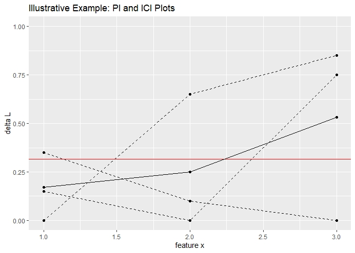

```

This exchangeability between PFI, PI and ICI depicts a convenient property for further analyses. The PI allows to detect regions with a higher or lower Feature Importance, whereby the ICI allows to analyse individual observations and its contribution to the global PFI. 


## Simulations: A cookbook for using with PI and ICI {#ch3}

Simulations are a convenient choice to check statistical models for their correctness and validity. The following simulations are meant to guide the reader through a proposed step-by-step procedure which first, shall detect, then explain and lastly visualize interaction effects and their impact on a feature's heterogeneity in importance. Even though each step is motivated by a limitation from its preceeding method, they should be considered as mutual complements which aim to derive a complete picture. 


### Detect Interactions {#ch31}

In general, two kinds of relationships between two covariates exist. First, the most common one, they are correlated. Second, the covariates do interact. Detecting correlation can be obtained by calculating the correlation matrix between the features. If two features are independent, the correlation is 0. The reverse, however, is not necessarily true as correlation measures only linear dependence. In such cases, a concept of information theory can be used. The metric "mutual information" describes the amount of information about one feature that is obtained when observing the other feature. Briefly, it quantifies the amount of shared information between features and therefore, measures implicitly the dependence between them. If the mutual information is 0, the features are indeed independent. This allows to even quantify interactions between features. 

Hence, methods exist which can detect and even quantify the dependence between variables, apart from correlation. Still, the question remains whether PI or ICI plots have a similar power. 


#### Partial Importance and Individual Conditional Importance plots {#ch311}

Again, the goal is to assess whether visualizations can detect interaction effects. In order to gain a first visual understanding of PI and ICI plots, consider the following data-generating model. 

$$ y \, = \, 5w_{1} \,  + \, 5w_{2} \, + w_{3}  \, + \, \epsilon$$
$$ w_{1} \, \overset{i.i.d}{\sim} \, \mathcal{N}(0,1), \, w_{2} \, \overset{i.i.d}{\sim}  \mathcal{N}(0, 1) \, and \, w_{3} \overset{i.i.d}{\sim} B(1, 0.5),\,  \epsilon \overset{i.i.d}{\sim} \mathcal{N}(0, 1)$$

The model is simulated with 1000 observations which are split in 80% training and 20% test data. On the training data a Random Forest model is fitted and based on the estimates, the Partial Importance and the Individual Conditional Importance are calculated on the test data. The latter is done as outlined in the preliminaries. In figure \@ref(fig:fig1), the plots are visualized for feature $w_{2}$. 

```{r fig1, eval = TRUE, echo = FALSE, fig.align = 'center', out.width = '99%', fig.cap = "Simulated data: PI Plot and ICI Plot for feature $w_{2}$. Introductory example with no interaction effect. Still, heterogeneity is observed."}
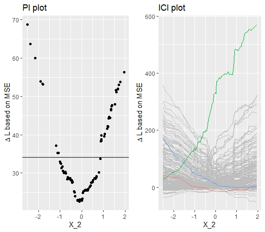

```

The PI plot indicates already a heterogeneous relationship, where the Partial Importance becomes large for large absolute values. The minimum is reached at around $w_{2} = 0$. The respective ICI plot, provides even more insights. It shows that some observations have a low local Feature Importance for large negative values and a large local Feature Importance for large positive values and vice-versa. As the shape of the curves are in both directions similar and the minimum is around $w_{2} = 0$, it can be concluded that the feature $w_{2}$ is equally distributed around its mean. 

But how does this coincide with the fact that none of the above discussed sources for heterogeneity are apparent in this simulation? As expected, no heterogeneity should be observed and yet the heterogeneity is considerable. The observed heterogeneity is due to the fact that inherently extreme input values are considered on average as more important. Extreme values are replaced by values which are on average farther away from the original input value which in turn results in higher loss differences. This problem is getting worse when choosing loss functions that penalize large errors more extreme. Briefly, the heterogeneity should be higher with a L2-loss compared to a more robust L1-loss.

Hence, the plots might be misleading as it should not be concluded that large positive or large negative values are more important. Therefore, if features are normally distributed, the shape of the curves should be considered as a baseline plot whereby only deviations from there can be considered as a "true", interpretable or meaningful heterogeneity. Yet, keeping that in mind, the PI and ICI plots do explain the heterogeneity to the full extent. 

With these baseline insights, one can now evaluate to what extent PI and ICI plots can detect heterogeneity which evolved through interaction effects. Following this objective, the following data-generating model is considered:


$$ y \, = \, x_{1} \,  + \, 5x_{2} \, + 5x_{2}  1_{x_2 > 2, x_3 = 0} \, + \, \epsilon$$

$$ x_{1} \, \overset{i.i.d}{\sim} \, \mathcal{N}(0,1), \, x_{2} \, \overset{i.i.d}{\sim}  \mathcal{N}(0, 4) \, \text{and} \, x_{3} \overset{i.i.d}{\sim} B(1, 0.5),\,  \epsilon \overset{i.i.d}{\sim} \mathcal{N}(0, 1)$$

Besides the comparabale linear relationship between the covariates and the outcome variable, the model contains additionally an interaction effect between $x_{2}$ and $x_{3}$. The model suggest that the feature $x_{2}$ should become more important for values $x_{2} > 2$ and $x_{3} = 0$. Hence, the plots should reveal large values in this area. 

The respective PI and ICI plots are at first glance quite similar to the plots, resulting from simulation 1. Yet, the above mentioned differences can be observed. First, the PI plot reveals that the Feature Importance increases with a higher magnitude for large positive values, indicating that these observations are relatively more important. Looking at the ICI plot and highlighting the observations with the highest, the lowest and the median FI, yields some clearer insights. The green curve corresponds to the observation with the largest contribution to the global PFI. Its initial value for $x_{2}$ is beyond the threshold of 10 and the corresponding $x_{3}$ takes the value 0. Hence, the interaction effect triggered and the feature became more important. The green curve ascends decisively in the area around $x_{2} = 2$. Once the threshold is reached, the fitted model does not trigger the interaction effect anymore and therefore, the predictions diverge increasingly. This observed property already indicates that an interaction effect is a major driver for heterogeneity. 

Yet, the quite similar plots from simulation 1 and simulation 2 might cause problems to identify this interaction from first glance. Therefore, in what follows, an additional method will be introduced which aims for less ambigious results. Besides, it is important to note that these plots still do not explain which features drive the heterogeneity in Feature Importance. 


```{r, fig2, eval = TRUE, echo = FALSE, fig.align = 'center', out.width = '99%', fig.cap = "Simulated data: PI Plot and ICI Plot for feature $x_{2}$. Visualizations correspond to data-generative model with interaction effect between $x_{2}$ and $x_{3}$."}
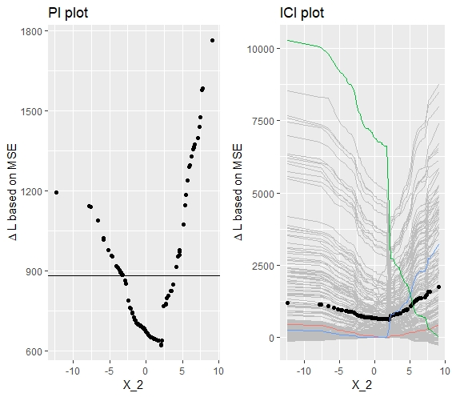

```


#### d-ICI (derivative Individual Conditional Importance) {#ch312}

In order to supplement the results, yielded from the PI and ICI plots, a method will be proposed that was introduced by @Goldstein2013 with the purpose to detect interaction effects in the context of analyzing Feature Effects. 

By calculating the numerical derivative for each ICE curve, they show that the respective derivative plots enable to detect interaction effects. They argue that the derivatives should be constant over the range of values if no interaction effects exist. In case of interaction effects, the derivatives should show a larger positive or negative magnitude at the point where the interaction effect takes place. 

Taking this, we can transfer the theoretical concept from Feature Effects to Feature Importance by calculating the derivatives of each ICI curve respectively. It was already observed that an interaction triggers an initial higher level of Feature Importance which was represented in a sudden increase or decrease of the ICI curves that were affected by the interaction. This should be perfectly captured by the derivatives. 

Even though the conceptual transfer seems straightforward, the interpretation of the derivative plots should be adjusted slightly. First, one should not expect that the plots are constant in case when no interaction is existent. Figure \@ref(fig:fig3) show for the model with no interaction effect that, there is also some altitude in the derivatives. However, this is approximately equally distributed over the feature's range of values and therefore, it is reasonable to assume that there is no interaction effect. 

Secondly, by contrast to the derivative of the ICE curves, it is to be expected that the derivatives of the ICI curves are both, negative (descending curves) ans positive (ascending curves). The respective d-ICI plot (see figure \@ref(fig:fig4)) for simulation 2 depicts a distinguished picture. Over the whole range of values, the derivatives are comparably low in magnitude, expect for the derivatives at $x_{2} = 2$.

Without going into further detail at this point, one can conclude that d-ICI plot seems to be a valid method to obtain a more robust indicator for interaction effects. Besides, the plots directly reveal where the interaction effect triggers which consitutes an important property when aiming for better interpretability.


```{r, fig3, eval = TRUE, echo = FALSE, fig.align = 'center', out.width = '99%', fig.cap = "Simulated data: d-ICI plot for feature $w_{2}$. The d-ICI plot shows a less clear structure of the derivatives. This corresponds to a the case where the respective feature does not interact"}
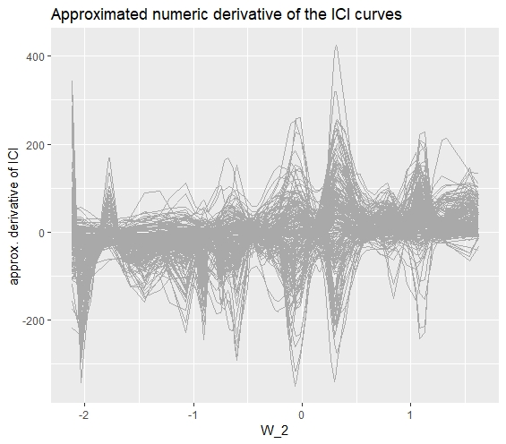

```
```{r, fig4,  eval = TRUE, echo = FALSE, fig.align = 'center', out.width = '99%', fig.cap = "Simulated data: d-ICI plot for feature $x_{2}$. The d-ICI plots shows a distinguished amplitude at $x_{2} = 2$. This finding is in line with the interaction effect between $x_{2}$ and x_{3}."}
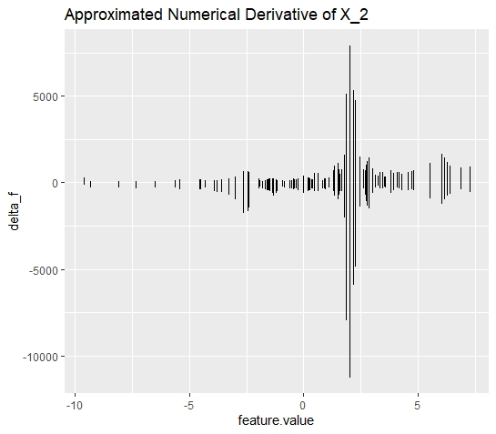

```

However, even if the d-ICI plots are sometimes convenient choices to detect interaction effects, it is still only applicable if some properties hold. First, and that is the most crucial one, the interaction effects shall not be existent over the entire range of values of the considered feature. If so, one cannot identify a single spot within the range where the feature becomes initially more important. Hence, the d-ICI plot is expected to take a similar shape as if no interaction was existent. 

Secondly, the d-ICI plot is only assumed to yield unambigious results, if the interaction effect is strong enough. However, this must not necessarily be interpreted as a limitation. It merely shows that the second order effect (interactions between two features) should not be decisively smaller than the first order effect (main effect of the feature). If the second order effect is too small, then it is open for discussion whether detecting this interaction effect is even decisive for interpreting the machine learning model. 


### Explain Interactions {#ch32}

So far it is understood that PI and ICI plots do probably not provide the clearest insights on whether interaction effects exist or not. Yet, calculating the Individual Conditional Importance allows to implement d-ICI plots which might provide better insights. 

Still, it is not clarified between which features the interaction takes place. Enabling this, would have a major impact on the interpretability of machine learning models. The following will introduce a reliable method that resolves the issue of a lack in explanatory power for interaction effects. These results will then be complemented by the insights form the previous simulations to obtain a full picture of the heterogeneity in Feature Importance.


#### Drivers for Heterogeneity in Feature Importance {#ch321}

Chapter \@ref(ch2) highlighted the fact the taking the integral of the Individual Conditional Importance yields the aggregated Feature Importance for each observation. This property can be used to predict the global Feature Importance for each observation with respect to the remaining covariates. If interaction exists, as for instance a d-ICI plot suggests, then a significant relationship with at least one other feature should be yielded. 

Here, it is still not clarified which learner is the most suited. Ideally, one would like to yield sparse results where noise is not fitted. This would prevent that other features, which are actually independent, are included in the model. This property would hold for any regularized regression model. Yet, it would be additionally convenient if the learner would additionally output the threshold were the interaction takes place. 

Both desired properties hold best when inducing a decision-tree with tree-depth of 1. This configuration is quite robust against noise and the returned split point indicates the threshold for which the conditional Feature Importance should be calculated. 

In conjunction with the results from the d-ICI plots, one obtains a complete understanding of the nature of the interaction effect. This insights can then be used to later calculate and visualize the conditional Feature Importance. 

```{r, fig5, eval = TRUE, echo = FALSE, fig.align = 'center', out.width = '99%', fig.cap = "Simulated data: The decision stump reveals the interaction between $x_{2}$ and $x_{3}$. The split node gives information about where the interaction takes place."}
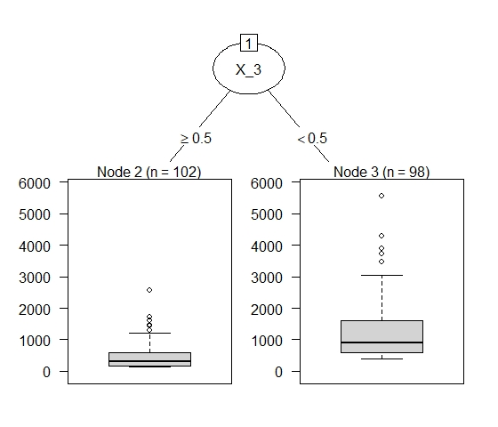

```

Figure \@ref(fig:fig5) visualizes the fitted decision tree. The results show that the Feature Importance of $x_2$ is distinctly larger for values $x_3 < 0.5$. As $x_3$ is a binary variable, either taking the value $0$ or $1$, the results show that if and only if $x_3 = 0$, interaction takes place. In case of only one interaction effect between two covariates, the decision tree should yield stable results. 

However, it might appear that there are several interaction effects taking place so that a decision-tree with tree-depth = 1 is insufficient. Still this poses no actual problem as this methods is in general not restricted to a specific learner. However, it would be still advantageous to preserve the Importance dimension. Hence, fitting a random forest model would be a suitable method. However, as the main idea should be clear, it will be refrained from going more into detail at this point.


#### Conditional Importance plots {#ch322}


With results from above, one can now calculate the Conditional Individual Importance of the feature $x_{2}$. Therefore, one just simply subdivides the Individual Conditional Importance into the respective groups. Meaning, calculate the PI for $x_2$ for all observations where $x_3 = 0$ and for all observations where $x_3 = 1$. As the plot below shows, the PI for the observations where the interaction triggered is above average and hence, the observations with $x_3 = 1$ are below average over the entire range.

```{r, fig6, eval = TRUE, echo = FALSE, fig.align = 'center', out.width = '99%', fig.cap = "Simulated data: The conditional Feature Importance plot visualizes the impact of the interaction effect on the heterogeneity in Feature Importance."}
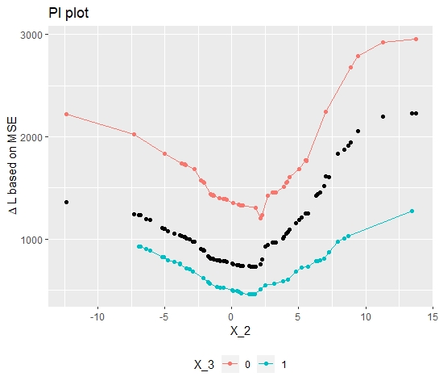

```

Finally plotting the conditional Feature Importance (see figure \@ref(fig:fig6)) indeed confirms the interaction effect and its impact on the Feature Importance. Besides, to get there, some additional interesting insights were obtained. Now, it is known between which features and where in the feature's range of values the interaction effect takes place. With the conditional Feature Importance, one can even quantify the difference and therefore measure the impact of the interaction effect. Concluding, that that the initial observed heterogeneity is understood to its full extent. 

Applying this on a real data application would then allow a more meaningful contextual interpretation. 


### Stress Methods in a Non-Linear Relationship Setting {#ch323}

When trying to detect interaction effects, it was already seen that the inherent heterogeneity diffuses a clear and unabmigious pícture. However, with some background knowledge and the d-ICI plot, it was still possible to reliably detect the interaction effect. 

Still, it seems reasonable to further validate the robustness of these methods within a data-generative model with a non-linear relationship. By doing so, it  can be assessed whether the methods still detect interaction effects even though additional inherent heterogeneity is introduced. For this purpose, consider the following data-generative model:


$$y \, = \, T_{1} \,  - \, 5T_{2} \, + 5T_{2}  1_{T_2 > 2, T_3 = 0} \, + \, \epsilon$$
$$ x_{1} \, \overset{i.i.d}{\sim} \, \mathcal{N}(0,1), \, x_{2} \, \overset{i.i.d}{\sim}  \mathcal{N}(0, 4) \, \text{and} \, x_{3} \overset{i.i.d}{\sim} B(1, 0.5),\,  \epsilon \overset{i.i.d}{\sim} \mathcal{N}(0, 1)$$
Inducing further heterogeneity by including the sinus function seems appropriate as heterogeneity is "uniformly" distributed over the feature's range of values. The function values are bounded by -1 and 1, so that the heterogeneity is controlled and does not exceed extreme values.

The plotted PI curve (see figure \@ref(fig:fig7)) indicates that the Feature Importance for $T_2 > 5$ is above the average. Therefore, one might conclude that interaction which makes the feature more important takes place in this area. Disentangling the PI curve into its components, yields a slightly different picture. It shows a steep descent of some curves at $T_2 = 2$ and descending but also ascending curves at $T_2 = 5$. Compared to the PI curves, the ICI curves allow a more detailed analysis of the heterogeneity. But, still it is not clarified whether interaction takes place at $T_2 = 2$ or $T_2 = 5$. 

```{r, fig7, eval = TRUE, echo = FALSE, fig.align = 'center', out.width = '99%', fig.cap = "Simualated Data: PI Plot and ICI Plot corresponding to the variable $t_{2}."}
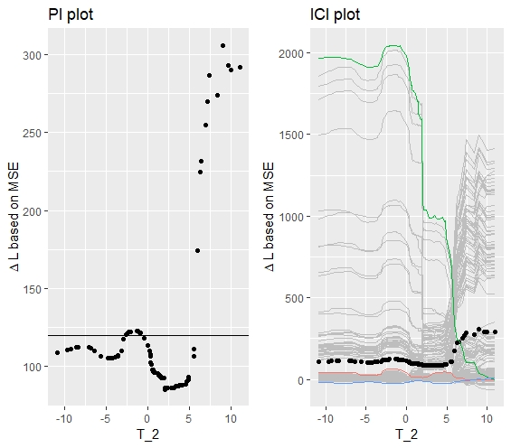

```

Hence, again the derivatives can be calculated and plotted as shown below. 

```{r, fig8, eval = TRUE, echo = FALSE, fig.align = 'center', out.width = '99%', fig.cap = "Simulated data: PI Plot and ICI Plot."}
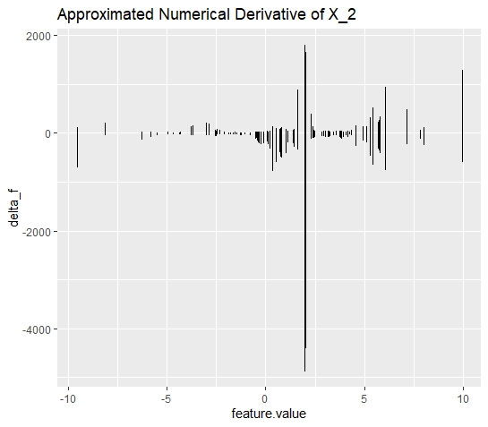

```

Despite the additional heterogeneity, the d-ICI plots still disentangles the diffused picture and uniquely identifies the ineraction effects. It can be seen that the largest descent of the ICI curves takes place at $T_2 = 2$. It further can be excluded that an interaction effect takes place at $T_2 = 5$.

Of course, as it is known that the feature is sinusoidally distributed, the steep ascent of the ICI curves at $T_2 = 5$ could have been explained. Having a closer look at the ICI plot it also reveals that the ascent is gradually increasing which does not hold for the ascent at $T_2 = 2$. But still, it can be concluded that within this setting, the PI and ICI plots are not very telling. 


## Real Data Application: Boston Housing {#ch4}

Before this chapter will be closed by a brief discussion and an outlook for further research, the introduced methods will be now applied on real data. Doing so is important for a final validation. Only if it can be shown that these methods are applicable to real data, they can be assessed as useful.

Pursuing this objective, we will caculate the PFI, PI and ICI for the predictors of the Boston Housing dataset. In this setting, it is of interest to predict and explain the "median value of owner-occupied homes in USD1,000$. In a pre-analysis, the predictor variable `lstat` was chosen to conduct further analyses. Briefly, `lstat` measures the percentage share of lower status people in the population and from an economic perspective, it is assumed that there is a significant relationship between the predictor and the outcome variable. 

As in the simulation analysis, the model is fitted equivalently by a random forest model and the calculation of the Importance metrics follows the same principle. The PI and ICI plots below, allow a first interpretation of the Feature Importance. 


```{r, fig9, eval = TRUE, echo = FALSE, fig.align = 'center', out.width = '99%', fig.cap = "Boston Housing Data: PI and ICI plot for feature `lstat`. A clear and not uniformly distributed heterogeneity can be observed."}
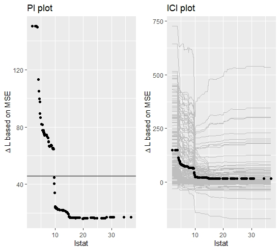

```

The PI plot reveals that on average the explanatory power of `lstat` becomes decisively larger for values below 10. Briefly, if the percentage of people with lower status is below 10%, the variable becomes a more important consitute of the predictive model. The ICI plot confirms this result and shows some additional heterogeneity in this area which however, is hard to interpret within this visualization setting. Therefore, again, the derivatives of the ICI curves can be calculated to detect the heterogeneity in a more comprehensive way.


```{r, fig10, eval = TRUE, echo = FALSE, fig.align = 'center', out.width = '99%', fig.cap = "Boston Housing Data: d-ICI plot for feature `lstat`. The plot provides further insights on the initially observed heterogeneity."}
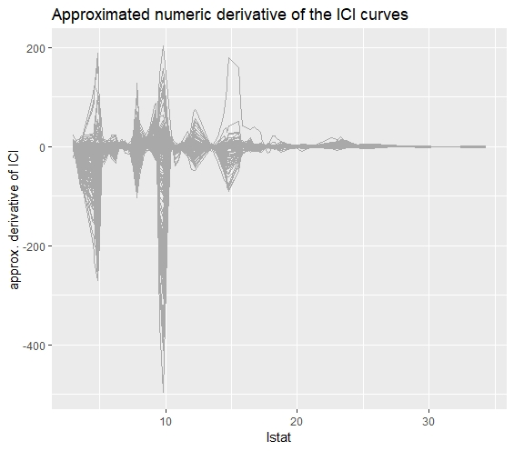

```

The d-ICI plot for the feature `lstat` additionally confirms the heterogeneity, visible in the ICI plot. Especially at $lstat = 10$ a significant amplitude can be identified. This indicates that an interaction between `lstat` and another covariate takes place in the area around $lstat <= 10$. Given this insight, it is now to be determined with which covariate the feature "lstat" interacts. Therefore, we again predict the integral of each observation's Feature Importance with respect to the remaining covariates. 

```{r, fig11, eval = TRUE, echo = FALSE, fig.align = 'center', out.width = '99%', fig.cap = "Boston Housing Data: Explain Interaction Effects for feature `lstat``. The decision stump identifies the interaction between feature `lstat` and feature `dis`. Again the split point indicates where the interaction effect takes place."}
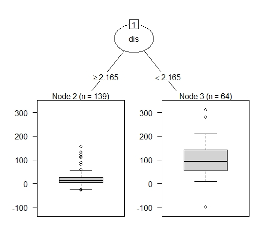

```


At this point, one has gained a rather complete picture of why there is heterogeneity in the Feature Importance of the feature "lstat". Therefore, one can now calculate the Conditional Feature Importance of `lstat` on the variable `dis`. Plotting the conditional curves (see figure \@ref(fig:fig12)), confirms the analyis of the previous results. Even though, the results are not as distinguished as in the simulation settings, the interaction taking place is still clearly visible. 

```{r, fig12, eval = TRUE, echo = FALSE, fig.align = 'center', out.width = '99%', fig.cap = "Boston Housing Data: Conditional Importance Plot. Importance of `lstat` conditional on values of `dist`"}
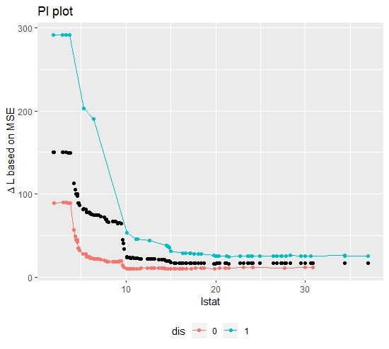

```

With the insights from the Real Data Application, one can conclude that the presented methods also work beyond the simulation setting and is therefore, applicable for explaining heterogeneity in Feature Importance within a machine learning model. Yet, the heterogeneity problem was merely discussed in the context of interaction effects. It could be further discussed whether it might be even possible to identify the structural relationship between a feature and the response. Besides, it would be also interesting to investigate the PI and ICI plots in the context of correlated features. 


## Discussion {#ch5}

So far, it was stressed to what extent the PI and ICI plots are suitable tools to obtain a better interpretation of Feature Importance. In order to give this a final evaluation, the critical assessment is subdivided into two parts. The first part will summarize the capabilites of the visualization tools. The second part will explore the possibilities that have arisen through the data obtained. 

The simulation chapter clearly revealed that the ICI and PI plots are indeed able to visualize heterogeneity but both had its limitations when trying to detect interaction effects. First, even though no heterogeneity was expected, the PI and ICI plot still visualized heterogeneity. Even though, it can be explained by the distributional properties of the feature, it can lead to confusion. One could circumvent the problem by weighting the local Feature Importance of each observations with its respective probability mass. This would "squash" the curves to a linear shape and merely only deviations from that could be interpreted as a proper heterogeneity. Second, when a non-linear relationship between response and the feature was induced, both methods did not yield robust and reliable results.

Further, it was argued that explaining interactions is as important as detecting interaction effects. Even if the ICI plots were able to detect interaction effects, it was not possible to really explain them. Briefly, between which features and where did the interaction take place. 

Concluding, the visualization of PI and ICI does indeed disentangle the global PFI metric, but has its non-negligible limitations when interpreting the results properly.  

Even though, the PI and ICI plots themselves are very limited in its explanatory power, it was still possible with the underlying data to create a cookbook which enabled a full picture. The d-ICI plots represent a robust method for detecting interactions, even in a "messy" non-linear relationship. It turned out that calculating the approximated Feature Importance was easy to implement and therefore posed no major challenge. Further, as the Partial Importance was already calculated it was not difficult to implement a method which explains between which features interaction takes place. Solving that, one can the calculate the conditional Feature Importance and therefore, finally visualize the actual effect of the interaction on the Feature Importance.

Concluding, even though the PI and ICI plots have its limitations, the underlying data represents an exhaustive foundation for yielding a complete picture of the heterogeneity. Therefore, it can be stated that disentangling the global PFI into its individual components is a valid and insightful approach to better understand what exactly drives the predictions of a machine learning model.

