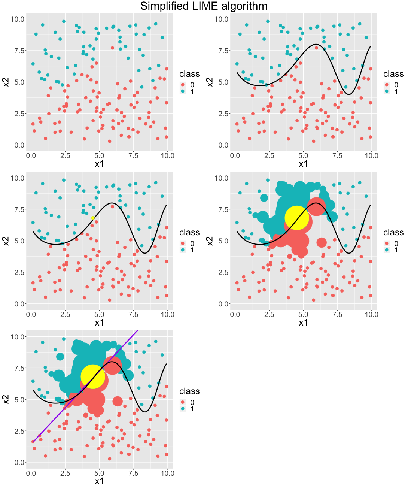

# Introduction to Local Interpretable Model-Agnostic Explanations (LIME) {#lime}

*Authors: Sebastian Gruber, Philipp Kopper*

*Supervisor: Christoph Molnar*

When doing machine learning we always build models.
Models are simplifications of reality.
Even if the predictive power of a model may be very strong, it will still only be a model.
However, models with high predictive capacity do most of the time not seem simple to a human as seen throughout this book.
In order to simplify a complex model we could use another model.
These simplifying models are referred to as surrogate models.
They imitate the black box prediction behaviour of a machine learning model subject to a specific and important constraint: 
surrogate models are interpretable.
For example, we may use a neural network to solve a classification task.
While a neural network is anything but interpretable, we may find that some of the decision boundaries are explained reasonably well by a logistic regression which in fact yields interpretable coefficients.

In general, there are two kinds of surrogate models: global and local surrogate models.
In this chapter, we will focus on the latter ones.

## Local Surrogate Models and LIME

The concept of local surrogate models is heavily tied to @ribeiro2016should, who propose local interpretable model-agnostic explanations (LIME). 
Different from global surrogate models, local ones aim to rather explain single predictions by interpretable models than the whole black box model at once.
These surrogate models, also referred to as explainers, need to be easily interpretable (like linear regression or decision trees) and thus may of course not have the adaptability and flexibility of the original black box model which they aim to explain.
However, we actually don't care about a __global__ fit in this case.
We only want to have a very __local__ fit of the surrogate model in the proximity of the instance whose prediction is explained. 

A LIME explanation could be retrieved by the following algorithm:

1. Get instance $x$ out of the data space for which we desire an explanation for its predicted target value.

2. _Perturb_ your dataset $X$ and receive a perturbed data set $Z$ of increased size. 

3. Retrieve predictions $\hat{y}_{Z}$ for $Z$ using the black box model $f$.

4. Weight $Z$ w.r.t. the proximity/neighbourhood to $x$.

5. Train an explainable weighted model $g$ on $Z$ and the associated predictions $\hat{y}_{Z}$.

Return: An explanation for the interpretable model $g$.

The visualisation below nicely depicts the described algorithm for a two-dimensional classification problem based on simulated data.
We start only with our data split into two classes: 1 and 0.
Then, we fit a model that can perfectly distinguish between the two classes.
This is indicated by the sinus-shaped function drawn as a black curve.
We do not perturb the data in this case.
(However, we may argue that our perturbation strategy is to use the original data.
We will more formally discuss perturbation later on.)
Now, we choose the data point, which we want an explanation for.
It is coloured in yellow.
With respect to this point, we weight our data by giving close observations higher weights.
We illustrate this by the size of data points.
Afterwards, we fit a classification model based on these weighted instances.
This yields an interpretable linear decision boundary -- depicted by the purple line. 
As we can see, this is indeed locally very similar to the black box decision boundary and seems to be a reasonable result.

```{r, echo = FALSE}
output <- knitr::opts_knit$get("rmarkdown.pandoc.to")
is.html = !is.null(output) && output == "html"
```

```{r, eval = is.html, echo = FALSE, fig.align = 'center', fig.cap = "Simplified GIF representation of the LIME algorithm."}
knitr::include_graphics("images/lime.gif")
```

```{r, eval = !is.html, echo = FALSE, fig.align = 'center', out.width = '99%', fig.cap = "Simplified graphical representaion of the LIME algorithm. Each single panel represents one step of the described algorithm. It reads from left to right."}

```

This way we receive a single explanation.
This one explanation can only help to understand and validate the corresponding prediction.
However, the model as a whole can be examined and validated by multiple (representative) LIME explanations.

## How LIME works in detail

So far so good. 
However, the previous outline was not very specific and leaves (at least) three questions.
First, what does neighbourhood refer to?
Second, what properties should suitable explainers have?
Third, what data do we use, why and how do we perturb this data?

To better assess these open questions it may be helpful to study the mathematical definition of $LIME$.
The explanation for a datapoint $x$, which we aim to interpret, can be represented by the following formula:

$$explanation\left(x\right) = arg\,min_{g \epsilon G} \,\mathcal{L}\left(f, g, \pi_x \right) + \Omega\left(g\right)$$

Let's decompose this compact, yet precise definition:

$x$ can be an instance that is entirely new to us as long as it can be represented in the same way as the training data of the black box model.
The final explanation for $x$ results from the maximisation of the loss-like fidelity term $\mathcal{L}\left(f, g, \pi_x \right)$ and a complexity term $\Omega\left(g\right)$.
$f$ refers to the black box model we want to explain and $g$ to the explainer. 
$G$ represents the complete hypothesis space of a given interpretable learner.
The explanation has to deal with two trade-off terms when minimising: 
The first term $\mathcal{L}\left(f, g, \pi_x \right)$ is responsible to deliver the optimal fit of $g$ to the model $f$ while a low _loss_ is desirable indicating high (local) _fidelity_.
The optimal fit is only found with respect to a proximity measure $\pi_x(z)$ in the neighbourhood of $x$.

### Neighbourhood

This leads us to the first open question:
What does neighbourhood refer to?
Neighbourhood is a very vague term.
This is for good reason because a priori it is not clear how to specify a neighbourhood properly.
Technically, there are many different options to deal with this issue.
Weighting the observations w.r.t. their distance to the observation being explained seems like a good idea.
This may possibly be implemented as an arbitrarily parametrised kernel.
However, this leaves in total many scientific degrees of freedom which makes the neighbourhood definition somewhat problematic.
This neighbourhood issue will be discussed in more detail in the next chapter.

### What makes a good explainer?

We already answered the second open question -- what properties suitable explainers should have -- in parts.
We mentioned the interpretability property and outlined generalised linear models or decision trees as examples.
However, we did not discuss further desired properties of these models.
Since they have strong assumptions, it is unlikely that they are capable of maintaining an optimal fit to the original black box model. 
Recall our formula.
As we want local optimal fit subjected to a certain (low) degree of explainer complexity -- in order to allow interpretation -- our formula needs to facilitate this aspect.
$\Omega\left(g\right)$ is our complexity measure and responsible to choose the model with the lowest complexity.
For example, for decision trees, tree depth may describe the complexity.
In the case of linear regression, the $L_1$ norm may indicate how simple the interpretation has to be. 
The resulting LASSO model allows us to focus only on the most important features.

### Sampling and perturbation

Having answered the first two open question we still have the last question related to the data and the perturbation unresolved.
Besides the tabular data case, we can also interpret models trained on more complex data, like text data or image data. 
However, some data representations (e.g. word embeddings) are not human-interpretable and must be replaced by interpretable variants (e.g. one-hot-encoded word vectors) for LIME to yield interpretable results.
The function modeled by the black box model operates in the complete feature space. 
It can even yield predictions for instances not seen in the training data.
This means that the original data does not sufficiently explore the feature space.
Hence, we want to create a more complete _grid_ of the data and fill the feature space with new observations so that we can better study the behaviour of the black box model.
Still, the data for the explainer should be related to the original data.
Otherwise the explainer may be ill-placed in space having nothing in common with the original problem anymore.
This is why we perturb the original data.
But how does perturbation work?
This is a priori not clear at all.
For categorical features, perturbation may be realised by randomly changing the categories of a random amount of features, or even recombining all possible levels of these. 
Numerical features may be drawn from a properly parametrised (normal) distribution.
The perturbed data set, which is used to train the explainer, should be much larger than the original one and supposed to better represent the (possible) feature space, giving the surrogate model more anchor points -- especially in sparse areas.
Further details on this topic will be studied in the next chapters.

## Example

A fully implemented example of LIME can be seen in the following code block with its resulting plot. In the latter we can observe how much each feature contributes to the surrogate model's prediction and to what extend this prediction offers a good fit on the black box model ('Explanation Fit' between 0 and 1).

```{r, eval = TRUE, echo = FALSE, warning = FALSE}
required_packages = c("lime", "mlr")
install_these = required_packages[!(required_packages %in%
                                      installed.packages())]
if (length(install_these) > 0) {
  if ("lime" %in% install_these) {
    install_these = install_these[install_these != "lime"]
    install_github("https://github.com/thomasp85/lime")
  }
  install.packages(install_these)
}
```

```{r, eval = TRUE, echo = TRUE, fig.align = 'center', out.width = '99%', fig.cap = "Basic example of a LIME application. We create a black box model on the iris dataset without the first data point and then explain the prediction of this point with LIME."}
library(lime)
library(mlr)

# separate data point we want to explain
to_explain  = iris[ 1, 1:4]
train_set   = iris[-1, ]

# create task and calculate black box model
task_iris   = makeClassifTask(data = train_set, 
                              target = "Species")
learner     = makeLearner("classif.randomForest", 
                          ntree = 200, predict.type = "prob")
black_box   = train(learner, task_iris)

# use lime to explain new data point
explainer   = lime(train_set[, 1:4], black_box)
explanation = explain(to_explain,
                      explainer,
                      n_labels = 1,
                      n_features = 4)

plot_features(explanation)
```

## Outlook

The definition of LIME still seems after all very rough and vague.
This leaves us many scientific degrees of freedom when implementing it -- for the good and for the bad.
For example, we see that the model $f$ can be any machine learning model that exists.
This gives us the opportunity to drastically change the underlying predictive model while keeping the same explainer $g$ with the same complexity constraints. 

On the other hand, LIME being a very generic approach also means that many "hyperparameters", like the neighbourhood definition or the sampling/perturbation strategy, are arbitrary.
Hence, it is likely that in some use cases LIME explanations heavily depend on changing the hyperparameters.
In these cases, the explanations can hardly be trusted and should be treated with great care.

The following two chapters will focus on two very significant hyperparameters: 
the neighbourhood definition and the sampling strategy.
They will investigate how these affect the results of the method and their interpretability.
We will emphasise the coefficient stability of LIME explainers in order to illustrate the trustworthiness of the results. 
