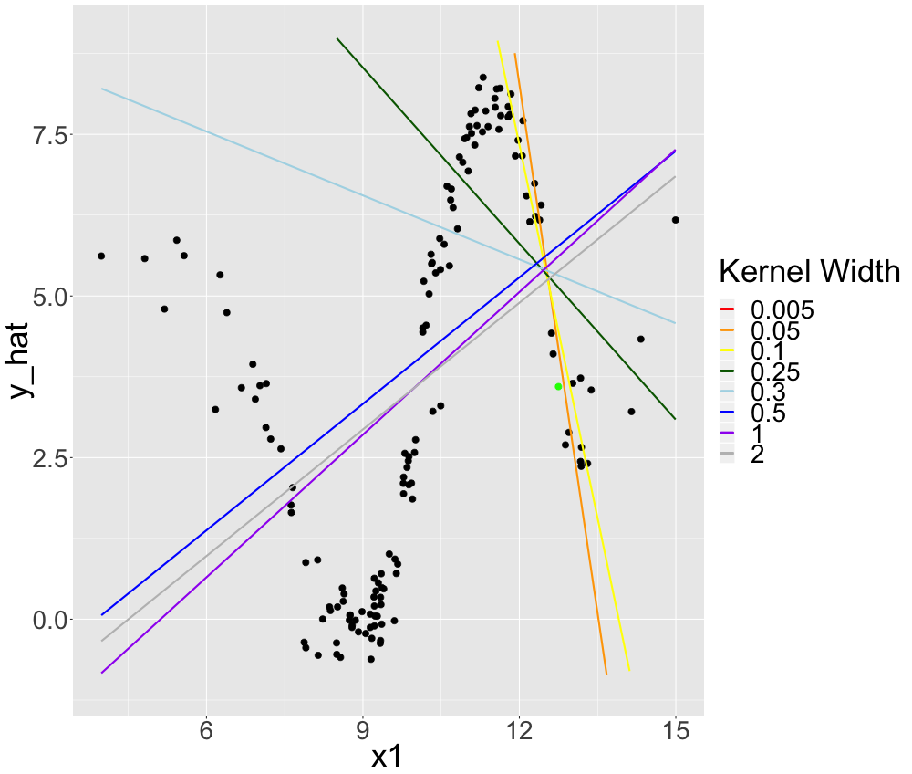

# LIME and Neighbourhood

*Author: Philipp Kopper*

How much neighbourhood may be an issue can be illustrated in a setting very different to LIME:
Descriptive statistics or in particular kernel density estimations.
The figure below illustrates kernel densities from a standard normal distribution.
One can easily see that the second panel seems to be appropriate while the first one is too granular and the third one does not feature any information.
The proper definition of the neighbourhood is in this case very crucial.
However, with no prior information this definition is arbitrary.
We can only judge on the proper definition of the neighbourhood from our experience and our expectations.
This may work in low dimensional problems and descriptive statistics.
However, machine learning models operate in multivariate space and mostly tackle complex associations.
Thus, it seems much harder to argue on the proper neighbourhood definition when working with LIME.

This chapter reviews the neighbourhood issue w.r.t. the LIME algorithm critically.
The objective of this chapter is more to outline this particular issue and not to suggest solutions for it.
First of all, it describes the neighbourhood defintion abstractly (section 1).
Then, it reviews possible implementations with special emphasis on the implementation in Python and R (section 2).
Section 3 discusses inherent problems and potential issues of the current implementations.
In section 4 we examine the coefficient stability of LIME explanations w.r.t to altering the neighbourhood definition within an experiment in R.
We use both, simulated and real data.
We make use of the stability selection algorithm which is explained in section 4.1.
Finally, section 5 concludes reviewing the take-aways of this chapter and proposing an improved algorithm w.r.t. the neighbourhood issue.

## The Neighbourhood in LIME

When obtaining explanations with LIME the neighbourhood of an instance is determined when fitting the model by applying weights to instances w.r.t. proximity to the instance of interest.
However, it is important to note that this step is already arbitrary.
@craven1996 show that increasing the density of observations around the instance of interest is very helpful to achieve model fidelity.
This could be obtained in many other ways than weighting observations as in LIME.
One possible alternative might be to combine steps 2 (sampling) and 4 (weighting) of the LIME algorithm.
This way we would increase the density around the instance already by proper sampling. 
In fact, @laugel2018defining claim that this way should be preferred over the way LIME samples.
In this chapter, however, we focus on the explicit implementation in LIME and analyse how the weighting strategy _ceteris paribus_ affects surrogate model stability.

In LIME the weighting of instances is performed using a kernel function over the distances of instances to the instance of interest.
This leaves us two _arbitrary_ (in fact they may not be that arbitrary) choices:
the distance and the kernel function.
Typical distance functions applicable to statistical data analysis are based on the L0, L1 and L2 norms.
For numerical features one tends to use either manhattan distance (L1) or euclidean distance (L2).
For categorical features one would classically apply hamming distance (L0).
Mixed data (data with both categorical and numerical features) usually one combines distances for numerical and categorical features.
So does Gower's distance @Gower 

$$ d_G(x_i, x_j) = \sum_{p = 1} ^ {P} \frac{d_{euc}(x_{p, i}, x_{p, j})}{ 
range(x_p)} $$
or a bit more general the distance proposed by @Huang1997kproto

$$ d_H(x_i, x_j) = d_{euc}(x_i, x_j) + \lambda d_{ham}(x_i, x_j) $$

with $d_{euc}$ refering to the euclidean distance and $d_{ham}$ to the hamming distance.
$\lambda$ steers the importance of categorical features relative to numerical ones.
However, it is important to note that despite these mesasures it may be challenging to properly determine distances for mixed data properly. @ribeiro2016should recommend using cosine distance for text, euclidean distance for images.

For the kernel function itself there are two hyperparameters to be set.
First of all the type of the kernel.
Second, the kernel width.
By default the R implementation implements an exponential kernel where the kernel width equls the square root of the number of features.

As the choice of the distance measure seems least arbitrary and the choice of the kernel function is not expected to have crucial impact on the neighbourhood definition, we focus on the kernel width in our experimental study.
However, it is very important to notice that practically the distance measure may interact with the kernel width.
This is because as of the current implementation in R Gower distance does not apply any kernel as it already returns scaled distances.
We observed that this property may have some undesired properties as global models seem to be preferred over local models.
We suggest to implement a kernel function also for the Gower distance.
We are currently working on this issue in collaboration with the package owner.

## The Problem in a one-dimensional setting

How crucial the kernel width is can be illustrated by a very simple example.
We simulate data with one target and two features.
One feature is purely noise and the other one has a non-linear sinus-like effect on the target.
If we plot the influential feature on the x-axis and the target on the y-axis we can observe this pattern in figure 1.

```{r, eval = TRUE, echo = FALSE, fig.align = 'center', fig.cap = "Simulated data: Non-linear univariate relationship."}
knitr::include_graphics("images/04-09-01.png")
```

Now we fit a random forest on this problem which should be able to detect the non-linearity and incorporate it into its predictive surface.
In fact, we observe that the predictions of the random forest look very accurate in figure 2.

```{r, eval = TRUE, echo = FALSE, fig.align = 'center', fig.cap = "Simulated data: Random Forest Predictions."}
knitr::include_graphics("images/04-09-02.png")
```

LIME could now be used to explain this random forest locally.
"Good" local models would look very different w.r.t. the value of the feature.
We could describe the data locally well by piece-wise linear models.
This is depicted in the figure 3.

```{r, eval = TRUE, echo = FALSE, fig.align = 'center', fig.cap = "Simulated data: Non-linear univariate relationship linearly interpolated."}
knitr::include_graphics("images/04-09-03.png")
```

LIME should be able to find these good local explanations given the right kernel size.
Let's select one instance that is close to the predictive surface. 
We indicate this by the green point in figure 4.
This particular instance can be linearly described by a linear regression with approximately intercept $60$ and slope $-4.5$.
If we set the kernel width to $0.08$, we actually fit this local model (on average).
This is indicated by the red line in figure 4.
However, if we increased the kernel width to $2$ the coefficients change to $-2.84$ (intercept) and $0.64$ (slope) (on average) which seems drastically distorted as observed by the yellow line in figure 4.
The second line does not seem to fit a local linear model but rather a global one.

```{r, eval = TRUE, echo = FALSE, fig.align = 'center', fig.cap = "Simulated data: Local models for univariately non-linear data."}
knitr::include_graphics("images/04-09-05.png")
```

More systematically we review explanations resulting from altering the kernel size in figure 5. 
We average over many different models to achieve more robust local models.
We do that because we observe some coefficent variation resulting from the (random) sampling.
In figure 5 we see these averaged models for 8 different kernel sizes.
We observe that the larger we set the kernel size, the more we converge to a linear model that operates globally.
In fact, the largest three kernel sizes ($0.5$, $1$ and $2$) appear very global while $0.005$, $0.05$ and $0.1$ seem to fit good local models.
$0.25$ and $0.3$ are neither global nor very local.
This is very intuitive and complies with the idea of a weighted local regression.

```{r, eval = TRUE, echo = FALSE, fig.align = 'center', fig.cap = "Simulated data: Local models for univariately non-linear data with different kernel sizes."}

```

Additionally, we analyse the same alteration of the kernel size for an observation where a good local approximation would be a linear model with positive slope in figure 6.
We observe a similar behaviour.

```{r, eval = TRUE, echo = FALSE, fig.align = 'center', fig.cap = "Simulated data: Local models for univariately non-linear data with different kernel sizes."}
knitr::include_graphics("images/04-09-06.png")
```

This behaviour is not necessarily a problem but only a property of the LIME.
However, it is problematic that the appropriate kernel size is not a priori clear.
Additionally, there is no straight forward way to determine a good kernel width for a given observation to be explained.
The only generic goodness-of-fit criterion of LIME, model fidelity, is endogenous w.r.t. the kernel size.
If we set the kernel size very small there will be many models with extremely good local fit as local refers only to a single observation.
In our examples it looks as if a very small kernel sizes should be prefered.
A small kernel width indeed grants local fit.
But what a small kernel width is also strongly depends on the dimensionality and complexity of the problem.

## The problem in more complex settings

The previous setting was trivial for LIME.
We could visualise the predicitve surface.
This means that interpretability was largely given in the first place.
We will study our problem in more complex settings to show that the problem persists.
We will do so by examining simulated and real data.

### Simulated data

We simulate data with multiple numeric features and a numeric target.
We assume the features to originate from a multivariate normal distribution where all features are moderately correlated.
Note that the choice of the normal distribution to be consistent with the assumptions within LIME.
We simulate three different data sets. 
In the first one the true associations are linear.
In the second one we exchange one of the linear associations with a non-linear one.
In the third one the true assocations are linear but only affect the target within a sub interval of the feature domain.
This should examine LIME's ability to determin local feature importance.
For all three data sets we expect the kernel width to have crucial impact on the resulting explainer.
However, for the global linear relationships we expect the weakest dependency because the true local model and the true global model are identical.

We refrain from simulating more complex data sets as we strongly favour that the true marginal predicitive surface is human interpretable.

#### Global Linear Relationships

We simulate data where the true predicitve surface is a hyperplane.
Good machine learning models should be able to approximate the hyperplane.
This case is somewhat trivial because LIME.
The most suitable model for this data would be linear regression which is interpretable in the first place.
However, LIME can be easily tested in this controlled environment.
We know the true local coefficients as they equal to the global ones.
Thus, we can evaluate the goodness of the kernel width appropriatley.

The simulated data looks as follows:
The feature space consists of three features ($x_1$, $x_2$, $x_3$).
All originate from a multivariate Gaussian distribution with mean $\mu$ and covariance $\Sigma$.
$\mu$ is set to be $5$ for all features and $\Sigma$ incorporates moderate correlation.
The true relationship of the features on the target $y$ is described by:

$$ y = \beta_0 + \beta_1 x_1 + \beta_2 x_2 + \beta_3 x_3 + \epsilon $$
We set the coefficients to be...

We use a random forest as black box model.

We choose random observations and compute the local LIME model for each one w.r.t. different kernel sizes.
In this case we assume that the kernel size may be infinitely large as the global model should equal good local models.
However, if the kernel width is set too small we may fit too much noise.

The table below indicates the local parameters for one of the selected observations for different kernel sizes.
Note that this is representative for all observations.

...

#### Local Linear Relationships

We may induce non-linearity by different means.
However, first of all it seems interesting to study how the kernel width affects LIME explanations in a very simple setting of non-linearity:
The features only affect the target locally linearly, as expressed by:

$$ y = \beta_0 + \beta_1 x_1 1_{x_1<c_1} + \beta_2 x_2 1_{x_2>c_2}+ \beta_3 x_3 + \epsilon $$

where $x_1$ and $x_2$ only affect $y$ within the given interval.
We again fit a random forest which can deal with this property.
LIME should be able to detect this as well given the right kernel.
To illustrate this we investigate _representative_ observations, i.e. one belonging to each _bin_ of the predicitve surface. 

...

We outlined earlier that with an increasing dimensionality the same kernel width will correspond to a different locality.
If we add new features, we should observe this. 
The kernel width needs to be larger for higher dimensionality in order to fit appropriate local models.

#### Global Non-Linearity

### Real data

The real data set is... 
EXPLANATIONS WHAT IT IS
First of all, we will show that the same problems as for simulated data persist for real data.
When LIME is used in practise on real data, we aim that it produces consistent, or in other words stable, results.
This means that if the input slighlty changes, we wish the explanation not to drastically change as well.
We examine the stability of the explanations by coefficient and so-called stability paths.
Stability paths are explained in detail below.
We study how drastically explanations differ at different kernel sizes if we explain the nearest neighbours of the instance to be explained are used instead.


