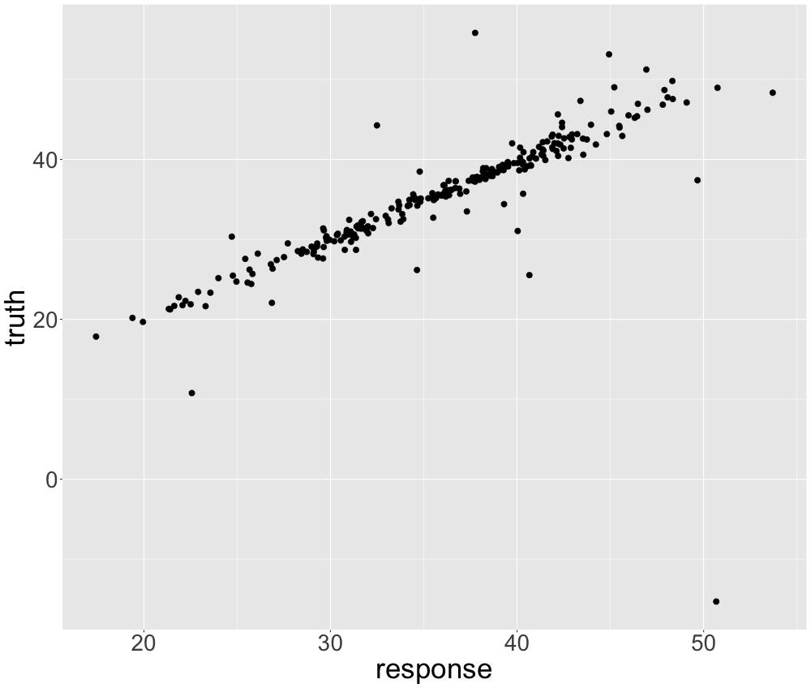
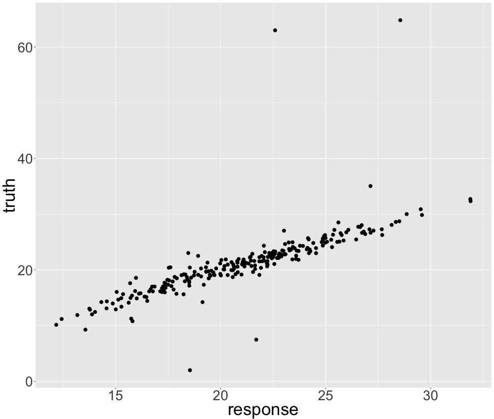

# LIME and Neighbourhood

*Author: Philipp Kopper*

How much neighbourhood may be an issue can be illustrated in a setting very different to LIME:
Descriptive statistics or in particular kernel density estimations.
Figure \@ref(fig:fig1) illustrates kernel densities from a standard normal distribution.

```{r, fig1, eval = TRUE, echo = FALSE, fig.align = 'center', out.width = '99%', fig.cap = "The appropriate kernel width for kernel density estimations."}
knitr::include_graphics("images/04-09-01.png")
```

One can easily see that the first panel seems to be appropriate while the second one is too granular.
The proper definition of the neighbourhood is in this case very crucial.
However, with no prior information this definition is arbitrary.
We can only judge on the proper definition of the neighbourhood from our experience and our expectations.
This may work in low dimensional problems and descriptive statistics.
However, machine learning models operate in multivariate space and mostly tackle complex associations.
Thus, it seems much harder to argue on the proper neighbourhood definition when working with LIME.

This chapter reviews the neighbourhood issue w.r.t. the LIME algorithm critically.
The objective of this chapter is more to outline this particular issue and not to suggest solutions for it.
First of all, it describes the neighbourhood defintion abstractly in greater detail. 
Then, it illustrates how problematic the neighbourhood definition is in a simple one-dimensional example.
Furthermore, we study the effect of altering the kernel size more systematically in more complex contexts in the next section.
The first subsection investigates multivariate globally linear relationships.
The second one researches local coefficients.
The third one studies non-linear effects.
Afterwards, we apply the insights from simulated data to a real data set and suggest best practises for setting an appropriate kernel width when working with LIME.

## The Neighbourhood in LIME in more detail

When obtaining explanations with LIME the neighbourhood of an instance is determined when fitting the model by applying weights to instances w.r.t. proximity to the instance of interest.
However, it is important to note that this step is already arbitrary.
@craven1996 show that increasing the density of observations around the instance of interest is very helpful to achieve model fidelity.
This could be obtained in many more ways than weighting observations as done in LIME.
One possible alternative might be to combine steps 2 (sampling) and 4 (weighting) of the LIME algorithm.
This way we would increase the density around the instance already by proper sampling. 
In fact, @laugel2018defining claim that this way should be preferred over the way LIME samples.
In this chapter, however, we focus on the explicit implementation in LIME and analyse how the weighting strategy _ceteris paribus_ affects surrogate model stability.

When working with LIME, the weighting of instances is performed using a kernel function over the distances of instances to the instance of interest.
This leaves us two _arbitrary_ (in fact they may not be _that_ arbitrary) choices:
the distance and the kernel function.
Typical distance functions applicable to statistical data analysis are based on the L0, L1 and L2 norms.
For numerical features one tends to use either manhattan distance (L1) or euclidean distance (L2).
For categorical features one would classically apply hamming distance (L0).
Mixed data (data with both categorical and numerical features) usually one combines distances for numerical and categorical features.
So does Gower's distance @gower1986metric: 

$$ d_G(x_i, x_j) = \sum_{p = 1} ^ {P} \frac{d_{euc}(x_{p, i}, x_{p, j})}{ 
range(x_p)} $$
or a bit more general the distance proposed by @huang1998kproto

$$ d_H(x_i, x_j) = d_{euc}(x_i, x_j) + \lambda d_{ham}(x_i, x_j) $$

with $d_{euc}$ refering to the euclidean distance and $d_{ham}$ to the hamming distance.
$\lambda$ steers the importance of categorical features relative to numerical ones.
However, it is important to note that despite these mesasures it may be challenging to properly determine distances for mixed data properly. @ribeiro2016should recommend using cosine distance for text, euclidean distance for images.

For the kernel function itself there are two hyperparameters to be set.
First of all the type of the kernel.
Second, the kernel width.
By default the R implementation implements an exponential kernel where the kernel width equls the square root of the number of features.

As the choice of the distance measure seems least arbitrary and the choice of the kernel function is not expected to have crucial impact on the neighbourhood definition, we focus on the kernel width in our experimental study.
However, it is very important to notice that practically the distance measure may interact with the kernel width.
This is because as of 2019 the current implementation in R Gower distance does not apply any kernel as it already returns scaled distances.
We observed that this property may have some undesired properties as global models seem to be preferred over local models.
We suggest to implement a kernel function also for the Gower distance.
We are currently working on this issue in collaboration with the package owner.

## The problem in a one-dimensional setting

How crucial the kernel width is can be illustrated by a very simple example.
We simulate data with one target and two features.
One feature is purely noise and the other one has a non-linear sinus-like effect on the target.
If we plot the influential feature on the x-axis and the target on the y-axis we can observe this pattern in figure \@ref(fig:fig2).

```{r, fig2, eval = TRUE, echo = FALSE, fig.align = 'center', out.width = '99%', fig.cap = "Simulated data: Non-linear univariate relationship."}
knitr::include_graphics("images/04-09-02.png")
```

Now we fit a random forest on this problem which should be able to detect the non-linearity and incorporate it into its predictive surface.
In fact, we observe that the predictions of the random forest look very accurate in figure \@ref(fig:fig3)

```{r, fig3, eval = TRUE, echo = FALSE, fig.align = 'center', out.width = '99%', fig.cap = "Simulated data: Random Forest Predictions."}
knitr::include_graphics("images/04-09-03.png")
```

LIME could now be used to explain this random forest locally.
"Good" local models would look very different w.r.t. the value of the feature.
We could describe the data locally well by piece-wise linear models.
This is depicted in the figure \@ref(fig:fig4).

```{r, fig4, eval = TRUE, echo = FALSE, fig.align = 'center', out.width = '99%', fig.cap = "Simulated data: Non-linear univariate relationship linearly interpolated."}
knitr::include_graphics("images/04-09-04.png")
```

LIME should be able to find these good local explanations given the right kernel size.
Let's select one instance that is close to the predictive surface. 
We indicate this by the green point in figure 4.
This particular instance can be linearly described by a linear regression with approximately intercept $60$ and slope $-4.5$.
If we set the kernel width to $0.08$, we actually fit this local model (on average).
This is indicated by the red line in figure 4.
However, if we increased the kernel width to $2$ the coefficients change to $-2.84$ (intercept) and $0.64$ (slope) (on average) which seems drastically distorted as observed by the yellow line in figure \@ref(fig:fig5).
The second line does not seem to fit a local linear model but rather a global one.

```{r, fig5, eval = TRUE, echo = FALSE, fig.align = 'center', out.width = '99%', fig.cap = "Simulated data: Possible local models for univariately non-linear data."}
knitr::include_graphics("images/04-09-05.png")
```

More systematically we review explanations resulting from altering the kernel size in figure \@ref(fig:fig6). 
We average over many different models to achieve more robust local models.
We do that because we observe some coefficent variation resulting from the (random) sampling.
In figure \@ref(fig:fig6) (upper panel) we see these averaged models for 8 different kernel sizes.
We observe that the larger we set the kernel size, the more we converge to a linear model that operates globally.
In fact, the largest three kernel sizes ($0.5$, $1$ and $2$) appear very global while $0.005$, $0.05$ and $0.1$ seem to fit good local models.
$0.25$ and $0.3$ are neither global nor very local.
This is very intuitive and complies with the idea of a weighted local regression.

Additionally, we analyse the same alteration of the kernel size for an observation where a good local approximation would be a linear model with positive slope in the lower panel of figure \@ref(fig:fig6).
We observe a similar behaviour.

```{r, fig6, eval = TRUE, echo = FALSE, fig.align = 'center', out.width = '99%', fig.cap = "Simulated data: Local models for univariately non-linear data with different kernel sizes."}
knitr::include_graphics("images/04-09-06.png")
```

This behaviour is not necessarily a problem but only a property of the LIME.
However, it is problematic that the appropriate kernel size is not a priori clear.
Additionally, there is no straight forward way to determine a good kernel width for a given observation to be explained.
The only generic goodness-of-fit criterion of LIME, model fidelity, is endogenous w.r.t. the kernel size.
If we set the kernel size very small there will be many models with extremely good local fit as local refers only to a single observation.
In our examples it looks as if a very small kernel sizes should be prefered.
A small kernel width indeed grants local fit.
But what a small kernel width is also strongly depends on the dimensionality and complexity of the problem.

## The problem in more complex settings

The previous setting was trivial for LIME.
We could visualise the predicitve surface in the first place.
This means that interpretability was largely given in the first place.
We will study our problem in more complex settings to show that the problem persists.
We will do so by examining simulated and real data.

### Simulated data

We simulate data with multiple numeric features and a numeric target.
We assume the features to originate from a multivariate normal distribution where all features are moderately correlated.
Note that the choice of the normal distribution to be consistent with the assumptions within LIME.
We simulate three different data sets. 
In the first one the true associations are linear (globally linear).
In the second one the true assocations are linear but only affect the target within a sub interval of the feature domain (locally linear).
This should examine LIME's ability to determine local feature importance.
In the third one we exchange one of the linear associations from the first simulation with a non-linear one (globally non-linear).
For all three data sets, we expect the kernel width to have impact on the resulting explainer.
However, for the global linear relationships we expect the weakest dependency because the true local model and the true global model are identical.

We refrain from simulating more complex data sets as we strongly favour that the true marginal predicitive surface is human interpretable.

#### Global Linear Relationships

We simulate data where the true predicitve surface is a hyperplane.
Good machine learning models should be able to approximate the hyperplane.
This case is somewhat trivial because LIME.
The most suitable model for this data would be linear regression which is interpretable in the first place.
However, LIME can be easily tested in this controlled environment.
We know the true local coefficients as they equal to the global ones.
Thus, we can evaluate the goodness of the kernel width appropriatley.

The simulated data looks as follows:
The feature space consists of three features ($x_1$, $x_2$, $x_3$).
All originate from a multivariate Gaussian distribution with mean $\mu$ and covariance $\Sigma$.
$\mu$ is set to be $5$ for all features and $\Sigma$ incorporates moderate correlation.
The true relationship of the features on the target $y$ is described by:

$$ y = \beta_0 + \beta_1 x_1 + \beta_2 x_2 + \beta_3 x_3 + \epsilon $$
We set the true coefficients to be $\beta_1 = 4$, $\beta_2 = -3$, $\beta_1 = 5$.

We use a linear regression model as black box model.
Below we indicate the test set performance of the model in figure @ref(fig:fig7).
Not surprisingly, the linear model describes the association very well. 

```{r fig7, eval = TRUE, echo = FALSE, fig.align = 'center', out.width = '99%', fig.cap = "Simulated data: Model evaluation for random forest."}

```

We choose random observations and compute the local LIME model for each one w.r.t. different kernel sizes.
In this case we assume that the kernel size may be infinitely large as the global model should equal good local models.
However, if the kernel width is set too small we may fit too much noise.
Hence, in this case we may find no good local models.

The figures below (all four panels of figure \@ref(fig:fig8)) indicate the local parameters for one of the selected observations for different kernel sizes which have been determined by LIME.
The three vertical line indicate the true global coefficients.
Note that this is representative for all observations.

```{r fig8, eval = TRUE, echo = FALSE, fig.align = 'center', out.width = '99%', fig.cap = "Simulated data: Coefficients for different kernel widhts."}
knitr::include_graphics("images/04-09-08.png")
```

We observe that too small kernel widths are not able to reproduce the global predictive surface at all.
However, moderately all kinds of kernel widths from moderate size to very large kernels fit very similar models which are all very close to the _true_ model.

These results allow to conclude that for predicitive surfaces corresponding to linear relationships, the kernel width is a non-critical parameter.
However, this case may be seen as trivial for most users of LIME.

#### Local Linear Relationships

For non-linear relationships we have already seen that the kernel width is more crucial.
Thus, we aim to study the behaviour of the explanations w.r.t. the kernel size where the true associations are non-linear or _local_.

We may induce non-linearity by different means.
However, first of all it seems interesting to study how the kernel width affects LIME explanations in a very simple setting of non-linearity:
The features only affect the target locally linearly, as expressed by:

$$ y = \beta_0 + \beta_1 x_1 1_{x_1<c_1} + \beta_2 x_2 + \beta_3 x_3 + \epsilon + \gamma_0 1_{x_1>c_1} $$

where $x_1$ only affects $y$ within the given interval. 
$\gamma_0$ corrects the predictive surface by another intercept in order to avoid discontinuities.
We again fit a random forest which can deal with this property of local features.
LIME should be able to detect this as well -- given an appropriate kernel for each observation.
To illustrate this we investigate _representative_ observations, i.e. one belonging to each _bin_ of the predicitve surface in figure \@ref(fig:fig9).

```{r, fig9, eval = TRUE, echo = FALSE, fig.align = 'center', out.width = '99%', fig.cap = "Simulated data: Random forest predictions for piece-wise local associations."}

```

We set $\beta_1 = 5$, $\beta_2 = -4$, $\beta_1 = 3$ and $c_1 = 5$.

Representative now means that we should investigate observations with the following properties:

1. $x_1 < 5$ 

2. $x_1 > 5$ 

We think these observations are best explained in areas with reasonable margin to $c_1 = 5$.

Below in figure \@ref(fig:fig10), we depict the coefficient paths for four representative observations, two belonging to each bin.
The true local coefficients are displayed by solid vertical lines.

```{r, fig10, eval = TRUE, echo = FALSE, fig.align = 'center', out.width = '99%', fig.cap = "Simulated data: Local coefficients for different kernel widths for piece-wise local associations."}
knitr::include_graphics("images/04-09-10.png")
```

We can clearly see that in this case, we __cannot__ simply set an arbitrary kernel width.
The true local coefficient for $x_1$ is only approximated well within a narrow interval of the kernel width.
In our scenario, good kernel widths are between $0.25$ and $0.75$.
As before, we observe that a too small kernel width however produces non-meaningful coefficients.
In the limit, the true coefficient is not approximated, but rather the global (average) linear coefficient:
For $x_1$ a large kernel_width results in a linear model that averages the local slopes.
Additionally, we observe in that for lower kernel widths, the local models are rather volatile.

This motivates us to further investigate this volatility.
We display the mean and the confidence intervals of the coefficients of 100 different models for different kernel sizes in figure \@ref(fig:fig11) for $x_1$.
The black lines interpolate averaged coefficient estimates for different kernel sizes. 
The solid black line indicates the true local coefficient. 
The grey shaded area are the (capped) 95% confidence intervals.
For very low kernel widths we observe a massive volatility.
The volatility decreases to an acceptable level only after $0.25$ for all covariates.

```{r, fig11,  eval = TRUE, echo = FALSE, fig.align = 'center', out.width = '99%', fig.cap = "Simulated data: Local coefficients for different kernel widths for piece-wise local associations."}
knitr::include_graphics("images/04-09-11-1.png")
```

Note that we obtain the same picture for every covariate and other representative observations.
We observe that there is a trade-off between stable coefficients and locality (expressed by small kernel width).
In our analysis, it seems as if a good kernel size should tend to be as small as possible as long as the resulting explainer produces non-volatile coefficients.
Mathematically speaking, we aim the minimal kernel size so that it satisfies a volatility condition.

#### Global Non-Linearity

More generally, we aim to show that a similar behaviour occurs if we induce more severe non-linearity.
As we strongly favour linear relationships, we further generalise the approache from the previous section and simulate data with the underlying data generating mechanism:

$$ y = \beta_0 + \beta_1 x_1 + \beta_{2,1} x_2 1_{x_2<c_1} + \beta_{2,2} x_2 1_{c_1 < x_2 < c_2} +  \beta_{2,3} x_2 1_{c_2 < x_2} + \beta_3 x_3 + \epsilon + \gamma_0 1_{c_1 < x_1 < c_2} + \gamma_0 1_{x_1 > c_2} $$

where the slope $\beta_2$ changes over the whole domain of $x_2$.
We set $\beta_1 = 5$, $\beta_{2,1} = -4$, $\beta_{2,2} = 3$, $\beta_{2,3} = -3$ $\beta_1 = 3$, $c_1 = 4$ and $c_2 = 6$.

We study three _representative_ observations complying with:

1. $x_2 < 4$

2. $4 < x_2 < 6$

3. $6 < x_2$

We observe a same pattern as before with one very significant exemption.
As the example becomes more complex, the pattern described in @laugel2018defining can be found in our data.
The sampling of LIME strongly biases its local models towards a global linear surrogate model.
This problem is strongly associated with the sampling strategy and will be dealt with in more depth in the next chapter.
However, we strongly favour the alternative approach of @laugel2018defining who sample locally instead of weighting a global sample.

Ignoring this problem that is not related to the choice of the kernel width, we also find for globally highly non-linear associations that we prefer a small kernel width which however yields stable coefficients in order to achieve a (second best) optimal local model.

```{r, fig12, eval = TRUE, echo = FALSE, fig.align = 'center', out.width = '99%', fig.cap = "Simulated data: Local coefficients for different kernel widths for non-linear associations"}
knitr::include_graphics("images/04-09-12.png")
```


```{r, fig13, eval = TRUE, echo = FALSE, fig.align = 'center', out.width = '99%', fig.cap = "Simulated data: Local coefficients and cofidence bands for different kernel widths for non-linear associations (for x2)."}
knitr::include_graphics("images/04-09-13.png")
```

Having investigated simulated data where we knew the ground truth gave us a good feeling on how the kernel size affects the resulting explainer model.
The neighbourhood problem can be described briefly by the following.
A (too) small kernel width creates unstable coefficients whilst a too large kernel width fits a global surrogate model.
An optimal kernel size should balance these effects.
We may formulate the problem as a mininmisation problem w.r.t. the kernel size subjected to the constraint that coefficients need to be stable.

### Real data

Leaving the controlled environment we may face more challenges than we used to.
Most however are related to the sampling of LIME and thus will be neglected in this chapter.
However, we should mention that sampling does not work in areas with low density.
This problem becomes highly significant for high-dimensional data.

High-dimensional data is also for the kernel width an issue to consider.
LIME computes dissimilarities of observations to each other.
It is well-known that dissimilarities get increasingly less meaningful as the feature space expands.
This is one consequence of the curse of dimensionality.

Computing some dissimilarities (e.g. Manhattan or euclidean) also comes with the problem that the cardinility of the features mainly steers this meausre.
Thus, data should be scaled before the weights for the regression are determined.
This is featured in the current R package.

When working with real data sets with many features, we typically want a sparse explanation.
In order to achieve this we should let LIME do feature selection.

Within this section we study whether we find the same behaviour as we did for simulated data in the previous sections for a real data set.
We will work with the well-known Boston housing data set.
We do so because this data set is familiar to most machine learning scholars and we find the regression context more straight forward when talking about interpretability.
Furthermore, it has a reasonable feature space making it not highly prone to the curse of dimensionality.

Using this data we aim to use a random forest to predict the per capita crime rate by suburb.
The random forest performs...

When working with LIME in practise we want to obtain stable explanations. 
An explanation is stable if the surrogate model does not change much when altering the randomly drawn samples.
We evaluate this property with the aid of modified stability paths (@meinshausen2010stability).
Stability paths are used for sparse models and indicate how likely each covariate is part of the model.
Normally, analyse the association of the regularisation strength and these probabilities.
In our context we rather aim to study how likely a covariate is part of the model for a given regularisation (number of features) over a grid of kernel_widths.

Over a grid of kernel widths, we compute several explanations for the same kernel width.
We count how frequently each covariate has been part of the explanation model.
We divide by the total number of iterations and achieve estimates for the sampling probability for a given observation, a given number of features and a given kernel width.
We search the grid of kernel width and can repeat this procedure for different observations.

Our pseudo stability paths are stable in areas where we have extreme probabilities, i.e. either probabilites close to 1 or close to 0.
We observe that all observations converge to the same set of covariates if we set the kernel width large.
These are the global features.
In our example these are 
Furthermore, we observe that for small values of the kernel width we have - like in our simulation - high variation.
Here this variation is expressed with intersecting paths where most covariates are equally likely to be sampled.


- Problem persists:
single observations as before, then what happens when jumping to nearest neighbours?

- How to achieve stable & local coefficients in general?

## Conclusion and outlook


