# LIME and Sampling

*Author: Sebastian Gruber*


## Introduction

The idea behind LIME reduced to its most basic scheme is basically fitting a simpler model on a more complex model with weights definining an area of higher relevance for the loss function.
Let's remember how an arbitrary machine learning model is fitted:
We search the function (= model) $f^*$ out of our hypothesis space $\mathcal{H}$ offering the best minimization of a loss function $L$ plus a regularization term $J(f)$ for counteracting overfitting as can be seen by

$$ f^* = \arg\min_{f \in \mathcal{H}} \sum_{i=1}^{n} L\Big(y^{(i)}, f\big(x^{(i)}\big) \Big) + \lambda \times J(f) $$

A more specific description of this is given in [C. Bishop, Pattern Recognition and Machine Learning] and is out of scope in this book.
The interesting part is now, how this is related to the LIME equation.
Let's assume we just fitted successfully a very complex (and highly impressive) model on a not less intimidating dataset.
This means we identified our $f^*$, that is -- of course -- still a function of $x$.
So we have our black box model and predict $ŷ'$ of a new point $x'$, but we are possibly not satisfied with the received output and want to have an explanation of how the features in $x'$ are weighted to receive $ŷ'$.
This is the point, where LIME is applied to deliver an explainer model $g^*$, whose parameters we can interpret.
Recall from the introduction how this looks as a minimization problem:
$$ explanation\left(x'\right) := g^* = arg\,min_{g \epsilon G} \,\mathcal{L}\left(f^*, g, \pi_{x'} \right) + \Omega\left(g\right) $$
If we now do some small changes of notations, the task of calculating the LIME explainer can be seen as a very similar problem as the minimization problem of any original machine learning task:

$$ g^* = \arg\min_{g \epsilon G} \sum_{i=1}^{n'} \pi_{x'}(x^{(i)}) \times L\Big( f^*\big(x^{(i)}\big), \, g\big(x^{(i)}\big) \Big) + \lambda \times J(g) $$

with $\Omega\left(g\right) := \lambda \times J(g)$ and $\mathcal{L}\left(f, g, \pi_{x'} \right) := \sum_{i=1}^{n'} \pi_{x'}(x^{(i)}) \times L\Big( f\big(x^{(i)}\big), \, g\big(x^{(i)}\big) \Big)$.
Besides the fact of $G$ being supposed to only hold easily interpretable functions compared to $\mathcal{H}$, the difference between fitting a LIME model and a normal supervised model can be precisely indentified to three parts.
The first is the replacement of the original target variable $y$ with the response $ŷ := f^*\big(x^{(i)} \big)$ of the black box model.
This means nothing more besides the fact that we do not care about our original target variable anymore.
We just don't, it's gone.
We only want to explain the black box model $f^*$ and thus completely ignore everything of distraction for a best fit of $g^*$ on $f^*$ -- even the original target.
The second difference is the factor $\pi_{x'}(x^{(i)})$ scaling the loss value of each observation.
As we have already discussed in the introduction, $\pi_{x'}$ is simply a proximity measure giving observations $x^{(i)}$ more weight the closer they are to $x'$, ensuring significantly lower loss on more distant points and thus being responsible for a local fit around $x'$ instead of a global fit of the whole available feature space.
When you read the last few words, there may just have popped up a small question mark in the back of your head.
Why 'feature space'?
Isn't it simply the original dataset instead?
The feature space is basically infinitely large for numerical cases, and almost always by more than a few factors bigger than the dataset for categorical cases.
So how does it make sense talking about the feature space instead of the real, given samples of this space?
Long story short, the answer is the solely reason why this Chapter 10 even exists.
And the answer also leads to another set of gigantic problems in practice -- it's the third difference between the equations: $n'$ is not the same as $n$.
Usually one would assume $n' < n$ because you can't simulate the data generation process, but in our case $n' >> n$.
The reason why this works is due to our target.
The normal target $y$ is a vector of values of fixed size.
Full stop.
But because our new target is not a fixed vector, but rather a function $f^*$, we can basically generate an infinite amount of new target observations (assuming the codomain is also infinite) and these observations represent exactly the ground truth $f^*(x)$ without any stochastic noise or whatsoever -- afterall functions are deterministic.
But why should someone burden this computational effort?
Isn't our real dataset enough?
The quick answer is 'no'.
The long answer is that we want a local fit of a new observation $x'$, but what if $x'$ lies in a very sparse area, or on the edge, or even far away of the space consumed by $\{x^{(i)}: i = 1, ..., n\}$?
A general advice in machine learning is to never ever assume you have a reliable fit in these cases due to local overfitting or -- the worst nightmare -- extrapolation.
These problems occure because $\{x^{(i)}: i = 1, ..., n\}$ may not offer enough anchor points for $g*$ to deliver a good fit on $\{(x, f^*(x)): x \in X\}$ for a new $x' \in X$.
So, generating more data sounds suddenly like a solid plan.
The first (and certainly not the last) issue here is the definition of the feature space.
We need a new set $\{x: x \sim X\}$ with feature space $X$ to receive the responses of $f^*$, but nowhere is written how $X$ looks like, and our original dataset is a finite sample of an infinite space (numerical features) or 'only' an exponentially large space with respect to $dim(X)$.
As a consequence, we can't assume producing a dataset equal to the size of our feature space -- we need strategies to receive the best possible representation with respect to our task.


## Sampling strategies

This chapter is about different approaches of generating a sample representing the original feature space as exactly as possible.
To see how absolutely non-trivial this is, just keep in mind that we possibly don't even need an approximation of the probability density in the feature space, but just areas where the assumed possibility of data is higher than zero, due to the deterministic nature of $f^*(x)$, and uniformly sample there.
The word 'possibly' was used here because we could also decide to use the density and draw more samples in certain areas, this would give the explanation $g^*$ of our $x'$ more anchor points in it's surrounding for a more precise fit, assuming $x'$ is located in areas of higher probability.
But what if $x'$ is located in an area of lower probability?
Unlikely, but absolutely possible with potentially disastrous results due to a missing locality around $x'$.
The next best idea to reduce the likelihood of this happening is to increase the amount of samples of our feature space.
But thanks to our good old friend 'Curse of Dimensionality' (who absolutely deserves that name), this is not feasable for an arbitrarely large feature dimension.
The Curse of Dimensionality means the feature space grows exponentially large with each added dimension, thus we would need an exponentially large sample size under the assumption of linear independence between the features.
A way to circumvent this would be to not sample in the traditional way, but rather pick a data point of our original dataset and randomly change a random amount of its feature values.
The results are so called perturbations, because they are 'perturbed' in some of their features.
It happens (like in the R implementation) that these are even called permutations, assuming this comes from the case of text data, where the words are randomly unordered, removed or inserted, thus resulting in different permutations of the whole one-hot encoded vector of the word dictionary.
To not confuse the reader 'perturbation' and 'permutation' are both not used anymore in the following, but instead the more general 'sample' describing the same thing in our case.
As a rule of thumb, sampling takes place as a form of the following trade-off:
The one extreme is to completely ignore any distribution in the data and uniformly explore all areas in the feature space, providing roughly the same saturated locality for any $x'$ to explain.
The other extreme would be to not change the original data $x \sim \{x^{(i)}: i = 1, ..., n\}$ at all, reasoning the current data points are a perfect and complete representation of all realistic feature values.
Both extremes are not a smart choice, because the former ignores the Curse of Dimensionality, while the latter assumes perfect knowledge.
The following strategies take up a position somewhere between, but something like a perfect middle has still to be found for the general case.


### Categorical features

Categorical features are handled a bit more straight forward then numerical ones due to finite space.
But this doesn't mean there's a trivial strategy.
The easiest way would be to simply sample each feature independently of the others and with probabilities of the frequency of each category appearing in the original dataset.
The cases when this goes wrong is if one category is very unlikely and then simply not drawn, giving the fitting process not enough information of how this category would influence our prediction.
If we throw away the original data after sampling, no information is left over about this category.
On the other side, by ignoring feature combinations, we may sample points that are impossible in the real world and add no value to our fit, or may even distort it.
For example imagine a dataset about eating habits of persons, with one feature called 'is_vegetarian' and the other 'favorite_food' and getting the sample combination of 'Yes' and 'Roast beef'.
Of course this is a very specific example easy to spot, but if you have high dimensional datasets, a lot of drawn samples may be wasted on non-sense combinations, filling the feature space at areas not accessible for real data on the cost of areas with plausible combinations.

Another way to draw samples would be to randomly draw a data point of our given dataset $\{x^{(i)}: i = 1, ..., n\}$, then change a random amount of features randomly to different categories.
At first, this may sound confusing, but by adjusting the expected value of the amount of features changed, we can control the trade-off stated in the end of last chapter.
By always changing all features, we basically end up with the same strategy as before.
If the expected amount of changed features is small, we lower the risk of unrealistic feature combinations.
This strategy is especially used for text data, when the underlying feature space is the size of the word dictionary with binary variables if a word is appearing in a sentence or not.
The dimension of this feature space is easily in the thousands, making it impossible to sample most word combinations.
On the other hand due to the way language works, most of the possible word combinations make no sense at all, so staying close to the original combinations is a sound plan.


### Numerical features

Numerical features rise the challenge even further.
While categorical features make it possible for at least very low dimensions to gather a dataset with all possible values, numerical features are theoretically of infinite size.
Fortunately in practice one can at least give a good approximation of the lower and upper bounds, making sure a certain denseness of the samples is possible.
 - bins
 - normal distribution
 - kernel approximated distribution
 - danger of extrapolating areas


## Understanding basic LIME by examples

- using continuous, convex black box model
- following code snippet setting environment for LIME

```{r, eval = FALSE, echo = TRUE, fig.align = 'center', fig.cap = "LIME implementation preliminaries", warning = FALSE}

# default input parameters
model_smoothness = 270
kernel_width     = 900
sample_seed      = 2
sample_size      = 10

# create ground truth of simulated black box model
black_box = function(x) sin(x / model_smoothness)
x = 1:1000
y = black_box(x)

set.seed(1)
# pick data point to explain (by random in this case)
x_ex = runif(1, 1, 1000)
y_ex = black_box(x_ex)
```

- following code snippet showing core functionality of LIME

```{r, eval = FALSE, echo = TRUE, fig.align = 'center', fig.cap = "LIME implementation", warning = FALSE}

set.seed(sample_seed)
# sample new data points uniformly
x_samp  = runif(sample_size, 1, 1000)
y_samp  = black_box(x_samp)
samples = data.frame(x = x_samp, y = y_samp)
  
# apply gaussian kernel to receive proximity weights
proximity = exp( - (x_samp - x_ex)^2 / kernel_width )
  
# fit interpretable model
model = lm(y ~ x, data = samples, weights = proximity)

```

```{r, eval = TRUE, echo = FALSE, fig.align = 'center', fig.cap = "LIME output", warning = FALSE}
req_packages  = c("lime", "mlr", "ggplot2", "ranger", "mlbench")
install_these = req_packages[!(req_packages %in% installed.packages())]

if (length(install_these) > 0) install.packages(install_these)
library(ggplot2)

plot_lime = function(model_smoothness = 270, sample_seed, kernel_width = 900, sample_size = 10) {
  
  # create ground truth
  black_box = function(x) sin(x / model_smoothness)
  x = 1:1000
  y = black_box(x)

  set.seed(1)
  # randomly pick data point to explain
  x_ex = runif(1, 1, 1000)
  y_ex = black_box(x_ex)
  
  set.seed(sample_seed)
  # sample new data points
  x_samp = runif(sample_size, 1, 1000)
  y_samp = black_box(x_samp)
  data   = data.frame(x = x_samp, y = y_samp)
  
  # apply gaussian kernel to receive weights
  weights = exp( - (x_samp - x_ex)^2 / kernel_width )
  
  # fit surrogate model and get predictions
  model  = lm(y ~ x, data = data, weights = weights)
  y_pred = predict(model, newdata = data.frame(x = x))
  
  # visualize everything
  ggplot(data = NULL, aes(y = y, x = x)) +
    geom_line(color = "#00C5CD", size = 1.5) +
    geom_point(data = NULL, aes(x = x_samp, y = y_samp)) +
    geom_line(data = NULL, aes(x = x, y = y_pred), color = "#e04d2e", size = 1) +
    geom_point(data = NULL, aes(x = x_ex, y = y_ex), color = "#c1c10d", size = 3) +
    geom_vline(aes(xintercept = x_ex - sqrt(kernel_width))) +
    geom_vline(aes(xintercept = x_ex + sqrt(kernel_width))) +
    theme_minimal() +
    ylim(c(-1.5, 1.5)) +
    ylab("target") +
    xlab("feature")

}
  
```

- showing LIME results of simple numerical example

```{r, eval = TRUE, echo = TRUE, fig.align = 'center', fig.cap = "LIME output", warning=FALSE}


plot_lime(sample_seed = 2)
  
```

```{r, eval = TRUE, echo = TRUE, fig.align = 'center', fig.cap = "LIME output", warning=FALSE}


plot_lime(sample_seed = 1)
  
```

- as we can see, the surrogate models depend only on randomly generated samples, that randomly lie closer or further spread across the feature space, giving raise to the following investigation


## Sampling stability

- using continuous, non-convex black box model
- giving raise of question about weight stability in certain settings
- which settings are worse/have biggest influence?

```{r, eval = TRUE, echo = TRUE, fig.align = 'center', fig.cap = "LIME output", warning=FALSE}


plot_lime(sample_seed = 2, model_smoothness = 50)
  
```

```{r, eval = TRUE, echo = TRUE, fig.align = 'center', fig.cap = "LIME output", warning=FALSE}


plot_lime(sample_seed = 1, model_smoothness = 50)
  
```

- increase of sampling size helps
- not feasable for higher dimensions (curse of dimensionality)

```{r, eval = TRUE, echo = TRUE, fig.align = 'center', fig.cap = "LIME output", warning=FALSE}


plot_lime(sample_seed = 2, model_smoothness = 50, sample_size = 100)
  
```

```{r, eval = TRUE, echo = TRUE, fig.align = 'center', fig.cap = "LIME output", warning=FALSE}


plot_lime(sample_seed = 1, model_smoothness = 50, sample_size = 100)
  
```

- quick sanity check: kernel width doesn't help (careful about intersections with philipp)

```{r, eval = TRUE, echo = TRUE, fig.align = 'center', fig.cap = "LIME output", warning=FALSE}


plot_lime(sample_seed = 2, model_smoothness = 50, kernel_width = 9000)
  
```

```{r, eval = TRUE, echo = TRUE, fig.align = 'center', fig.cap = "LIME output", warning=FALSE}


plot_lime(sample_seed = 1, model_smoothness = 50, kernel_width = 9000)
  
```


- using real datasets in the following to show weight stability associated with different samples

### Numerical features

```{r, eval = FALSE, echo = FALSE, fig.align = 'center', fig.cap = "LIME output", warning=FALSE}

library(mlbench)
library(mlr)


nice_plot = function(means, sds, color1 = rgb(135/255, 150/255, 40/255), color2 = rgb(70/255, 95/255, 25/255), xlab = "Feature", ylab = "Weight", angle = 0, hjust = 0) {

  ggplot(data = NULL, aes(x = names(means), y = means)) +
    geom_bar(stat = "identity", fill = color1) +
    geom_errorbar(aes(ymin = means - sds, ymax = means + sds), color = color2, width = 0.4, size = 1.2, alpha = 0.7) +
    theme_minimal() +
    theme(
      text = element_text(size = 15),
      axis.title.x = element_text(vjust = -4),
      axis.text.x = element_text(angle = angle, hjust = hjust),
      plot.margin = ggplot2::margin(20,20,30,20)
    ) +
    xlab(xlab) +
    ylab(ylab)
}

data("BostonHousing", package = "mlbench")
# removing categorical feature
boston     = BostonHousing[, -4]
# normalizing standard deviation to make coefficients comparable
boston     = as.data.frame(lapply(boston, function(x) x/sd(x)))

plots = lapply(names(boston[-ncol(boston)]), function(feat) qplot(get(feat), medv, data = boston, ylab = "", xlab = feat))
args = paste0("plots[[", 1:12, "]]", collapse = ", ")
grid_plot_func = paste0("gridExtra::grid.arrange(", args, ", nrow = 3)")

filename = paste0("images/boston.png")
png(filename, width = 700, height = 500)
eval(parse(text = grid_plot_func))
dev.off()

btask      = makeRegrTask(data = boston, target = "medv")

# normal non-continuous model
regr_model = makeLearner("regr.ranger")
black_box  = train(regr_model, btask)
explainer  = lime(boston[, -ncol(boston)], black_box, bin_continuous = FALSE, use_density = FALSE)

# pick mean of each feature as data point
data_point = as.data.frame(lapply(boston[, -ncol(boston)], mean))
# set index of datapoint to use
limes = sapply(1:100, function(k) {
  interim = explain(data_point, explainer, n_features = ncol(boston)-1, dist_fun = "euclidian")
  weights_l = interim$feature_weight
  names(weights_l) = interim$feature
  weights_l
})


means = apply(limes, MARGIN = 1, mean)
sds   = apply(limes, MARGIN = 1, sd)


filename = paste0("images/boston_100iter_standard.png")
png(filename, width = 700, height = 500)
nice_plot(means, sds)
dev.off()

means_scaled = means / means
sds_scaled   = sds / abs(means)

filename = paste0("images/boston_100iter_scaled.png")
png(filename, width = 700, height = 500)
nice_plot(means_scaled, sds_scaled, ylab = "Weight / weight")
dev.off()


# pick max of each feature as data point
data_point = as.data.frame(lapply(boston[, -ncol(boston)], max))
# set index of datapoint to use
limes = sapply(1:100, function(k) {
  interim = explain(data_point, explainer, n_features = ncol(boston)-1, dist_fun = "euclidian")
  weights_l = interim$feature_weight
  names(weights_l) = interim$feature
  weights_l
})


means = apply(limes, MARGIN = 1, mean)
sds   = apply(limes, MARGIN = 1, sd)


filename = paste0("images/boston_100iter_outlier.png")
png(filename, width = 700, height = 500)
nice_plot(means, sds)
dev.off()

means_scaled = means / means
sds_scaled   = sds / abs(means)

filename = paste0("images/boston_100iter_outlier_scaled.png")
png(filename, width = 700, height = 500)
nice_plot(means_scaled, sds_scaled, ylab = "Weight / weight")
dev.off()

# switch to bins
explainer  = lime(boston[, -ncol(boston)], black_box)

# pick mean of each feature as data point
data_point = as.data.frame(lapply(boston[, -ncol(boston)], mean))
# set index of datapoint to use
limes = sapply(1:100, function(k) {
  interim = explain(data_point, explainer, n_features = ncol(boston)-1)
  weights_l = interim$feature_weight
  names(weights_l) = interim$feature
  weights_l
})


means = apply(limes, MARGIN = 1, mean)
sds   = apply(limes, MARGIN = 1, sd)


filename = paste0("images/boston_100iter_bins.png")
png(filename, width = 700, height = 500)
nice_plot(means, sds)
dev.off()

means_scaled = means / means
sds_scaled   = sds / abs(means)

filename = paste0("images/boston_100iter_bins_scaled.png")
png(filename, width = 700, height = 500)
nice_plot(means_scaled, sds_scaled, ylab = "Weight / weight")
dev.off()


# pick max of each feature as data point
data_point = as.data.frame(lapply(boston[, -ncol(boston)], max))
# set index of datapoint to use
limes = sapply(1:100, function(k) {
  interim = explain(data_point, explainer, n_features = ncol(boston)-1)
  weights_l = interim$feature_weight
  names(weights_l) = interim$feature
  weights_l
})


means = apply(limes, MARGIN = 1, mean)
sds   = apply(limes, MARGIN = 1, sd)


filename = paste0("images/boston_100iter_bins_outlier.png")
png(filename, width = 700, height = 500)
nice_plot(means, sds)
dev.off()

means_scaled = means / means
sds_scaled   = sds / abs(means)

filename = paste0("images/boston_100iter_bins_outlier_scaled.png")
png(filename, width = 700, height = 500)
nice_plot(means_scaled, sds_scaled, ylab = "Weight / weight")
dev.off()


### LINEAR MODEL
regr_model = makeLearner("regr.lm")
black_box  = train(regr_model, btask)
explainer  = lime(boston[, -ncol(boston)], black_box, bin_continuous = FALSE, use_density = FALSE)

# pick mean of each feature as data point
data_point = as.data.frame(lapply(boston[, -ncol(boston)], mean))
# set index of datapoint to use
limes = sapply(1:100, function(k) {
  interim = explain(data_point, explainer, n_features = ncol(boston)-1, dist_fun = "euclidian")
  weights_l = interim$feature_weight
  names(weights_l) = interim$feature
  weights_l
})


means = apply(limes, MARGIN = 1, mean)
sds   = apply(limes, MARGIN = 1, sd)


filename = paste0("images/boston_lm.png")
png(filename, width = 700, height = 500)
nice_plot(means, sds)
dev.off()

means_scaled = means / means
sds_scaled   = sds / abs(means)

filename = paste0("images/boston_lm_scaled.png")
png(filename, width = 700, height = 500)
nice_plot(means_scaled, sds_scaled, ylab = "Weight / weight")
dev.off()


# pick max of each feature as data point
data_point = as.data.frame(lapply(boston[, -ncol(boston)], max))
# set index of datapoint to use
limes = sapply(1:100, function(k) {
  interim = explain(data_point, explainer, n_features = ncol(boston)-1, dist_fun = "euclidian")
  weights_l = interim$feature_weight
  names(weights_l) = interim$feature
  weights_l
})


means = apply(limes, MARGIN = 1, mean)
sds   = apply(limes, MARGIN = 1, sd)


filename = paste0("images/boston_lm_outlier.png")
png(filename, width = 700, height = 500)
nice_plot(means, sds)
dev.off()

means_scaled = means / means
sds_scaled   = sds / abs(means)

filename = paste0("images/boston_lm_outlier_scaled.png")
png(filename, width = 700, height = 500)
nice_plot(means_scaled, sds_scaled, ylab = "Weight / weight")
dev.off()

# switch to bins
explainer  = lime(boston[, -ncol(boston)], black_box)

# pick mean of each feature as data point
data_point = as.data.frame(lapply(boston[, -ncol(boston)], mean))
# set index of datapoint to use
limes = sapply(1:100, function(k) {
  interim = explain(data_point, explainer, n_features = ncol(boston)-1)
  weights_l = interim$feature_weight
  names(weights_l) = interim$feature
  weights_l
})


means = apply(limes, MARGIN = 1, mean)
sds   = apply(limes, MARGIN = 1, sd)


filename = paste0("images/boston_lm_bins.png")
png(filename, width = 700, height = 500)
nice_plot(means, sds)
dev.off()

means_scaled = means / means
sds_scaled   = sds / abs(means)

filename = paste0("images/boston_lm_bins_scaled.png")
png(filename, width = 700, height = 500)
nice_plot(means_scaled, sds_scaled, ylab = "Weight / weight")
dev.off()


# pick max of each feature as data point
data_point = as.data.frame(lapply(boston[, -ncol(boston)], max))
# set index of datapoint to use
limes = sapply(1:100, function(k) {
  interim = explain(data_point, explainer, n_features = ncol(boston)-1)
  weights_l = interim$feature_weight
  names(weights_l) = interim$feature
  weights_l
})


means = apply(limes, MARGIN = 1, mean)
sds   = apply(limes, MARGIN = 1, sd)


filename = paste0("images/boston_lm_bins_outlier.png")
png(filename, width = 700, height = 500)
nice_plot(means, sds)
dev.off()

means_scaled = means / means
sds_scaled   = sds / abs(means)

filename = paste0("images/boston_lm_bins_outlier_scaled.png")
png(filename, width = 700, height = 500)
nice_plot(means_scaled, sds_scaled, ylab = "Weight / weight")
dev.off()


### OVERFITTING MODEL
regr_model = makeLearner("regr.ranger", num.trees = 1, min.node.size = 1)
black_box  = train(regr_model, btask)
explainer  = lime(boston[, -ncol(boston)], black_box, bin_continuous = FALSE, use_density = FALSE)

# pick mean of each feature as data point
data_point = as.data.frame(lapply(boston[, -ncol(boston)], mean))
# set index of datapoint to use
limes = sapply(1:100, function(k) {
  interim = explain(data_point, explainer, n_features = ncol(boston)-1, dist_fun = "euclidian")
  weights_l = interim$feature_weight
  names(weights_l) = interim$feature
  weights_l
})


means = apply(limes, MARGIN = 1, mean)
sds   = apply(limes, MARGIN = 1, sd)


filename = paste0("images/boston_tree.png")
png(filename, width = 700, height = 500)
nice_plot(means, sds)
dev.off()

means_scaled = means / means
sds_scaled   = sds / abs(means)

filename = paste0("images/boston_tree_scaled.png")
png(filename, width = 700, height = 500)
nice_plot(means_scaled, sds_scaled, ylab = "Weight / weight")
dev.off()


# pick max of each feature as data point
data_point = as.data.frame(lapply(boston[, -ncol(boston)], max))
# set index of datapoint to use
limes = sapply(1:100, function(k) {
  interim = explain(data_point, explainer, n_features = ncol(boston)-1, dist_fun = "euclidian")
  weights_l = interim$feature_weight
  names(weights_l) = interim$feature
  weights_l
})


means = apply(limes, MARGIN = 1, mean)
sds   = apply(limes, MARGIN = 1, sd)


filename = paste0("images/boston_tree_outlier.png")
png(filename, width = 700, height = 500)
nice_plot(means, sds)
dev.off()

means_scaled = means / means
sds_scaled   = sds / abs(means)

filename = paste0("images/boston_tree_outlier_scaled.png")
png(filename, width = 700, height = 500)
nice_plot(means_scaled, sds_scaled, ylab = "Weight / weight")
dev.off()

```

- boston housing dataset well known
- offering good amount of numerical features

```{r, eval = TRUE, echo = FALSE, fig.align = 'center', fig.cap = "Overview of the normalized numerical features compared to target 'medv' in the boston housing dataset"}
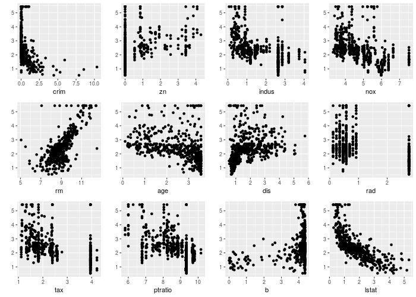
```

##### Average data point explanation
- experiment: average data point explanation resampled 100 times
- weight average and standard deviation of each feature

```{r, eval = TRUE, echo = FALSE, fig.align = 'center', fig.cap = "Weight coefficients of LIME applied to the mean data point with errorbars indicating the standard deviation across repeated runs"}

```

```{r, eval = TRUE, echo = FALSE, fig.align = 'center', fig.cap = "All weights scaled to 1.0 -- the standard deviation is highly varying to the weight size"}
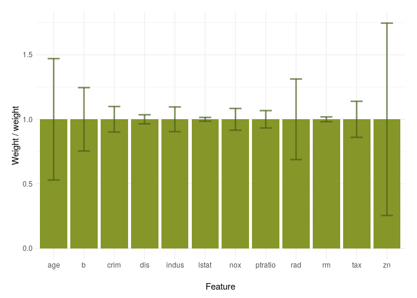
```

###### comparing results with outlying data point
- same experiment settings

```{r, eval = TRUE, echo = FALSE, fig.align = 'center', fig.cap = "LIME weights of an extreme outlying data point"}
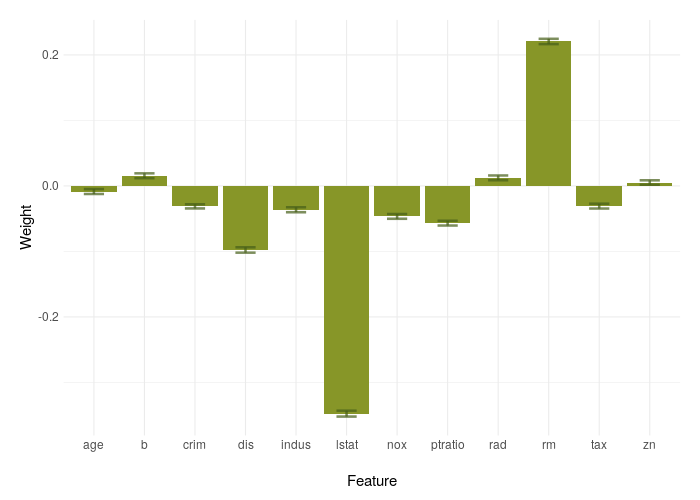
```

```{r, eval = TRUE, echo = FALSE, fig.align = 'center', fig.cap = "Same weights as previous figure, but scaled to 1.0 -- standard deviation is extremely varying"}
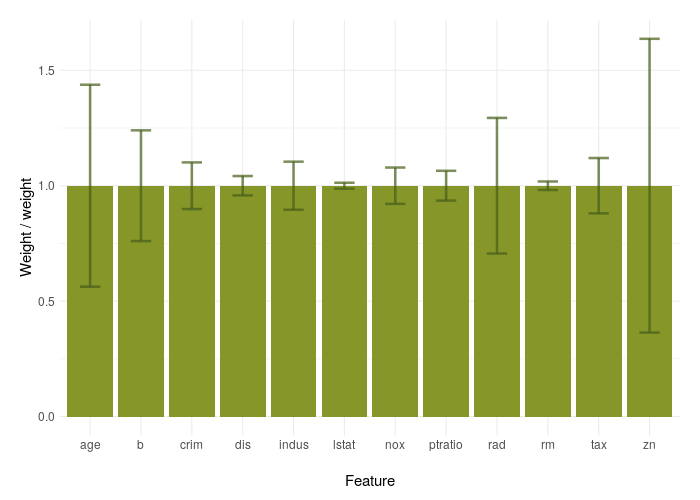
```

##### using binning (default) option as sampling strategy
- same other settings as before (average data point vs outlying data point)

```{r, eval = TRUE, echo = FALSE, fig.align = 'center', fig.cap = "LIME weights of mean data point with binning as sampling strategy -- standard deviation highly increased compared to previous results"}
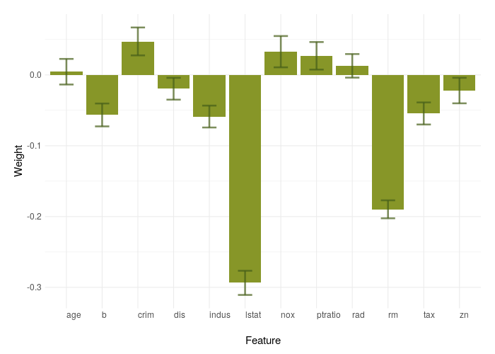
```

```{r, eval = TRUE, echo = FALSE, fig.align = 'center', fig.cap = "Same weights, but rescaled to 1.0 -- differing and partly extremely high standard deviation raising questions about outcome validity"}
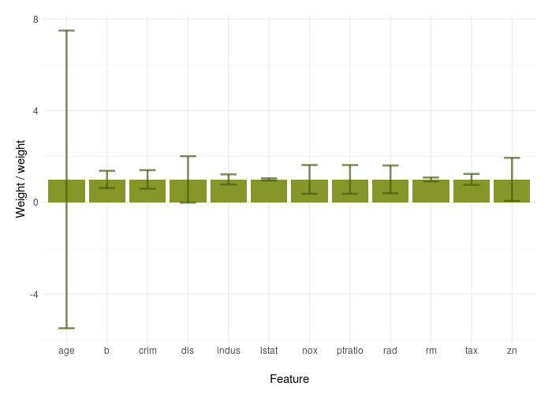
```

###### vs outlyer

```{r, eval = TRUE, echo = FALSE, fig.align = 'center', fig.cap = "LIME weights of outlying data point -- different weight sizes as before, but the standard deviation is not clearly different"}
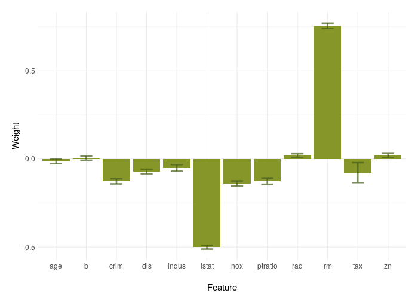
```

```{r, eval = TRUE, echo = FALSE, fig.align = 'center', fig.cap = "Same LIME weights, but scaled to 1.0 -- coefficient standard deviation of the almost-zero weight dominating the rest"}
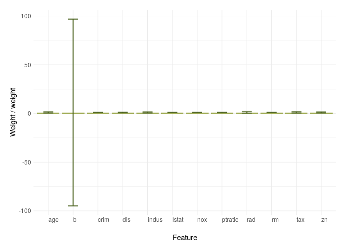
```

- binning is pretty bad

##### using a globally linear black box model (sanity check)
- expected: very stable results and same results for average and outlying data point
- same experiment settings as before


```{r, eval = TRUE, echo = FALSE, fig.align = 'center', fig.cap = "LIME weights of the mean data point applied on a linar model as black box model"}

```

```{r, eval = TRUE, echo = FALSE, fig.align = 'center', fig.cap = "Same LIME weights, but rescaled -- standard deviation is neglectably small as expected"}
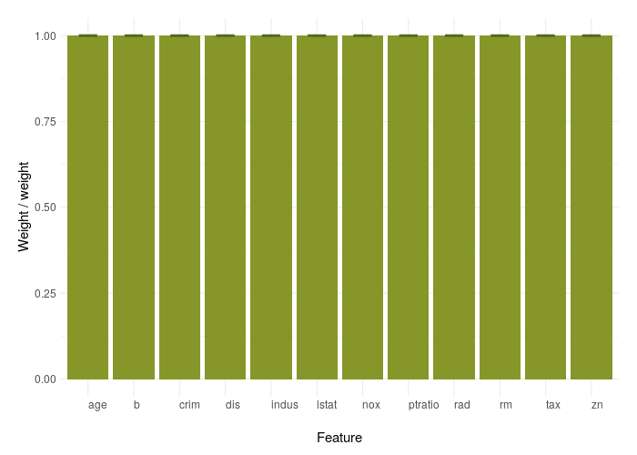
```

###### vs outlyer

```{r, eval = TRUE, echo = FALSE, fig.align = 'center', fig.cap = "Same linear model as before, but with the LIME weights of an outlying data point"}
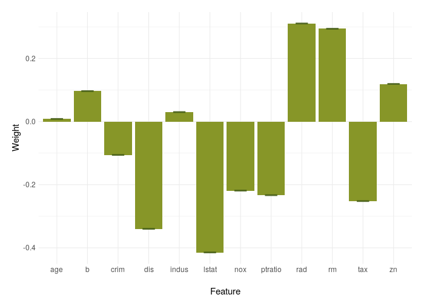
```

```{r, eval = TRUE, echo = FALSE, fig.align = 'center', fig.cap = "Same LIME weights, but rescaled -- standard deviation still neglectably small, but visually clearly higher as in the case of the mean data point"}

```

##### vs binning

```{r, eval = TRUE, echo = FALSE, fig.align = 'center', fig.cap = "Weights of the mean data point with a linear model as black box and binning as sampling strategy"}
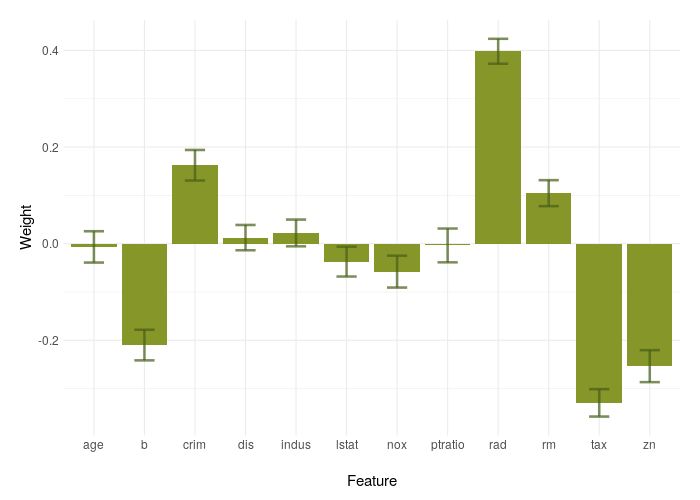
```

```{r, eval = TRUE, echo = FALSE, fig.align = 'center', fig.cap = "Same weights rescaled -- noticably higher standard deviation making results very questionable"}
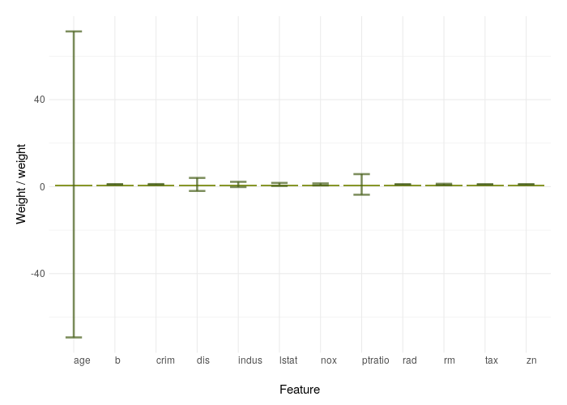
```

###### vs binning with outlyer

```{r, eval = TRUE, echo = FALSE, fig.align = 'center', fig.cap = "Same settings but with outlying data point for weights -- weight size notably different to the case of the mean point"}
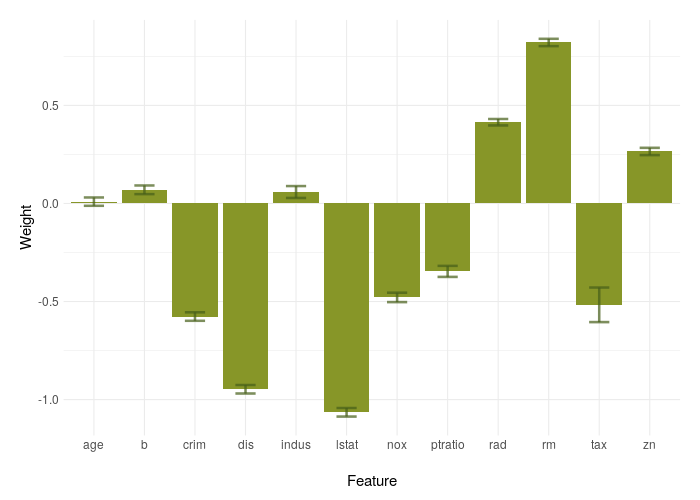
```

```{r, eval = TRUE, echo = FALSE, fig.align = 'center', fig.cap = "Same weights rescaled -- standard deviation surprisingly smaller than in the mean data point case"}
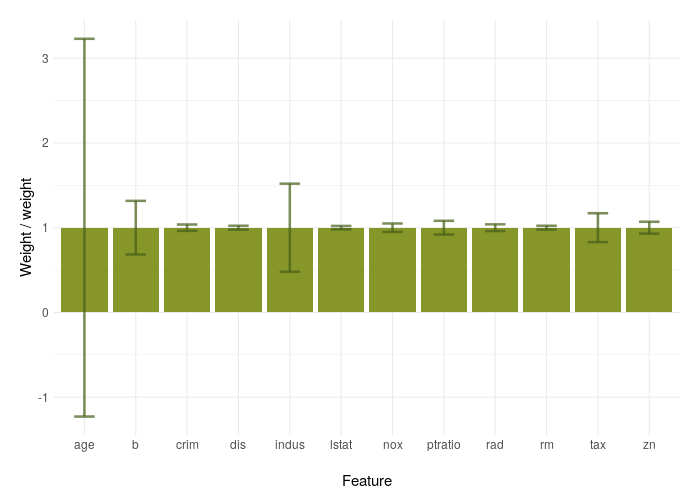
```


#### Influence of feature dimension
- Is Curse of dimensionality real?
- how is the general trend over amount of feature dimensions in the train data set?
- experiment design: 10 random data points explained 100 times under different feature dimension
- results of experiment in terms of stability (= standard deviation) averaged
- plots of feature dimension vs stability and amount of selected features vs stability in the following

```{r, eval = FALSE, echo = FALSE, fig.align = 'center', fig.cap = "LIME output", warning=FALSE}
#################################
# AMOUNT OF FEATURES VS STABILITY
#################################

library(mlbench)
library(mlr)
#library(dplyr)
library(lime)
library(ggplot2)


#' @description function used in this chunk for general stability measurement in dependence
#' of feature dimensions and amount of selected features (n_features parameter)
#' @return dataframe of feature weights
#' @example result = feature_growth(iris, "Species", dim_increment = 1)
feature_growth <- function(
  data,
  target,
  pts_to_predict,
  type,
  repeats = 10L,
  dim_increment = 10L
  ) {
  
  # dimension of feature space
  p_max = ncol(data) - 1L
  feature_names = names(data[names(data) != target])

  # move target variable to the end
  data_sort           = data[names(data) != target]
  data_sort[[target]] = data[[target]]
  
  # remove the target variable from points for interpretation
  pts_to_predict = pts_to_predict[names(pts_to_predict) != target]

  # iterate over amount of feature dimensions
  outer_return = lapply(
    seq(2L, p_max, by = dim_increment),
    function(p) {
      
      # define train data based on iterated dimension
      train_data           = data_sort[, 1L:p]
      train_data[[target]] = data_sort[[target]]
      
      # define task and learner based on data type
      if (type == "classif") {
        task = makeClassifTask(data = train_data, target = target)
        learner = makeLearner("classif.randomForest", ntree = 20L, predict.type = "prob")
        
      } else if (type == "regr") {
        task = makeRegrTask(data = train_data, target = target)
        learner = makeLearner("regr.randomForest", ntree = 20L)
        
      } else {
        stop("Wrong type, buddy")
      }
      
      black_box = train(learner, task)
      explainer = lime(train_data[1L:p], black_box, bin_continuous = FALSE, use_density = FALSE)
      
      # create sequence of "n_feature" arguments
      n_feat_seq = seq(1L, p, by = dim_increment)
      n_feat_seq = rep(n_feat_seq, each = repeats)
      
      # iterate over sequence of "n_feature" arguments
      inner_return = lapply(
        n_feat_seq,
        function(n_features) {
          
          feat_return        = rep(NA, p_max)
          names(feat_return) = feature_names
          
          # iterate over all points for interpretation
          inner_inner = apply(
            pts_to_predict,
            MARGIN = 1,
            function(target_pt) {
              
              explanation = explain(
                as.data.frame(t(target_pt[1:p])),
                explainer,
                n_labels = 1L,
                n_features = n_features,
                dist_fun = "euclidian",
                kernel_width = 100
              )
              
              to_update = names(feat_return) %in% explanation$feature
              feat_return[to_update] = explanation$feature_weight
              names(target_pt) = paste0("data_", feature_names)
              
              c(
                p = p,
                n_features = n_features,
                target_pt,
                feat_return
              )
            }
          )
          # transform from matrix to dataframe
          as.data.frame(t(inner_inner))
        }
      )

      # output progress
      log = sprintf("%2.2f/1.00 done", (p-1)/(p_max-1))
      print(log)
      # concatenate dataframes
      data.table::rbindlist(inner_return)
    }
  )
  # concatenate dataframes
  data.table::rbindlist(outer_return)
}


data("BostonHousing", package = "mlbench")
# removing categorical feature
boston     = BostonHousing[, -4]
# normalizing standard deviation to make coefficients comparable
boston     = as.data.frame(lapply(boston, function(x) x/sd(x)))
# forgot seed, pls dont kill me
set.seed(123)
pts_to_predict = boston[sample(10, 1:nrow(boston)), -ncol(boston)]

# this may take a while
results = feature_growth(boston, "medv", pts_to_predict, type = "regr", dim_increment = 1L, repeats = 100)
saveRDS(results, "feature_growth_boston_repeats100")

results_gr = dplyr::group_by(
  results,
  #data_crim, data_zn, data_indus, data_nox, data_rm, data_age, data_dis, data_rad, data_tax, data_ptratio, data_b, data_lstat,
  #n_features,
  p
)

results_sd = as.data.frame(dplyr::summarize(
  results_gr,
  sd_crim  = sd(crim, na.rm = TRUE),
  sd_zn    = sd(zn, na.rm = TRUE),
  sd_indus = sd(indus, na.rm = TRUE),
  sd_nox   = sd(nox, na.rm = TRUE),
  sd_rm    = sd(rm, na.rm = TRUE),
  sd_age   = sd(age, na.rm = TRUE),
  sd_dis   = sd(dis, na.rm = TRUE),
  sd_rad   = sd(rad, na.rm = TRUE),
  sd_tax   = sd(tax, na.rm = TRUE),
  sd_ptratio = sd(ptratio, na.rm = TRUE),
  sd_b     = sd(b, na.rm = TRUE),
  sd_lstat = sd(lstat, na.rm = TRUE)#,
  # pr means pick ratio - the frequency of non NAs
  #pr_crim  = sum(!is.na(crim))/10,
  #pr_zn    = sum(!is.na(zn))/10,
  #pr_indus = sum(!is.na(indus))/10,
  #pr_nox   = sum(!is.na(nox))/10,
  #pr_rm    = sum(!is.na(rm))/10,
  #pr_age   = sum(!is.na(age))/10,
  #pr_dis   = sum(!is.na(dis))/10,
  #pr_rad   = sum(!is.na(rad))/10,
  #pr_tax   = sum(!is.na(tax))/10,
  #pr_ptratio = sum(!is.na(ptratio))/10,
  #pr_b     = sum(!is.na(b))/10,
  #pr_lstat = sum(!is.na(lstat))/10
))

plot_data = data.frame(sd = apply(results_sd[-1], MARGIN = 1, function(row) mean(row[!is.nan(row)])))
plot_data$p = results_sd$p

plot = ggplot(plot_data, aes(y = sd, x = p)) +
  geom_line() +
  theme_minimal() +
  theme(
    text = element_text(size = 15),
    axis.title.x = element_text(vjust = -4),
    axis.text.x = element_text(angle = 45, hjust = 1),
    plot.margin = ggplot2::margin(20,20,30,20),
    axis.ticks.x = element_blank()
  ) +
  ylab("Average Standard Deviation") +
  xlab("Added feature") +
  scale_x_continuous(
    breaks = 1:12,
    labels = names(boston[-13])
  )

filename = paste0("images/sd_p.png")
png(filename, width = 700, height = 500)
plot
dev.off()

####################
### plotting n_features

results_12 = results[results$p == 12, ]
results_gr = dplyr::group_by(
  results_12,
  #data_crim, data_zn, data_indus, data_nox, data_rm, data_age, data_dis, data_rad, data_tax, data_ptratio, data_b, data_lstat,
  n_features#,
  #p
)

results_sd = as.data.frame(dplyr::summarize(
  results_gr,
  sd_crim  = sd(crim, na.rm = TRUE),
  sd_zn    = sd(zn, na.rm = TRUE),
  sd_indus = sd(indus, na.rm = TRUE),
  sd_nox   = sd(nox, na.rm = TRUE),
  sd_rm    = sd(rm, na.rm = TRUE),
  sd_age   = sd(age, na.rm = TRUE),
  sd_dis   = sd(dis, na.rm = TRUE),
  sd_rad   = sd(rad, na.rm = TRUE),
  sd_tax   = sd(tax, na.rm = TRUE),
  sd_ptratio = sd(ptratio, na.rm = TRUE),
  sd_b     = sd(b, na.rm = TRUE),
  sd_lstat = sd(lstat, na.rm = TRUE)#,
  # pr means pick ratio - the frequency of non NAs
  #pr_crim  = sum(!is.na(crim))/10,
  #pr_zn    = sum(!is.na(zn))/10,
  #pr_indus = sum(!is.na(indus))/10,
  #pr_nox   = sum(!is.na(nox))/10,
  #pr_rm    = sum(!is.na(rm))/10,
  #pr_age   = sum(!is.na(age))/10,
  #pr_dis   = sum(!is.na(dis))/10,
  #pr_rad   = sum(!is.na(rad))/10,
  #pr_tax   = sum(!is.na(tax))/10,
  #pr_ptratio = sum(!is.na(ptratio))/10,
  #pr_b     = sum(!is.na(b))/10,
  #pr_lstat = sum(!is.na(lstat))/10
))

plot_data = data.frame(sd = apply(results_sd[-1], MARGIN = 1, function(row) mean(row[!is.nan(row) & !is.na(row)])))
plot_data$n_features = results_sd$n_features

plot = ggplot(plot_data, aes(y = sd, x = n_features)) +
  geom_line() +
  theme_minimal() +
  theme(
    text = element_text(size = 15),
    axis.title.x = element_text(vjust = -4),
    axis.text.x = element_text(angle = 45, hjust = 1),
    plot.margin = ggplot2::margin(20,20,30,20),
    axis.ticks.x = element_blank()
  ) +
  ylab("Average Standard Deviation") +
  xlab("Amount selected features") +
  scale_x_continuous(
    breaks = 1:12,
    labels = 1:12
  )

filename = paste0("images/sd_nfeat.png")
png(filename, width = 700, height = 500)
plot
dev.off()

```

```{r, eval = TRUE, echo = FALSE, fig.align = 'center', fig.cap = "Average standard deviation of 10 randomly sampled points for explanation repeated 100 times. Each feature is sequentially added with a new black box model being calculated each time. Increased feature amount has no monotonous effect on coefficient stability. Curse of dimensionality is not applying in this case."}
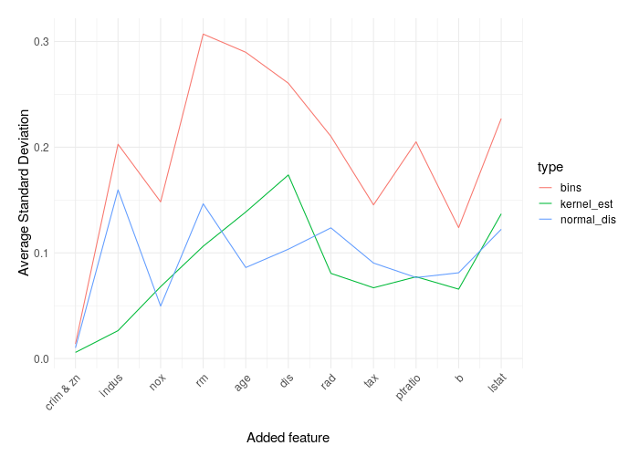
```

- no tendency found
- may depend on learned interactions of the black box model, but not on the actual train data

```{r, eval = TRUE, echo = FALSE, fig.align = 'center', fig.cap = "Average standard deviation with the same settings as before but with full feature size. The x-axis plots the amount of features selected for the explainer. As can be seen, the weight stability is remarkably constant for low amount of features and suddenly becomes very jumpy for higher amount of selected feature. If the experiment was only evaluated for small amounts of selected features, a clear recommendation of sticking to less explained features could be given, but unfortunately no real rule of thumb can be suggested in this case. The shape of the graph may result due to globally linear predictions for the lesser important features -- assuming the features are picked by weight size."}

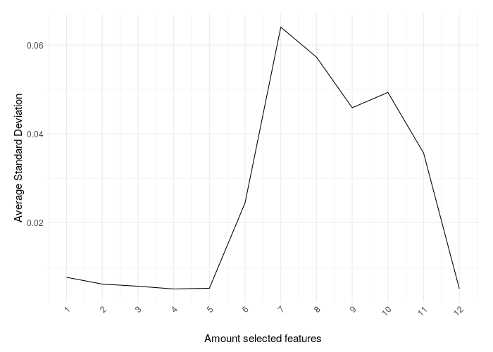

```

- tendency of less weights selected being better, but no clear tendency for higher amounts
- no curse of dimensionality visible


#### Does the amount of chosen samples influence stability?
- how does increased denseness in the feature space (by increasing sample size) increase stability of the surrogate model?
- experiment design: 10 randomly picked datapoints explained 100 times iterated over amount of permutations/size of sample
- again standard deviation of all weights calculated and averaged

```{r, eval = FALSE, echo = FALSE, fig.align = 'center', fig.cap = "LIME output", warning=FALSE}
#################################
# AMOUNT OF SAMPLES/PERMUTATIONS VS STABILITY
#################################

library(mlbench)
library(mlr)
#library(dplyr)
library(lime)
library(ggplot2)


permutation_growth = function(
  data,
  target,
  pts_to_predict,
  type,
  repeats = 10L,
  permutation_seq = c(2500L, 5000L, 10000L),
  dim_increment = 10L
  ) {
  
  # dimension of feature space
  p_max = ncol(data) - 1L
  feature_names = names(data[names(data) != target])
  
  # create sequence of "n_feature" arguments
  n_feat_seq = seq(1L, p_max, by = dim_increment)
  n_feat_seq = rep(n_feat_seq, each = repeats)
  
  # move target variable to the end
  train_data           = data[names(data) != target]
  train_data[[target]] = data[[target]]
  
  # define task and learner based on data type
  if (type == "classif") {
    task = makeClassifTask(data = train_data, target = target)
    learner = makeLearner("classif.randomForest", ntree = 20L, predict.type = "prob")
    
  } else if (type == "regr") {
    task = makeRegrTask(data = train_data, target = target)
    learner = makeLearner("regr.randomForest", ntree = 20L)
    
  } else {
    stop("Wrong type, buddy")
  }
  
  black_box = train(learner, task)
  explainer = lime(train_data[1L:p_max], black_box, bin_continuous = FALSE, use_density = FALSE)
  
  
  # iterate over sequence of permutation amount
  outer_return = lapply(
    permutation_seq,
    function(n_permutations) {
      
      # iterate over sequence of "n_feature" arguments
      inner_return = lapply(
        n_feat_seq,
        function(n_features) {
          
          feat_return        = rep(NA, p_max)
          names(feat_return) = feature_names
          
          # iterate over all points for interpretation
          inner_inner = apply(
            pts_to_predict,
            MARGIN = 1,
            function(target_pt) {
              
              explanation = explain(
                as.data.frame(t(target_pt[1:p_max])),
                explainer,
                n_labels = 1L,
                n_features = p_max,
                n_permutations = n_permutations,
                dist_fun = "euclidian"
              )
              
              to_update = names(feat_return) %in% explanation$feature
              feat_return[to_update] = explanation$feature_weight
              names(target_pt) = paste0("data_", feature_names)
              
              c(
                n_features = n_features,
                n_permutations = n_permutations,
                target_pt,
                feat_return
              )
            }
          )
          # transform from matrix to dataframe
          as.data.frame(t(inner_inner))
        }
      )
      # output progress
      frac = which(n_permutations == permutation_seq) / length(permutation_seq)
      log = sprintf("%2.2f/1.00 done", frac)
      print(log)
      # transpose matrix and transform to dataframe
      data.table::rbindlist(inner_return)
    }
  )
  # concatenate dataframes
  data.table::rbindlist(outer_return)
}

data("BostonHousing", package = "mlbench")
# removing categorical feature
boston     = BostonHousing[, -4]
# normalizing standard deviation to make coefficients comparable
boston     = as.data.frame(lapply(boston, function(x) x/sd(x)))
set.seed(123)
pts_to_predict = boston[sample(10, 1:nrow(boston)), -ncol(boston)]

# this may take a while
results = permutation_growth(boston, "medv", pts_to_predict, type = "regr", dim_increment = 1L, repeats = 100, permutation_seq = c(250, 500, 1000, 2000, 4000, 8000))
saveRDS(results, "permutation_growth_boston_repeats100_perm250x500x1000x2000x4000x8000")

results_gr = dplyr::group_by(
  results,
  #data_crim, data_zn, data_indus, data_nox, data_rm, data_age, data_dis, data_rad, data_tax, data_ptratio, data_b, data_lstat,
  #n_features,
  n_permutations
)

results_sd = as.data.frame(dplyr::summarize(
  results_gr,
  sd_crim  = sd(crim, na.rm = TRUE),
  sd_zn    = sd(zn, na.rm = TRUE),
  sd_indus = sd(indus, na.rm = TRUE),
  sd_nox   = sd(nox, na.rm = TRUE),
  sd_rm    = sd(rm, na.rm = TRUE),
  sd_age   = sd(age, na.rm = TRUE),
  sd_dis   = sd(dis, na.rm = TRUE),
  sd_rad   = sd(rad, na.rm = TRUE),
  sd_tax   = sd(tax, na.rm = TRUE),
  sd_ptratio = sd(ptratio, na.rm = TRUE),
  sd_b     = sd(b, na.rm = TRUE),
  sd_lstat = sd(lstat, na.rm = TRUE)#,
  # pr means pick ratio - the frequency of non NAs
  #pr_crim  = sum(!is.na(crim))/10,
  #pr_zn    = sum(!is.na(zn))/10,
  #pr_indus = sum(!is.na(indus))/10,
  #pr_nox   = sum(!is.na(nox))/10,
  #pr_rm    = sum(!is.na(rm))/10,
  #pr_age   = sum(!is.na(age))/10,
  #pr_dis   = sum(!is.na(dis))/10,
  #pr_rad   = sum(!is.na(rad))/10,
  #pr_tax   = sum(!is.na(tax))/10,
  #pr_ptratio = sum(!is.na(ptratio))/10,
  #pr_b     = sum(!is.na(b))/10,
  #pr_lstat = sum(!is.na(lstat))/10
))

plot_data = data.frame(sd = apply(results_sd[-1], MARGIN = 1, function(row) mean(row[!is.nan(row)])))
plot_data$n_permutations = results_sd$n_permutations

plot = ggplot(plot_data, aes(y = sd, x = n_permutations)) +
  geom_line() +
  theme_minimal() +
  theme(
    text = element_text(size = 15),
    axis.title.x = element_text(vjust = -4),
    axis.text.x = element_text(angle = 45, hjust = 1),
    plot.margin = ggplot2::margin(20,20,30,20)#,
    #axis.ticks.x = element_blank()
  ) +
  ylab("Average Standard Deviation") +
  xlab("Sample size")# +
#  scale_x_continuous(
#    breaks = 1:12,
#    labels = names(boston[-13])
#  )

filename = paste0("images/sd_npermutations.png")
png(filename, width = 700, height = 500)
plot
dev.off()

```

```{r, eval = TRUE, echo = FALSE, fig.align = 'center', fig.cap = "Average standard deviation under the same settings as before. A clear trend can be seen here: Increasing the amount of samples acting as train data for our surrogate model has incredible influence on weight stability."}
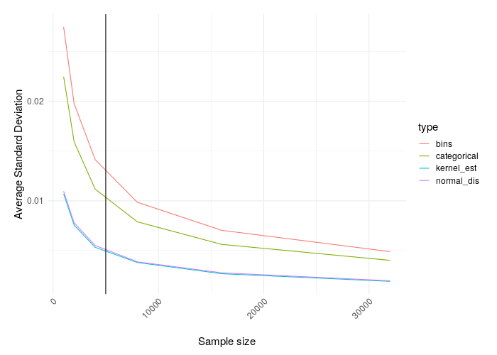
```

- clear and monotonous trend of more permutations giving better stability
- feature dimension unrelated to weight stability, but sample size highly related - does this make sense?
- moving focus from train data to black box model


#### Demonstrating LIME in combination with overfitting

- demonstrating by 2D simulation
- sampled boston housing data: medv ~ lstat
- decision tree with node size = 1 (overfitting + non-smoothness)
- random forest with more trees and higher node size still non-continuous, but less overfitting

```{r, eval = FALSE, echo = FALSE, fig.align = 'center', fig.cap = "Random forest with 'node size = 1' and 'trees = 1'", warning=FALSE}

### EVALUATE THIS CELL TO MAKE FUNCTIONS BELOW WORK

library(mlbench)
library(mlr)

data(BostonHousing)
set.seed(5)
boston = BostonHousing[sample(nrow(BostonHousing), 20), ]

# create task and leaner
btask      = makeRegrTask(data = boston[c("lstat", "medv")], target = "medv")
regr_model = makeLearner("regr.ranger", min.node.size = 1, num.trees = 1)
# run model and get prediction surface
black_box  = train(regr_model, btask)
x_grid     = 1:4000 / 100
y_pred     = predict(black_box, newdata = data.frame(lstat=x_grid))

# visualize results
plot = ggplot() +
  geom_line(
    data = data.frame(x_grid, y_pred=y_pred$data$response),
    aes(x = x_grid, y = y_pred),
    color = "#00C5CD",
    size  = 1.5
  ) +
  geom_point(data = boston, aes(y = medv, x = lstat)) +
  ylim(c(0, 50)) +
  theme_minimal() +
  theme(
    text = element_text(size = 15),
    axis.title.x = element_text(vjust = -4),
    plot.margin = ggplot2::margin(20,20,30,20)
  ) +
  ylab("target (medv)") +
  xlab("feature (lstat)")

filename = paste0("images/boston_sampled_tree.png")
png(filename, width = 700, height = 500)
plot
dev.off()
```

```{r, eval = TRUE, echo = FALSE, fig.align = 'center', fig.cap = "Non-smooth and non-continuous overfit of a decision tree on the feature 'lstat' of the boston housing dataset -- this will be used as black box model in the following"}
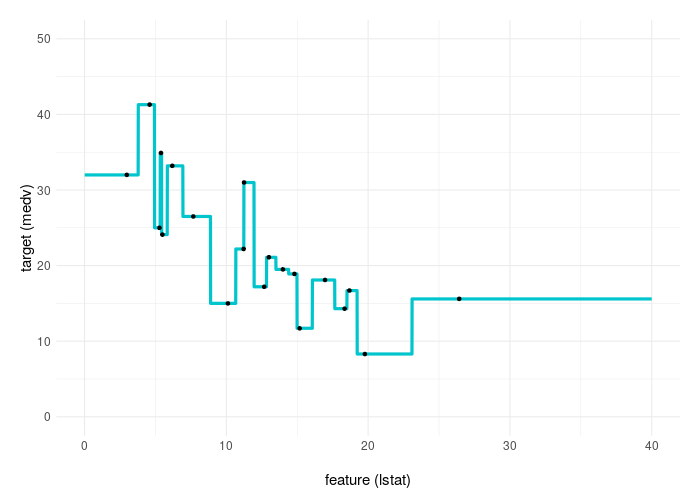
```


```{r, eval = FALSE, echo = FALSE, fig.align = 'center', fig.cap = "LIME output", warning=FALSE}

# EVALUATE ABOVE CELL FIRST
plot_lime_boston = function(model_smoothness = 50, sample_seed, kernel_width = 25, sample_size = 10) {
  
  # create grid
  x_grid     = 1:4000 / 100
  y_grid     = predict(black_box, newdata = data.frame(lstat=x_grid))

  set.seed(1)
  # randomly pick data point to explain
  x_ex = runif(1, 1, 40)
  yret = predict(black_box, newdata = data.frame(lstat = x_ex))
  y_ex = yret$data$response
  
  set.seed(sample_seed)
  # sample new data points
  x_samp = runif(sample_size, 1, 40)
  y_samp = predict(black_box, newdata = data.frame(lstat = x_samp))
  data   = data.frame(x = x_samp, y = y_samp$data$response)
  
  # apply gaussian kernel to receive weights
  weights = exp( - (x_samp - x_ex)^2 / kernel_width )
  
  # fit surrogate model and get predictions
  model  = lm(y ~ x, data = data, weights = weights)
  y_pred = predict(model, newdata = data.frame(x = x_grid))
  
  # visualize everything
  ggplot(data = NULL, aes(x = x_grid, y = y_grid$data$response)) +
    geom_line(color = "#00C5CD", size = 1.5) +
    geom_point(data = data, aes(x = x, y = y)) +
    geom_line( data = NULL, aes(x = x_grid, y = y_pred), color = "#e04d2e", size = 1) +
    geom_point(data = NULL, aes(x = x_ex,   y = y_ex  ), color = "#c1c10d", size = 3) +
    geom_vline(aes(xintercept = x_ex - sqrt(kernel_width))) +
    geom_vline(aes(xintercept = x_ex + sqrt(kernel_width))) +
    theme_minimal() +
    theme(
      text = element_text(size = 15),
      axis.title.x = element_text(vjust = -4),
      plot.margin = ggplot2::margin(20,20,30,20)
    ) +
    ylim(c(0, 50)) +
    ylab("target") +
    xlab("feature")

}

```

```{r, eval = FALSE, echo = FALSE, fig.align = 'center', fig.cap = "LIME output", warning=FALSE}

filename = paste0("images/boston_sampled_tree_fst.png")
png(filename, width = 700, height = 500)
plot_lime_boston(sample_seed = 1, kernel_width = 1)
dev.off()
  
```

```{r, eval = TRUE, echo = FALSE, fig.align = 'center', fig.cap = "Uniform sampling strategy -- black dots are sampled data points, red line is the LIME explanation, yellow dot the explained data point and the horizontal lines the square root of the kernel width, approximating size of neighborhood"}
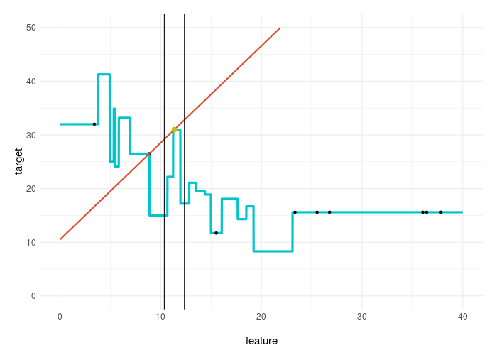
```

```{r, eval = FALSE, echo = FALSE, fig.align = 'center', fig.cap = "LIME output", warning=FALSE}

filename = paste0("images/boston_sampled_tree_snd.png")
png(filename, width = 700, height = 500)
plot_lime_boston(sample_seed = 2, kernel_width = 1)
dev.off()
  
```

```{r, eval = TRUE, echo = FALSE, fig.align = 'center', fig.cap = "Exact same settings, but simple rerun of the sampling leading to catastrophic differences due to missing anchor points in the neighborhood"}
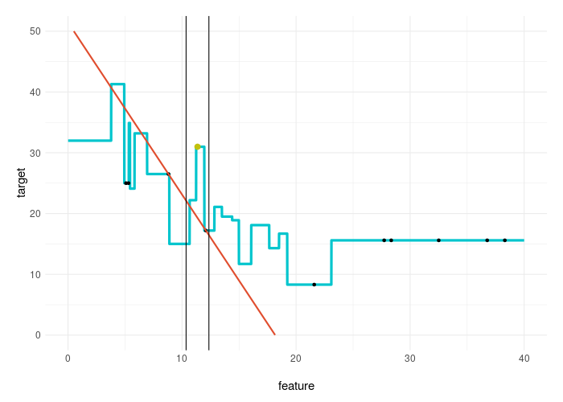
```

- giving raise to further investigations

##### Numerical features with overfitting model

- using decision tree with minimum node size of 1 as black box model
- expected: worse stability compared to smoother models (random forest and linear model)
- same experiment settings as before (100 iterations; no binning)
- average data point:

```{r, eval = TRUE, echo = FALSE, fig.align = 'center', fig.cap = "Weights of the mean data point with an overfitting decision tree as black box model"}
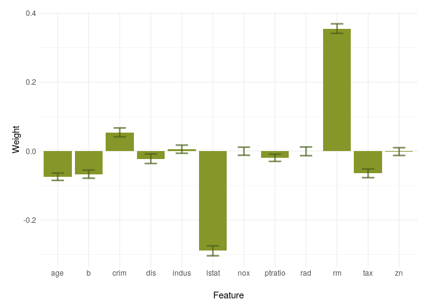
```

```{r, eval = TRUE, echo = FALSE, fig.align = 'center', fig.cap = "Same weights rescaled -- standard deviation is for smaller weights high enough to make these untrustworthy"}
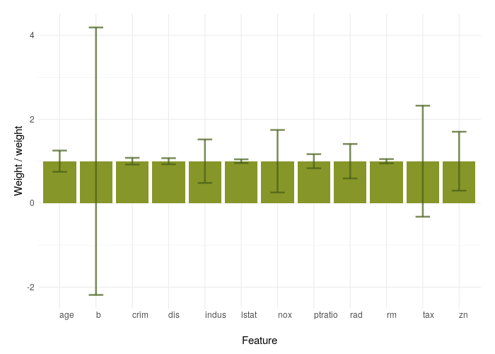
```

###### vs outlying data point:

```{r, eval = TRUE, echo = FALSE, fig.align = 'center', fig.cap = "Weights of an outlying data point with the same tree -- weights differ strongly compared to the mean data point"}
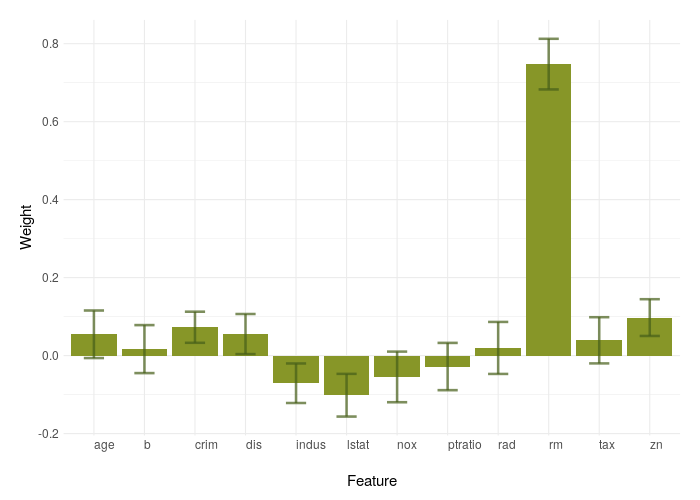
```

```{r, eval = TRUE, echo = FALSE, fig.align = 'center', fig.cap = "Same weights rescaled -- too much standard deviation making every result untrustworthy except feature 'rm'"}
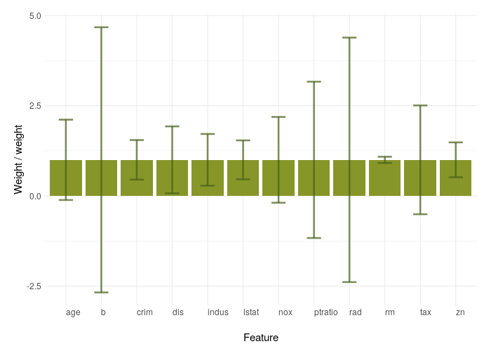
```

- highly increased weight instability
- giving raise to more general experiment


#### How does the black box model smoothness influence weight stability?
- 2D simulation suggests more overfitting and less smoothness of the prediction surface influences weight stability
- interim explanation: random forest hyperparameters tree amount and minimum node size
- higher tree amount giving prediction surface more smoothness (by reducing average step size of each step in the prediction function)
- higher minimum node size reducing overfitting (by making predictions dependent on more train data points)
- experiment: 10 randomly picked data points explained 100 times, iterated over random forest with different hyperparameter settings (each iteration more trees are added and minimum node size increased, leading to less overfitting and more smoothness)
- results again used to get average standard deviation (= average weight stability)

```{r, eval = FALSE, echo = FALSE, fig.align = 'center', fig.cap = "LIME output", warning=FALSE}
#################################
# BLACK BOX COMPLEXITY/SMOOTHNESS VS STABILITY
#################################

library(mlbench)
library(mlr)
#library(dplyr)
library(lime)
library(ggplot2)


complexity_growth = function(
  data,
  target,
  pts_to_predict,
  type,
  repeats = 10L,
  max_degree = 10
) {
  

  # dimension of feature space
  p_max = ncol(data) - 1L
  feature_names = names(data[names(data) != target])
  
  # move target variable to the end
  train_data           = data[names(data) != target]
  train_data[[target]] = data[[target]]

  degree_seq = rep(1:max_degree, each = repeats)
  # iterate over sequence of polynomial degrees
  outer_return = lapply(
    degree_seq,
    function(degree) {

      # make model smoother with each iteration
      num.trees = 1L + (degree - 1L) * 10L
      # less overfitting
      min.node.size = degree
      
      # define task and learner based on data type
      if (type == "classif") {
        task = makeClassifTask(data = train_data, target = target)
        learner = makeLearner("classif.ranger", num.trees = num.trees, min.node.size = min.node.size, predict.type = "prob")
        
      } else if (type == "regr") {
        task = makeRegrTask(data = train_data, target = target)
        learner = makeLearner("regr.ranger", num.trees = num.trees, min.node.size = min.node.size)
        
      } else {
        stop("Wrong type, buddy")
      }
      
      black_box = train(learner, task)
      explainer = lime(train_data[1L:p_max], black_box, bin_continuous = FALSE, use_density = FALSE)
      
      inner_return = apply(
        pts_to_predict,
        MARGIN = 1,
        function(target_pt) {
          
          feat_return        = rep(NA, p_max)
          names(feat_return) = feature_names
          
          explanation = explain(
            as.data.frame(t(target_pt[1:p_max])),
            explainer,
            n_labels = 1L,
            n_features = p_max,
            dist_fun = "euclidian"
          )
          
          to_update = names(feat_return) %in% explanation$feature
          feat_return[to_update] = explanation$feature_weight
          names(target_pt) = paste0("data_", feature_names)
          
          c(
            smoothness = degree,
            target_pt,
            feat_return
          )
        }
      )
      # output progress
      frac = degree / max_degree
      log = sprintf("%2.2f/1.00 done", frac)
      print(log)
      # transpose matrix and transform to dataframe
      as.data.frame(t(inner_return))
    }
  )
  # concatenate dataframes
  data.table::rbindlist(outer_return)
}

data("BostonHousing", package = "mlbench")
# removing categorical feature
boston     = BostonHousing[, -4]
# normalizing standard deviation to make coefficients comparable
boston     = as.data.frame(lapply(boston, function(x) x/sd(x)))
set.seed(123)
pts_to_predict = boston[sample(10, 1:nrow(boston)), -ncol(boston)]

# this may take a while
results = complexity_growth(boston, "medv", pts_to_predict, type = "regr", repeats = 100)
saveRDS(results, "complexity_growth_boston_100repeats")

results_gr = dplyr::group_by(
  results,
  #data_crim, data_zn, data_indus, data_nox, data_rm, data_age, data_dis, data_rad, data_tax, data_ptratio, data_b, data_lstat,
  #n_features,
  smoothness
)

results_sd = as.data.frame(dplyr::summarize(
  results_gr,
  sd_crim  = sd(crim, na.rm = TRUE),
  sd_zn    = sd(zn, na.rm = TRUE),
  sd_indus = sd(indus, na.rm = TRUE),
  sd_nox   = sd(nox, na.rm = TRUE),
  sd_rm    = sd(rm, na.rm = TRUE),
  sd_age   = sd(age, na.rm = TRUE),
  sd_dis   = sd(dis, na.rm = TRUE),
  sd_rad   = sd(rad, na.rm = TRUE),
  sd_tax   = sd(tax, na.rm = TRUE),
  sd_ptratio = sd(ptratio, na.rm = TRUE),
  sd_b     = sd(b, na.rm = TRUE),
  sd_lstat = sd(lstat, na.rm = TRUE)#,
  # pr means pick ratio - the frequency of non NAs
  #pr_crim  = sum(!is.na(crim))/10,
  #pr_zn    = sum(!is.na(zn))/10,
  #pr_indus = sum(!is.na(indus))/10,
  #pr_nox   = sum(!is.na(nox))/10,
  #pr_rm    = sum(!is.na(rm))/10,
  #pr_age   = sum(!is.na(age))/10,
  #pr_dis   = sum(!is.na(dis))/10,
  #pr_rad   = sum(!is.na(rad))/10,
  #pr_tax   = sum(!is.na(tax))/10,
  #pr_ptratio = sum(!is.na(ptratio))/10,
  #pr_b     = sum(!is.na(b))/10,
  #pr_lstat = sum(!is.na(lstat))/10
))

plot_data = data.frame(sd = apply(results_sd[-1], MARGIN = 1, function(row) mean(row[!is.nan(row)])))
plot_data$smoothness = results_sd$smoothness

plot = ggplot(plot_data, aes(y = sd, x = smoothness)) +
  geom_line() +
  theme_minimal() +
  theme(
    text = element_text(size = 15),
    axis.title.x = element_text(vjust = -4),
    axis.text.x = element_text(angle = 45, hjust = 1),
    plot.margin = ggplot2::margin(20,20,30,20)#,
    #axis.ticks.x = element_blank()
  ) +
  ylab("Average Standard Deviation") +
  xlab("Model smoothness") +
  scale_x_continuous(
    breaks = 1:10,
    labels = 1:10
  )

filename = paste0("images/sd_smoothness.png")
png(filename, width = 700, height = 500)
plot
dev.off()

```

```{r, eval = TRUE, echo = FALSE, fig.align = 'center', fig.cap = "Average standard deviation of the same settings as before but with black box model smoothness/complexity iterated over. As a base model a random forest with only one tree and minimum node size of one was used and each iteration the amount of trees was increased by 10 and the minimum node size by one. This means the last tick in this graph is corresponding to a random forest with 91 trees and minimum node size of 10. It's nicely shown how important the smoothness of the model is for the weight stability. Keep in mind the model was fitted on some training data, which means if we would pick more complex data, the line may take much longer to flatten out, and vice versa for less complex data."}
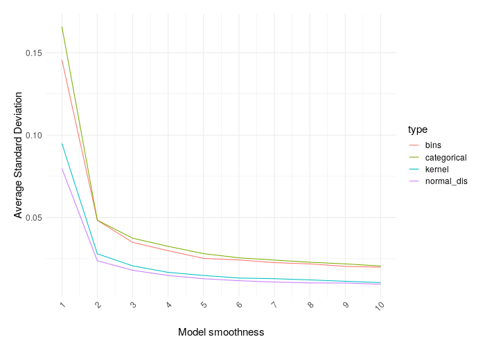
```

- big influence of the smoothness
- influence flattens quickly, but may be different for more complex data sets requiring more "overfitting" (=less smooth fitting)

### LIME with categorical data

- only numerical features so far
- using dataset with only categorical features now (rental bikes)
- forced gower distance (equal or not // every other distance not possible)
- do we get similar results as for numerical features?


```{r, eval = FALSE, echo = FALSE, fig.align = 'center', fig.cap = "LIME output", warning=FALSE}

library(ggplot2)
library(mlr)
library(lime)

bikes = read.csv("datasets/day.csv")
# remove undesired variables
bikes = bikes[-which(names(bikes) %in% c("casual", "registered", "instant", "dteday"))]

# quantile binning with 4 bins
bikes[c("temp", "atemp", "hum", "windspeed")] = lapply(
  bikes[c("temp", "atemp", "hum", "windspeed")],
  function(vec) {
    quantiles = quantile(vec)
    quantiles[5] = Inf
    sapply(vec, function(x) sum(x >= quantiles))
  }
)

bikes[-ncol(bikes)] = lapply(bikes[-ncol(bikes)], as.factor)

plots = lapply(names(bikes[-ncol(bikes)]), function(feat) qplot(get(feat), cnt, data = bikes, ylab = "", xlab = feat, geom = "boxplot"))
args = paste0("plots[[", 1:11, "]]", collapse = ", ")
grid_plot_func = paste0("gridExtra::grid.arrange(", args, ", nrow = 3)")

filename = paste0("images/bikes.png")
png(filename, width = 700, height = 500)
eval(parse(text = grid_plot_func))
dev.off()

btask      = makeRegrTask(data = bikes, target = "cnt")

# normal non-continuous model
regr_model = makeLearner("regr.ranger")
black_box  = train(regr_model, btask)
explainer  = lime(bikes[, -ncol(bikes)], black_box)

# pick majority of each feature as data point
data_point = as.data.frame(lapply(
  bikes[, -ncol(bikes)],
  function(vec) names(table(vec))[which.max(table(vec))]
))
# set index of datapoint to use
limes = sapply(1:100, function(k) {
  interim = explain(data_point, explainer, n_features = ncol(bikes)-1)
  weights_l = interim$feature_weight
  names(weights_l) = interim$feature
  weights_l
})


means = apply(limes, MARGIN = 1, mean)
sds   = apply(limes, MARGIN = 1, sd)


filename = paste0("images/bikes_standard.png")
png(filename, width = 700, height = 500)
nice_plot(means, sds, color1 = "#62b1e7", color2 = "#6274e7", angle = 45, hjust = 1)
dev.off()

means_scaled = means / means
sds_scaled   = sds / abs(means)

filename = paste0("images/bikes_scaled.png")
png(filename, width = 700, height = 500)
nice_plot(means_scaled, sds_scaled, ylab = "Weight / weight", color1 = "#62b1e7", color2 = "#6274e7", angle = 45, hjust = 1)
dev.off()


# pick minority of each feature as data point
data_point = as.data.frame(lapply(
  bikes[, -ncol(bikes)],
  function(vec) names(table(vec))[which.min(table(vec))]
))
# set index of datapoint to use
limes = sapply(1:100, function(k) {
  interim = explain(data_point, explainer, n_features = ncol(bikes)-1)
  weights_l = interim$feature_weight
  names(weights_l) = interim$feature
  weights_l
})


means = apply(limes, MARGIN = 1, mean)
sds   = apply(limes, MARGIN = 1, sd)


filename = paste0("images/bikes_outlier.png")
png(filename, width = 700, height = 500)
nice_plot(means, sds, color1 = "#62b1e7", color2 = "#6274e7", angle = 45, hjust = 1)
dev.off()

means_scaled = means / means
sds_scaled   = sds / abs(means)

filename = paste0("images/bikes_outlier_scaled.png")
png(filename, width = 700, height = 500)
nice_plot(means_scaled, sds_scaled, ylab = "Weight / weight", color1 = "#62b1e7", color2 = "#6274e7", angle = 45, hjust = 1)
dev.off()


# EASY MODEL
regr_model = makeLearner("regr.lm")
black_box  = train(regr_model, btask)
explainer  = lime(bikes[, -ncol(bikes)], black_box)

# pick majority of each feature as data point
data_point = as.data.frame(lapply(
  bikes[, -ncol(bikes)],
  function(vec) names(table(vec))[which.max(table(vec))]
))
# set index of datapoint to use
limes = sapply(1:100, function(k) {
  interim = explain(data_point, explainer, n_features = ncol(bikes)-1)
  weights_l = interim$feature_weight
  names(weights_l) = interim$feature
  weights_l
})


means = apply(limes, MARGIN = 1, mean)
sds   = apply(limes, MARGIN = 1, sd)


filename = paste0("images/bikes_lm.png")
png(filename, width = 700, height = 500)
nice_plot(means, sds, color1 = "#62b1e7", color2 = "#6274e7", angle = 45, hjust = 1)
dev.off()

means_scaled = means / means
sds_scaled   = sds / abs(means)

filename = paste0("images/bikes_lm_scaled.png")
png(filename, width = 700, height = 500)
nice_plot(means_scaled, sds_scaled, ylab = "Weight / weight", color1 = "#62b1e7", color2 = "#6274e7", angle = 45, hjust = 1)
dev.off()


# pick minority of each feature as data point
data_point = as.data.frame(lapply(
  bikes[, -ncol(bikes)],
  function(vec) names(table(vec))[which.min(table(vec))]
))
# set index of datapoint to use
limes = sapply(1:100, function(k) {
  interim = explain(data_point, explainer, n_features = ncol(bikes)-1)
  weights_l = interim$feature_weight
  names(weights_l) = interim$feature
  weights_l
})


means = apply(limes, MARGIN = 1, mean)
sds   = apply(limes, MARGIN = 1, sd)


filename = paste0("images/bikes_lm_outlier.png")
png(filename, width = 700, height = 500)
nice_plot(means, sds, color1 = "#62b1e7", color2 = "#6274e7", angle = 45, hjust = 1)
dev.off()

means_scaled = means / means
sds_scaled   = sds / abs(means)

filename = paste0("images/bikes_lm_outlier_scaled.png")
png(filename, width = 700, height = 500)
nice_plot(means_scaled, sds_scaled, ylab = "Weight / weight", color1 = "#62b1e7", color2 = "#6274e7", angle = 45, hjust = 1)
dev.off()

####

# OVERFITTING MODEL
regr_model = makeLearner("regr.ranger", num.trees = 1, min.node.size = 1)
black_box  = train(regr_model, btask)
explainer  = lime(bikes[, -ncol(bikes)], black_box)

# pick majority of each feature as data point
data_point = as.data.frame(lapply(
  bikes[, -ncol(bikes)],
  function(vec) names(table(vec))[which.max(table(vec))]
))
# set index of datapoint to use
limes = sapply(1:100, function(k) {
  interim = explain(data_point, explainer, n_features = ncol(bikes)-1)
  weights_l = interim$feature_weight
  names(weights_l) = interim$feature
  weights_l
})


means = apply(limes, MARGIN = 1, mean)
sds   = apply(limes, MARGIN = 1, sd)


filename = paste0("images/bikes_tree.png")
png(filename, width = 700, height = 500)
nice_plot(means, sds, color1 = "#62b1e7", color2 = "#6274e7", angle = 45, hjust = 1)
dev.off()

means_scaled = means / means
sds_scaled   = sds / abs(means)

filename = paste0("images/bikes_tree_scaled.png")
png(filename, width = 700, height = 500)
nice_plot(means_scaled, sds_scaled, ylab = "Weight / weight", color1 = "#62b1e7", color2 = "#6274e7", angle = 45, hjust = 1)
dev.off()


# pick minority of each feature as data point
data_point = as.data.frame(lapply(
  bikes[, -ncol(bikes)],
  function(vec) names(table(vec))[which.min(table(vec))]
))
# set index of datapoint to use
limes = sapply(1:100, function(k) {
  interim = explain(data_point, explainer, n_features = ncol(bikes)-1)
  weights_l = interim$feature_weight
  names(weights_l) = interim$feature
  weights_l
})


means = apply(limes, MARGIN = 1, mean)
sds   = apply(limes, MARGIN = 1, sd)


filename = paste0("images/bikes_tree_outlier.png")
png(filename, width = 700, height = 500)
nice_plot(means, sds, color1 = "#62b1e7", color2 = "#6274e7", angle = 45, hjust = 1)
dev.off()

means_scaled = means / means
sds_scaled   = sds / abs(means)

filename = paste0("images/bikes_tree_outlier_scaled.png")
png(filename, width = 700, height = 500)
nice_plot(means_scaled, sds_scaled, ylab = "Weight / weight", color1 = "#62b1e7", color2 = "#6274e7", angle = 45, hjust = 1)
dev.off()

```

- overview of data set
- good amount of categorical features
- only 2 numerical features, discretized by binning

```{r, eval = TRUE, echo = FALSE, fig.align = 'center', fig.cap = "Overview of the features in the bike rental dataset with respect to the target variable 'cnt', describing amount of rented bikes for a day"}
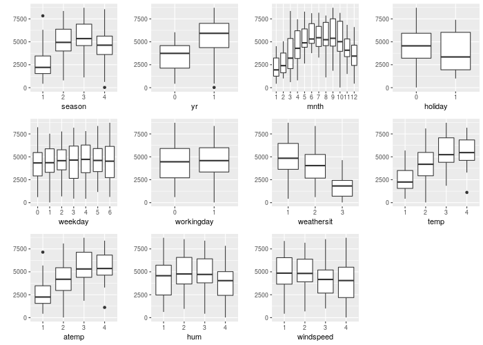
```

- average case
- same experiment settings as before (100 iterations)

```{r, eval = TRUE, echo = FALSE, fig.align = 'center', fig.cap = "LIME weights of the modal data point with a random forest model of standard regularisations"}
knitr::include_graphics("images/bikes_standard.png")
```

```{r, eval = TRUE, echo = FALSE, fig.align = 'center', fig.cap = "Same weights but rescaled -- weight coefficients varying to the weight size, similar to the case of numerical features"}
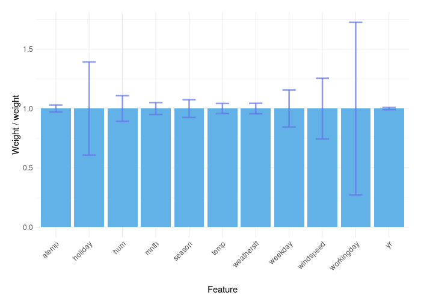
```

###### vs outlying data point
- same settings

```{r, eval = TRUE, echo = FALSE, fig.align = 'center', fig.cap = "Weights of a LIME model applied on an outlying data point"}
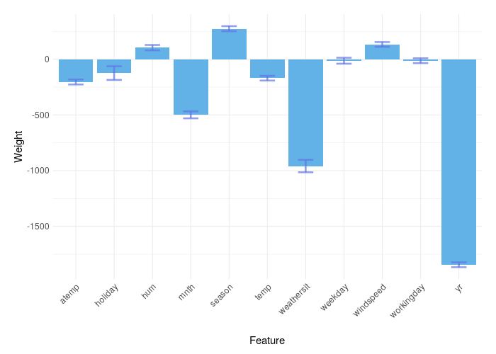
```

```{r, eval = TRUE, echo = FALSE, fig.align = 'center', fig.cap = "Same weights but rescaled -- lower weight values seem highly untrustworthy similar to the case of numerical features"}
knitr::include_graphics("images/bikes_outlier_scaled.png")
```

##### using linear model (maybe remove this, because linear models don't provide a global fit for categorical features with category size higher than 2)
- average data point:

```{r, eval = TRUE, echo = FALSE, fig.align = 'center', fig.cap = "Weights of the modal data points with a linear model as black box -- high discrepancy to the random forest case"}
knitr::include_graphics("images/bikes_lm.png")
```

```{r, eval = TRUE, echo = FALSE, fig.align = 'center', fig.cap = "Same weights but rescaled -- similar behaviour as the random forest case"}
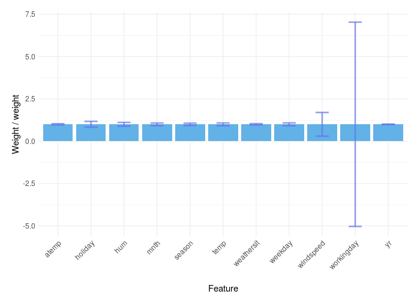
```

###### linear model with ouyling point:

```{r, eval = TRUE, echo = FALSE, fig.align = 'center', fig.cap = "Weights of an outlying data point with the linear model as black box -- different weights as in the case of the modal data point, but not surprising due to the nature of linear models with categorical features"}
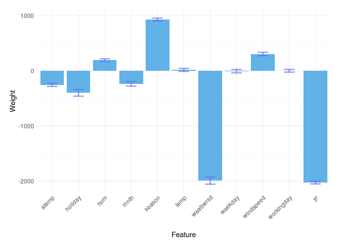
```

```{r, eval = TRUE, echo = FALSE, fig.align = 'center', fig.cap = "Same weights rescaled -- same behaviour as before: the higher the weights the more trustworthy"}
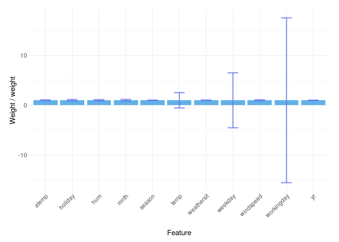
```

##### using decision tree (overfitting with minimum node size of 1)
- average data point:

```{r, eval = TRUE, echo = FALSE, fig.align = 'center', fig.cap = "Weights of the modal data point with an extremely overfitting tree as black box -- similar weights as in the case of a linear model"}
knitr::include_graphics("images/bikes_tree.png")
```

```{r, eval = TRUE, echo = FALSE, fig.align = 'center', fig.cap = "Same weights but rescaled"}
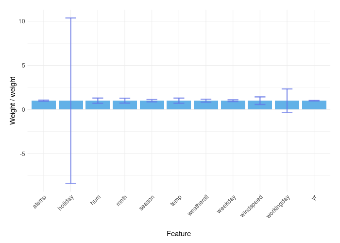
```

###### vs outlying data point

```{r, eval = TRUE, echo = FALSE, fig.align = 'center', fig.cap = "Weights of an outlying data point with the same tree as above -- very different weight sizes"}
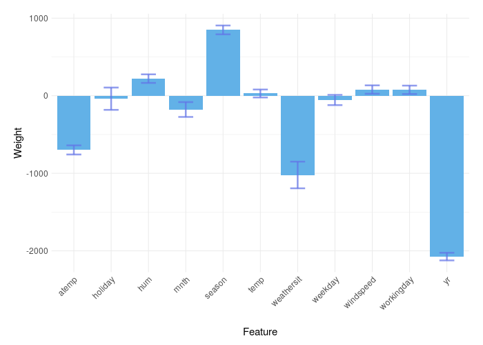
```

```{r, eval = TRUE, echo = FALSE, fig.align = 'center', fig.cap = "Same weights rescaled -- standard deviation increased compared to the modal data point"}
knitr::include_graphics("images/bikes_tree_outlier_scaled.png")
```

- side observation: categorical weights not as instable as numericals with binning as sampling strategy
- raising the following question

### Is bin sampling inferior?

```{r, eval = FALSE, echo = FALSE, fig.align = 'center', fig.cap = "LIME output", warning=FALSE}

library(ggplot2)
library(mlr)
library(lime)

bikes = read.csv("datasets/day.csv")
# remove undesired variables
bikes = bikes[-which(names(bikes) %in% c("casual", "registered", "instant", "dteday"))]
bikes[c("temp", "atemp", "hum", "windspeed")] = as.data.frame(lapply(
  bikes[c("temp", "atemp", "hum", "windspeed")],
  function(x) x/sd(x)
))

bikes_num = as.data.frame(bikes[c("temp", "atemp", "hum", "windspeed")])
bikes_num$cnt = bikes$cnt

b_numtask = makeRegrTask(data = bikes_num, target = "cnt")

# normal non-continuous model
regr_model = makeLearner("regr.ranger")
black_box  = train(regr_model, b_numtask)
explainer  = lime(bikes_num[, -ncol(bikes_num)], black_box)

# pick majority of each feature as data point
data_point = as.data.frame(lapply(
  bikes_num[, -ncol(bikes_num)],
  mean
))
# set index of datapoint to use
limes = sapply(1:100, function(k) {
  interim = explain(data_point, explainer, n_features = ncol(bikes_num)-1)
  weights_l = interim$feature_weight
  names(weights_l) = interim$feature
  weights_l
})


means = apply(limes, MARGIN = 1, mean)
sds   = apply(limes, MARGIN = 1, sd)


filename = paste0("images/bikes_bins_lime.png")
png(filename, width = 700, height = 500)
nice_plot(means, sds, color1 = "#df8a4f", color2 = "#c64b00", angle = 45, hjust = 1)
dev.off()

# quantile binning with 4 bins
bikes_bins = as.data.frame(lapply(
  bikes[c("temp", "atemp", "hum", "windspeed")],
  function(vec) {
    quantiles = quantile(vec)
    quantiles[5] = Inf
    sapply(vec, function(x) sum(x >= quantiles))
  }
))

bikes_bins$cnt = bikes$cnt
bikes_bins[-ncol(bikes_bins)] = lapply(bikes_bins[-ncol(bikes_bins)], as.factor)


b_binstask = makeRegrTask(data = bikes_bins, target = "cnt")

# normal non-continuous model
regr_model = makeLearner("regr.ranger")
black_box  = train(regr_model, b_binstask)
explainer  = lime(bikes_bins[, -ncol(bikes_bins)], black_box)

# put mean point into bins
data_point = as.data.frame(lapply(
  names(data_point),
  function(name) {
    quantiles = quantile(bikes_num[[name]])
    quantiles[5] = Inf
    as.factor(sum(data_point[[name]] >= quantiles))
  }
))
names(data_point) = names(bikes_bins[-ncol(bikes_bins)])

# set index of datapoint to use
limes = sapply(1:100, function(k) {
  interim = explain(data_point, explainer, n_features = ncol(bikes_bins)-1)
  weights_l = interim$feature_weight
  names(weights_l) = interim$feature
  weights_l
})


means = apply(limes, MARGIN = 1, mean)
sds   = apply(limes, MARGIN = 1, sd)

filename = paste0("images/bikes_manual_bins.png")
png(filename, width = 700, height = 500)
nice_plot(means, sds, color1 = "#df8a4f", color2 = "#c64b00", angle = 45, hjust = 1)
dev.off()

##########
### non bins, but kernel density estimation

# normal non-continuous model
regr_model = makeLearner("regr.ranger")
black_box  = train(regr_model, b_numtask)
explainer  = lime(bikes_num[, -ncol(bikes_num)], black_box, bin_continuous = FALSE, use_density = FALSE)

# pick majority of each feature as data point
data_point = as.data.frame(lapply(
  bikes_num[, -ncol(bikes_num)],
  mean
))
# set index of datapoint to use
limes = sapply(1:100, function(k) {
  interim = explain(data_point, explainer, n_features = ncol(bikes_num)-1, dist_fun = "euclidian")
  weights_l = interim$feature_weight
  names(weights_l) = interim$feature
  weights_l
})


means = apply(limes, MARGIN = 1, mean)
sds   = apply(limes, MARGIN = 1, sd)


filename = paste0("images/bikes_no_bins.png")
png(filename, width = 700, height = 500)
nice_plot(means, sds, color1 = "#df8a4f", color2 = "#c64b00", angle = 45, hjust = 1)
dev.off()

```

```{r, eval = TRUE, echo = FALSE, fig.align = 'center', fig.cap = "Weights of the mean data point, but each feature has been categorized into four bins as preprocessing step"}
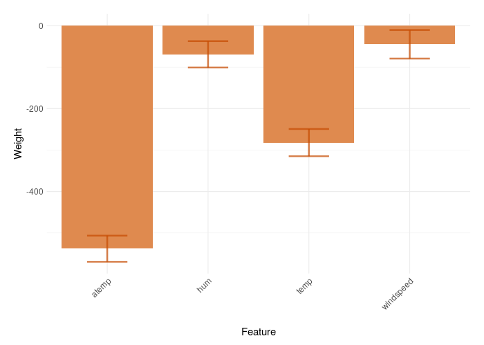
```

```{r, eval = TRUE, echo = FALSE, fig.align = 'center', fig.cap = "Weights of the same mean data point without preprocessing of the features, but with binning as sampling strategy -- totally different weight sizes but roughly similar standard deviaton (mind the different scales)"}
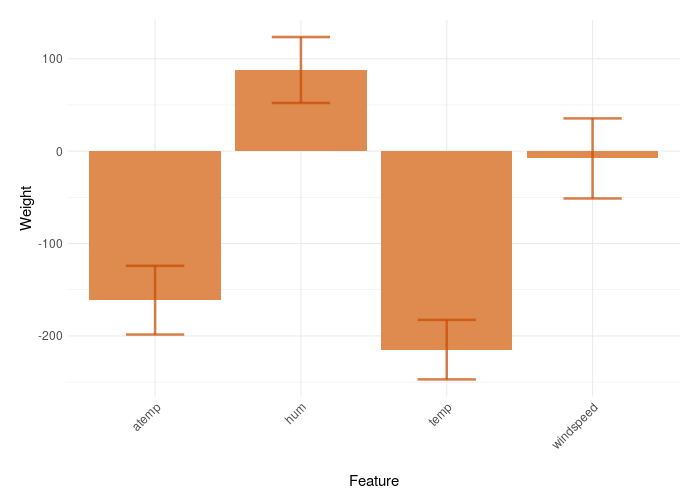
```

```{r, eval = TRUE, echo = FALSE, fig.align = 'center', fig.cap = "Weights of the same mean data point without preprocessing and with conventional density sampling -- again totally different weight sizes, but also smaller standard deviation"}
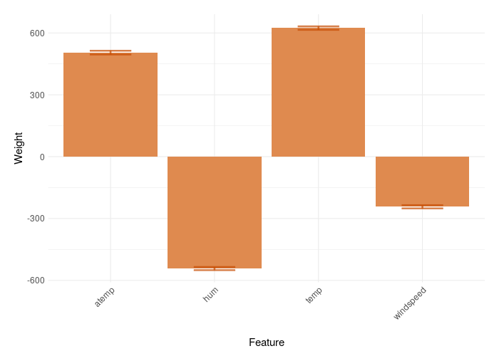
```

- LIME binning similarly unstable as data preprocessing
- totally different results in terms of weight size compared to non binning
- conclusion: binning in lime (the !DEFAULT! option) is not recommendable as a sampling stability

## Conclusion
- different settings having high influence on weight stability
- weight stability independent of weight size (ignore small weights)
- averaging over several samples recommended
- selecting low amount of explained features recommended (to remove the smaller weights)
- train data doesn't matter
- black box model matters
- don't use binning

## STOP REVIEW HERE, PHILIPP

## Proposing replacement of proximity measure with new sampling strategy (PROBABLY REMOVED)
- this chapter and the following probably gets a cut
- extreme increase of sampling efficiency
- show mathematically risk minimization of uniform sample + gaussian kernel is the same as normal sample + no kernel with kernel width equal to variance of normal distribution

```{r, eval = TRUE, echo = FALSE, fig.align = 'center', fig.cap = "LIME output", warning=FALSE}

plot_better_lime = function(model_smoothness = 50, sample_seed, kernel_width = 900, sample_size = 10) {
  
  # create ground truth
  black_box = function(x) sin(x / model_smoothness)
  x = 1:1000
  y = black_box(x)

  set.seed(1)
  # randomly pick data point to explain
  x_ex = runif(1, 1, 1000)
  y_ex = black_box(x_ex)
  
  
  set.seed(sample_seed)
  # sample new data points
  x_samp = rnorm(sample_size, x_ex, sqrt(kernel_width))
  y_samp = black_box(x_samp)
  data   = data.frame(x = x_samp, y = y_samp)
  
  # fit surrogate model and get predictions
  model  = lm(y ~ x, data = data)
  y_pred = predict(model, newdata = data.frame(x = x))
  
  # visualize everything
  ggplot(data = NULL, aes(y = y, x = x)) +
    geom_line(color = "#00C5CD", size = 1.5) +
    geom_point(data = NULL, aes(x = x_samp, y = y_samp)) +
    geom_line(data = NULL, aes(x = x, y = y_pred), color = "#e04d2e", size = 1) +
    geom_point(data = NULL, aes(x = x_ex, y = y_ex), color = "#c1c10d", size = 3) +
    geom_vline(aes(xintercept = x_ex - sqrt(kernel_width))) +
    geom_vline(aes(xintercept = x_ex + sqrt(kernel_width))) +
    theme_minimal() +
    ylim(c(-1.5, 1.5)) +
    ylab("target") +
    xlab("feature")

}
  
```

```{r, eval = TRUE, echo = TRUE, fig.align = 'center', fig.cap = "Local sampling offers more anchor points in the neighborhood and strongly increases sampling efficiency", warning=FALSE}


plot_better_lime(sample_seed = 2, model_smoothness = 50, sample_size = 10)
  
```

```{r, eval = TRUE, echo = TRUE, fig.align = 'center', fig.cap = "A rerun of the same settings reveals high similarity of the samples", warning=FALSE}


plot_better_lime(sample_seed = 1, model_smoothness = 50, sample_size = 10)
  
```


```{r, eval = FALSE, echo = FALSE, fig.align = 'center', fig.cap = "LIME output", warning=FALSE}

# EVALUATE ABOVE CELLS FIRST!
plot_better_lime_boston = function(model_smoothness = 50, sample_seed, kernel_width = 900, sample_size = 10) {
  
  # create grid
  x_grid     = 1:4000 / 100
  y_grid     = predict(black_box, newdata = data.frame(lstat=x_grid))

  set.seed(1)
  # randomly pick data point to explain
  x_ex = runif(1, 1, 40)
  yret = predict(black_box, newdata = data.frame(lstat = x_ex))
  y_ex = yret$data$response
  
  set.seed(sample_seed)
  # sample new data points
  x_samp = rnorm(sample_size, x_ex, sqrt(kernel_width))
  y_samp = predict(black_box, newdata = data.frame(lstat = x_samp))
  data   = data.frame(x = x_samp, y = y_samp$data$response)
  
  # fit surrogate model and get predictions
  model  = lm(y ~ x, data = data)
  y_pred = predict(model, newdata = data.frame(x = x_grid))
  
  # visualize everything
  ggplot(data = NULL, aes(x = x_grid, y = y_grid$data$response)) +
    geom_line(color = "#00C5CD", size = 1.5) +
    geom_point(data = data, aes(x = x, y = y)) +
    geom_line( data = NULL, aes(x = x_grid, y = y_pred), color = "#e04d2e", size = 1) +
    geom_point(data = NULL, aes(x = x_ex,   y = y_ex  ), color = "#c1c10d", size = 3) +
    geom_vline(aes(xintercept = x_ex - sqrt(kernel_width))) +
    geom_vline(aes(xintercept = x_ex + sqrt(kernel_width))) +
    theme_minimal() +
    theme(
      text = element_text(size = 15),
      axis.title.x = element_text(vjust = -4),
      plot.margin = ggplot2::margin(20,20,30,20)
    ) +
    ylim(c(0, 50)) +
    ylab("target") +
    xlab("feature")
  
}

```

```{r, eval = FALSE, echo = FALSE, fig.align = 'center', fig.cap = "LIME output", warning=FALSE}

filename = paste0("images/boston_sampled_tree_fst_better.png")
png(filename, width = 700, height = 500)
plot_better_lime_boston(sample_seed = 1, kernel_width = 1)
dev.off()
  
```

```{r, eval = TRUE, echo = FALSE, fig.align = 'center', fig.cap = "Applying new sampling strategy on overfitting decision tree"}
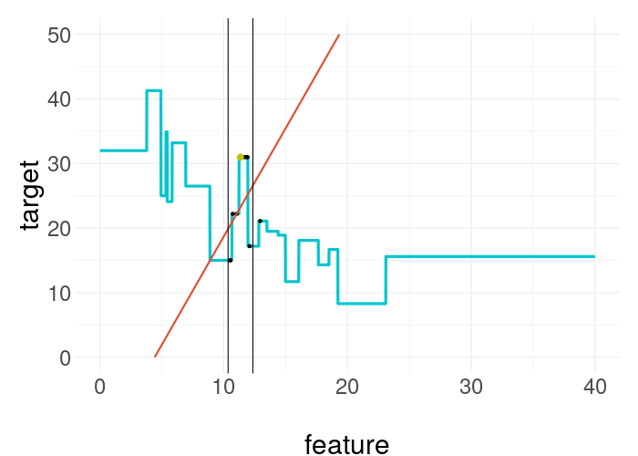
```

```{r, eval = FALSE, echo = FALSE, fig.align = 'center', fig.cap = "LIME output", warning=FALSE}

filename = paste0("images/boston_sampled_tree_snd_better.png")
png(filename, width = 700, height = 500)
plot_better_lime_boston(sample_seed = 2, kernel_width = 1)
dev.off()
  
```

```{r, eval = TRUE, echo = FALSE, fig.align = 'center', fig.cap = "Even though the surface is an extreme challenge, both runs capture the increasing tendency from left to right"}
knitr::include_graphics("images/boston_sampled_tree_snd_better.png")
```

- new sampling strategy still works with extreme small kernel width
- but losses surrounding information (as possibly intended)

```{r, eval = FALSE, echo = FALSE, fig.align = 'center', fig.cap = "LIME output", warning=FALSE}

filename = paste0("images/boston_sampled_tree_snd_better_slim.png")
png(filename, width = 700, height = 500)
plot_better_lime_boston(sample_seed = 2, kernel_width = 0.01)
dev.off()
  
```

```{r, eval = TRUE, echo = FALSE, fig.align = 'center', fig.cap = "Kernel width can be arbitrarily small without losing stability -- all samples are close to the explained data point and correctly capture the local plateau"}
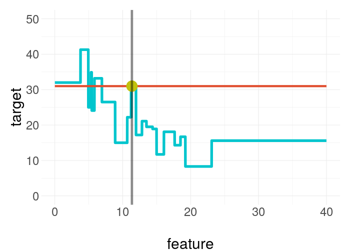
```

- catastrophic failure of global sampling with low kernel width in the following

```{r, eval = FALSE, echo = FALSE, fig.align = 'center', fig.cap = "LIME output", warning=FALSE}

filename = paste0("images/boston_sampled_tree_snd_slim.png")
png(filename, width = 700, height = 500)
plot_lime_boston(sample_seed = 2, kernel_width = 0.01)
dev.off()
  
```

```{r, eval = TRUE, echo = FALSE, fig.align = 'center', fig.cap = "Global sampling misses a lot of close anchor points to offer a good fit for smaller kernel widths -- leading to a catastrophic failure in this case"}
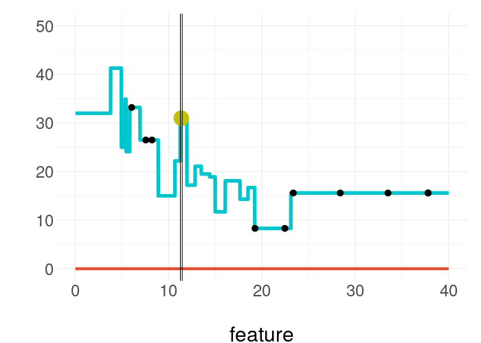
```

