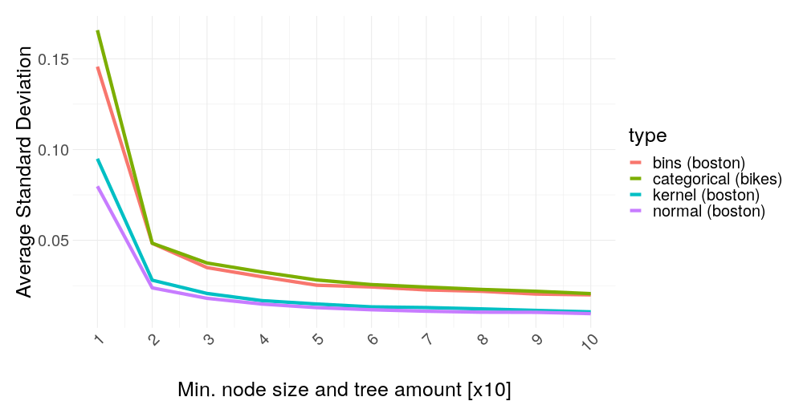
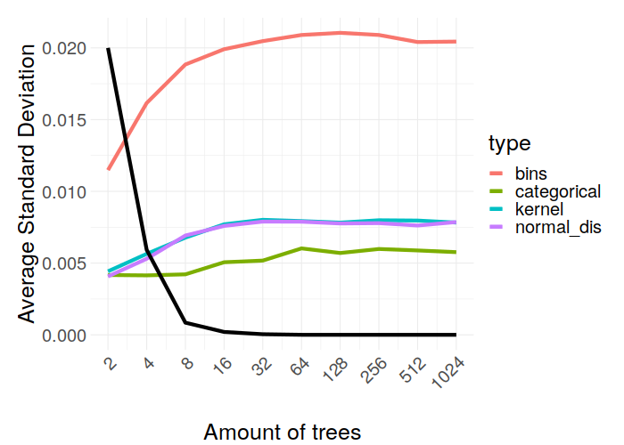

---
output:
  html_document: default
  pdf_document: default
---

# LIME and Sampling

*Author: Sebastian Gruber*


## Understanding Sampling in LIME

In this chapter, we will discuss the fundamentals of LIME from a slightly different angle to receive a further understanding of what enables sampling and to have a look at how basic results look like.


### Formula

If we do some small changes of notations compared to the introduction chapter, the task of calculating the LIME explainer can be seen as

$$ g^* = \arg\min_{g \epsilon G} \sum_{i=1}^{n'} \pi_{\tilde x}(x^{(i)}) L\Big( f\big(x^{(i)}\big), \, g\big(x^{(i)}\big) \Big) + \Omega\left(g\right) $$

with $\mathcal{L}\left(f, g, \pi_{\tilde x} \right) := \sum_{i=1}^{n'} \pi_{\tilde x}(x^{(i)}) \times L\Big( f\big(x^{(i)}\big), \, g\big(x^{(i)}\big) \Big)$ further expressed more in detail as in the introduction and $\tilde x$ as our desired point to explain.
This change of notation allows us to spot the enabling property for sampling.
First of all, the original target variable $y$ is replaced by the response $ŷ := f\big(x^{(i)} \big)$ of the black box model.
This means nothing more besides that we minimize this problem without accessing the original target.
The great thing about this is, that $f$ can be evaluated for any value in the feature space, giving us -- theoretically -- an arbitrarily amount $n'$ of non-stochastic observations compared to before.
This may sound absolutely great at first, but we still need the values of our feature space for evaluation.
And this is where problems arise on the horizon.
At first, one may ask why even try to receive new values of the feature space?
Is our real dataset not enough?
The ground truth for our surrogate model is a function of an infinite domain (assuming at least one numeric variable is present), so the more information we gather about this function, the better our approximation is going to be.
So, if we can get more data, we will simply take it.
The first (and certainly not the last) issue here is the definition of the feature space.
We need a new dataset to receive the responses of $f$.
However, a priori, it is not clear how this new data may look like.
Our original dataset is a finite sample of infinite space in the numerical case, or of finite space exponentially growing with its dimension in the categorical case.
As a consequence, we can't assume producing a dataset equal to the size of our feature space -- we need strategies to receive the best possible representation with respect to our task.


### Sampling strategies

Originally, sampling in LIME was meant as a perturbation of the original data, to stay as close as possible to the real data distribution. [cite]
Though, the implementations of LIME in R and Python took a different path and decided to estimate a univariate distribution for each feature and then draw samples out of that. [cite]
The consequence of this approach is the total loss of the covariance structure, as our estimated distribution for the whole feature space is simply a product of several univariate distributions.
This way, we may receive samples that lie outside the space of our real data generation process.
Because almost all machine learning models are well defined on the whole input space, evaluating unrealistic values leads to no problems at first.
But in theory, issues could occur, if a lot of unrealistic evaluations lied close to our point for explanation and influenced greatly the fit of the surrogate model.
In that case, we would not be able to trust the results of LIME anymore, even though we got told the local fit is a very decent approximation.
On the other hand, an issue like this was not encountered during the preparation of this work as most used learners are well regularized in space of low data denseness.


#### Categorical features

Categorical features are handled more straight forward then numerical ones due to finite space.
The R LIME package will sample with probabilities of the frequency of each category appearing in the original dataset.
The case when this goes wrong is if one category is very infrequent and then -- due to bad luck -- simply not drawn.
Since the original data is thrown away after sampling, no information is leftover about this category for the fitting process.
Additionally, by ignoring feature combinations, we may sample points that are impossible in the real world and add no value to our fit, or may even distort it. 


#### Numerical features

Numerical features rise the challenge higher.
While categorical features make it possible for at least very low dimensions to gather a dataset with all possible values, numerical features are theoretically of infinite size.
There are currently three different options implemented in the R LIME package for sampling numerical features.
The first -- and default -- one uses a fixed amount of bins.
The limits of these bins are picked by the quantiles of the original dataset.
In the sampling step, one of these bins will be randomly picked and after that, a value is uniformly sampled between the lower and upper limit of that bin.
The small benefit here is being allowed to fine-tune the number of bins, leading to a rougher or more detailed sample representation of the original feature.
The downside is that the order of the bins is ignored, as a consequence risking the loss of a global fit as each bin receives its own weight.
Additionally, bins have a lower and upper limit, i.e. it is possible the new point for explanation lies outside of all bins.
The current implementation handles this by discretizing the explanation with each bin as a category class, making it possible to assign values to the lowest (or highest) bin even if it lies below (or above) that bin.
Another option would be to approximate the original feature through a normal distribution and then sample out of that one.
This is relatively straight forward, but one may ask if the assumption of normally distributed features is correct.
A lack of denseness of the training data for the surrogate model may be a result of a wrong assumption.
Additionally, it is not possible to change options for each feature, so by choosing this distribution, all your features will be handled as normally distributed with their own individual mean and variance.
The last option for numerical features is approximating the real feature distribution through a kernel density estimation.
Any downsides besides slightly increased computational effort have not been encountered with this option.
Thus -- and after gathering empirical evidence supporting this --, we choose to not use binning, but rather kernel density estimation for most of our trials following down.


### Visualization of a basic example

To give more substance to the introduction, in \@ref(fig:figbasic) one can see two LIME results of a simple numerical example.
Both use the exact same settings except one uses a different sample seed than the other.
 The black-box model in blue is tried to be explained by the surrogate model as the red line.
The black dots are the sampled values dealing as training data set for the surrogate model, which tries to explain our target point, the dot in yellow.
The vertical bars are an indicator of the kernel width.
This color scheme is kept from now on in all further graphics.

```{r, figbasic, eval = TRUE, echo = FALSE, out.width='.49\\linewidth', fig.width=3, fig.height=3, fig.show='hold', fig.align = 'center', fig.cap = "Visulization of LIME applied on a non-linear function - the right plot uses the same settings but is resampled", warning=FALSE}

knitr::include_graphics(c("images/convex_samples_1.png", "images/convex_samples_2.png"))
```

As can be seen the results in both cases are very similar, as one would wish.
But this may not always be the case.
The surrogate models depend only on randomly generated samples, that lie closer or further spread across the feature space. This raises the following questions.
How much influence has a new sample of the explanation?
What is the average confidence of certain weights?
Do certain settings influence these and is there a tendency?


## Sketching Problems of Sampling

To give an idea of the potential problems, a few artificial showcases are presented in the following.
In \@ref(fig:figbad) a sinus shaped black-box model is tried to be explained twice again with a different seed.

```{r, figbad, eval = TRUE, echo = FALSE, out.width='.49\\linewidth', fig.width=3, fig.height=3, fig.show='hold', fig.align = 'center', fig.cap = "LIME applied on a non-convex function - again, the right plot uses the same settings but is resampled", warning=FALSE}

knitr::include_graphics(c("images/nonconvex_samples_1.png", "images/nonconvex_samples_2.png"))

```

The two LIME explanations of the same scenario and with the same settings hold totally different results.
This indicates how untrusty single explanations could be.
So, what can we do here?

The most obvious step is increasing the sample size.
As it is depicted in \@ref(fig:figgood), this indeed shrinks the problem to irrelevancy, restoring some of the lost trust in our explanation.
But the problem with this solution is its heavy computational burden, so it would be good to know in which cases the additional computational effort is necessary.

```{r, figgood, eval = TRUE, echo = FALSE, out.width='.49\\linewidth', fig.width=3, fig.height=3, fig.show='hold', fig.align = 'center', fig.cap = "LIME applied on a non-convex function with increased sample size - resampled plot on the right", warning=FALSE}

knitr::include_graphics(c("images/nonconvex_samples_1_size100.png", "images/nonconvex_samples_2_size100.png"))
  
```

Another possible step would be to increase the kernel width as seen in \@ref(fig:figkernel), making the explanations again more similar, but also greatly losing the locality of the explanation.
Since \@ref(id1) already gave a thorough overview of this and because we assume we don't want to lose any locality, we focus on the default kernel width in the following and investigate the influence of further options on the weight stability of the LIME explanations.

```{r, figkernel, eval = TRUE, echo = FALSE, out.width='.49\\linewidth', fig.width=3, fig.height=3, fig.show='hold', fig.align = 'center', fig.cap = "LIME applied on a non-convex function with increased kernel width - resampled plot on the right", warning=FALSE}

knitr::include_graphics(c("images/nonconvex_samples_1_width81000.png", "images/nonconvex_samples_2_width81000.png"))
  
```


## Real World Problems with LIME

So far, only artificial problems have been shown for demonstration purposes, but how does LIME behave applied to real-world problems?
We are using real datasets in the following to show weight stability associated with different circumstances.


### Boston Housing Data

Boston housing dataset is a well-known data set, so a deeper description of its properties is skipped here.
It's offering a good amount of numerical features ($p = 12$) and can be seen as a typical case of a numerical regression task.
A quick overview of each of its features versus the target -- the median housing price -- is depicted in \@ref(fig:figboston).

```{r, figboston, eval = TRUE, echo = FALSE, fig.align = 'center', fig.cap = "Overview of the normalized numerical features compared to target 'medv' in the boston housing dataset"}

knitr::include_graphics("images/boston_prezi.png")

```

In the following, weight stability is explored by resampling an explanation 100 times for a specific setting.
Of the 100 weights of each feature in the explanations, the mean and the empirical 2.5% and 97.5% quantiles are calculated and depicted in the figures.
Based on the quantiles we then plot the empirical 95% confidence interval.
As the black-box model, a random forest model with default parameters is used.
The reasoning here is, that random forests are very common in practice and their default parameters usually perform well without tuning.
For the sampling, we choose to use kernel density estimation.
The reason is the results of later experiments, showing kernel density estimation as a benefactor for weight stability compared to the other methods.
The target point to explain is the mean of the original dataset.
In each of the following scenarios, only one of the above-described settings is changed.
Not all possible scenarios are shown, but only a cherry-picked selection supposed to spark interest in the experiments further down.


#### Mean point versus outlying point

In the first showcase, the mean data point is compared with an extreme outlier (having the maximum appearing value of each feature).
As we can see in \@ref(fig:figbostmeanoutlier), the outlier has clearly larger confidence intervals as the mean point.
This suggests that either the model is behaving really roughly in its area, or, more likely, the sample size in the neighborhood has a significant influence on our stability, as our original features have higher density mass around the mean with the kernel density estimation copying that approximately.

```{r, figbostmeanoutlier, eval = TRUE, echo = FALSE, out.width='.49\\linewidth', fig.width=3, fig.height=3, fig.show='hold', fig.align = 'center', fig.cap = "Weight coefficients of LIME applied to the mean data point with errorbars indicating the standard deviation across repeated runs"}

knitr::include_graphics(c("images/boston_standard_presi.png", "images/boston_outlier_presi.png"))

```


#### Decision tree versus linear regression model

This scenario compares two different black-box models. 
The left plot in \@ref(fig:figbosttreelm) shows the weights explaining a decision tree, while the right one shows the case for a linear regression model.
It's kind of expected of the linear model to have very stable weights, but the differences to the decision tree are still striking, suggesting the black-box model could have a huge influence on weight stability.

```{r, figbosttreelm, eval = TRUE, echo = FALSE, out.width='.49\\linewidth', fig.width=3, fig.height=3, fig.show='hold', fig.align = 'center', fig.cap = "LIME weights of an extreme outlying data point"}

knitr::include_graphics(c("images/boston_tree_presi.png", "images/boston_lm_presi.png"))

```


#### Kernel density estimation versus binning

In this case, we compare two different sampling options.
Binning is the default setting in the R LIME package.
Due to sampling via normal distribution acting very similar to the kernel density estimation in the experiments further down, this option is left out here.
The differences in \@ref(fig:figbostkdebin) are clearly visible, leading to the question if there are strict ranks of the sampling options with respect to weight stability.

```{r, figbostkdebin, eval = TRUE, echo = FALSE, out.width='.49\\linewidth', fig.width=3, fig.height=3, fig.show='hold', fig.align = 'center', fig.cap = "LIME weights of mean data point with binning as sampling strategy -- standard deviation highly increased compared to previous results"}

knitr::include_graphics(c("images/boston_standard_presi.png", "images/boston_bins_presi.png"))

```


### Rental Bikes Data

So far, we only used numerical features.
To also cover the categorical case, we are using the rental bikes dataset with only categorical features here.
Originally, the data also contained a few numerical features, but these have been manually categorized by creating classes based on their 25%-, 50%-, and 75%-quantiles.
In \@ref(fig:figbike), boxplots of the classes in each feature with respect to the target 'cnt' -- the count of bikes rented a day -- is shown to give a quick overview.
This means we are forced to use the Gower distance, a binary distance measure for the categorical case.
The purpose of this short chapter is: Do we get similar results as for numerical features?

```{r, figbike, eval = TRUE, echo = FALSE, fig.align = 'center', fig.cap = "Overview of the normalized numerical features compared to target 'medv' in the boston housing dataset"}

knitr::include_graphics("images/bikes_prezi.png")

```

We compare the same scenarios under the same settings as in the case of the Boston housing data, except the sampling option, as we only have one (the class frequency of each feature).
As we can't calculate the mean and maximum of a categorical variable, we switch to the majority and minority point -- the point having the most, and analogous the least frequent class in each feature respectively.


#### Majority data point versus minority data point

In \@ref(fig:figmajorminor), the majority data point is compared to the minority data point.
The differences are a lot more subtle than in the Boston housing case, almost not visible.

```{r, figmajorminor, eval = TRUE, echo = FALSE, out.width='.49\\linewidth', fig.width=3, fig.height=3, fig.show='hold', fig.align = 'center', fig.cap = "Weight coefficients of LIME applied to the mean data point with errorbars indicating the standard deviation across repeated runs"}

knitr::include_graphics(c("images/bikes_standard_presi.png", "images/bikes_outlier_presi.png"))

```


#### Decision tree versus linear regression model

Again, we are comparing a decision tree with a linear regression model as the black-box model in \@ref(fig:figbiketreelm).
The differences are visible, but by far not as much as in the numerical case.
This suggests we include this categorical data set in our experiments further down but expect the results won't be as clear cut as in the numerical case.

```{r, figbiketreelm, eval = TRUE, echo = FALSE, out.width='.49\\linewidth', fig.width=3, fig.height=3, fig.show='hold', fig.align = 'center', fig.cap = "LIME weights of an extreme outlying data point"}

knitr::include_graphics(c("images/bikes_tree_presi.png", "images/bikes_lm_presi.png"))

```


## Experiments regarding Sampling stability

All the different scenarios we have encountered so far show more or less discrepancy in weight stability between certain settings.
We have observed:
- a target point in an area with higher sample denseness is more stable than an extreme outlier
- different black-box models have highly different stableness
- different sampling options and numerical features compared to categorical ones also show different behavior
Based on these findings, we construct several experiments to investigate each point and to see, if we receive results showing a clear, monotonous tendency for weight stability with respect to available parameters.


### Influence of feature dimension

The first and most obvious question regarding sampling, that wasn't showable for a fixed dataset, is if an increasing number of features also increases weight instability.
The curse of dimensionality is a known problem in Machine Learning and to uncover its hidden influence on our case, we run the following experiment regarding feature dimension.


#### Feature dimension - setup

The experiment is designed as given by this algorithm:
\begin{itemize}
\item[1)] Start with only two features of the original data as the training data.
\item[2)] Train a black-box model (random forest with default parameters).
\item[3)] Ten randomly sampled data points of the original data set are explained repeatedly ten times.
\item[4)] The standard deviation of the ten weights of each feature and each explained points is calculated, and then all the standard deviations are averaged to a single value.
\item[5)] If there are unused features left, add a new feature to the existing feature set and continue from step 2), else stop.
\end{itemize}


#### Feature dimension - results

This procedure is executed for all the sampling options possible for the Boston Housing and the Rental Bikes dataset.
The results are shown in \@ref(fig:figsdp) and as can be seen, it is hard to spot a clear tendency.
If the curse of dimensionality would apply for our case, we definitely wouldn't expect improving stability by adding new features.
Thus, a curse of dimensionality can not be identified in our case and a high feature amount shouldn't necessarily concern the user.
As a further thought, since LIME models the black-box and not the original data, dimensionality in the dataset has only an indirect impact as what matters is how the model fits interactions between features.

```{r, figsdp, eval = TRUE, echo = FALSE, out.width='.49\\linewidth', fig.width=3, fig.height=3, fig.show='hold', fig.align = 'center', fig.cap = "Results of the experiment regarding the feature dimension for the Boston Housing and Rental Bikes dataset. Each line shows a different sampling option."}

knitr::include_graphics(c("images/sd_p_presi.png", "images/sd_pc_presi.png"))

```


#### Amount of features selected - setup

In the R LIME package, an option is available to only explain a fixed amount of features with the highest weight.
This may sound interesting as a small side experiment to the general amount of features.
Maybe this selection offers better stability in the results?
For this, we use the full dataset instead of iterating over the number of features, but iterate over increasing parameter values of 'n_features' in the explainer function.

#### Amount of features selected - results

As can be seen in \@ref(fig:figsdnfeat), weight stability is remarkably constant for a low amount of features and suddenly becomes very jumpy for a higher amount of selected features.
If the experiment was only evaluated for small amounts of selected features, a clear recommendation of sticking to less explained features could be given, but unfortunately, no real rule of thumb can be suggested in this case. 
The inverted 'U' shape of the graph may result due to globally linear predictions for the least important features.

```{r, figsdnfeat, eval = TRUE, echo = FALSE, out.width='.49\\linewidth', fig.width=3, fig.height=3, fig.show='hold', fig.align = 'center', fig.cap = "Average standard deviation with the same settings as before but with full feature size. The x-axis plots the number of features selected for the explainer."}

knitr::include_graphics(c("images/sd_nfeat_presi.png", "images/sd_nfeatc_presi.png"))

```


### Influence of sample size

The next experiment is about the influence of the sample size.
The difference between an explained point in a high-density region compared to one sitting in a low-density area was easily recognizable in \@ref(fig:figbostmeanoutlier).
The question is how this relates to an increased global sampling size, which we try to answer in the following.
Here, the setup is basically the same as in the case for the experiment about the number of features selected, except we iterate over different sample sizes.


#### Sample size -- results

Again, we run the modified algorithm of the experiment for all the possible sampling options at the Boston Housing and Rental Bike dataset.
As a result, we receive the averaged standard deviation of all weights per sample size and sampling option.
These are depicted in \@ref(fig:fignperm) and show a clear and monotonous trend of more samples having a huge positive impact on the stability.
Additionally, binning seems to be consistently dominated by other sampling options.


```{r, fignperm, eval = TRUE, echo = FALSE, fig.align = 'center', fig.cap = "Average standard deviation under the same settings as before. A clear trend can be seen here: Increasing the amount of samples acting as train data for our surrogate model has incredible influence on weight stability."}
knitr::include_graphics(c("images/sd_npermutations_presi.png"))
```

We have seen before in \@ref(fig:figsdp) feature dimension being relatively unrelated to weight stability, while the sample size is the total opposite -- does this make sense?
After all if not the feature dimension, what else may cause a high sample requirement?
As we have already seen in \@ref(fig:figbosttreelm) the black-box model may be the phantom we are hunting.
This motivates the last two experiments in this chapter.


### Influence of black-box

The simulations already presented in \@ref(fig:figbasic) and \@ref(fig:figbad) suggest more volatility and less smoothness of the prediction surface may influence weight stability.
Demonstrating the problem through a slightly adjusted real case problem, we are using sampled Boston housing data of sample size 20, and modeling only $medv ~ lstat$.
Because LIME doesn't know the original data, the resulting black-box fit seems like an impossible task to approximate linearly in an appropriate manner with only small samples as seen in \@ref(fig:figverybad).

```{r, figverybad, eval = TRUE, echo = FALSE, out.width='.49\\linewidth', fig.width=3, fig.height=3, fig.show='hold', fig.align = 'center', fig.cap = "LIME trying to explain an extremely volatily prediction surface."}
knitr::include_graphics(c("images/boston_sampled_tree_presi.png", "images/boston_sampled_tree_1_presi.png"))
```


#### Black-box -- setup

To receive meaningful results, we need comparable models.
For this, we choose to pick a random forest as the model class and iterate over the two parameters being the most responsible for a smooth fit.
These are the tree amount and the minimum node size.
A higher tree amount gives the prediction surface more smoothness (by reducing the average step size of each step in the prediction function), while a higher minimum node size reduces overfitting (by making predictions dependent on more train data points) and as consequence reducing volatility of the prediction surface.
Here is a slightly modified algorithm as the framework for our experiment:
\begin{itemize}
\item[1)] Start with a tree amount of one and a minimum node size of one.
\item[2)] Train a random forest with these parameters on the full data.
\item[3)] Ten randomly sampled data points of the original data set are explained ten times repeatedly.
\item[4)] The standard deviation of the ten weights of each feature and each explained points is calculated, and then all the standard
\item[5)] If we haven't reached ten iterations, increment the tree amount by ten and the minimum node size by one, and continue from step 2), else stop.
\end{itemize}


#### Black-box -- results

The results in \@ref(fig:figsmooth) are unambiguous: It's shown clearly how important the smoothness of the model is for weight stability. 
Keep in mind the model was fitted on two very specific datasets, which means if we would pick more complex data, the line could take much longer to flatten out, and vice versa for less complex data.
As a small sidenote, binning is again consistently inferior.

```{r, figsmooth, eval = TRUE, echo = FALSE, fig.align = 'center', fig.cap = "Average standard deviation of the same settings as before versus the black-box model smoothness/complexity. As the model class, a random forest was used with increasing parameters per iteration. The last tick in this graph is corresponding to a random forest with 91 trees and a minimum node size of 10. "}



```

We have just seen how important the smoothness is, but this would mean we can expect the inverted effect for more overfitting.
After all, our data case could be misleading as there are more complicated tasks in the real world requiring a much more volatile fit.
A certain level of smoothness is then often not given, so it would be nice to know of how much worse the stability can get in the case of extreme overfitting.
This leads us to the last experiment.


#### Black-box overfit -- setup

Before, we started with a very unsmooth model and gradually added more regularisation (more trees and higher minimum node size).
But now, we are doing the opposite with a model class being able to fit an arbitrarily complex data structure by increasing only a single hyperparameter: Extreme Gradient Boosting (Xgboost).
For this, we start with only two trees and double the amount with each iteration.
All the other settings and the algorithm for receiving the results are kept the same.
Additionally, we are also interested in the training error as it is a good indicator of when our boosting algorithm stops overfitting more (due to its nature of fitting residuals the test error can't get worse after the training data is fitted perfectly).


#### Black-box overfit -- results

As we can see in  \@ref(fig:figoverfit), as long as the Xgboost learner is able to reduce the training error, the weight stability gets consistently worse, but not any longer.
Let's try to dissect why this is happening in such a dependent fashion:
What makes the training error get smaller? 
Reducing the residuals.
What consequence has reducing the residuals on the prediction surface assuming a certain level of Gaussian noise? 
It becomes more volatile.
And this volatility kills our weight stability.


```{r, figoverfit, eval = TRUE, echo = FALSE, fig.align = 'center', fig.cap = "Average standard deviation of the same settings as before versus the tree amount of the xgboost model used as black-box."}



```

## Outlook
So far all the sampling methods have been about drawing out of a distribution representing the whole space of each feature. 
This global sampling disregards the covariance structure and results in a lot of samples drawn in areas so far away in distance from the point to explain, that their weight for the fitting process is essentially zero.
(Just to not spark any confusion: 'Weight' in this subchapter revers to the weights in the loss function and not the weights of the explanation, as we have used so far.)
These samples are a huge computational burden while having almost no influence at all on the fit.
A solution to this problem is not implemented in any LIME package known to the author but @laugel2018defining gives a thorough overview of how local sampling tackles exactly that for the classification case.
In short, the weighting based on a distance measure can be removed while we only sample in the area around the point to explain.
Thus, points having a higher distance are sampled less likely or not at all, making the weights redundant and hugely increasing sampling efficiency.
Because we only focused on regression tasks in our work so far, the figure \@ref(fig:figlocalsampling) will also only show this case -- for more details about classification please have a look into @laugel2018defining.

```{r, figlocalsampling, eval = TRUE, echo = FALSE, out.width='.49\\linewidth', fig.width=3, fig.height=3, fig.show='hold', fig.align = 'center', fig.cap = "By sampling locally around our point to explain we can catch the plateau the point sits on as seen on the left plot. As a local sampling strategy, a normal distribution was used with variance equal to the kernel width of the distance measure in the usual procedure. Achieving the same with global sampling in the right plot is a game of luck since the plateau is very narrow and hard to hit. In this case, our explanation even fails drastically as all the samples receive zero weight due to the small kernel width."}
knitr::include_graphics(c("images/boston_sampled_tree_fst_better_slim.png", "images/boston_sampled_tree_snd_slim.png"))
```

In practice the increase in sampling efficiency wouldn't improve our computational burden since the sample size was a strictly monotonous benefactor for explanation stability and thus should not be reduced.
But in the end, under the same settings, we simply draw more in the area of relevance, drastically increasing the sample size in the neighborhood of our explained point, making our results more stable and trustworthy.
Due to the absence of implementation in the R LIME package, this new ambitious procedure could not be part of the experiments to reinforce the assertions just made, but further research is strongly recommended.


## Conclusion
In all cases of categorical and numerical data we investigated, weight stability issues can be found easily.
But LIME explanations for numerical data can be stabilized a lot by simply changing the default option of binning as the sampling strategy to kernel density estimation.
The advantage of binning lies in a purely pragmatic way:
By using bins, numerical features are handled as categoricals and the effects of classes occupied are a lot easier to explain to the layman than the slope of a regression line.
In a more general way, we would ask ourselves in the end, what makes us have trust in a single explanation?
Weight stability is almost independent of the weight size, so high weights are very trustworthy.
Additionally, picking a very high sample size increases stability.
This should be done whenever possible as the only disadvantage is a longer runtime.
Furthermore, what makes us have less trust in the LIME result?
When we know the data set is very complex with a curvy/wavy fit almost surely going to happen, then we should be very careful.
The same holds true if the model we are using is capable of extreme overfitting.
In this case, the less regularisation we put onto it, the less stable our LIME explanations are going to be.
If we are unsure about the trustworthiness of our explanation, it is always beneficial to rerun the same explanation a few times and average the results -- this has a similar effect than a higher sample size, but this way we can actually use already computed results and we can also calculate a confidence interval, giving good indication of how much variance the results have.


```{r, eval = FALSE, echo = FALSE, fig.align = 'center', fig.cap = "LIME output", warning = FALSE}
req_packages  = c("lime", "mlr", "ggplot2", "ranger", "mlbench")
install_these = req_packages[!(req_packages %in% installed.packages())]
# Wo bleibt meine Zitation ;-)? Better work with the Description file, though!

if (length(install_these) > 0) install.packages(install_these)
library(ggplot2)

plot_lime = function(model_smoothness = 270, sample_seed, kernel_width = 900, sample_size = 10) {
  
  # create ground truth
  black_box = function(x) sin(x / model_smoothness)
  x = 1:1000
  y = black_box(x)

  set.seed(1)
  # randomly pick data point to explain
  x_ex = runif(1, 1, 1000)
  y_ex = black_box(x_ex)
  
  set.seed(sample_seed)
  # sample new data points
  x_samp = runif(sample_size, 1, 1000)
  y_samp = black_box(x_samp)
  data   = data.frame(x = x_samp, y = y_samp)
  
  # apply gaussian kernel to receive weights
  weights = exp( - (x_samp - x_ex)^2 / kernel_width )
  
  # fit surrogate model and get predictions
  model  = lm(y ~ x, data = data, weights = weights)
  y_pred = predict(model, newdata = data.frame(x = x))
  
  # visualize everything
  ggplot(data = NULL, aes(y = y, x = x)) +
    geom_line(color = "#00C5CD", size = 1.5) +
    geom_point(data = NULL, aes(x = x_samp, y = y_samp)) +
    geom_line(data = NULL, aes(x = x, y = y_pred), color = "#e04d2e", size = 1) +
    geom_point(data = NULL, aes(x = x_ex, y = y_ex), color = "#c1c10d", size = 3) +
    geom_vline(aes(xintercept = x_ex - sqrt(kernel_width))) +
    geom_vline(aes(xintercept = x_ex + sqrt(kernel_width))) +
    theme_minimal() +
    ylim(c(-1.5, 1.5)) +
    ylab("target") +
    xlab("feature")

}
  
```

```{r, eval = FALSE, echo = FALSE, fig.align = 'center', fig.cap = "LIME output", warning=FALSE}

library(ggplot2)
library(mlbench)
library(mlr)


book_plot = function(means, sds, color1 = rgb(135/255, 150/255, 40/255), color2 = rgb(70/255, 95/255, 25/255), xlab = "Feature", ylab = "Weight", angle = 0, hjust = 0) {

  ggplot(data = NULL, aes(x = names(means), y = means)) +
    geom_bar(stat = "identity", fill = color1) +
    geom_errorbar(aes(ymin = means - sds, ymax = means + sds), color = color2, width = 0.4, size = 1.2, alpha = 0.7) +
    theme_minimal() +
    theme(
      text = element_text(size = 15),
      axis.title.x = element_text(vjust = -4),
      axis.text.x = element_text(angle = angle, hjust = hjust),
      plot.margin = ggplot2::margin(20,20,30,20)
    ) +
    xlab(xlab) +
    ylab(ylab)
}

presi_plot = function(means, lower, upper, color1 = rgb(135/255, 150/255, 40/255), color2 = rgb(70/255, 95/255, 25/255), xlab = "Feature", ylab = "Weight", angle = 0, hjust = 0, ylim = NULL) {

  ggplot(data = NULL, aes(x = names(means), y = means, ymin = lower, ymax = upper)) +
    geom_errorbar(color = color1, width = 1L, size = 1.6) +
    geom_point(color = color2, size = 2L) +
    geom_hline(yintercept = 0L) +
    theme_minimal() +
    theme(
      text = element_text(size = 25),
      axis.title.x = element_text(vjust = -4),
      axis.text.x = element_text(angle = angle, hjust = hjust),
      plot.margin = ggplot2::margin(20,20,30,20)
    ) +
    xlab(xlab) +
    ylab(ylab) +
    ylim(ylim)
}


data("BostonHousing", package = "mlbench")
# removing categorical feature
boston     = BostonHousing[, -4]
# normalizing standard deviation to make coefficients comparable
boston     = as.data.frame(lapply(boston, function(x) x/sd(x)))

plots = lapply(
  names(boston[-ncol(boston)]), function(feat) qplot(get(feat), medv, data = boston, ylab = "", xlab = feat) + theme(
  axis.text.x = element_blank(),
  axis.text.y = element_blank(),
  axis.ticks = element_blank(),
  text = element_text(size = 20))
)
args = paste0("plots[[", 1:12, "]]", collapse = ", ")
grid_plot_func = paste0("gridExtra::grid.arrange(", args, ", nrow = 3)")

filename = paste0("images/boston_prezi.png")
png(filename, width = 700L, height = 500L)
eval(parse(text = grid_plot_func))
dev.off()

btask      = makeRegrTask(data = boston, target = "medv")

# normal non-continuous model
regr_model = makeLearner("regr.ranger")
black_box  = train(regr_model, btask)
explainer  = lime(boston[, -ncol(boston)], black_box, bin_continuous = FALSE, use_density = FALSE)

# pick mean of each feature as data point
data_point = as.data.frame(lapply(boston[, -ncol(boston)], mean))
# set index of datapoint to use
limes = sapply(1:100, function(k) {
  interim = explain(data_point, explainer, n_features = ncol(boston)-1, dist_fun = "euclidian")
  weights_l = interim$feature_weight
  names(weights_l) = interim$feature
  weights_l
})

means = apply(limes, MARGIN = 1, mean)
sds   = apply(limes, MARGIN = 1, sd)
ci_upper = apply(limes, MARGIN = 1, quantile, 0.975)
ci_lower = apply(limes, MARGIN = 1, quantile, 0.025)

filename = paste0("images/boston_standard_presi.png")
png(filename, width = 700L, height = 500L)
presi_plot(means, lower = ci_lower, ci_upper, angle = 45L, hjust = 1L, ylim = c(-0.4, 0.3))
dev.off()

filename = paste0("images/boston_100iter_standard.png")
png(filename, width = 700L, height = 500L)
book_plot(means, sds)
dev.off()


# pick max of each feature as data point
data_point = as.data.frame(lapply(boston[, -ncol(boston)], max))
# set index of datapoint to use
limes = sapply(1:100, function(k) {
  interim = explain(data_point, explainer, n_features = ncol(boston)-1, dist_fun = "euclidian")
  weights_l = interim$feature_weight
  names(weights_l) = interim$feature
  weights_l
})

means = apply(limes, MARGIN = 1, mean)
sds   = apply(limes, MARGIN = 1, sd)
ci_upper = apply(limes, MARGIN = 1, quantile, 0.975)
ci_lower = apply(limes, MARGIN = 1, quantile, 0.025)

filename = paste0("images/boston_outlier_presi.png")
png(filename, width = 700L, height = 500L)
presi_plot(means, lower = ci_lower, ci_upper, angle = 45L, hjust = 1L, ylim = c(-0.4, 0.3))
dev.off()


filename = paste0("images/boston_100iter_outlier.png")
png(filename, width = 700L, height = 500L)
book_plot(means, sds)
dev.off()

# switch to bins
explainer  = lime(boston[, -ncol(boston)], black_box)

# pick mean of each feature as data point
data_point = as.data.frame(lapply(boston[, -ncol(boston)], mean))
# set index of datapoint to use
limes = sapply(1:100, function(k) {
  interim = explain(data_point, explainer, n_features = ncol(boston)-1)
  weights_l = interim$feature_weight
  names(weights_l) = interim$feature
  weights_l
})


means = apply(limes, MARGIN = 1, mean)
sds   = apply(limes, MARGIN = 1, sd)
ci_upper = apply(limes, MARGIN = 1, quantile, 0.975)
ci_lower = apply(limes, MARGIN = 1, quantile, 0.025)

filename = paste0("images/boston_bins_presi.png")
png(filename, width = 700L, height = 500L)
presi_plot(means, lower = ci_lower, ci_upper, angle = 45L, hjust = 1L, ylim = c(-0.4, 0.3))
dev.off()


filename = paste0("images/boston_100iter_bins.png")
png(filename, width = 700L, height = 500L)
book_plot(means, sds)
dev.off()

# pick max of each feature as data point
data_point = as.data.frame(lapply(boston[, -ncol(boston)], max))
# set index of datapoint to use
limes = sapply(1:100, function(k) {
  interim = explain(data_point, explainer, n_features = ncol(boston)-1)
  weights_l = interim$feature_weight
  names(weights_l) = interim$feature
  weights_l
})


means = apply(limes, MARGIN = 1, mean)
sds   = apply(limes, MARGIN = 1, sd)

filename = paste0("images/boston_100iter_bins_outlier.png")
png(filename, width = 700L, height = 500L)
book_plot(means, sds)
dev.off()


### LINEAR MODEL
regr_model = makeLearner("regr.lm")
black_box  = train(regr_model, btask)
explainer  = lime(boston[, -ncol(boston)], black_box, bin_continuous = FALSE, use_density = FALSE)

# pick mean of each feature as data point
data_point = as.data.frame(lapply(boston[, -ncol(boston)], mean))
# set index of datapoint to use
limes = sapply(1:100, function(k) {
  interim = explain(data_point, explainer, n_features = ncol(boston)-1, dist_fun = "euclidian")
  weights_l = interim$feature_weight
  names(weights_l) = interim$feature
  weights_l
})


means = apply(limes, MARGIN = 1, mean)
sds   = apply(limes, MARGIN = 1, sd)
ci_upper = apply(limes, MARGIN = 1, quantile, 0.975)
ci_lower = apply(limes, MARGIN = 1, quantile, 0.025)

filename = paste0("images/boston_lm_presi.png")
png(filename, width = 700L, height = 500L)
presi_plot(means, lower = ci_lower, ci_upper, angle = 45L, hjust = 1L, ylim = c(-0.45, 0.35))
dev.off()

filename = paste0("images/boston_lm.png")
png(filename, width = 700L, height = 500L)
book_plot(means, sds)
dev.off()


# pick max of each feature as data point
data_point = as.data.frame(lapply(boston[, -ncol(boston)], max))
# set index of datapoint to use
limes = sapply(1:100, function(k) {
  interim = explain(data_point, explainer, n_features = ncol(boston)-1, dist_fun = "euclidian")
  weights_l = interim$feature_weight
  names(weights_l) = interim$feature
  weights_l
})


means = apply(limes, MARGIN = 1, mean)
sds   = apply(limes, MARGIN = 1, sd)

filename = paste0("images/boston_lm_outlier.png")
png(filename, width = 700L, height = 500L)
book_plot(means, sds)
dev.off()


# switch to bins
explainer  = lime(boston[, -ncol(boston)], black_box)

# pick mean of each feature as data point
data_point = as.data.frame(lapply(boston[, -ncol(boston)], mean))
# set index of datapoint to use
limes = sapply(1:100, function(k) {
  interim = explain(data_point, explainer, n_features = ncol(boston)-1)
  weights_l = interim$feature_weight
  names(weights_l) = interim$feature
  weights_l
})

means = apply(limes, MARGIN = 1, mean)
sds   = apply(limes, MARGIN = 1, sd)

filename = paste0("images/boston_lm_bins.png")
png(filename, width = 700L, height = 500L)
book_plot(means, sds)
dev.off()


# pick max of each feature as data point
data_point = as.data.frame(lapply(boston[, -ncol(boston)], max))
# set index of datapoint to use
limes = sapply(1:100, function(k) {
  interim = explain(data_point, explainer, n_features = ncol(boston)-1)
  weights_l = interim$feature_weight
  names(weights_l) = interim$feature
  weights_l
})

means = apply(limes, MARGIN = 1, mean)
sds   = apply(limes, MARGIN = 1, sd)

filename = paste0("images/boston_lm_bins_outlier.png")
png(filename, width = 700L, height = 500L)
book_plot(means, sds)
dev.off()


### OVERFITTING MODEL
regr_model = makeLearner("regr.ranger", num.trees = 1, min.node.size = 1)
black_box  = train(regr_model, btask)
explainer  = lime(boston[, -ncol(boston)], black_box, bin_continuous = FALSE, use_density = FALSE)

# pick mean of each feature as data point
data_point = as.data.frame(lapply(boston[, -ncol(boston)], mean))
# set index of datapoint to use
limes = sapply(1:100, function(k) {
  interim = explain(data_point, explainer, n_features = ncol(boston)-1, dist_fun = "euclidian")
  weights_l = interim$feature_weight
  names(weights_l) = interim$feature
  weights_l
})

means = apply(limes, MARGIN = 1, mean)
sds   = apply(limes, MARGIN = 1, sd)
ci_upper = apply(limes, MARGIN = 1, quantile, 0.975)
ci_lower = apply(limes, MARGIN = 1, quantile, 0.025)

filename = paste0("images/boston_tree_presi.png")
png(filename, width = 700L, height = 500L)
presi_plot(means, lower = ci_lower, ci_upper, angle = 45L, hjust = 1L, ylim = c(-0.45, 0.35))
dev.off()


filename = paste0("images/boston_tree.png")
png(filename, width = 700L, height = 500L)
book_plot(means, sds)
dev.off()


# pick max of each feature as data point
data_point = as.data.frame(lapply(boston[, -ncol(boston)], max))
# set index of datapoint to use
limes = sapply(1:100, function(k) {
  interim = explain(data_point, explainer, n_features = ncol(boston)-1, dist_fun = "euclidian")
  weights_l = interim$feature_weight
  names(weights_l) = interim$feature
  weights_l
})

means = apply(limes, MARGIN = 1, mean)
sds   = apply(limes, MARGIN = 1, sd)

filename = paste0("images/boston_tree_outlier.png")
png(filename, width = 700L, height = 500L)
book_plot(means, sds)
dev.off()

```


```{r, eval = FALSE, echo = FALSE, fig.align = 'center', fig.cap = "LIME output", warning=FALSE}
#################################
# AMOUNT OF FEATURES VS STABILITY
#################################

library(mlbench)
library(mlr)
library(lime)
library(ggplot2)


#' @description function used in this chunk for general stability measurement in dependence
#' of feature dimensions and amount of selected features (n_features parameter)
#' @return dataframe of feature weights
#' @example result = feature_growth(iris, "Species", dim_increment = 1)
feature_growth = function(
  data,
  target,
  pts_to_predict,
  type,
  repeats = 10L,
  dim_increment = 10L,
  bin_continuous = FALSE,
  use_density = FALSE
  ) {
  
  # dimension of feature space
  p_max = ncol(data) - 1L
  feature_names = names(data[names(data) != target])

  # move target variable to the end
  data_sort           = data[names(data) != target]
  data_sort[[target]] = data[[target]]
  
  # remove the target variable from points for interpretation
  pts_to_predict = pts_to_predict[names(pts_to_predict) != target]

  # iterate over amount of feature dimensions
  outer_return = lapply(#parallel::mclapply(
    #mc.cores = 4,
    seq(2L, p_max, by = dim_increment),
    function(p) {
      
      # define train data based on iterated dimension
      train_data           = data_sort[, 1L:p]
      train_data[[target]] = data_sort[[target]]
      
      # define task and learner based on data type
      if (type == "classif") {
        task = makeClassifTask(data = train_data, target = target)
        learner = makeLearner("classif.randomForest", ntree = 20L, predict.type = "prob")
        
      } else if (type == "regr") {
        task = makeRegrTask(data = train_data, target = target)
        learner = makeLearner("regr.randomForest", ntree = 20L)
        
      } else {
        stop("Wrong type, buddy")
      }
      
      black_box = train(learner, task)
      explainer = lime(train_data[1L:p], black_box, bin_continuous = bin_continuous, use_density = use_density)

      if (!bin_continuous && use_density) {
        lapply(1:length(explainer$feature_distribution), function(i) {
          explainer$feature_distribution[[i]]["mean"] <<- mean(explainer$feature_distribution[[i]]$x, na.rm = TRUE)
          explainer$feature_distribution[[i]]["sd"]   <<- sd(  explainer$feature_distribution[[i]]$x, na.rm = TRUE)
        })
      }
     
      # create sequence of "n_feature" arguments
      n_feat_seq = seq(1L, p, by = dim_increment)
      n_feat_seq = rep(n_feat_seq, each = repeats)
      
      # iterate over sequence of "n_feature" arguments
      inner_return = lapply(
        n_feat_seq,
        function(n_features) {
          
          feat_return        = rep(NA, p_max)
          names(feat_return) = feature_names
          
          # iterate over all points for interpretation
          inner_inner = apply(
            pts_to_predict,
            MARGIN = 1,
            function(target_pt) {
              
              explanation = explain(
                as.data.frame(t(target_pt[1:p])),
                explainer,
                n_labels = 1L,
                n_features = n_features,
                dist_fun = "euclidian",
                kernel_width = 100
              )
              
              to_update = names(feat_return) %in% explanation$feature
              feat_return[to_update] = explanation$feature_weight
              names(target_pt) = paste0("data_", feature_names)
              
              c(
                p = p,
                n_features = n_features,
                target_pt,
                feat_return
              )
            }
          )
          # transform from matrix to dataframe
          as.data.frame(t(inner_inner))
        }
      )

      # output progress
      log = sprintf("%2.2f/1.00 done", (p-1)/(p_max-1))
      print(log)
      # concatenate dataframes
      data.table::rbindlist(inner_return)
    }
  )
  # concatenate dataframes
  data.table::rbindlist(outer_return)
}


data("BostonHousing", package = "mlbench")
# removing categorical feature
boston     = BostonHousing[, -4]
# normalizing standard deviation to make coefficients comparable
boston     = as.data.frame(lapply(boston, function(x) x/sd(x)))
# forgot seed, pls dont kill me
set.seed(123)
pts_to_predict = boston[sample(1:nrow(boston), 10), -ncol(boston)]

# this may take a while
#results = feature_growth(boston, "medv", pts_to_predict, type = "regr", dim_increment = 1L, repeats = 10)
#saveRDS(results, "LIME_experiment_results/feature_growth_boston_repeats10")
results  = readRDS("LIME_experiment_results/feature_growth_boston_repeats10")
results$type = "kernel"
#resultsb = feature_growth(
#  boston, "medv", pts_to_predict,
#  type = "regr",
#  dim_increment = 1L,
#  repeats = 10,
#  bin_continuous = TRUE,
#  use_density = TRUE
#)
#saveRDS(resultsb, "LIME_experiment_results/feature_growth_boston_repeats10_bins")
resultsb = readRDS("LIME_experiment_results/feature_growth_boston_repeats10_bins")
resultsb$type = "bins"
#resultsn = feature_growth(
#  boston, "medv", pts_to_predict,
#  type = "regr",
#  dim_increment = 1L,
#  repeats = 10,
#  use_density = TRUE
#)
#saveRDS(resultsn, "LIME_experiment_results/feature_growth_boston_repeats10_nd")
resultsn = readRDS("LIME_experiment_results/feature_growth_boston_repeats10_nd")
resultsn$type = "normal"

### categorical data
bikes = read.csv("datasets/day.csv")
# remove undesired variables
bikes = bikes[-which(names(bikes) %in% c("casual", "registered", "instant", "dteday"))]

# quantile binning with 4 bins
bikes[c("temp", "atemp", "hum", "windspeed")] = lapply(
  bikes[c("temp", "atemp", "hum", "windspeed")],
  function(vec) {
    quantiles = quantile(vec)
    quantiles[5] = Inf
    sapply(vec, function(x) sum(x >= quantiles))
  }
)
# normalize
bikes$cnt = bikes$cnt / sd(bikes$cnt)

bikes[-ncol(bikes)] = lapply(bikes[-ncol(bikes)], as.factor)
set.seed(123)
pts_to_predict = bikes[sample(10, 1:nrow(bikes)), -ncol(bikes)]

#resultsc = feature_growth(
#  bikes, "cnt", pts_to_predict,
#  type = "regr", dim_increment = 1L, repeats = 10,
#  bin_continuous = TRUE,
#  use_density = TRUE
#)
#saveRDS(resultsc, "LIME_experiment_results/feature_growth_bikes_repeats10")
resultsc = readRDS("LIME_experiment_results/feature_growth_bikes_repeats10")
resultsc$type = "categorical"


results = rbind(results, resultsb, resultsn)
# boston
results_gr = dplyr::group_by(
  results,
  data_crim,
  data_zn,
  data_indus,
  data_nox,
  data_rm,
  data_age,
  data_dis,
  data_rad,
  data_tax,
  data_ptratio,
  data_b,
  data_lstat,
  p,
  type
)

# bikes
resultsc_gr = dplyr::group_by(
  resultsc,
  data_season,
  data_yr,
  data_mnth,
  data_holiday,
  data_weekday,
  data_workingday,
  data_weathersit,
  data_temp,
  data_atemp,
  data_hum,
  data_windspeed,
  p,
  type
)

# boston
results_sd = as.data.frame(dplyr::summarize(
  results_gr,
  sd_crim  = sd(crim, na.rm = TRUE),
  sd_zn    = sd(zn, na.rm = TRUE),
  sd_indus = sd(indus, na.rm = TRUE),
  sd_nox   = sd(nox, na.rm = TRUE),
  sd_rm    = sd(rm, na.rm = TRUE),
  sd_age   = sd(age, na.rm = TRUE),
  sd_dis   = sd(dis, na.rm = TRUE),
  sd_rad   = sd(rad, na.rm = TRUE),
  sd_tax   = sd(tax, na.rm = TRUE),
  sd_ptratio = sd(ptratio, na.rm = TRUE),
  sd_b     = sd(b, na.rm = TRUE),
  sd_lstat = sd(lstat, na.rm = TRUE)#,
))

# bikes
resultsc_sd = as.data.frame(dplyr::summarize(
  resultsc_gr,
  sd_season     = sd(as.numeric(as.character(season)), na.rm = TRUE),
  sd_yr         = sd(as.numeric(as.character(yr)), na.rm = TRUE),
  sd_mnth       = sd(as.numeric(as.character(mnth)), na.rm = TRUE),
  sd_holiday    = sd(as.numeric(as.character(holiday)), na.rm = TRUE),
  sd_weekday    = sd(as.numeric(as.character(weekday)), na.rm = TRUE),
  sd_workingday = sd(as.numeric(as.character(workingday)), na.rm = TRUE),
  sd_weathersit = sd(as.numeric(as.character(weathersit)), na.rm = TRUE),
  sd_temp       = sd(as.numeric(as.character(temp)), na.rm = TRUE),
  sd_atemp      = sd(as.numeric(as.character(atemp)), na.rm = TRUE),
  sd_hum        = sd(as.numeric(as.character(hum)), na.rm = TRUE),
  sd_windspeed  = sd(as.numeric(as.character(windspeed)), na.rm = TRUE)
))
# the following shows that the standard deviation is the same across (almost) all features
# thus standardizing would do more harm than good
#summary(resultsc_sd)

results_gr = dplyr::group_by(
  results_sd,
  p,
  type
)

# bikes
resultsc_gr = dplyr::group_by(
  resultsc_sd,
  p,
  type
)

# boston
results_sd = as.data.frame(dplyr::summarize(
  results_gr,
  sd_crim  = mean(sd_crim, na.rm = TRUE),
  sd_zn    = mean(sd_zn, na.rm = TRUE),
  sd_indus = mean(sd_indus, na.rm = TRUE),
  sd_nox   = mean(sd_nox, na.rm = TRUE),
  sd_rm    = mean(sd_rm, na.rm = TRUE),
  sd_age   = mean(sd_age, na.rm = TRUE),
  sd_dis   = mean(sd_dis, na.rm = TRUE),
  sd_rad   = mean(sd_rad, na.rm = TRUE),
  sd_tax   = mean(sd_tax, na.rm = TRUE),
  sd_ptratio = mean(sd_ptratio, na.rm = TRUE),
  sd_b     = mean(sd_b, na.rm = TRUE),
  sd_lstat = mean(sd_lstat, na.rm = TRUE)#,
))

# bikes
resultsc_sd = as.data.frame(dplyr::summarize(
  resultsc_gr,
  sd_season     = mean(as.numeric(as.character(sd_season)), na.rm = TRUE),
  sd_yr         = mean(as.numeric(as.character(sd_yr)), na.rm = TRUE),
  sd_mnth       = mean(as.numeric(as.character(sd_mnth)), na.rm = TRUE),
  sd_holiday    = mean(as.numeric(as.character(sd_holiday)), na.rm = TRUE),
  sd_weekday    = mean(as.numeric(as.character(sd_weekday)), na.rm = TRUE),
  sd_workingday = mean(as.numeric(as.character(sd_workingday)), na.rm = TRUE),
  sd_weathersit = mean(as.numeric(as.character(sd_weathersit)), na.rm = TRUE),
  sd_temp       = mean(as.numeric(as.character(sd_temp)), na.rm = TRUE),
  sd_atemp      = mean(as.numeric(as.character(sd_atemp)), na.rm = TRUE),
  sd_hum        = mean(as.numeric(as.character(sd_hum)), na.rm = TRUE),
  sd_windspeed  = mean(as.numeric(as.character(sd_windspeed)), na.rm = TRUE)
))

plot_data = data.frame(sd = c(
  apply(results_sd[-1:-2], MARGIN = 1, function(row) mean(row[!is.nan(row)]))#,
#  apply(resultsc_sd[-1:-2], MARGIN = 1, function(row) mean(row[!is.nan(row)]))
))
plot_data$p = c(results_sd$p)#, as.numeric(as.character(resultsc_sd$p)))
plot_data$type = c(results_sd$type)#, resultsc_sd$type)


plot = ggplot(plot_data, aes(y = sd, x = p, color = type)) +
  geom_line(size = 2) +
  theme_minimal() +
  theme(
    text = element_text(size = 25L),
    axis.title.x = element_text(vjust = -4L),
    axis.text.x = element_text(angle = 45L, hjust = 1L),
    plot.margin = ggplot2::margin(20L, 20L, 30L, 20L),
    axis.ticks.x = element_blank()
  ) +
  ylab("Average Standard Deviation") +
  xlab("Added feature") +
  scale_x_continuous(
    breaks = 1L:12L,
    labels = c("", "crim & zn", names(boston[c(-1, -2, -13)]))
  ) +
  ylim(c(0, 0.2))

filename = paste0("images/sd_p_presi2.png")
png(filename, width = 700L, height = 500L)
plot
dev.off()

plot_datac = data.frame(
  sd = apply(resultsc_sd[-1:-2], MARGIN = 1, function(row) mean(row[!is.nan(row)], na.rm = TRUE)),
  p = as.numeric(as.character(resultsc_sd$p)),
  type = resultsc_sd$type
)

plotc = ggplot(plot_datac, aes(y = sd, x = p, color = type)) +
  geom_line(size = 2L) +
  theme_minimal() +
  theme(
    text = element_text(size = 25L),
    axis.title.x = element_text(vjust = -4L),
    axis.text.x = element_text(angle = 45L, hjust = 1L),
    plot.margin = ggplot2::margin(20L, 20L, 30L, 20L),
    axis.ticks.x = element_blank()
  ) +
  ylab("Average Standard Deviation") +
  xlab("Added feature") +
  scale_x_continuous(
    breaks = 1L:11L,
    labels = c("", "season & yr", names(bikes[c(-1, -2, -12)]))
  ) +
  ylim(c(0, 0.2))


filename = paste0("images/sd_pc_presi2.png")
png(filename, width = 700L, height = 500L)
plotc
dev.off()


#######################
### plotting n_features
#######################
# boston
results_12 = results[results$p == 12, ]
# bikes
resultsc_11 = resultsc[resultsc$p == 11, ]

results_gr = dplyr::group_by(
  results_12,
  data_crim,
  data_zn,
  data_indus,
  data_nox,
  data_rm,
  data_age,
  data_dis,
  data_rad,
  data_tax,
  data_ptratio,
  data_b,
  data_lstat,
  n_features,
  type
)

# bikes
resultsc_gr = dplyr::group_by(
  resultsc_11,
  data_season,
  data_yr,
  data_mnth,
  data_holiday,
  data_weekday,
  data_workingday,
  data_weathersit,
  data_temp,
  data_atemp,
  data_hum,
  data_windspeed,
  n_features,
  type
)

# boston
results_sd = as.data.frame(dplyr::summarize(
  results_gr,
  sd_crim  = sd(crim, na.rm = TRUE),
  sd_zn    = sd(zn, na.rm = TRUE),
  sd_indus = sd(indus, na.rm = TRUE),
  sd_nox   = sd(nox, na.rm = TRUE),
  sd_rm    = sd(rm, na.rm = TRUE),
  sd_age   = sd(age, na.rm = TRUE),
  sd_dis   = sd(dis, na.rm = TRUE),
  sd_rad   = sd(rad, na.rm = TRUE),
  sd_tax   = sd(tax, na.rm = TRUE),
  sd_ptratio = sd(ptratio, na.rm = TRUE),
  sd_b     = sd(b, na.rm = TRUE),
  sd_lstat = sd(lstat, na.rm = TRUE)#,
))

# bikes
resultsc_sd = as.data.frame(dplyr::summarize(
  resultsc_gr,
  sd_season     = sd(as.numeric(as.character(season)), na.rm = TRUE),
  sd_yr         = sd(as.numeric(as.character(yr)), na.rm = TRUE),
  sd_mnth       = sd(as.numeric(as.character(mnth)), na.rm = TRUE),
  sd_holiday    = sd(as.numeric(as.character(holiday)), na.rm = TRUE),
  sd_weekday    = sd(as.numeric(as.character(weekday)), na.rm = TRUE),
  sd_workingday = sd(as.numeric(as.character(workingday)), na.rm = TRUE),
  sd_weathersit = sd(as.numeric(as.character(weathersit)), na.rm = TRUE),
  sd_temp       = sd(as.numeric(as.character(temp)), na.rm = TRUE),
  sd_atemp      = sd(as.numeric(as.character(atemp)), na.rm = TRUE),
  sd_hum        = sd(as.numeric(as.character(hum)), na.rm = TRUE),
  sd_windspeed  = sd(as.numeric(as.character(windspeed)), na.rm = TRUE)
))

# boston
results_gr = dplyr::group_by(
  results_sd,
  n_features,
  type
)

# bikes
resultsc_gr = dplyr::group_by(
  resultsc_sd,
  n_features,
  type
)

# boston
results_sd = as.data.frame(dplyr::summarize(
  results_gr,
  sd_crim  = mean(sd_crim, na.rm = TRUE),
  sd_zn    = mean(sd_zn, na.rm = TRUE),
  sd_indus = mean(sd_indus, na.rm = TRUE),
  sd_nox   = mean(sd_nox, na.rm = TRUE),
  sd_rm    = mean(sd_rm, na.rm = TRUE),
  sd_age   = mean(sd_age, na.rm = TRUE),
  sd_dis   = mean(sd_dis, na.rm = TRUE),
  sd_rad   = mean(sd_rad, na.rm = TRUE),
  sd_tax   = mean(sd_tax, na.rm = TRUE),
  sd_ptratio = mean(sd_ptratio, na.rm = TRUE),
  sd_b     = mean(sd_b, na.rm = TRUE),
  sd_lstat = mean(sd_lstat, na.rm = TRUE)#,
))

# bikes
resultsc_sd = as.data.frame(dplyr::summarize(
  resultsc_gr,
  sd_season     = mean(as.numeric(as.character(sd_season)), na.rm = TRUE),
  sd_yr         = mean(as.numeric(as.character(sd_yr)), na.rm = TRUE),
  sd_mnth       = mean(as.numeric(as.character(sd_mnth)), na.rm = TRUE),
  sd_holiday    = mean(as.numeric(as.character(sd_holiday)), na.rm = TRUE),
  sd_weekday    = mean(as.numeric(as.character(sd_weekday)), na.rm = TRUE),
  sd_workingday = mean(as.numeric(as.character(sd_workingday)), na.rm = TRUE),
  sd_weathersit = mean(as.numeric(as.character(sd_weathersit)), na.rm = TRUE),
  sd_temp       = mean(as.numeric(as.character(sd_temp)), na.rm = TRUE),
  sd_atemp      = mean(as.numeric(as.character(sd_atemp)), na.rm = TRUE),
  sd_hum        = mean(as.numeric(as.character(sd_hum)), na.rm = TRUE),
  sd_windspeed  = mean(as.numeric(as.character(sd_windspeed)), na.rm = TRUE)
))

plot_data = data.frame(
  sd = apply(results_sd[-1:-2], MARGIN = 1, function(row) mean(row[!is.nan(row) & !is.na(row)])),
  n_features = results_sd$n_features,
  type = results_sd$type
)

plot = ggplot(plot_data, aes(y = sd, x = n_features, color = type)) +
  geom_line(size = 2L) +
  theme_minimal() +
  theme(
    text = element_text(size = 25L),
    axis.title.x = element_text(vjust = -4L),
    axis.text.x = element_text(angle = 45L, hjust = 1L),
    plot.margin = ggplot2::margin(20L, 20L, 30L, 20L),
    axis.ticks.x = element_blank()
  ) +
  ylab("Average Standard Deviation") +
  xlab("Amount selected features") +
  scale_x_continuous(
    breaks = 1:12L,
    labels = 1:12L
  ) +
  ylim(c(0, 0.3))

filename = paste0("images/sd_nfeat_presi2.png")
png(filename, width = 700L, height = 500L)
plot
dev.off()

# bikes
plot_datac = data.frame(
  sd = apply(resultsc_sd[-1:-2], MARGIN = 1, function(row) mean(row[!is.nan(row)], na.rm = TRUE)),
  n_features = as.numeric(as.character(resultsc_sd$n_features)),
  type = resultsc_sd$type
)

plotc = ggplot(plot_datac, aes(y = sd, x = n_features, color = type)) +
  geom_line(size = 2L) +
  theme_minimal() +
  theme(
    text = element_text(size = 25L),
    axis.title.x = element_text(vjust = -4L),
    axis.text.x = element_text(angle = 45L, hjust = 1L),
    plot.margin = ggplot2::margin(20L, 20L, 30L, 20L),
    axis.ticks.x = element_blank()
  ) +
  ylab("Average Standard Deviation") +
  xlab("Amount selected features") +
  scale_x_continuous(
    breaks = 1L:11L,
    labels = 1L:11L
  ) +
  ylim(c(0, 0.3))

filename = paste0("images/sd_nfeatc_presi2.png")
png(filename, width = 700L, height = 500L)
plotc
dev.off()


```


```{r, eval = FALSE, echo = FALSE, fig.align = 'center', fig.cap = "LIME output", warning=FALSE}
#################################
# AMOUNT OF SAMPLES/PERMUTATIONS VS STABILITY
#################################

library(mlbench)
library(mlr)
#library(dplyr)
library(lime)
library(ggplot2)


permutation_growth = function(
  data,
  target,
  pts_to_predict,
  type,
  repeats = 10L,
  permutation_seq = c(2500L, 5000L, 10000L),
  dim_increment = 10L,
  bin_continuous = FALSE,
  use_density = FALSE
  ) {
  
  # dimension of feature space
  p_max = ncol(data) - 1L
  feature_names = names(data[names(data) != target])
  
  # create sequence of "n_feature" arguments
  n_feat_seq = seq(1L, p_max, by = dim_increment)
  n_feat_seq = rep(n_feat_seq, each = repeats)
  
  # move target variable to the end
  train_data           = data[names(data) != target]
  train_data[[target]] = data[[target]]
  
  # define task and learner based on data type
  if (type == "classif") {
    task = makeClassifTask(data = train_data, target = target)
    learner = makeLearner("classif.randomForest", ntree = 20L, predict.type = "prob")
    
  } else if (type == "regr") {
    task = makeRegrTask(data = train_data, target = target)
    learner = makeLearner("regr.randomForest", ntree = 20L)
    
  } else {
    stop("Wrong type, buddy")
  }
  
  black_box = train(learner, task)
  explainer = lime(train_data[1L:p_max], black_box, bin_continuous = bin_continuous, use_density = use_density)

  if (!bin_continuous && use_density) {
    lapply(1:length(explainer$feature_distribution), function(i) {
      explainer$feature_distribution[[i]]["mean"] <<- mean(explainer$feature_distribution[[i]]$x, na.rm = TRUE)
      explainer$feature_distribution[[i]]["sd"]   <<- sd(  explainer$feature_distribution[[i]]$x, na.rm = TRUE)
    })
  }
  
  # iterate over sequence of permutation amount
  outer_return = parallel::mclapply(
    mc.cores = 4,
    permutation_seq,
    function(n_permutations) {
      
      # iterate over sequence of "n_feature" arguments
      inner_return = lapply(
        n_feat_seq,
        function(n_features) {
          
          feat_return        = rep(NA, p_max)
          names(feat_return) = feature_names
          
          # iterate over all points for interpretation
          inner_inner = apply(
            pts_to_predict,
            MARGIN = 1,
            function(target_pt) {
              
              explanation = explain(
                as.data.frame(t(target_pt[1:p_max])),
                explainer,
                n_labels = 1L,
                n_features = p_max,
                n_permutations = n_permutations,
                dist_fun = "euclidian"
              )
              
              to_update = names(feat_return) %in% explanation$feature
              feat_return[to_update] = explanation$feature_weight
              names(target_pt) = paste0("data_", feature_names)
              
              c(
                n_features = n_features,
                n_permutations = n_permutations,
                target_pt,
                feat_return
              )
            }
          )
          # transform from matrix to dataframe
          as.data.frame(t(inner_inner))
        }
      )
      # output progress
      frac = which(n_permutations == permutation_seq) / length(permutation_seq)
      log = sprintf("%2.2f/1.00 done", frac)
      print(log)
      # transpose matrix and transform to dataframe
      data.table::rbindlist(inner_return)
    }
  )
  # concatenate dataframes
  data.table::rbindlist(outer_return)
}

data("BostonHousing", package = "mlbench")
# removing categorical feature
boston     = BostonHousing[, -4]
# normalizing standard deviation to make coefficients comparable
boston     = as.data.frame(lapply(boston, function(x) x/sd(x)))
set.seed(123)
pts_to_predict = boston[sample(1:nrow(boston), 10), -ncol(boston)]

# this may take a while
#results = permutation_growth(
#  boston, "medv", pts_to_predict,
#  type = "regr",
#  dim_increment = 1L,
#  repeats = 10,
#  permutation_seq = c(1000, 2000, 4000, 8000, 16000, 32000)
#)
#saveRDS(results, "LIME_experiment_results/permutation_growth_boston_repeats10_perm1kx2kx4kx8kx16kx32k")
results = readRDS("LIME_experiment_results/permutation_growth_boston_repeats10_perm1kx2kx4kx8kx16kx32k")
results$type = "kernel (boston)"

#resultsb = permutation_growth(
#  boston, "medv", pts_to_predict,
#  type = "regr",
#  dim_increment = 1L,
#  repeats = 10,
#  permutation_seq = c(16000, 32000, 1000, 2000, 4000, 8000),
#  bin_continuous = TRUE,
#  use_density = TRUE
#)
#saveRDS(resultsb, "LIME_experiment_results/permutation_growth_boston_repeats10_perm1kx2kx4kx8kx16kx32k_bins")
resultsb = readRDS("LIME_experiment_results/permutation_growth_boston_repeats10_perm1kx2kx4kx8kx16kx32k_bins")
resultsb$type = "bins (boston)"

#resultsn = permutation_growth(
#  boston, "medv", pts_to_predict,
#  type = "regr",
#  dim_increment = 1L,
#  repeats = 10,
#  permutation_seq = c(16000, 32000, 1000, 2000, 4000, 8000),
#  use_density = TRUE
#)
#saveRDS(resultsn, "permutation_growth_boston_repeats10_perm1kx2kx4kx8kx16kx32k_nd")
resultsn = readRDS("LIME_experiment_results/permutation_growth_boston_repeats10_perm1kx2kx4kx8kx16kx32k_nd")
resultsn$type = "normal (boston)"

### categorical data
bikes = read.csv("datasets/day.csv")
# remove undesired variables
bikes = bikes[-which(names(bikes) %in% c("casual", "registered", "instant", "dteday"))]

# quantile binning with 4 bins
bikes[c("temp", "atemp", "hum", "windspeed")] = lapply(
  bikes[c("temp", "atemp", "hum", "windspeed")],
  function(vec) {
    quantiles = quantile(vec)
    quantiles[5] = Inf
    sapply(vec, function(x) sum(x >= quantiles))
  }
)
# normalize
bikes$cnt = bikes$cnt / sd(bikes$cnt)

bikes[-ncol(bikes)] = lapply(bikes[-ncol(bikes)], as.factor)
set.seed(123)
pts_to_predict = bikes[sample(10, 1:nrow(bikes)), -ncol(bikes)]

#resultsc = permutation_growth(
#  bikes, "cnt", pts_to_predict,
#  type = "regr",
#  dim_increment = 1L,
#  repeats = 10,
#  permutation_seq = c(16000, 32000, 1000, 2000, 4000, 8000),
#  bin_continuous = TRUE,
#  use_density = TRUE
#)
#saveRDS(resultsc, "permutation_growth_bikes_repeats10_perm1kx2kx4kx8kx16kx32k")
resultsc = readRDS("LIME_experiment_results/permutation_growth_bikes_repeats10_perm1kx2kx4kx8kx16kx32k")
resultsc$type = "categorical (bikes)"

results = rbind(results, resultsb, resultsn)
# boston
results_gr = dplyr::group_by(
  results,
  data_crim,
  data_zn,
  data_indus,
  data_nox,
  data_rm,
  data_age,
  data_dis,
  data_rad,
  data_tax,
  data_ptratio,
  data_b,
  data_lstat,
  n_permutations,
  type
)

# bikes
resultsc_gr = dplyr::group_by(
  resultsc,
  data_season,
  data_yr,
  data_mnth,
  data_holiday,
  data_weekday,
  data_workingday,
  data_weathersit,
  data_temp,
  data_atemp,
  data_hum,
  data_windspeed,
  n_permutations,
  type
)

# boston
results_sd = as.data.frame(dplyr::summarize(
  results_gr,
  sd_crim  = sd(crim, na.rm = TRUE),
  sd_zn    = sd(zn, na.rm = TRUE),
  sd_indus = sd(indus, na.rm = TRUE),
  sd_nox   = sd(nox, na.rm = TRUE),
  sd_rm    = sd(rm, na.rm = TRUE),
  sd_age   = sd(age, na.rm = TRUE),
  sd_dis   = sd(dis, na.rm = TRUE),
  sd_rad   = sd(rad, na.rm = TRUE),
  sd_tax   = sd(tax, na.rm = TRUE),
  sd_ptratio = sd(ptratio, na.rm = TRUE),
  sd_b     = sd(b, na.rm = TRUE),
  sd_lstat = sd(lstat, na.rm = TRUE)#,
))

# bikes
resultsc_sd = as.data.frame(dplyr::summarize(
  resultsc_gr,
  sd_season     = sd(as.numeric(as.character(season)), na.rm = TRUE),
  sd_yr         = sd(as.numeric(as.character(yr)), na.rm = TRUE),
  sd_mnth       = sd(as.numeric(as.character(mnth)), na.rm = TRUE),
  sd_holiday    = sd(as.numeric(as.character(holiday)), na.rm = TRUE),
  sd_weekday    = sd(as.numeric(as.character(weekday)), na.rm = TRUE),
  sd_workingday = sd(as.numeric(as.character(workingday)), na.rm = TRUE),
  sd_weathersit = sd(as.numeric(as.character(weathersit)), na.rm = TRUE),
  sd_temp       = sd(as.numeric(as.character(temp)), na.rm = TRUE),
  sd_atemp      = sd(as.numeric(as.character(atemp)), na.rm = TRUE),
  sd_hum        = sd(as.numeric(as.character(hum)), na.rm = TRUE),
  sd_windspeed  = sd(as.numeric(as.character(windspeed)), na.rm = TRUE)
))

# boston
results_gr = dplyr::group_by(
  results_sd,
  n_permutations,
  type
)

# bikes
resultsc_gr = dplyr::group_by(
  resultsc_sd,
  n_permutations,
  type
)

# boston
results_sd = as.data.frame(dplyr::summarize(
  results_gr,
  sd_crim  = mean(sd_crim, na.rm = TRUE),
  sd_zn    = mean(sd_zn, na.rm = TRUE),
  sd_indus = mean(sd_indus, na.rm = TRUE),
  sd_nox   = mean(sd_nox, na.rm = TRUE),
  sd_rm    = mean(sd_rm, na.rm = TRUE),
  sd_age   = mean(sd_age, na.rm = TRUE),
  sd_dis   = mean(sd_dis, na.rm = TRUE),
  sd_rad   = mean(sd_rad, na.rm = TRUE),
  sd_tax   = mean(sd_tax, na.rm = TRUE),
  sd_ptratio = mean(sd_ptratio, na.rm = TRUE),
  sd_b     = mean(sd_b, na.rm = TRUE),
  sd_lstat = mean(sd_lstat, na.rm = TRUE)#,
))

# bikes
resultsc_sd = as.data.frame(dplyr::summarize(
  resultsc_gr,
  sd_season     = mean(as.numeric(as.character(sd_season)), na.rm = TRUE),
  sd_yr         = mean(as.numeric(as.character(sd_yr)), na.rm = TRUE),
  sd_mnth       = mean(as.numeric(as.character(sd_mnth)), na.rm = TRUE),
  sd_holiday    = mean(as.numeric(as.character(sd_holiday)), na.rm = TRUE),
  sd_weekday    = mean(as.numeric(as.character(sd_weekday)), na.rm = TRUE),
  sd_workingday = mean(as.numeric(as.character(sd_workingday)), na.rm = TRUE),
  sd_weathersit = mean(as.numeric(as.character(sd_weathersit)), na.rm = TRUE),
  sd_temp       = mean(as.numeric(as.character(sd_temp)), na.rm = TRUE),
  sd_atemp      = mean(as.numeric(as.character(sd_atemp)), na.rm = TRUE),
  sd_hum        = mean(as.numeric(as.character(sd_hum)), na.rm = TRUE),
  sd_windspeed  = mean(as.numeric(as.character(sd_windspeed)), na.rm = TRUE)
))

plot_data = data.frame(sd = c(
  apply(results_sd[-1:-2], MARGIN = 1, function(row) mean(row[!is.nan(row)])),
  apply(resultsc_sd[-1:-2], MARGIN = 1, function(row) mean(row[!is.nan(row)]))
))
plot_data$n_permutations = c(results_sd$n_permutations, as.numeric(as.character(resultsc_sd$n_permutations)))
plot_data$type = c(results_sd$type, resultsc_sd$type)

plot = ggplot(plot_data, aes(y = sd, x = n_permutations, color = type)) +
  geom_line(size = 2L) +
  geom_vline(xintercept = 5000L) +
  theme_minimal() +
  theme(
    text = element_text(size = 25L),
    axis.title.x = element_text(vjust = -4L),
    axis.text.x = element_text(angle = 45L, hjust = 1L),
    plot.margin = ggplot2::margin(20L, 20L, 30L, 20L)
  ) +
  ylab("Average Standard Deviation") +
  xlab("Sample size")

filename = paste0("images/sd_npermutations_presi2.png")
png(filename, width = 1000L, height = 500L)
plot
dev.off()

```


```{r, eval = FALSE, echo = FALSE, fig.align = 'center', fig.cap = "Random forest with 'node size = 1' and 'trees = 1'", warning=FALSE}

### EVALUATE THIS CELL TO MAKE FUNCTIONS BELOW WORK

library(mlbench)
library(mlr)

data(BostonHousing)
set.seed(5)
boston = BostonHousing[sample(nrow(BostonHousing), 20), ]

# create task and leaner
btask      = makeRegrTask(data = boston[c("lstat", "medv")], target = "medv")
regr_model = makeLearner("regr.xgboost", nrounds = 50)#, min.node.size = 1, num.trees = 1)#makeLearner("regr.ranger", min.node.size = 1, num.trees = 1)
# run model and get prediction surface
black_box  = train(regr_model, btask)
x_grid     = 1:4000 / 100
y_pred     = predict(black_box, newdata = data.frame(lstat=x_grid))

# visualize results
plot = ggplot() +
  geom_line(
    data = data.frame(x_grid, y_pred=y_pred$data$response),
    aes(x = x_grid, y = y_pred),
    color = "#00C5CD",
    size  = 2L
  ) +
  geom_point(data = boston, aes(y = medv, x = lstat), size = 3L) +
  ylim(c(0, 50)) +
  theme_minimal() +
  theme(
    text = element_text(size = 25L),
    axis.title.x = element_text(vjust = -4),
    plot.margin = ggplot2::margin(20,20,30,20)
  ) +
  ylab("target (medv)") +
  xlab("feature (lstat)")

filename = paste0("images/boston_sampled_tree_presi.png")
png(filename, width = 700L, height = 500L)
plot
dev.off()
```


```{r, eval = FALSE, echo = FALSE, fig.align = 'center', fig.cap = "LIME output", warning=FALSE}

# EVALUATE ABOVE CELL FIRST
plot_lime_boston = function(model_smoothness = 50, sample_seed, kernel_width = 25, sample_size = 10) {
  
  # create grid
  x_grid     = 1:4000 / 100
  y_grid     = predict(black_box, newdata = data.frame(lstat=x_grid))

  set.seed(1)
  # randomly pick data point to explain
  x_ex = runif(1, 1, 40)
  yret = predict(black_box, newdata = data.frame(lstat = x_ex))
  y_ex = yret$data$response
  
  set.seed(sample_seed)
  # sample new data points
  x_samp = runif(sample_size, 1, 40)
  y_samp = predict(black_box, newdata = data.frame(lstat = x_samp))
  data   = data.frame(x = x_samp, y = y_samp$data$response)
  
  # apply gaussian kernel to receive weights
  weights = exp( - (x_samp - x_ex)^2 / kernel_width )
  
  # fit surrogate model and get predictions
  model  = lm(y ~ x, data = data, weights = weights)
  y_pred = predict(model, newdata = data.frame(x = x_grid))
  
  # visualize everything
  ggplot(data = NULL, aes(x = x_grid, y = y_grid$data$response)) +
    geom_line(color = "#00C5CD", size = 2) +
    geom_point(data = data, aes(x = x, y = y), size = 3) +
    geom_line( data = NULL, aes(x = x_grid, y = y_pred), color = "#e04d2e", size = 2) +
    geom_point(data = NULL, aes(x = x_ex,   y = y_ex  ), color = "#c1c10d", size = 5) +
    geom_vline(aes(xintercept = x_ex - sqrt(kernel_width))) +
    geom_vline(aes(xintercept = x_ex + sqrt(kernel_width))) +
    theme_minimal() +
    theme(
      text = element_text(size = 25),
      axis.title.x = element_text(vjust = -4),
      plot.margin = ggplot2::margin(20,20,30,20)
    ) +
    ylim(c(0, 50)) +
    ylab("target") +
    xlab("feature")

}

```

```{r, eval = FALSE, echo = FALSE, fig.align = 'center', fig.cap = "LIME output", warning=FALSE}

filename = paste0("images/boston_sampled_tree_1_presi.png")
png(filename, width = 700L, height = 500L)
plot_lime_boston(sample_seed = 1, kernel_width = 1)
dev.off()
  
```


```{r, eval = FALSE, echo = FALSE, fig.align = 'center', fig.cap = "LIME output", warning=FALSE}

filename = paste0("images/boston_sampled_tree_snd.png")
png(filename, width = 700L, height = 500L)
plot_lime_boston(sample_seed = 5, kernel_width = 1)
dev.off()
  
```


```{r, eval = FALSE, echo = FALSE, fig.align = 'center', fig.cap = "LIME output", warning=FALSE}
#################################
# BLACK BOX COMPLEXITY/SMOOTHNESS VS STABILITY
#################################

library(mlbench)
library(mlr)
#library(dplyr)
library(lime)
library(ggplot2)


complexity_growth = function(
  data,
  target,
  pts_to_predict,
  type,
  repeats = 10L,
  max_degree = 10L,
  bin_continuous = FALSE,
  use_density = FALSE
) {
  

  # dimension of feature space
  p_max = ncol(data) - 1L
  feature_names = names(data[names(data) != target])
  
  # move target variable to the end
  train_data           = data[names(data) != target]
  train_data[[target]] = data[[target]]

  # set exponential size for nrounds hyperparameter
  degree_seq = rep(1:max_degree, each = repeats)
  # iterate over sequence of exponential degrees
  outer_return = parallel::mclapply(
    mc.cores = 4,
    degree_seq,
    function(degree) {

      # make model smoother with each iteration
      num.trees = 1L + (degree - 1L) * 10L
      # less overfitting
      min.node.size = degree
      
      # more overfitting
      nrounds = 2^degree
      
      # define task and learner based on data type
      if (type == "classif") {
        task = makeClassifTask(data = train_data, target = target)
        learner = makeLearner("classif.ranger", num.trees = num.trees, min.node.size = min.node.size, predict.type = "prob")
        #learner = makeLearner("classif.xgboost", nrounds = nrounds, predict.type = "prob")
        
      } else if (type == "regr") {
        task = makeRegrTask(data = train_data, target = target)
        #learner = makeLearner("regr.xgboost", nrounds = nrounds)
        learner = makeLearner("regr.ranger", num.trees = num.trees, min.node.size = min.node.size)
        
      } else {
        stop("Wrong type, buddy")
      }
      
      black_box = train(learner, task)
      explainer = lime(train_data[1L:p_max], black_box, bin_continuous = bin_continuous, use_density = use_density)
    
      if (!bin_continuous && use_density) {
        lapply(1:length(explainer$feature_distribution), function(i) {
          explainer$feature_distribution[[i]]["mean"] <<- mean(explainer$feature_distribution[[i]]$x, na.rm = TRUE)
          explainer$feature_distribution[[i]]["sd"]   <<- sd(  explainer$feature_distribution[[i]]$x, na.rm = TRUE)
        })
      }
      
      inner_return = apply(
        pts_to_predict,
        MARGIN = 1,
        function(target_pt) {
          
          feat_return        = rep(NA, p_max)
          names(feat_return) = feature_names
          
          explanation = explain(
            as.data.frame(t(target_pt[1:p_max])),
            explainer,
            n_labels = 1L,
            n_features = p_max,
            dist_fun = "euclidian"
          )
          
          to_update = names(feat_return) %in% explanation$feature
          feat_return[to_update] = explanation$feature_weight
          names(target_pt) = paste0("data_", feature_names)
          
          c(
            smoothness = degree,
            target_pt,
            feat_return
          )
        }
      )
      # output progress
      frac = degree / max_degree
      log = sprintf("%2.2f/1.00 done", frac)
      print(log)
      # transpose matrix and transform to dataframe
      as.data.frame(t(inner_return))
    }
  )
  # concatenate dataframes
  data.table::rbindlist(outer_return)
}

data("BostonHousing", package = "mlbench")
# removing categorical feature
boston     = BostonHousing[, -4]
# normalizing standard deviation to make coefficients comparable
boston     = as.data.frame(lapply(boston, function(x) x/sd(x)))
set.seed(123)
pts_to_predict = boston[sample(1:nrow(boston), 10), -ncol(boston)]

# this may take a while
#results = complexity_growth(boston, "medv", pts_to_predict, type = "regr", repeats = 10L)
#saveRDS(results, "LIME_experiment_results/complexity_growth_boston_repeats10_xgboost10")
results = readRDS("LIME_experiment_results/complexity_growth_boston_repeats10_xgboost10")
results$type = "kernel"

# this may take a while
#resultsb = complexity_growth(boston, "medv", pts_to_predict, type = "regr", repeats = 10L, bin_continuous = TRUE, use_density = TRUE)
#saveRDS(resultsb, "LIME_experiment_results/complexity_growth_boston_repeats10_xgboost10_bins")
resultsb = readRDS("LIME_experiment_results/complexity_growth_boston_repeats10_xgboost10_bins")
resultsb$type = "bins"

# this may take a while
#resultsn = complexity_growth(boston, "medv", pts_to_predict, type = "regr", repeats = 10L, use_density = TRUE)
#saveRDS(resultsn, "LIME_experiment_results/complexity_growth_boston_repeats10_xgboost10_nd")
resultsn = readRDS("LIME_experiment_results/complexity_growth_boston_repeats10_xgboost10_nd")
resultsn$type = "normal"

### categorical data
bikes = read.csv("datasets/day.csv")
# remove undesired variables
bikes = bikes[-which(names(bikes) %in% c("casual", "registered", "instant", "dteday"))]

# quantile binning with 4 bins
bikes[c("temp", "atemp", "hum", "windspeed")] = lapply(
  bikes[c("temp", "atemp", "hum", "windspeed")],
  function(vec) {
    quantiles = quantile(vec)
    quantiles[5] = Inf
    sapply(vec, function(x) sum(x >= quantiles))
  }
)
# normalize
bikes$cnt = bikes$cnt / sd(bikes$cnt)

bikes[-ncol(bikes)] = lapply(bikes[-ncol(bikes)], as.factor)
# dummy encoding
bikes = createDummyFeatures(
  bikes, target = "cnt",
  cols = names(bikes[-ncol(bikes)])
)
set.seed(123)
pts_to_predict = bikes[sample(10, 1:nrow(bikes)), -1] # "cnt" switched position

#resultsc = complexity_growth(bikes, "cnt", pts_to_predict, type = "regr", repeats = 10L, bin_continuous = TRUE, use_density = TRUE)
#saveRDS(resultsc, "LIME_experiment_results/complexity_growth_bikes_xgboost10")
resultsc = readRDS("LIME_experiment_results/complexity_growth_bikes_xgboost10")
resultsc$type = "categorical"

# merge results
results = rbind(results, resultsb, resultsn)

# bikes...
resultsc$season = resultsc$season.1 + resultsc$season.2 + resultsc$season.3 + resultsc$season.4
resultsc$yr = resultsc$yr.0 + resultsc$yr.1
resultsc$mnth = eval(parse(text = paste0("resultsc$mnth.", 1:12, collapse = " + ")))
resultsc$holiday = eval(parse(text = paste0("resultsc$holiday.", 0:1, collapse = " + ")))
resultsc$weekday = eval(parse(text = paste0("resultsc$weekday.", 0:6, collapse = " + ")))
resultsc$workingday = eval(parse(text = paste0("resultsc$workingday.", 0:1, collapse = " + ")))
resultsc$weathersit = eval(parse(text = paste0("resultsc$weathersit.", 1:3, collapse = " + ")))
resultsc$temp = eval(parse(text = paste0("resultsc$temp.", 1:4, collapse = " + ")))
resultsc$atemp = eval(parse(text = paste0("resultsc$atemp.", 1:4, collapse = " + ")))
resultsc$hum = eval(parse(text = paste0("resultsc$hum.", 1:4, collapse = " + ")))
resultsc$windspeed = eval(parse(text = paste0("resultsc$windspeed.", 1:4, collapse = " + ")))

resultsc$data_season = resultsc$season.1 + resultsc$season.2*2 + resultsc$season.3*3 + resultsc$season.4*4
resultsc$data_yr = resultsc$yr.0 + resultsc$yr.1 * 2
resultsc$data_mnth = eval(parse(text = paste0("resultsc$data_mnth.", 1:12, "*", 1:12, collapse = " + ")))
resultsc$data_holiday = eval(parse(text = paste0("resultsc$data_holiday.", 0:1, "*", 1:2, collapse = " + ")))
resultsc$data_weekday = eval(parse(text = paste0("resultsc$data_weekday.", 0:6, "*", 1:7, collapse = " + ")))
resultsc$data_workingday = eval(parse(text = paste0("resultsc$data_workingday.", 0:1, "*", 1:2, collapse = " + ")))
resultsc$data_weathersit = eval(parse(text = paste0("resultsc$data_weathersit.", 1:3, "*", 1:3, collapse = " + ")))
resultsc$data_temp = eval(parse(text = paste0("resultsc$data_temp.", 1:4, "*", 1:4, collapse = " + ")))
resultsc$data_atemp = eval(parse(text = paste0("resultsc$data_atemp.", 1:4, "*", 1:4, collapse = " + ")))
resultsc$data_hum = eval(parse(text = paste0("resultsc$data_hum.", 1:4, "*", 1:4, collapse = " + ")))
resultsc$data_windspeed = eval(parse(text = paste0("resultsc$data_windspeed.", 1:4, "*", 1:4, collapse = " + ")))


# boston
results_gr = dplyr::group_by(
  results,
  data_crim,
  data_zn,
  data_indus,
  data_nox,
  data_rm,
  data_age,
  data_dis,
  data_rad,
  data_tax,
  data_ptratio,
  data_b,
  data_lstat,
  smoothness,
  type
)

# bikes
resultsc_gr = dplyr::group_by(
  resultsc,
  data_season,
  data_yr,
  data_mnth,
  data_holiday,
  data_weekday,
  data_workingday,
  data_weathersit,
  data_temp,
  data_atemp,
  data_hum,
  data_windspeed,
  smoothness,
  type
)

# boston
results_sd = as.data.frame(dplyr::summarize(
  results_gr,
  sd_crim  = sd(crim, na.rm = TRUE),
  sd_zn    = sd(zn, na.rm = TRUE),
  sd_indus = sd(indus, na.rm = TRUE),
  sd_nox   = sd(nox, na.rm = TRUE),
  sd_rm    = sd(rm, na.rm = TRUE),
  sd_age   = sd(age, na.rm = TRUE),
  sd_dis   = sd(dis, na.rm = TRUE),
  sd_rad   = sd(rad, na.rm = TRUE),
  sd_tax   = sd(tax, na.rm = TRUE),
  sd_ptratio = sd(ptratio, na.rm = TRUE),
  sd_b     = sd(b, na.rm = TRUE),
  sd_lstat = sd(lstat, na.rm = TRUE)#,
))

# bikes
resultsc_sd = as.data.frame(dplyr::summarize(
  resultsc_gr,
  sd_season     = sd(as.numeric(as.character(season)), na.rm = TRUE),
  sd_yr         = sd(as.numeric(as.character(yr)), na.rm = TRUE),
  sd_mnth       = sd(as.numeric(as.character(mnth)), na.rm = TRUE),
  sd_holiday    = sd(as.numeric(as.character(holiday)), na.rm = TRUE),
  sd_weekday    = sd(as.numeric(as.character(weekday)), na.rm = TRUE),
  sd_workingday = sd(as.numeric(as.character(workingday)), na.rm = TRUE),
  sd_weathersit = sd(as.numeric(as.character(weathersit)), na.rm = TRUE),
  sd_temp       = sd(as.numeric(as.character(temp)), na.rm = TRUE),
  sd_atemp      = sd(as.numeric(as.character(atemp)), na.rm = TRUE),
  sd_hum        = sd(as.numeric(as.character(hum)), na.rm = TRUE),
  sd_windspeed  = sd(as.numeric(as.character(windspeed)), na.rm = TRUE)
))

# boston
results_gr = dplyr::group_by(
  results_sd,
  smoothness,
  type
)

# bikes
resultsc_gr = dplyr::group_by(
  resultsc_sd,
  smoothness,
  type
)

# boston
results_sd = as.data.frame(dplyr::summarize(
  results_gr,
  sd_crim  = mean(sd_crim, na.rm = TRUE),
  sd_zn    = mean(sd_zn, na.rm = TRUE),
  sd_indus = mean(sd_indus, na.rm = TRUE),
  sd_nox   = mean(sd_nox, na.rm = TRUE),
  sd_rm    = mean(sd_rm, na.rm = TRUE),
  sd_age   = mean(sd_age, na.rm = TRUE),
  sd_dis   = mean(sd_dis, na.rm = TRUE),
  sd_rad   = mean(sd_rad, na.rm = TRUE),
  sd_tax   = mean(sd_tax, na.rm = TRUE),
  sd_ptratio = mean(sd_ptratio, na.rm = TRUE),
  sd_b     = mean(sd_b, na.rm = TRUE),
  sd_lstat = mean(sd_lstat, na.rm = TRUE)#,
))

# bikes
resultsc_sd = as.data.frame(dplyr::summarize(
  resultsc_gr,
  sd_season     = mean(as.numeric(as.character(sd_season)), na.rm = TRUE),
  sd_yr         = mean(as.numeric(as.character(sd_yr)), na.rm = TRUE),
  sd_mnth       = mean(as.numeric(as.character(sd_mnth)), na.rm = TRUE),
  sd_holiday    = mean(as.numeric(as.character(sd_holiday)), na.rm = TRUE),
  sd_weekday    = mean(as.numeric(as.character(sd_weekday)), na.rm = TRUE),
  sd_workingday = mean(as.numeric(as.character(sd_workingday)), na.rm = TRUE),
  sd_weathersit = mean(as.numeric(as.character(sd_weathersit)), na.rm = TRUE),
  sd_temp       = mean(as.numeric(as.character(sd_temp)), na.rm = TRUE),
  sd_atemp      = mean(as.numeric(as.character(sd_atemp)), na.rm = TRUE),
  sd_hum        = mean(as.numeric(as.character(sd_hum)), na.rm = TRUE),
  sd_windspeed  = mean(as.numeric(as.character(sd_windspeed)), na.rm = TRUE)
))

plot_data = data.frame(
  sd = c(
    apply(results_sd[-1:-2], MARGIN = 1, function(row) mean(row[!is.nan(row)]))#,
    #apply(resultsc_sd[-1:-2], MARGIN = 1, function(row) mean(row[!is.nan(row)]))
  ),
  smoothness = c(
    results_sd$smoothness#,
    #as.numeric(as.character(resultsc_sd$smoothness))
  ),
  type = c(results_sd$type)#, resultsc_sd$type)
)

############################
### calculate train error
############################

# set exponential size for nrounds hyperparameter
degree_seq = rep(1:10)
# iterate over sequence of exponential degrees
errors_data = lapply(#parallel::mclapply(
  #mc.cores = 4,
  degree_seq,
  function(degree) {

    # more overfitting
    nrounds = 2^degree
    
    task = makeRegrTask(data = boston, target = "medv")
    learner = makeLearner("regr.xgboost", nrounds = nrounds)
      
    # let's assume 10 times 99,9% of the training data have almost equal train error as 100%
    black_box = train(learner, task)
    
    preds = predict(black_box, task)

    data.frame(
      smoothness = degree,
      mse = mean((preds$data$response - preds$data$truth)^2, na.rm = TRUE)
    )
  }
)
# concatenate dataframes
errors_data = data.table::rbindlist(errors_data)
      

plot = ggplot(plot_data, aes(y = sd, x = smoothness, color = type)) +
  geom_line(size = 2L) +
  geom_line(data = errors_data, aes(y = mse/max(mse) * 0.02, x = smoothness, color = NULL), size = 2L) +
  theme_minimal() +
  theme(
    text = element_text(size = 25L),
    axis.title.x = element_text(vjust = -4),
    axis.text.x = element_text(angle = 45, hjust = 1),
    plot.margin = ggplot2::margin(20,20,30,20)
  ) +
  ylab("Average Standard Deviation") +
  xlab("Amount of trees") +
  scale_x_continuous(
    breaks = 1:10,
    labels = 2^(1:10)
  )

filename = paste0("images/sd_overfitting_presi2.png")
png(filename, width = 1000L, height = 500L)
plot
dev.off()

```

```{r, eval = FALSE, echo = FALSE, fig.align = 'center', fig.cap = "Average standard deviation"}
#results = readRDS("complexity_growth_boston_100repeats")
#results$type = "kernel (boston)"

#resultsb = readRDS("complexity_growth_boston_100repeats_bins")
#resultsb$type = "bins (boston)"

#resultsn = readRDS("complexity_growth_boston_100repeats_nd")
#resultsn$type = "normal (boston)"

### categorical data
#resultsc = readRDS("complexity_growth_bikes_100repeats")
#resultsc$type = "categorical (bikes)"

data("BostonHousing", package = "mlbench")
# removing categorical feature
boston     = BostonHousing[, -4]
# normalizing standard deviation to make coefficients comparable
boston     = as.data.frame(lapply(boston, function(x) x/sd(x)))
set.seed(123)
pts_to_predict = boston[sample(1:nrow(boston), 10), -ncol(boston)]

# this may take a while
results = readRDS("LIME_experiment_results/complexity_growth_boston_repeats10")
#complexity_growth(boston, "medv", pts_to_predict, type = "regr", repeats = 10L)
#saveRDS(results, "LIME_experiment_results/complexity_growth_boston_repeats10")
results$type = "kernel"

# this may take a while
resultsb = readRDS("LIME_experiment_results/complexity_growth_boston_repeats10_bins")
#complexity_growth(boston, "medv", pts_to_predict, type = "regr", repeats = 10L, bin_continuous = TRUE, use_density = TRUE)
#saveRDS(resultsb, "LIME_experiment_results/complexity_growth_boston_repeats10_bins")
resultsb$type = "bins"

# this may take a while
resultsn = readRDS("LIME_experiment_results/complexity_growth_boston_repeats10_nd")
#complexity_growth(boston, "medv", pts_to_predict, type = "regr", repeats = 10L, use_density = TRUE)
#saveRDS(resultsn, "LIME_experiment_results/complexity_growth_boston_repeats10_nd")
resultsn$type = "normal"

### categorical data
bikes = read.csv("datasets/day.csv")
# remove undesired variables
bikes = bikes[-which(names(bikes) %in% c("casual", "registered", "instant", "dteday"))]

# quantile binning with 4 bins
bikes[c("temp", "atemp", "hum", "windspeed")] = lapply(
  bikes[c("temp", "atemp", "hum", "windspeed")],
  function(vec) {
    quantiles = quantile(vec)
    quantiles[5] = Inf
    sapply(vec, function(x) sum(x >= quantiles))
  }
)
# normalize
bikes$cnt = bikes$cnt / sd(bikes$cnt)

bikes[-ncol(bikes)] = lapply(bikes[-ncol(bikes)], as.factor)

set.seed(123)
pts_to_predict = bikes[sample(1:nrow(bikes), 10), -ncol(bikes)]

#resultsc = complexity_growth(bikes, "cnt", pts_to_predict, type = "regr", repeats = 10L, bin_continuous = TRUE, use_density = TRUE)
#saveRDS(resultsc, "LIME_experiment_results/complexity_growth_bikes_repeats10")
resultsc = readRDS("LIME_experiment_results/complexity_growth_bikes_repeats10")
resultsc$type = "categorical"


# merge results
results = rbind(results, resultsb, resultsn)
# boston
results_gr = dplyr::group_by(
  results,
  data_crim,
  data_zn,
  data_indus,
  data_nox,
  data_rm,
  data_age,
  data_dis,
  data_rad,
  data_tax,
  data_ptratio,
  data_b,
  data_lstat,
  smoothness,
  type
)

# bikes
resultsc_gr = dplyr::group_by(
  resultsc,
  data_season,
  data_yr,
  data_mnth,
  data_holiday,
  data_weekday,
  data_workingday,
  data_weathersit,
  data_temp,
  data_atemp,
  data_hum,
  data_windspeed,
  smoothness,
  type
)

# boston
results_sd = as.data.frame(dplyr::summarize(
  results_gr,
  sd_crim  = sd(crim, na.rm = TRUE),
  sd_zn    = sd(zn, na.rm = TRUE),
  sd_indus = sd(indus, na.rm = TRUE),
  sd_nox   = sd(nox, na.rm = TRUE),
  sd_rm    = sd(rm, na.rm = TRUE),
  sd_age   = sd(age, na.rm = TRUE),
  sd_dis   = sd(dis, na.rm = TRUE),
  sd_rad   = sd(rad, na.rm = TRUE),
  sd_tax   = sd(tax, na.rm = TRUE),
  sd_ptratio = sd(ptratio, na.rm = TRUE),
  sd_b     = sd(b, na.rm = TRUE),
  sd_lstat = sd(lstat, na.rm = TRUE)#,
))

# bikes
resultsc_sd = as.data.frame(dplyr::summarize(
  resultsc_gr,
  sd_season     = sd(as.numeric(as.character(season)), na.rm = TRUE),
  sd_yr         = sd(as.numeric(as.character(yr)), na.rm = TRUE),
  sd_mnth       = sd(as.numeric(as.character(mnth)), na.rm = TRUE),
  sd_holiday    = sd(as.numeric(as.character(holiday)), na.rm = TRUE),
  sd_weekday    = sd(as.numeric(as.character(weekday)), na.rm = TRUE),
  sd_workingday = sd(as.numeric(as.character(workingday)), na.rm = TRUE),
  sd_weathersit = sd(as.numeric(as.character(weathersit)), na.rm = TRUE),
  sd_temp       = sd(as.numeric(as.character(temp)), na.rm = TRUE),
  sd_atemp      = sd(as.numeric(as.character(atemp)), na.rm = TRUE),
  sd_hum        = sd(as.numeric(as.character(hum)), na.rm = TRUE),
  sd_windspeed  = sd(as.numeric(as.character(windspeed)), na.rm = TRUE)
))

# boston
results_gr = dplyr::group_by(
  results_sd,
  smoothness,
  type
)

# bikes
resultsc_gr = dplyr::group_by(
  resultsc_sd,
  smoothness,
  type
)

# boston
results_sd = as.data.frame(dplyr::summarize(
  results_gr,
  sd_crim  = mean(sd_crim, na.rm = TRUE),
  sd_zn    = mean(sd_zn, na.rm = TRUE),
  sd_indus = mean(sd_indus, na.rm = TRUE),
  sd_nox   = mean(sd_nox, na.rm = TRUE),
  sd_rm    = mean(sd_rm, na.rm = TRUE),
  sd_age   = mean(sd_age, na.rm = TRUE),
  sd_dis   = mean(sd_dis, na.rm = TRUE),
  sd_rad   = mean(sd_rad, na.rm = TRUE),
  sd_tax   = mean(sd_tax, na.rm = TRUE),
  sd_ptratio = mean(sd_ptratio, na.rm = TRUE),
  sd_b     = mean(sd_b, na.rm = TRUE),
  sd_lstat = mean(sd_lstat, na.rm = TRUE)#,
))

# bikes
resultsc_sd = as.data.frame(dplyr::summarize(
  resultsc_gr,
  sd_season     = mean(as.numeric(as.character(sd_season)), na.rm = TRUE),
  sd_yr         = mean(as.numeric(as.character(sd_yr)), na.rm = TRUE),
  sd_mnth       = mean(as.numeric(as.character(sd_mnth)), na.rm = TRUE),
  sd_holiday    = mean(as.numeric(as.character(sd_holiday)), na.rm = TRUE),
  sd_weekday    = mean(as.numeric(as.character(sd_weekday)), na.rm = TRUE),
  sd_workingday = mean(as.numeric(as.character(sd_workingday)), na.rm = TRUE),
  sd_weathersit = mean(as.numeric(as.character(sd_weathersit)), na.rm = TRUE),
  sd_temp       = mean(as.numeric(as.character(sd_temp)), na.rm = TRUE),
  sd_atemp      = mean(as.numeric(as.character(sd_atemp)), na.rm = TRUE),
  sd_hum        = mean(as.numeric(as.character(sd_hum)), na.rm = TRUE),
  sd_windspeed  = mean(as.numeric(as.character(sd_windspeed)), na.rm = TRUE)
))

plot_data = data.frame(
  sd = c(
    apply(results_sd[-1:-2], MARGIN = 1, function(row) mean(row[!is.nan(row)])),
    apply(resultsc_sd[-1:-2], MARGIN = 1, function(row) mean(row[!is.nan(row)]))
  ),
  smoothness = c(
    results_sd$smoothness,
    as.numeric(as.character(resultsc_sd$smoothness))
  ),
  type = c(results_sd$type, resultsc_sd$type)
)

plot = ggplot(plot_data, aes(y = sd, x = smoothness, color = type)) +
  geom_line(size = 2L) +
  theme_minimal() +
  theme(
    text = element_text(size = 25),
    axis.title.x = element_text(vjust = -4),
    axis.text.x = element_text(angle = 45, hjust = 1),
    plot.margin = ggplot2::margin(20,20,30,20)#,
    #axis.ticks.x = element_blank()
  ) +
  ylab("Average Standard Deviation") +
  xlab("Min. node size and tree amount [x10]") +
  scale_x_continuous(
    breaks = 1:10,
    labels = 1:10
  )

filename = paste0("images/sd_smoothness_presi2.png")
png(filename, width = 1000L, height = 500L)
plot
dev.off()

```


```{r, eval = FALSE, echo = FALSE, fig.align = 'center', fig.cap = "LIME output", warning=FALSE}

library(ggplot2)
library(mlr)
library(lime)

bikes = read.csv("datasets/day.csv")
# remove undesired variables
bikes = bikes[-which(names(bikes) %in% c("casual", "registered", "instant", "dteday"))]

# quantile binning with 4 bins
bikes[c("temp", "atemp", "hum", "windspeed")] = lapply(
  bikes[c("temp", "atemp", "hum", "windspeed")],
  function(vec) {
    quantiles = quantile(vec)
    quantiles[5] = Inf
    sapply(vec, function(x) sum(x >= quantiles))
  }
)
# normalize
bikes$cnt = bikes$cnt / sd(bikes$cnt)
bikes[-ncol(bikes)] = lapply(bikes[-ncol(bikes)], as.factor)

plots = lapply(names(bikes[-ncol(bikes)]), function(feat) qplot(get(feat), cnt, data = bikes, ylab = "", xlab = feat, geom = "boxplot") + theme(
  axis.text.x = element_blank(),
  axis.text.y = element_blank(),
  axis.ticks = element_blank(),
  text = element_text(size = 20))
)

args = paste0("plots[[", 1:11, "]]", collapse = ", ")
grid_plot_func = paste0("gridExtra::grid.arrange(", args, ", nrow = 3)")

filename = paste0("images/bikes_prezi.png")
png(filename, width = 700L, height = 500L)
eval(parse(text = grid_plot_func))
dev.off()

btask      = makeRegrTask(data = bikes, target = "cnt")

# normal non-continuous model
regr_model = makeLearner("regr.ranger")
black_box  = train(regr_model, btask)
explainer  = lime(bikes[, -ncol(bikes)], black_box)

# pick majority of each feature as data point
data_point = as.data.frame(lapply(
  bikes[, -ncol(bikes)],
  function(vec) names(table(vec))[which.max(table(vec))]
))

set.seed(123)
# repeat explanation 100 times
limes = sapply(1:100, function(k) {
  interim = explain(data_point, explainer, n_features = ncol(bikes)-1)
  weights_l = interim$feature_weight
  names(weights_l) = interim$feature
  weights_l
})


means = apply(limes, MARGIN = 1, mean)
sds   = apply(limes, MARGIN = 1, sd)
ci_upper = apply(limes, MARGIN = 1, quantile, 0.975)
ci_lower = apply(limes, MARGIN = 1, quantile, 0.025)

filename = paste0("images/bikes_standard_presi.png")
png(filename, width = 700L, height = 500L)
presi_plot(means, lower = ci_lower, ci_upper, color1 = "#62b1e7", color2 = "#6274e7", angle = 45L, hjust = 1L, ylim = c(-1.0, 1.0))
dev.off()


filename = paste0("images/bikes_standard.png")
png(filename, width = 700L, height = 500L)
book_plot(means, sds, color1 = "#62b1e7", color2 = "#6274e7", angle = 45, hjust = 1)
dev.off()


# pick minority of each feature as data point
data_point = as.data.frame(lapply(
  bikes[, -ncol(bikes)],
  function(vec) names(table(vec))[which.min(table(vec))]
))

set.seed(123)
# set index of datapoint to use
limes = sapply(1:100, function(k) {
  interim = explain(data_point, explainer, n_features = ncol(bikes)-1)
  weights_l = interim$feature_weight
  names(weights_l) = interim$feature
  weights_l
})


means = apply(limes, MARGIN = 1, mean)
sds   = apply(limes, MARGIN = 1, sd)
ci_upper = apply(limes, MARGIN = 1, quantile, 0.975)
ci_lower = apply(limes, MARGIN = 1, quantile, 0.025)

filename = paste0("images/bikes_outlier_presi.png")
png(filename, width = 700L, height = 500L)
presi_plot(means, lower = ci_lower, ci_upper, color1 = "#62b1e7", color2 = "#6274e7", angle = 45L, hjust = 1L, ylim = c(-1.0, 1.0))
dev.off()


filename = paste0("images/bikes_outlier.png")
png(filename, width = 700L, height = 500L)
book_plot(means, sds, color1 = "#62b1e7", color2 = "#6274e7", angle = 45, hjust = 1)
dev.off()


# EASY MODEL
regr_model = makeLearner("regr.lm")
black_box  = train(regr_model, btask)
explainer  = lime(bikes[, -ncol(bikes)], black_box)

# pick majority of each feature as data point
data_point = as.data.frame(lapply(
  bikes[, -ncol(bikes)],
  function(vec) names(table(vec))[which.max(table(vec))]
))

set.seed(123)
# repeat explanation 100 times
limes = sapply(1:100, function(k) {
  interim = explain(data_point, explainer, n_features = ncol(bikes)-1)
  weights_l = interim$feature_weight
  names(weights_l) = interim$feature
  weights_l
})


means = apply(limes, MARGIN = 1, mean)
sds   = apply(limes, MARGIN = 1, sd)
ci_upper = apply(limes, MARGIN = 1, quantile, 0.975)
ci_lower = apply(limes, MARGIN = 1, quantile, 0.025)

filename = paste0("images/bikes_lm_presi.png")
png(filename, width = 700L, height = 500L)
presi_plot(means, lower = ci_lower, ci_upper, color1 = "#62b1e7", color2 = "#6274e7", angle = 45L, hjust = 1L, ylim = c(-0.6, 1.1))
dev.off()


filename = paste0("images/bikes_lm.png")
png(filename, width = 700L, height = 500L)
book_plot(means, sds, color1 = "#62b1e7", color2 = "#6274e7", angle = 45, hjust = 1)
dev.off()


# pick minority of each feature as data point
data_point = as.data.frame(lapply(
  bikes[, -ncol(bikes)],
  function(vec) names(table(vec))[which.min(table(vec))]
))
# set index of datapoint to use
limes = sapply(1:100, function(k) {
  interim = explain(data_point, explainer, n_features = ncol(bikes)-1)
  weights_l = interim$feature_weight
  names(weights_l) = interim$feature
  weights_l
})


means = apply(limes, MARGIN = 1, mean)
sds   = apply(limes, MARGIN = 1, sd)


filename = paste0("images/bikes_lm_outlier.png")
png(filename, width = 700L, height = 500L)
book_plot(means, sds, color1 = "#62b1e7", color2 = "#6274e7", angle = 45, hjust = 1)
dev.off()

####

# OVERFITTING MODEL
regr_model = makeLearner("regr.ranger", num.trees = 1, min.node.size = 1)
black_box  = train(regr_model, btask)
explainer  = lime(bikes[, -ncol(bikes)], black_box)

# pick majority of each feature as data point
data_point = as.data.frame(lapply(
  bikes[, -ncol(bikes)],
  function(vec) names(table(vec))[which.max(table(vec))]
))

set.seed(123)
# repeat explanation 100 times
limes = sapply(1:100, function(k) {
  interim = explain(data_point, explainer, n_features = ncol(bikes)-1)
  weights_l = interim$feature_weight
  names(weights_l) = interim$feature
  weights_l
})


means = apply(limes, MARGIN = 1, mean)
sds   = apply(limes, MARGIN = 1, sd)
ci_upper = apply(limes, MARGIN = 1, quantile, 0.975)
ci_lower = apply(limes, MARGIN = 1, quantile, 0.025)

filename = paste0("images/bikes_tree_presi.png")
png(filename, width = 700L, height = 500L)
presi_plot(means, lower = ci_lower, ci_upper, color1 = "#62b1e7", color2 = "#6274e7", angle = 45L, hjust = 1L, ylim = c(-0.6, 1.1))
dev.off()


filename = paste0("images/bikes_tree.png")
png(filename, width = 700L, height = 500L)
book_plot(means, sds, color1 = "#62b1e7", color2 = "#6274e7", angle = 45, hjust = 1)
dev.off()


# pick minority of each feature as data point
data_point = as.data.frame(lapply(
  bikes[, -ncol(bikes)],
  function(vec) names(table(vec))[which.min(table(vec))]
))
# set index of datapoint to use
limes = sapply(1:100, function(k) {
  interim = explain(data_point, explainer, n_features = ncol(bikes)-1)
  weights_l = interim$feature_weight
  names(weights_l) = interim$feature
  weights_l
})


means = apply(limes, MARGIN = 1, mean)
sds   = apply(limes, MARGIN = 1, sd)


filename = paste0("images/bikes_tree_outlier.png")
png(filename, width = 700L, height = 500L)
book_plot(means, sds, color1 = "#62b1e7", color2 = "#6274e7", angle = 45, hjust = 1)
dev.off()

```


```{r, eval = FALSE, echo = FALSE, fig.align = 'center', fig.cap = "LIME output", warning=FALSE}

library(ggplot2)
library(mlr)
library(lime)

bikes = read.csv("datasets/day.csv")
# remove undesired variables
bikes = bikes[-which(names(bikes) %in% c("casual", "registered", "instant", "dteday"))]
bikes[c("temp", "atemp", "hum", "windspeed")] = as.data.frame(lapply(
  bikes[c("temp", "atemp", "hum", "windspeed")],
  function(x) x/sd(x)
))

# normalize
bikes$cnt = bikes$cnt / sd(bikes$cnt)

bikes_num = as.data.frame(bikes[c("temp", "atemp", "hum", "windspeed")])
bikes_num$cnt = bikes$cnt

b_numtask = makeRegrTask(data = bikes_num, target = "cnt")

# normal non-continuous model
regr_model = makeLearner("regr.ranger")
black_box  = train(regr_model, b_numtask)
explainer  = lime(bikes_num[, -ncol(bikes_num)], black_box)

# pick majority of each feature as data point
data_point = as.data.frame(lapply(
  bikes_num[, -ncol(bikes_num)],
  mean
))
# set index of datapoint to use
limes = sapply(1:100, function(k) {
  interim = explain(data_point, explainer, n_features = ncol(bikes_num)-1)
  weights_l = interim$feature_weight
  names(weights_l) = interim$feature
  weights_l
})


means = apply(limes, MARGIN = 1, mean)
sds   = apply(limes, MARGIN = 1, sd)


filename = paste0("images/bikes_bins_lime.png")
png(filename, width = 700L, height = 500L)
book_plot(means, sds, color1 = "#df8a4f", color2 = "#c64b00", angle = 45, hjust = 1)
dev.off()

# quantile binning with 4 bins
bikes_bins = as.data.frame(lapply(
  bikes[c("temp", "atemp", "hum", "windspeed")],
  function(vec) {
    quantiles = quantile(vec)
    quantiles[5] = Inf
    sapply(vec, function(x) sum(x >= quantiles))
  }
))

bikes_bins$cnt = bikes$cnt
bikes_bins[-ncol(bikes_bins)] = lapply(bikes_bins[-ncol(bikes_bins)], as.factor)


b_binstask = makeRegrTask(data = bikes_bins, target = "cnt")

# normal non-continuous model
regr_model = makeLearner("regr.ranger")
black_box  = train(regr_model, b_binstask)
explainer  = lime(bikes_bins[, -ncol(bikes_bins)], black_box)

# put mean point into bins
data_point = as.data.frame(lapply(
  names(data_point),
  function(name) {
    quantiles = quantile(bikes_num[[name]])
    quantiles[5] = Inf
    as.factor(sum(data_point[[name]] >= quantiles))
  }
))
names(data_point) = names(bikes_bins[-ncol(bikes_bins)])

# set index of datapoint to use
limes = sapply(1:100, function(k) {
  interim = explain(data_point, explainer, n_features = ncol(bikes_bins)-1)
  weights_l = interim$feature_weight
  names(weights_l) = interim$feature
  weights_l
})


means = apply(limes, MARGIN = 1, mean)
sds   = apply(limes, MARGIN = 1, sd)

filename = paste0("images/bikes_manual_bins.png")
png(filename, width = 700L, height = 500L)
book_plot(means, sds, color1 = "#df8a4f", color2 = "#c64b00", angle = 45, hjust = 1)
dev.off()

##########
### non bins, but kernel density estimation

# normal non-continuous model
regr_model = makeLearner("regr.ranger")
black_box  = train(regr_model, b_numtask)
explainer  = lime(bikes_num[, -ncol(bikes_num)], black_box, bin_continuous = FALSE, use_density = FALSE)

# pick majority of each feature as data point
data_point = as.data.frame(lapply(
  bikes_num[, -ncol(bikes_num)],
  mean
))
# set index of datapoint to use
limes = sapply(1:100, function(k) {
  interim = explain(data_point, explainer, n_features = ncol(bikes_num)-1, dist_fun = "euclidian")
  weights_l = interim$feature_weight
  names(weights_l) = interim$feature
  weights_l
})


means = apply(limes, MARGIN = 1, mean)
sds   = apply(limes, MARGIN = 1, sd)


filename = paste0("images/bikes_no_bins.png")
png(filename, width = 700L, height = 500L)
book_plot(means, sds, color1 = "#df8a4f", color2 = "#c64b00", angle = 45, hjust = 1)
dev.off()

```


```{r, eval = FALSE, echo = FALSE, fig.align = 'center', fig.cap = "LIME output", warning=FALSE}

plot_better_lime = function(model_smoothness = 50, sample_seed, kernel_width = 900, sample_size = 10) {
  
  # create ground truth
  black_box = function(x) sin(x / model_smoothness)
  x = 1:1000
  y = black_box(x)

  set.seed(1)
  # randomly pick data point to explain
  x_ex = runif(1, 1, 1000)
  y_ex = black_box(x_ex)
  
  
  set.seed(sample_seed)
  # sample new data points
  x_samp = rnorm(sample_size, x_ex, sqrt(kernel_width))
  y_samp = black_box(x_samp)
  data   = data.frame(x = x_samp, y = y_samp)
  
  # fit surrogate model and get predictions
  model  = lm(y ~ x, data = data)
  y_pred = predict(model, newdata = data.frame(x = x))
  
  # visualize everything
  ggplot(data = NULL, aes(y = y, x = x)) +
    geom_line(color = "#00C5CD", size = 1.5) +
    geom_point(data = NULL, aes(x = x_samp, y = y_samp)) +
    geom_line(data = NULL, aes(x = x, y = y_pred), color = "#e04d2e", size = 1) +
    geom_point(data = NULL, aes(x = x_ex, y = y_ex), color = "#c1c10d", size = 3) +
    geom_vline(aes(xintercept = x_ex - sqrt(kernel_width))) +
    geom_vline(aes(xintercept = x_ex + sqrt(kernel_width))) +
    theme_minimal() +
    ylim(c(-1.5, 1.5)) +
    ylab("target") +
    xlab("feature")

}
  
```

```{r, eval = FALSE, echo = FALSE, fig.align = 'center', fig.cap = "Local sampling offers more anchor points in the neighborhood and strongly increases sampling efficiency", warning=FALSE}


plot_better_lime(sample_seed = 2, model_smoothness = 50, sample_size = 10)
  
```

```{r, eval = FALSE, echo = FALSE, fig.align = 'center', fig.cap = "A rerun of the same settings reveals high similarity of the samples", warning=FALSE}


plot_better_lime(sample_seed = 1, model_smoothness = 50, sample_size = 10)
  
```


```{r, eval = FALSE, echo = FALSE, fig.align = 'center', fig.cap = "LIME output", warning=FALSE}

# EVALUATE ABOVE CELLS FIRST!
plot_better_lime_boston = function(model_smoothness = 50, sample_seed, kernel_width = 900, sample_size = 10) {
  
  # create grid
  x_grid     = 1:4000 / 100
  y_grid     = predict(black_box, newdata = data.frame(lstat=x_grid))

  set.seed(1)
  # randomly pick data point to explain
  x_ex = runif(1, 1, 40)
  yret = predict(black_box, newdata = data.frame(lstat = x_ex))
  y_ex = yret$data$response
  
  set.seed(sample_seed)
  # sample new data points
  x_samp = rnorm(sample_size, x_ex, sqrt(kernel_width))
  y_samp = predict(black_box, newdata = data.frame(lstat = x_samp))
  data   = data.frame(x = x_samp, y = y_samp$data$response)
  
  # fit surrogate model and get predictions
  model  = lm(y ~ x, data = data)
  y_pred = predict(model, newdata = data.frame(x = x_grid))
  
  # visualize everything
  ggplot(data = NULL, aes(x = x_grid, y = y_grid$data$response)) +
    geom_line(color = "#00C5CD", size = 1.5) +
    geom_point(data = data, aes(x = x, y = y)) +
    geom_line( data = NULL, aes(x = x_grid, y = y_pred), color = "#e04d2e", size = 1) +
    geom_point(data = NULL, aes(x = x_ex,   y = y_ex  ), color = "#c1c10d", size = 3) +
    geom_vline(aes(xintercept = x_ex - sqrt(kernel_width))) +
    geom_vline(aes(xintercept = x_ex + sqrt(kernel_width))) +
    theme_minimal() +
    theme(
      text = element_text(size = 15),
      axis.title.x = element_text(vjust = -4),
      plot.margin = ggplot2::margin(20,20,30,20)
    ) +
    ylim(c(0, 50)) +
    ylab("target") +
    xlab("feature")
  
}

```

```{r, eval = FALSE, echo = FALSE, fig.align = 'center', fig.cap = "LIME output", warning=FALSE}

filename = paste0("images/boston_sampled_tree_fst_better.png")
png(filename, width = 700L, height = 500L)
plot_better_lime_boston(sample_seed = 1, kernel_width = 1)
dev.off()
  
```

```{r, eval = FALSE, echo = FALSE, fig.align = 'center', fig.cap = "Applying new sampling strategy on overfitting decision tree"}
knitr::include_graphics("images/boston_sampled_tree_fst_better.png")
```

```{r, eval = FALSE, echo = FALSE, fig.align = 'center', fig.cap = "LIME output", warning=FALSE}

filename = paste0("images/boston_sampled_tree_snd_better.png")
png(filename, width = 700L, height = 500L)
plot_better_lime_boston(sample_seed = 2, kernel_width = 1)
dev.off()
  
```

```{r, eval = FALSE, echo = FALSE, fig.align = 'center', fig.cap = "Even though the surface is an extreme challenge, both runs capture the increasing tendency from left to right"}
knitr::include_graphics("images/boston_sampled_tree_snd_better.png")
```


```{r, eval = FALSE, echo = FALSE, fig.align = 'center', fig.cap = "LIME output", warning=FALSE}

filename = paste0("images/boston_sampled_tree_snd_better_slim.png")
png(filename, width = 700L, height = 500L)
plot_better_lime_boston(sample_seed = 2, kernel_width = 0.01)
dev.off()
  
```

```{r, eval = FALSE, echo = FALSE, fig.align = 'center', fig.cap = "Kernel width can be arbitrarily small without losing stability -- all samples are close to the explained data point and correctly capture the local plateau"}
knitr::include_graphics("images/boston_sampled_tree_snd_better_slim.png")
```

```{r, eval = FALSE, echo = FALSE, fig.align = 'center', fig.cap = "LIME output", warning=FALSE}

filename = paste0("images/boston_sampled_tree_snd_slim.png")
png(filename, width = 700L, height = 500L)
plot_lime_boston(sample_seed = 2, kernel_width = 0.01)
dev.off()
  
```

```{r, eval = FALSE, echo = FALSE, fig.align = 'center', fig.cap = "Global sampling misses a lot of close anchor points to offer a good fit for smaller kernel widths -- leading to a catastrophic failure in this case"}
knitr::include_graphics("images/boston_sampled_tree_snd_slim.png")
```
