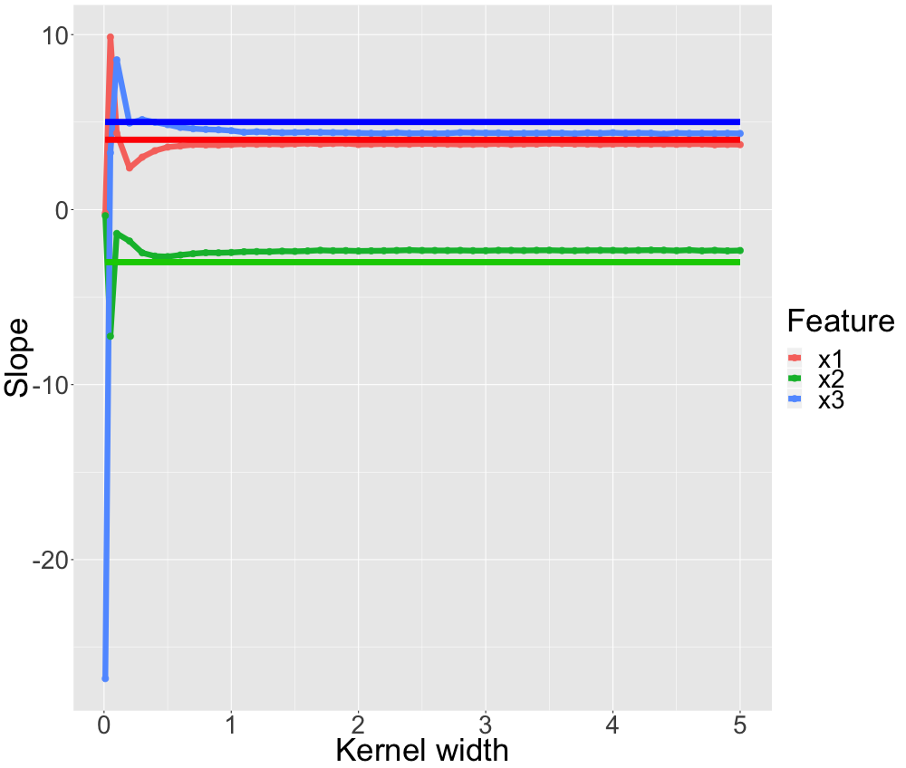
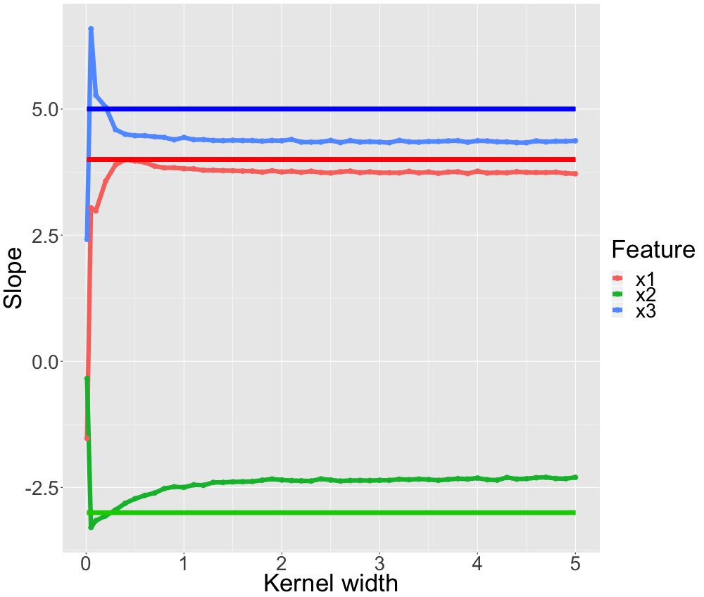
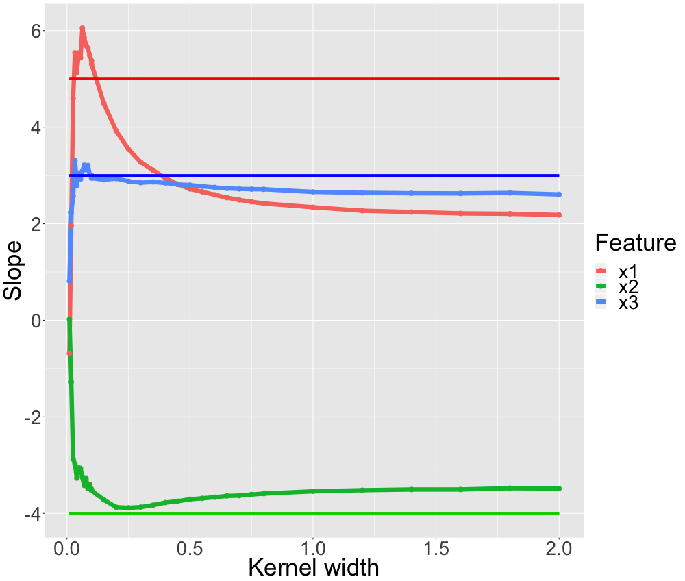
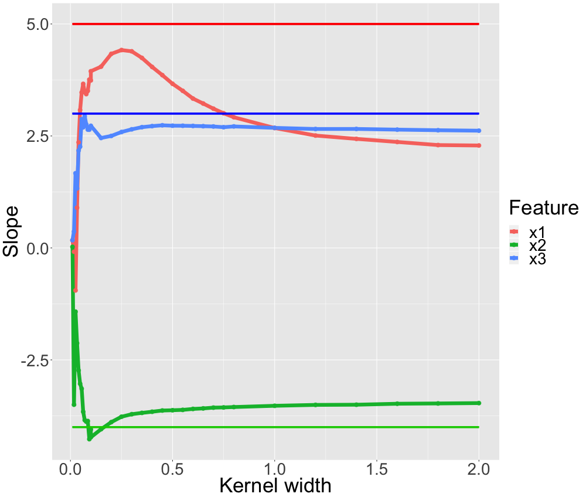
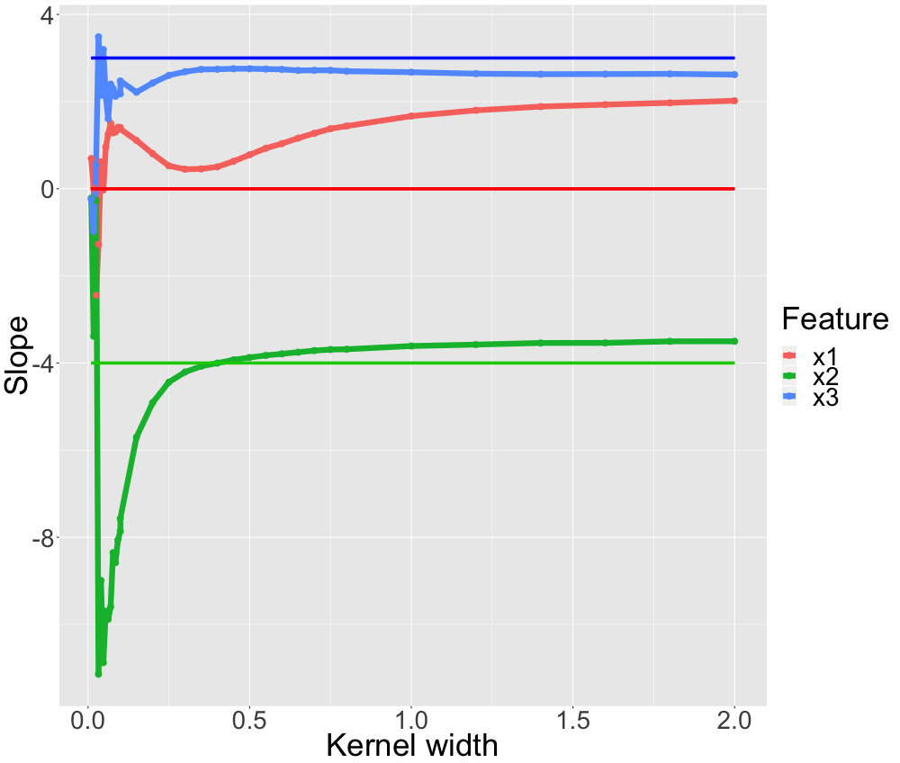
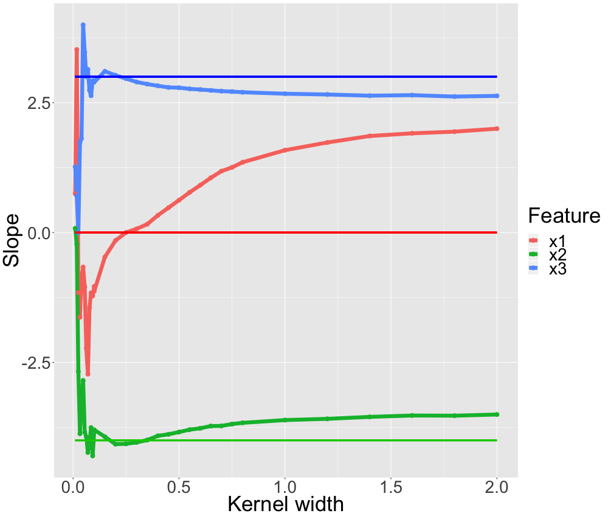

--- 
title: "Limitations of Interpretable Machine Learning Methods"
author: ""
date: "`r Sys.Date()`"
documentclass: krantz
bibliography: [book.bib, packages.bib]
biblio-style: apalike
link-citations: yes
colorlinks: yes
lot: yes
lof: yes
site: bookdown::bookdown_site
description: "Situations in which PDP, ALE, LIME, LOCO and feature importance fail."
graphics: yes
#cover-image: images/cover.jpg
---

```{r setup, include=FALSE}
options(
  htmltools.dir.version = FALSE, formatR.indent = 2, width = 55, digits = 4
)

```

# Preface {-}

This project explains the limitations of current approaches in interpretable machine learning, such as partial dependence plots (PDP, Accumulated Local Effects (ALE), permutation feature importance, leave-one-covariate out (LOCO) and local interpretable model-agnostic explanations (LIME).
All of those methods can be used to explain the behavior and predictions of trained machine learning models.
The interpretation methods might not work well in the following cases:

- if a model models interactions (e.g. when a random forest is used)
- if features strongly correlate with each other
- if the model does not correctly model causal relationships
- if parameters of the interpretation method are not set correctly


This book is licensed under the [Creative Commons Attribution-NonCommercial-ShareAlike 4.0 International License](http://creativecommons.org/licenses/by-nc-sa/4.0/).

```

## Structure of the book {-}

TODO


\mainmatter

<!--chapter:end:index.Rmd-->

# Introduction 

TODO


<!--chapter:end:00-introduction.Rmd-->

# Introduction to Partial Dependence Plots (PDP) and Individual Conditional Expectation (ICE)

## Partial Dependence Plots (PDP)

The Partial Dependence Plot (PDP) is a rather intuitive and easy-to-understand visualization of the features' impact on the predicted outcome. It maps the marginal effect of the selected variable(s) and can reveal the nature of dependence structure between target and individual feature variable.\citep{molnar2019}

The underlying function can be described as follows:

Let $x_S$ be the set of features of interest for the PDP and $x_C$ the complement set which contains all other features.
While the general model function $f(x) = f(x_S, x_C)$ depends on all input variables, the partial dependence function marginalizes over the feature distribution in set C \citep{hastie2013elements}:

$$f_{x_S}(x_S) = \mathbb{E}_{x_C}[f(x_S, x_C)]$$


The partial dependence function can be estimated by averaging the actual feature values of $x_C$ in the training data at given values of $x_S$ or, in other words, it computes the marginal effect of $x_S$ on the prediction. In order to derive realistic results, a major assumption of the PDP is that the features in $x_S$ and $x_C$ are independent and thus uncorrelated.\citep{hastie2013elements}

$$\hat{f}_{x_S}(x_S)=\frac{1}{n}\sum_{i=1}^{n}f(x_S, x^{(i)}_{C})$$


```{r echo=FALSE, out.width='90%', fig.cap="The PDP shows that the survival probability is sharply dropping until age 18 and more moderately afterwards."}
knitr::include_graphics('images/age_pdp.jpeg')
```

In classification problems with probability outputs, the partial dependence function is modeled separately for all of the K different classes, i.e. it shows the probability for each respective class at given feature values of $x_S$.\citep{hastie2013elements} 

```{r echo=FALSE, out.width='90%', fig.cap="The classification PDP reveals that passengers in lower classes had a lower probability to survive than those in a higher class."}
knitr::include_graphics('images/pdp_class.jpeg')
```


**Advantages and Limitations of Partial Dependence Plots**

Partial Dependence Plots are easy to compute and a poular way to explain insights from black box Machine Learning models. With their intuitive character, PDPs perfectly qualify for the communication to non-technical audience. However, due to limited visualization techniques and the restriction of human perception to a maximum of three dimensions, only one or two features can reasonably be displayed in one PDP.\citep{molnar2019}

```{r echo=FALSE, out.width='100%', fig.cap="The two-dimensional PDP for the numerical feature Age and the categorical feature Sex shows that while the survival probability for both genders declines as age increases, that there is a difference between genders an that the decrease is much steeper for males."}
knitr::include_graphics('images/pdp_2_features_1.jpeg')
```

```{r echo=FALSE, out.width='100%', fig.cap="The two-dimensional PDP for the numerical features Age and Fare illustrates that survival probability of younger passengers is fairly uniform, whilke from age 20 onwards, passengers travelling at a lower fare also had a much lower probability to survive than those that paid a high fare."}
knitr::include_graphics('images/pdp_2_features_2.jpeg')
```


Drawing a PDP with one or two feature variables allows a straight-forward interpretation of the marginal effects. This holds true as long as the features are not correlated. Should this assumption be violated, the partial dependence function will produce unrealistic data points. Furthermore, opposite effects of heterogeneous subgroups might remain hidden through averaging the marginal effects, which could lead to wrong conclusions.\citep{molnar2019}


## Individual Conditional Expectation Curves
While the partial dependence plots provide the average effect of a feature, the Individual Conditional Expectation (ICE) plots disaggregate this average and plot the functional relationship between the predicted response and the feature for individual instances. Thus, a PDP is the average of the lines of an ICE plot.\citep{molnar2019}


A formal definition: consider the response function $\hat{f}$, for each instance in ${(x^{(i)}_S, x^{(i)}_C)}^N_{i=1}$, the curve $\hat{f}_S^{(i)}$ is plotted against the observed values of $x^{(i)}_S$, while $x^{(i)}_C$ remains fixed.\citep{molnar2019}\citep{Goldstein2013}

In ICE plots, each line represents separately one instance and shows what would happen to the model’s prediction if the feature of a particular instance varied, holding all other features the same (c.p.). An ICE plot can highlight the variation in the fitted values across the range of a feature. This suggests where and to what extent heterogeneities might exist.

```{r echo=FALSE, out.width='80%', fig.cap="The ICE plot indicates that there is underlying heterogeneity in the complement set."}
knitr::include_graphics('images/ice_plot.jpeg')
```


###Centered ICE Plot###
Heterogeneity in the model can be difficult to distinguish when the curves have a wide range of intercepts and “stacked” on each other. The so called centered ICE plot (c-ICE) is a simple solution which removes level effects. The curves are centered at a certain point in the feature and display only the difference in the prediction to this point. \citep{molnar2019} After anchoring a location $x^a$ in the range of $x_s$ and connecting all prediction lines at that point, the new curves are defined as:

$$\hat{f}^{(i)}_{cent} = \hat{f^{(i)}} - \mathbf{1}\hat{f}(x^a,x^{(i)}_C)$$
It is recommended that the most interpretable plots occur when the minimum or the maximum observed value is chosen.


```{r echo=FALSE, out.width='80%', fig.cap="Centered ICE plot."}
knitr::include_graphics('images/c_ice_plot.jpeg')
```


###Derivative ICE Plot###
Another way to explore the heterogeneity is to show plots of the partial derivative
of $\hat{f}$ with respect to $x_s$. Assume that $x_s$ does not interact
with the other predictors in the fitted model, the prediction function can be written as:

$$\hat{f}(x) = \hat{f}(x_s,x_C) = g(x_s) + h(x_C),$$ 

so that $$\frac{\partial{\hat{f}(\mathbf{x})}}{\partial x_s} = g'(x_s)$$

When no interactions are present in the fitted model, all curves in the d-ICE plot are equivalent, and the plot shows a single line. When interactions do exist, the derivative lines will be heterogeneous. As it can be difficult to visually assess derivatives from ICE plots, it is useful to plot an estimate of the partial derivative directly.\citep{Goldstein2013}


###Advantages and Limitations of ICE Plots###
**Advantages**
ICE plots are more intuitive than PDPs and enable data scientists to drill much deeper to explore individual differences and identify subgroups and interactions between model inputs. 

**Disadvantages**
Firstly, only one feature can be plotted in an ICE plot meaningfully. Otherwise, there will be a problem of overplotting and you would see nothing. Secondly, ICE plots have the same problem as PDPs that some data points in the lines might be invalid. Finally, it might be difficult to see to average in ICE plots.\citep{molnar2019}


<!--chapter:end:01-00-pdp.Rmd-->

# PDP and Correlated Features

*Author: firstname lastname*


<!--chapter:end:01-1-pdp-correlated.Rmd-->

# PDP and Feature Interactions

*Author: firstname lastname*


<!--chapter:end:01-2-pdp-interactions.Rmd-->

# PDP and Causal Interpretation

*Author: firstname lastname*


<!--chapter:end:01-3-pdp-causal.Rmd-->

# Introduction to Accumulated Local Effects (ALE) 


## Motivation

As seen in section 2 PDPs don't work well as soon as two or more features are correlated. This gives rise to the definition of ALEs. Although their definition makes sense for high dimensional feature spaces including categorical features, within this section we only treat a space with two continous features. 

## The Theoretical Formula 

The uncentered ALE with respect to a starting point $z_{0, j}$ is defined by [@Apley2016] as
$$  \widetilde{ALE}_{\hat{f},~j}(x) = \hat{f}_{x_j,ALE}(x) = \int_{z_{0,~j}}^{x} E_{X_c \mid X_j} [\hat{f}^j(X_j,~X_c)\mid X_j = z_j]~dz_j,$$
where $\hat{f}$ is an arbitrary prediction function on the featurespace $X = (X_j,X_c)$ (with feature of interest $X_j$ and other features $X_c$) as well as its j-th partial derivative $\hat{f}^j(*,*)$.

### Centering

The ALE (centered ALE) is defined as

$$  ALE_{\hat{f},~j}(x) = \widetilde{ALE}_{\hat{f},~j}(x) - E_{X_j}[\widetilde{ALE}_{\hat{f},~j}(X_j)]$$ 

The centering makes sense as it helps interpreting the ALE in a reasonable way. This will be explained in section 3.4..


## Estimation Formula 

Since this theoretical formula is of no use for a blackbox model with unknown or even non existing gradients, an approximative approach will be used.
The uncentered ALE can be approximated by the formula 

$$ \widehat{\widetilde{ALE}}_{\hat{f},~j}(x) = \int_{z_{0,~j}}^{x} \sum_{k=1}^{K}   1_{]z_{k-1,~j},~z_{k,~j}]}(x_j)~ \frac{1}{n_j(k)}\sum_{i:x_j^{(i)}\in N_j(k)} \frac{[\hat{f}(z_{k,~j}, x_{\setminus j}^{(i)})-\hat{f}(z_{k-1,~j}, x_{\setminus j}^{(i)})]}{z_{k,~j}-z_{k-1,~j}}~dx_j~.  $$

In a first step the relevant dimension of the feature space is divided into K intervals beginning with the starting point $z_{0, j}$. As it is not clear how to exactly divide the feature space, section 3.x deals with that question. The upper boundary of the k-th interval is denoted by $z_{k, ~j}$ as well as the lower boundary by $z_{k-1, ~j}$. $N_j(k)$ denotes the k-th interval, i.e. $]z_{k-1,~j}, z_{k,~j}]$ and $n_j(k)$ the total number of observations having the j-value within this interval. $x_j^{(i)}$ is the j-value of the i-th observation and correspondingly $x_{\setminus j}^{(i)}$ the values of the other features. The term on the right approximates the expected partial derivative within each interval. 
Therefore each instance within an interval is shifted to the upper and lower limit of the interval and the total difference of the prediction is calculated. Devided by the length of the interval this is a reasonable approximation for the "local" effect on the prediction, if the feature of interest changes (cet. par.).
By averaging these approximations over all observations within the k-th interval, we recieve a rough estimator for the term $E_{X_c \mid X_j} [\hat{f}^j(X_j,~X_c)\mid X_j \in N_j(k)]$, which we take as constant effect for the k-th interval. 
By integrating over this step function, which represents the locally estimated derivatives, the (local) changes are accumulated. Thats why the name Accumulated Local Effects is quite reasonable.
The approximative formula for the centered ALE follows directly as
$$   \widehat{ALE}_{\hat{f},~j}(x) = \widehat{\widetilde{ALE}}_{\hat{f},~j}(x) - \frac{1}{n} \sum_{i=1}^{n} \widehat{\widetilde{ALE}}_{\hat{f},~j}(x_j^{(i)})~. 
 $$


### Implementation Formula

As both the centered and the uncentered ALE estimations are piecewise linear functions (integration over a step function), one can first calculate the ALE at the interval boundaries and interpolate in a second step. Therefore the folowing formula proposed by [@Apley2016, page 11] , with slightly changed notation will be useful. The definitions of its components are as above. Additionally $k_j(x)$ is defined as the number of the interval that contains $x$, i.e. $x \in ~]z_{k_j(x)-1,~j},~z_{k_j(x),~j}]$.  

$$  \widehat{\widetilde{ALE}}_{steps,~\hat{f},~j}(x) =  \sum_{k=1}^{k_j(x)}   \frac{1}{n_j(k)}\sum_{i:~x_j^{(i)}\in N_j(k)} [\hat{f}(z_{k,~j}, x_{\setminus j}^{(i)})-\hat{f}(z_{k-1,~j},~x_{\setminus j}^{(i)})].  $$
This formula returns a step function. The values in each interval are the accumulated values of the averaged total differences in each interval. To transfer this formula into the correct estimator of the uncentered ALE one has to linearely interpolate the points $(z_{k-1,~j},~\widehat{\widetilde{ALE}}_{steps,~\hat{f},~j}(z_{k-1,~j}))$ with $( z_{k,~j},\widehat{\widetilde{ALE}}_{steps,~ \hat{f},~j}(z_{k,~j}))$ for $k \in \{1, ..., K \}$ and $\widehat{\widetilde{ALE}}_{steps, \hat{f},j}(z_{0,~j}) = 0$.


Since in this formula there is no integral, it is easier to implement.


## Intuition and Interpretation 

As the former sections introduced the theoretical basics for the ALE, this section shall provide an intuition as well for the calculation method as for the interpretation. As described above, the local behaviour of the model with respect to the variable of interest is estimated by moving the existing data points to the boundaries of their interval and evaluating the total difference of the prediction for the "new" data points. Figure \@ref(fig:dataALE) first offered by [@molnar2019] gives a good intuition for this procedure. 


```{r dataALE, fig.cap='(ref:aleIntuition)', echo=FALSE}

knitr::include_graphics("images/ale_estimation_intuition.PNG")
```
(ref:aleIntuition) The data points within the 4-th interval are shifted to the interval boundaries $z_{3,~1}$ and $z_{4,~1}$.

First one splits the total range of the variable of interest (in this case $x_1$) to intervals of suitable size.  
For each interval the contained data points are moved to the interval boundaries. One gets twice as much "simulated" new data points as originally contained in each interval. The prediction function is now evaluated at this simulated points and the total difference of the prediction (for the given interval) is estimated as the mean change. Divided by the length of the interval one gets an estimation for the partial derivative within this interval. Theoretically one recieves the uncentered ALE by integration over this step function. Technically in a first step the total change per interval is accumulated. In a second step linear interpolation at the interval boundaries simulates a constant change within each interval. Both variants lead to the same result.      


As the evaluation is ideally done on relatively small intervals, on the one hand the local behaviour of the model is estimated. On the other hand the covariance structure of the features is taken into account, as only "realistic" data points are simulated. This is in accordance with sampling from the conditional distribution.

In a last step the uncentered ALE is centered, i.e. shifted by a constant such that the expectation of the centered ALE is zero.  

Figure \@ref(fig:aleEx) shows an example ALE which could match the data situtaion of Figure \@ref(fig:dataALE) :

```{r aleEx, fig.cap='(ref:aleExample)', echo=FALSE}

knitr::include_graphics("images/ale_example.png")
```
(ref:aleExample) ALE on basis of 5 intervals

To understand the interpretation of the ALE it can be usefull to first have a look on the intuition behind the uncentered ALE.
If the value of the uncentered ALE at $x_1 = 2$ equals $1$, this means that if one samples a data point from the joint distribution of both features but only knows that $x_1 = 2$, one would expect the prediction to be 1 higher than the average prediction for  realistic data points at $x_1 = z_{0,1}$ (i.e. data points sampled from the conditional distribution at $x_1 = z_{0,1}$). This expectation strongly depends on the reference point $z_{0,1}$, which per definition is smaller than the smallest $x_1$-value of the data.
By substracting the expectation of the uncentered ALE - which is the mean difference of the prediction of a data point from the joint distibution to the prediction of a realistic data point(i.e. from the conditional distribution) at $x_1 = z_{0,1}$ - the interpretation becomes a lot easier. If the value of the (centered) ALE at $x_1 = 2$ equals for example $2$, this means that, if one samples a data point from the joint distribution of both features and $x_1$ equals 2, one would expect the prediction to be 2 higher than the average prediction for an average data point of the joint distribution.          

So far only the case of 2-dimensional feature spaces with one feature of interest was taken into account. In the following chapters methods and interpretation for ALE with two numeric features (second order effects) or one categorical feature will be in the focus. Furthermore we will have a look on the size of the intervals the data is evaluated on, which can be crucial for the expressiveness of the ALE.

<!--chapter:end:02-00-ale.Rmd-->

# Comparison of ALE and PDP

*Author: firstname lastname*


<!--chapter:end:02-4-ale-pdp.Rmd-->

# ALE Intervals, Piece-Wise Constant Models and Categorical Features

*Author: firstname lastname*

<!--chapter:end:02-5-ale-other.Rmd-->

# Introduction to Feature Importance

As in previous chapters already discussed, there exist a variety of methods that enable a better understanding of the relationship between features and the outcome variables, especially for complex machine learning models. For instance, Partial Dependence (PD) plots visualize the feature effects on a global, aggregated level, whereas Individual Conditional Expectation (ICE) plots unravel the average feature effect by analyzing individual observations, allowing to detect, if existing, any heterogeneous relationships. Yet, these methods do not provide any insights to what extent a feature contributes to the predictive power of a model - in the following defined as feature importance. This perspective becomes interesting when recalling that so far black-box machine learning models aim for predictive accuracy rather than for inference, and hence, it is persuasive to also establish agnostic-methods that focus on the performance dimension. In the following, the two most common approaches, Permutation Feature Importance (PFI) by @breiman2001random and Leave-One-Covariate-Out (LOCO) by @lei2018distribution, for calculating and visualizing a Feature Importance metric, are introduced. At this point, however, it is worth to clarify that the concepts of feature effects and feature importance can by no means be ranked but rather should be considered as mutual complements that enable the interpretability from different angles. After introducing the concepts of PFI and LOCO, a brief discussion of their interpretability but also its non-negligible limitations will follow.

## Permutation Feature Importance (PFI)

The concept of Permutation Feature Importance was first introduced by @breiman2001random and applied on a random forest model. The main principle is rather straightforward and easily implemented. The idea is as follows: When permuting the values of feature $j$, its explanatory power mitigates, as it breaks the association to the outcome variable $y$. Therefore, if the model relied on the feature $j$, the prediction error $e = L(y,f(X))$ of the model $f$ should increase when predicting with the "permuted feature" dataset $X_{perm}$ instead of with the "initial feature" dataset $X$. The importance of feature $j$ is then evaluated by the increase of the prediction error which can be either determined by taking the difference $e_{perm} - e_{orig}$ or taking the ratio $e_{perm}/e_{orig}$. Note, taking the ratio can be favorable when comparing the result across different models. A feature is considered less important, if the increase in the prediction error was comparably small and the opposite if the increase was large. Thereby, it is important to note that when calculating the prediction error based on the permuted features there is no need to retrain the model $f$. This property constitutes computational advantages, especially in case of complex models and large feature spaces. Below, a respective PFI algorithm based on @fisher2018model is outlined. Note however, that their original algorithm has a slightly different specification and was adjusted here for general purposes.

**The Permutation Feature Importance algorithm based on Fisher, Rudin, and Dominici (2018):**

Input: Trained model $f$, feature matrix $X$, target vector $y$, error measure $L(y,f(X))$

1. Estimate the original model error $e_{orig} = L(y,f(X))$ (e.g. mean squared error)
2. For each feature $j = 1,...,p$ do:
    * Generate feature matrix $X_{perm}$ by permuting feature j in the data $X$
    * Estimate error $e_{perm} = L(y,f(X_{perm}))$ based on the predictions of the permuted data
    * Calculate permutation feature importance $PFI_{j} = e_{perm}/e_{orig}$. Alternatively, the difference can be used: $PFI_{j} = e_{perm} - e_{orig}$
3. Sort features by descending FI.

<br>

In Figure \@ref(fig:PFI) it is illustrated, by a fictional example, how the permutation algorithm alters the original dataset. For each of the $p$ features, the respectively permuted dataset is then used to first predict the outcomes and then calculate the prediction error. 


<br>
```{r PFI,out.width="65%", echo = FALSE, message = FALSE, fig.align='center', fig.cap="Example for Permutation Feature Importance"}
knitr::include_graphics("images/Permutation_All.jpg")
```

<br>

To show, how the PFI for all features of a model can be visualized and thereby more conveniently compared, the PFI algorithm with a random forest model is applied on the dataset "Boston" (see Figure \@ref(fig:plot)), which is available in R via the `MASS` package. To predict the house price, seven variables are included, whereby as the results show, the PFIs vary substantially across the variables. The depicted points correspond to the median PFIs over all shuffling iterations of one feature and the boundaries of the bands illustrate the 0.05- and 0.95-quantiles, respectively (see `iml` package).  

<br>

<center>
```{r plot, echo = FALSE, message = FALSE, fig.height=6, fig.width=12, fig.cap="Visualization of Permutation Feature Importance with a random forest applied on Boston dataset"}

library(iml)
library(ggplot2)
library(randomForest)

set.seed(040232359)
data("Boston", package = "MASS")
Boston <- Boston[,c(1,6,13,8,12,14,5,7)]
rf <- randomForest(medv ~ ., data = Boston, ntree = 50)
y = Boston$medv
X = Boston[-which(names(Boston) == "medv")]
mod = Predictor$new(rf, data = X, y = y)
  # Compute feature importances as the performance drop in mean absolute error
  imp = FeatureImp$new(mod, loss = "mae", n.repetitions = 5, compare = "ratio")
  # Plot the results directly
  imp.dat = imp$results

  imp.dat[which(imp.dat$feature == "rm"),]$feature <- "Rooms"
  imp.dat[which(imp.dat$feature == "lstat"),]$feature <- "Status of the Population"
  imp.dat[which(imp.dat$feature == "dis"),]$feature <- "Employment Centers Dist."
  imp.dat[which(imp.dat$feature == "crim"),]$feature <- "Crime Rate"
  imp.dat[which(imp.dat$feature == "nox"),]$feature <- "Nitric Oxides conc."
  imp.dat[which(imp.dat$feature == "age"),]$feature <- "Age"
  imp.dat[which(imp.dat$feature == "black"),]$feature <- "Blacks"

  
 p1 <- ggplot(data = imp.dat, aes(x = reorder(feature, importance), ymin=importance.05, ymax=importance.95)) + 
    geom_errorbar(width=0.3, size=1, color="darkblue") + 
    geom_point(mapping=aes(x=feature, y=importance), size=3, shape=21, fill="white") +
    coord_flip() +
    theme(plot.subtitle = element_text(size = 10)) +
    labs(y = "Feature Importance (ratio MAE)", x= "") + 
    theme(text = element_text(size = 16))
  
p1 
```

</center>

## Leave-One-Covariate-Out (LOCO)

The concept of Leave-One-Covariate-Out (LOCO) is as already mentioned a different approach to PFI with the same objective, to gain insights on the importance of a specific feature for the prediction performance of a model. Although applications of LOCO exist, where comparable to PFI, the initial values of feature $j$ are replaced by its mean, median or zero [see @hall2017ideas], and hence, circumvent the disadvantage of re-training the model $f$, the common approach follows the idea to simply leave the respective feature out. The overall prediction error of the re-trained model $f_{-j}$ is then compared to the prediction error resulted from the baseline model. However, re-training the model results in higher computational costs, becoming more severe with an increasing feature space. Besides, as one is actually interested in assessing the Feature Importance of a fixed model $f$, comparing the performance of a fixed model with the performance of a model $f_{-j}$ fitted merely with a subset of the data, might raise plausible concerns [see @molnar2019].
The pseudo-code shown below, illustrates the algorithm for the common case where the feature is left out [see @lei2018distribution].

**The Leave-One-Covariate-Out algorithm based on Lei et al. (2018):**

Input: Trained model $f$, feature matrix $X$, target vector $y$, error measure $L(y,f(X))$

1. Estimate the original model error $e_{orig} = L(y,f(X))$ (e.g. mean squared error)
2. For each feature $j = 1,...,p$ do:
    * Generate feature matrix $X_{-j}$ by removing feature j in the data $X$
    * Refit model $f_{-j}$ with data $X_{-j}$
    * Estimate error $e_{-j} = L(y,f_{-j}(X_{-j}))$ based on the predictions of the reduced data
    * Calculate LOCO Feature Importance $FI_{j} = e_{-j}/e_{orig}$. Alternatively, the difference can be used: $FI_{j} = e_{-j} - e_{orig}$
3. Sort features by descending FI.


<br>


In Figure \@ref(fig:LOCO) it is shown, how the LOCO algorithm alters the original dataset, whereby it always differs, depending on the respective feature that is left out. Note, that the qualitative and quantitative interpretations correspond the ones from the PFI method. So do the visualization tools and therefore at this point it is refrained from providing the reader with an additional real data example. 

<br>

```{r LOCO,out.width="65%", fig.align='center',echo = FALSE, message = FALSE,fig.cap="Example for Leave-One-Covariate-Out Feature Importance"}
knitr::include_graphics("images/LOCO_All.jpg")
```

<br>


## Interpretability of Feature Importance and its Limitations


After both methods are discussed, the question to what extent these agnostic-methods can contribute to a more comprehensive interpretability of machine learning models will be now touched on. By doing so, it is necessary to also reflect upon the limitations of the model regarding the interpretability of the results. The latter will constitute the main focus in the following chapters. 
Conveniently, both methods are highly adaptable on whether using classification or regression models, as they are non-rigid towards the prediction error metric (e.g. Accuracy, Precision, Recall, AUC, Average Log Loss, Mean Absolute Error, Mean Squared Error etc.). This allows to assess Feature Importance based on different performance measures. Besides, the interpretation can be conducted on a high-level, as both concepts do consider neither the shape of the relationship between the feature and outcome variable nor the direction of the feature effect. However, as illustrated in Figure \@ref(fig:plot), PFI and LOCO only return for each feature a single number and thereby neglect possible variations between subgroups in the data. Chapter XX will focus on how this limitation can be, at least for PFI, circumvented and introduces the concepts of Partial Importance (PI) and Individual Conditional Importance (ICI) which both avail themselves on the conceptual ideas of PD and ICE [see @casalicchio2018visualizing]. Besides, two general limitations appear when some features in the feature space are correlated. First, correlation makes an isolated analysis of the explanatory power of a feature complicated which results in an erroneous ranking in Feature Importance and hence, in incorrect conclusions. Second, if correlation exists and only in case of applying the PFI method, permuting a feature can result in unrealistic data instances so that the model performance is evaluated based on data which is never observed in reality. This makes comparisons of prediction errors complicated and therefore it should always be checked for this problem, if applying the PFI method. Chapter XX will focus on this limitations by comparing the performance of PFI and LOCO for different models and different levels of correlation in the data. Beyond these limitations, it is evident to also question whether these agnostic-methods should be computed on training or test data. As answering that depends highly on the research question and data, it is refrained from going into more detail at this point but will be examined and further discussed in chapter XX. 


<!--chapter:end:03-00-feature-importance.Rmd-->

# PFI, LOCO and Correlated Features

*Author: firstname lastname*

<!--chapter:end:03-6-fi-correlated.Rmd-->

# Partial and Individual Permutation Feature Importance

*Author: firstname lastname*

<!--chapter:end:03-7-pfi-ici.Rmd-->

# PFI: Training vs. Test Data

*Author: firstname lastname*

<!--chapter:end:03-8-fi-training-test.Rmd-->

# Introduction to Local Interpretable Model-Agnostic Explanations (LIME)

When doing machine learning we always build models.
Models are simplifications of reality.
Even if the predictive power of a model may be very strong, it will still only be a model.
However, models with high predictive capacity do most of the time not seem simple to a human as seen throughout this book.
In order to simplify a complex model we could use another model.
These simplifying models are referred to as surrogate models.
They imitate the black box prediction behaviour of a machine learning model subject to a specific and important constraint: 
surrogate models are interpretable.
For example, we may use a neural network to solve a classification task.
While a neural network is anything but interpretable, we may find that some of the decision boundaries are explained reasonably well by a logistic regression which in fact yields interpretable coefficients.

In general, there are two kinds of surrogate models: global and local surrogate models.
In this chapter, we will focus on the latter ones.

## Local Surrogate Models and LIME

The concept of local surrogate models is heavily tied to @ribeiro2016should, who propose local interpretable model-agnostic explanations (LIME). 
Different from global surrogate models, local ones aim to rather explain single predictions by interpretable models than the whole black box model at once.
These surrogate models, also referred to as explainers, need to be easily interpretable (like linear regression or decision trees) and thus may of course not have the adaptability and flexibility of the original black box model which they aim to explain.
However, we actually don't care about a __global__ fit in this case.
We only want to have a very __local__ fit of the surrogate model in the proximity of the instance whose prediction is explained. 

A LIME explanation could be retrieved by the following algorithm:

1. Get instance $x$ out of the data space for which we desire an explanation for its predicted target value.

2. _Perturb_ your dataset $X$ and receive a perturbed data set $Z$ of increased size. 

3. Retrieve predictions $\hat{y}_{Z}$ for $Z$ using the black box model $f$.

4. Weight $Z$ w.r.t. the proximity/neighbourhood to $x$.

5. Train an explainable weighted model $g$ on $Z$ and the associated predictions $\hat{y}_{Z}$.

Return: An explanation for the interpretable model $g$.

The visualisation below nicely depicts the described algorithm for a two-dimensional classification problem based on simulated data.
We start only with our data split into two classes: 1 and 0.
Then, we fit a model that can perfectly distinguish between the two classes.
This is indicated by the sinus-shaped function drawn as a black curve.
We do not perturb the data in this case.
(However, we may argue that our perturbation strategy is to use the original data.
We will more formally discuss perturbation later on.)
Now, we choose the data point, which we want an explanation for.
It is coloured in yellow.
With respect to this point, we weight our data by giving close observations higher weights.
We illustrate this by the size of data points.
Afterwards, we fit a classification model based on these weighted instances.
This yields an interpretable linear decision boundary -- depicted by the purple line. 
As we can see, this is indeed locally very similar to the black box decision boundary and seems to be a reasonable result.

```{r, echo = FALSE}
output <- knitr::opts_knit$get("rmarkdown.pandoc.to")
is.html = !is.null(output) && output == "html"
```

```{r, eval = is.html, echo = FALSE, fig.align = 'center', fig.cap = "Simplified GIF representation of the LIME algorithm."}
knitr::include_graphics("images/lime.gif")
```

```{r, eval = !is.html, echo = FALSE, fig.align = 'center', out.width = '99%', fig.cap = "Simplified graphical representaion of the LIME algorithm. Each single panel represents one step of the described algorithm. It reads from left to right."}
knitr::include_graphics("images/lime.png")
```

This way we receive a single explanation.
This one explanation can only help to understand and validate the corresponding prediction.
However, the model as a whole can be examined and validated by multiple (representative) LIME explanations.

## How LIME works in detail

So far so good. 
However, the previous outline was not very specific and leaves (at least) three questions.
First, what does neighbourhood refer to?
Second, what properties should suitable explainers have?
Third, what data do we use, why and how do we perturb this data?

To better assess these open questions it may be helpful to study the mathematical definition of $LIME$.
The explanation for a datapoint $x$, which we aim to interpret, can be represented by the following formula:

$$explanation\left(x\right) = arg\,min_{g \epsilon G} \,\mathcal{L}\left(f, g, \pi_x \right) + \Omega\left(g\right)$$

Let's decompose this compact, yet precise definition:

$x$ can be an instance that is entirely new to us as long as it can be represented in the same way as the training data of the black box model.
The final explanation for $x$ results from the maximisation of the loss-like fidelity term $\mathcal{L}\left(f, g, \pi_x \right)$ and a complexity term $\Omega\left(g\right)$.
$f$ refers to the black box model we want to explain and $g$ to the explainer. 
$G$ represents the complete hypothesis space of a given interpretable learner.
The explanation has to deal with two trade-off terms when minimising: 
The first term $\mathcal{L}\left(f, g, \pi_x \right)$ is responsible to deliver the optimal fit of $g$ to the model $f$ while a low _loss_ is desirable indicating high (local) _fidelity_.
The optimal fit is only found with respect to a proximity measure $\pi_x(z)$ in the neighbourhood of $x$.

### Neighbourhood

This leads us to the first open question:
What does neighbourhood refer to?
Neighbourhood is a very vague term.
This is for good reason because a priori it is not clear how to specify a neighbourhood properly.
Technically, there are many different options to deal with this issue.
Weighting the observations w.r.t. their distance to the observation being explained seems like a good idea.
This may possibly be implemented as an arbitrarily parametrised kernel.
However, this leaves in total many scientific degrees of freedom which makes the neighbourhood definition somewhat problematic.
This neighbourhood issue will be discussed in more detail in the next chapter.

### What makes a good explainer?

We already answered the second open question -- what properties suitable explainers should have -- in parts.
We mentioned the interpretability property and outlined generalised linear models or decision trees as examples.
However, we did not discuss further desired properties of these models.
Since they have strong assumptions, it is unlikely that they are capable of maintaining an optimal fit to the original black box model. 
Recall our formula.
As we want local optimal fit subjected to a certain (low) degree of explainer complexity -- in order to allow interpretation -- our formula needs to facilitate this aspect.
$\Omega\left(g\right)$ is our complexity measure and responsible to choose the model with the lowest complexity.
For example, for decision trees, tree depth may describe the complexity.
In the case of linear regression, the $L_1$ norm may indicate how simple the interpretation has to be. 
The resulting LASSO model allows us to focus only on the most important features.

### Sampling and perturbation

Having answered the first two open question we still have the last question related to the data and the perturbation unresolved.
Besides the tabular data case, we can also interpret models trained on more complex data, like text data or image data. 
However, some data representations (e.g. word embeddings) are not human-interpretable and must be replaced by interpretable variants (e.g. one-hot-encoded word vectors) for LIME to yield interpretable results.
The function modeled by the black box model operates in the complete feature space. 
It can even yield predictions for instances not seen in the training data.
This means that the original data does not sufficiently explore the feature space.
Hence, we want to create a more complete _grid_ of the data and fill the feature space with new observations so that we can better study the behaviour of the black box model.
Still, the data for the explainer should be related to the original data.
Otherwise the explainer may be ill-placed in space having nothing in common with the original problem anymore.
This is why we perturb the original data.
But how does perturbation work?
This is a priori not clear at all.
For categorical features, perturbation may be realised by randomly changing the categories of a random amount of features, or even recombining all possible levels of these. 
Numerical features may be drawn from a properly parametrised (normal) distribution.
The perturbed data set, which is used to train the explainer, should be much larger than the original one and supposed to better represent the (possible) feature space, giving the surrogate model more anchor points -- especially in sparse areas.
Further details on this topic will be studied in chapter X.

## Example

A fully implemented example of LIME can be seen in the following code block with its resulting plot. In the latter we can observe how much each feature contributes to the surrogate model's prediction and to what extend this prediction offers a good fit on the black box model ('Explanation Fit' between 0 and 1).

```{r, eval = TRUE, echo = FALSE, warning = FALSE}
required_packages = c("lime", "mlr")
install_these = required_packages[!(required_packages %in%
                                      installed.packages())]
if (length(install_these) > 0) install.packages(install_these)
```

```{r, eval = TRUE, echo = TRUE, fig.align = 'center', out.width = '99%', fig.cap = "Basic example of a LIME application. We create a black box model on the iris dataset without the first data point and then explain the prediction of this point with LIME."}
library(lime)
library(mlr)

# separate data point we want to explain
to_explain  = iris[ 1, 1:4]
train_set   = iris[-1, ]

# create task and calculate black box model
task_iris   = makeClassifTask(data = train_set, target = "Species")
learner     = makeLearner("classif.randomForest", ntree = 200, predict.type = "prob")
black_box   = train(learner, task_iris)

# use lime to explain new data point
explainer   = lime(train_set[, 1:4], black_box)
explanation = explain(to_explain,
                      explainer,
                      n_labels = 1,
                      n_features = 4)

plot_features(explanation)
```

## Outlook

The definition of LIME still seems after all very rough and vague.
This leaves us many scientific degrees of freedom when implementing it -- for the good and for the bad.
For example, we see that the model $f$ can be any machine learning model that exists.
This gives us the opportunity to drastically change the underlying predictive model while keeping the same explainer $g$ with the same complexity constraints. 

On the other hand, LIME being a very generic approach also means that many "hyperparameters", like the neighbourhood definition or the sampling/perturbation strategy, are arbitrary.
Hence, it is likely that in some use cases LIME explanations heavily depend on changing the hyperparameters.
In these cases, the explanations can hardly be trusted and should be treated with great care.

The following two chapters will focus on two very significant hyperparameters: 
the neighbourhood definition and the sampling strategy.
They will investigate how these affect the results of the method and their interpretability.
We will emphasise the coefficient stability of LIME explainers in order to illustrate the trustworthiness of the results. 

<!--chapter:end:04-00-lime.Rmd-->

# LIME and Neighbourhood

*Author: Philipp Kopper*

How much neighbourhood may be an issue can be illustrated in a setting very different to LIME:
Descriptive statistics or in particular kernel density estimations.
Figure \@ref(fig:fig1) illustrates kernel densities from a standard normal distribution.

```{r, fig1, eval = TRUE, echo = FALSE, fig.align = 'center', out.width = '99%', fig.cap = "The appropriate kernel width for kernel density estimations."}
knitr::include_graphics("images/04-09-01.png")
```

One can easily see that the first panel seems to be appropriate while the second one is too granular.
The proper definition of the neighbourhood is in this case very crucial.
However, with no prior information this definition is arbitrary.
We can only judge on the proper definition of the neighbourhood from our experience and our expectations.
This may work in low dimensional problems and descriptive statistics.
However, machine learning models operate in multivariate space and mostly tackle complex associations.
Thus, it seems much harder to argue on the proper neighbourhood definition when working with LIME.

This chapter reviews the neighbourhood issue w.r.t. the LIME algorithm critically.
The objective of this chapter is more to outline this particular issue and not to suggest solutions for it.
First of all, it describes the neighbourhood defintion abstractly in greater detail. 
Then, it illustrates how problematic the neighbourhood definition is in a simple one-dimensional example.
Furthermore, we study the effect of altering the kernel size more systematically in more complex contexts in the next section.
The first subsection investigates multivariate globally linear relationships.
The second one researches local coefficients.
The third one studies non-linear effects.
Afterwards, we apply the insights from simulated data to a real data set and suggest best practises for setting an appropriate kernel width when working with LIME.

## The Neighbourhood in LIME in more detail

When obtaining explanations with LIME the neighbourhood of an instance is determined when fitting the model by applying weights to instances w.r.t. proximity to the instance of interest.
However, it is important to note that this step is already arbitrary.
@craven1996 show that increasing the density of observations around the instance of interest is very helpful to achieve model fidelity.
This could be obtained in many other ways than weighting observations as in LIME.
One possible alternative might be to combine steps 2 (sampling) and 4 (weighting) of the LIME algorithm.
This way we would increase the density around the instance already by proper sampling. 
In fact, @laugel2018defining claim that this way should be preferred over the way LIME samples.
In this chapter, however, we focus on the explicit implementation in LIME and analyse how the weighting strategy _ceteris paribus_ affects surrogate model stability.

When working with LIME, the weighting of instances is performed using a kernel function over the distances of instances to the instance of interest.
This leaves us two _arbitrary_ (in fact they may not be _that_ arbitrary) choices:
the distance and the kernel function.
Typical distance functions applicable to statistical data analysis are based on the L0, L1 and L2 norms.
For numerical features one tends to use either manhattan distance (L1) or euclidean distance (L2).
For categorical features one would classically apply hamming distance (L0).
Mixed data (data with both categorical and numerical features) usually one combines distances for numerical and categorical features.
So does Gower's distance @gower1986metric: 

$$ d_G(x_i, x_j) = \sum_{p = 1} ^ {P} \frac{d_{euc}(x_{p, i}, x_{p, j})}{ 
range(x_p)} $$
or a bit more general the distance proposed by @huang1998kproto

$$ d_H(x_i, x_j) = d_{euc}(x_i, x_j) + \lambda d_{ham}(x_i, x_j) $$

with $d_{euc}$ refering to the euclidean distance and $d_{ham}$ to the hamming distance.
$\lambda$ steers the importance of categorical features relative to numerical ones.
However, it is important to note that despite these mesasures it may be challenging to properly determine distances for mixed data properly. @ribeiro2016should recommend using cosine distance for text, euclidean distance for images.

For the kernel function itself there are two hyperparameters to be set.
First of all the type of the kernel.
Second, the kernel width.
By default the R implementation implements an exponential kernel where the kernel width equls the square root of the number of features.

As the choice of the distance measure seems least arbitrary and the choice of the kernel function is not expected to have crucial impact on the neighbourhood definition, we focus on the kernel width in our experimental study.
However, it is very important to notice that practically the distance measure may interact with the kernel width.
This is because as of 2019 the current implementation in R Gower distance does not apply any kernel as it already returns scaled distances.
We observed that this property may have some undesired properties as global models seem to be preferred over local models.
We suggest to implement a kernel function also for the Gower distance.
We are currently working on this issue in collaboration with the package owner.

## The problem in a one-dimensional setting

How crucial the kernel width is can be illustrated by a very simple example.
We simulate data with one target and two features.
One feature is purely noise and the other one has a non-linear sinus-like effect on the target.
If we plot the influential feature on the x-axis and the target on the y-axis we can observe this pattern in figure \@ref(fig:fig2).

```{r, fig2, eval = TRUE, echo = FALSE, fig.align = 'center', out.width = '99%', fig.cap = "Simulated data: Non-linear univariate relationship."}
knitr::include_graphics("images/04-09-02.png")
```

Now we fit a random forest on this problem which should be able to detect the non-linearity and incorporate it into its predictive surface.
In fact, we observe that the predictions of the random forest look very accurate in figure \@ref(fig:fig3)

```{r, fig3, eval = TRUE, echo = FALSE, fig.align = 'center', out.width = '99%', fig.cap = "Simulated data: Random Forest Predictions."}
knitr::include_graphics("images/04-09-03.png")
```

LIME could now be used to explain this random forest locally.
"Good" local models would look very different w.r.t. the value of the feature.
We could describe the data locally well by piece-wise linear models.
This is depicted in the figure \@ref(fig:fig4).

```{r, fig4, eval = TRUE, echo = FALSE, fig.align = 'center', out.width = '99%', fig.cap = "Simulated data: Non-linear univariate relationship linearly interpolated."}
knitr::include_graphics("images/04-09-04.png")
```

LIME should be able to find these good local explanations given the right kernel size.
Let's select one instance that is close to the predictive surface. 
We indicate this by the green point in figure 4.
This particular instance can be linearly described by a linear regression with approximately intercept $60$ and slope $-4.5$.
If we set the kernel width to $0.08$, we actually fit this local model (on average).
This is indicated by the red line in figure 4.
However, if we increased the kernel width to $2$ the coefficients change to $-2.84$ (intercept) and $0.64$ (slope) (on average) which seems drastically distorted as observed by the yellow line in figure \@ref(fig:fig5).
The second line does not seem to fit a local linear model but rather a global one.

```{r, fig5, eval = TRUE, echo = FALSE, fig.align = 'center', out.width = '99%', fig.cap = "Simulated data: Possible local models for univariately non-linear data."}
knitr::include_graphics("images/04-09-05.png")
```

More systematically we review explanations resulting from altering the kernel size in figure \@ref(fig:fig6). 
We average over many different models to achieve more robust local models.
We do that because we observe some coefficent variation resulting from the (random) sampling.
In figure \@ref(fig:fig6) (upper panel) we see these averaged models for 8 different kernel sizes.
We observe that the larger we set the kernel size, the more we converge to a linear model that operates globally.
In fact, the largest three kernel sizes ($0.5$, $1$ and $2$) appear very global while $0.005$, $0.05$ and $0.1$ seem to fit good local models.
$0.25$ and $0.3$ are neither global nor very local.
This is very intuitive and complies with the idea of a weighted local regression.

Additionally, we analyse the same alteration of the kernel size for an observation where a good local approximation would be a linear model with positive slope in the lower panel of figure \@ref(fig:fig6).
We observe a similar behaviour.

```{r, fig6, eval = TRUE, echo = FALSE, fig.align = 'center', out.width = '99%', fig.cap = "Simulated data: Local models for univariately non-linear data with different kernel sizes."}
knitr::include_graphics("images/04-09-06.png")
```

This behaviour is not necessarily a problem but only a property of the LIME.
However, it is problematic that the appropriate kernel size is not a priori clear.
Additionally, there is no straight forward way to determine a good kernel width for a given observation to be explained.
The only generic goodness-of-fit criterion of LIME, model fidelity, is endogenous w.r.t. the kernel size.
If we set the kernel size very small there will be many models with extremely good local fit as local refers only to a single observation.
In our examples it looks as if a very small kernel sizes should be prefered.
A small kernel width indeed grants local fit.
But what a small kernel width is also strongly depends on the dimensionality and complexity of the problem.

## The problem in more complex settings

The previous setting was trivial for LIME.
We could visualise the predicitve surface in the first place.
This means that interpretability was largely given in the first place.
We will study our problem in more complex settings to show that the problem persists.
We will do so by examining simulated and real data.

### Simulated data

We simulate data with multiple numeric features and a numeric target.
We assume the features to originate from a multivariate normal distribution where all features are moderately correlated.
Note that the choice of the normal distribution to be consistent with the assumptions within LIME.
We simulate three different data sets. 
In the first one the true associations are linear (globally linear).
In the second one the true assocations are linear but only affect the target within a sub interval of the feature domain (locally linear).
This should examine LIME's ability to determine local feature importance.
In the third one we exchange one of the linear associations from the first simulation with a non-linear one (globally non-linear).
For all three data sets, we expect the kernel width to have impact on the resulting explainer.
However, for the global linear relationships we expect the weakest dependency because the true local model and the true global model are identical.

We refrain from simulating more complex data sets as we strongly favour that the true marginal predicitive surface is human interpretable.

#### Global Linear Relationships

We simulate data where the true predicitve surface is a hyperplane.
Good machine learning models should be able to approximate the hyperplane.
This case is somewhat trivial because LIME.
The most suitable model for this data would be linear regression which is interpretable in the first place.
However, LIME can be easily tested in this controlled environment.
We know the true local coefficients as they equal to the global ones.
Thus, we can evaluate the goodness of the kernel width appropriatley.

The simulated data looks as follows:
The feature space consists of three features ($x_1$, $x_2$, $x_3$).
All originate from a multivariate Gaussian distribution with mean $\mu$ and covariance $\Sigma$.
$\mu$ is set to be $5$ for all features and $\Sigma$ incorporates moderate correlation.
The true relationship of the features on the target $y$ is described by:

$$ y = \beta_0 + \beta_1 x_1 + \beta_2 x_2 + \beta_3 x_3 + \epsilon $$
We set the true coefficients to be $\beta_1 = 4$, $\beta_2 = -3$, $\beta_1 = 5$.

We use a random forest as black box model.
Below we indicate the test set performance of the model in figure 7.
It seems as if the random forest largely succeeds in finding the true association between the features and the target.

```{r, eval = TRUE, echo = FALSE, fig.align = 'center', out.width = '99%', fig.cap = "Simulated data: Model evaluation for random forest."}
knitr::include_graphics("images/04-09-07.png")
```

We choose random observations and compute the local LIME model for each one w.r.t. different kernel sizes.
In this case we assume that the kernel size may be infinitely large as the global model should equal good local models.
However, if the kernel width is set too small we may fit too much noise.
Hence, in this case we may find no good local models.

The figures below (all four panels of figure 8) indicate the local parameters for one of the selected observations for different kernel sizes which have been determined by LIME.
The three vertical line indicate the true global coefficients.
Note that this is representative for all observations.

```{r, eval = TRUE, echo = FALSE, fig.align = 'center', out.width = '99%', fig.cap = "Simulated data: Coefficients for different kernel widhts."}
knitr::include_graphics("images/04-09-08-1.png")


knitr::include_graphics("images/04-09-08-4.png")
```

We observe that too small kernel widths are not able to reproduce the global predictive surface at all.
However, moderately all kinds of kernel widths from moderate size to very large kernels fit very similar models which are all very close to the _true_ model where __qualitative__ model explanations remain identical.
We further notice that LIME does not converge to the true global model but a shrunk version of it. 
This can be reasoned by the regularisation applied in LIME (?).

These results allow to conclude that for predicitive surfaces corresponding to linear relationships, the kernel width is a non-critical parameter.
However, this case may be seen as trivial for most users of LIME.

#### Local Linear Relationships

For non-linear relationships we have already seen that the kernel width is more crucial.
Thus, we aim to study the behaviour of the explanations w.r.t. the kernel size where the true associations are non-linear or _local_.

We may induce non-linearity by different means.
However, first of all it seems interesting to study how the kernel width affects LIME explanations in a very simple setting of non-linearity:
The features only affect the target locally linearly, as expressed by:

$$ y = \beta_0 + \beta_1 x_1 1_{x_1<c_1} + \beta_2 x_2 + \beta_3 x_3 + \epsilon + \gamma_0 1_{x_1>c_1} $$

where $x_1$ only affects $y$ within the given interval. 
$\gamma_0$ corrects the predictive surface by another intercept in order to avoid discontinuities.
We again fit a random forest which can deal with this property of local features.
LIME should be able to detect this as well -- given an appropriate kernel for each observation.
To illustrate this we investigate _representative_ observations, i.e. one belonging to each _bin_ of the predicitve surface. 

```{r, eval = TRUE, echo = FALSE, fig.align = 'center', out.width = '99%', fig.cap = "Simulated data: Random forest predictions for piece-wise local associations."}
knitr::include_graphics("images/04-09-09.png")
```

We set $\beta_1 = 5$, $\beta_2 = -4$, $\beta_1 = 3$ and $c_1 = 5$.

Representative now means that we should investigate observations with the following properties:

1. $x_1 < 5$ 

2. $x_1 > 5$ 

We think these observations are best explained in areas with reasonable margin to $c_1 = 5$.

Below, we depict the coefficient paths for four representative observations, two belonging to each bin.
The true local coefficients are displayed by solid vertical lines.

```{r, eval = TRUE, echo = FALSE, fig.align = 'center', out.width = '99%', fig.cap = "Simulated data: Local coefficients for different kernel widths for piece-wise local associations."}




```

We can clearly see that in this case, we __cannot__ simply set an arbitrary kernel width.
The true local coefficient for $x_1$ is only approximated well within a narrow interval of the kernel width.
As before, we observe that a too small kernel width however produces non-meaningful coefficients.
In the limit, the true coefficient is not approximated, but rather the global (average) linear coefficient.
Additionally, we observe that for lower kernel widths, the local models are rather volatile (see figure).

Hence, we aim to better investigate this volatility.
We display the mean and the confidence intervals of the coefficients of 100 different models for different kernel sizes in figure 11 for $x_1$.
The black lines interpolate averaged coefficient estimates for different kernel sizes. 
The solid black line indicates the true local coefficient. 
The grey shaded area are the 95% confidence intervals (capped at X and $10$).
For very low kernel widths we observe a massive volatility which decreases to an acceptable level only after $0.25$ for all covariates.

```{r, eval = TRUE, echo = FALSE, fig.align = 'center', out.width = '99%', fig.cap = "Simulated data: Local coefficients for different kernel widths for piece-wise local associations."}
knitr::include_graphics("images/04-09-11-1.png")
```

Note that we obtain the same picture for every covariate and other representative observations.
We observe that there is a trade-off between stable coefficients and locality (expressed by small kernel width).
In our analysis, it seems as if a good kernel size should tend to be as small as possible as long as the resulting explainer produces non-volatile coefficients.
Mathematically speaking, we aim the minimal kernel size so that it satisfies a volatility condition.

Parallel to boosting...

#### Global Non-Linearity

More generally, we aim to show that a similar behaviour occurs if we induce more severe non-linearity.
As we strongly favour linear relationships, we further generalise the approache from the previous section and simulate data with the underlying data generating mechanism:

$$ y = \beta_0 + \beta_1 x_1 + \beta_{2,1} x_2 1_{x_2<c_1} + \beta_{2,2} x_2 1_{c_1 < x_2 < c_2} +  \beta_{2,3} x_2 1_{c_2 < x_2} + \beta_3 x_3 + \epsilon + \gamma_0 1_{c_1 < x_1 < c_2} + \gamma_0 1_{x_1 > c_2} $$

where the slope $\beta_2$ changes over the whole domain of $x_2$.
We set $\beta_1 = 5$, $\beta_{2,1} = -4$, $\beta_{2,2} = 3$, $\beta_{2,3} = -4$ $\beta_1 = 3$, $c_1 = 4$ and $c_2 = 6$.

We study three _representative_ observations complying with:

1. $x_2 < 4$

2. $4 < x_2 < 6$

3. $6 < x_2$

We observe the same pattern as before.
In figures 12 and 13 we see that there is a small range where we actually are capable of fitting a stable and appropriate model for all different bins.

```{r, eval = FALSE, echo = FALSE, fig.align = 'center', out.width = '99%', fig.cap = "Simulated data: Local coefficients for different kernel widths for piece-wise local associations."}
knitr::include_graphics("images/04-09-12-1.png")
knitr::include_graphics("images/04-09-12-2.png")
knitr::include_graphics("images/04-09-12-3.png")
```

```{r, eval = FALSE, echo = FALSE, fig.align = 'center', out.width = '99%', fig.cap = "Simulated data: Local coefficients for different kernel widths for piece-wise local associations."}
knitr::include_graphics("images/04-09-13-1.png")
knitr::include_graphics("images/04-09-13-2.png")
knitr::include_graphics("images/04-09-13-3.png")
```

Having investigated simulated data where we knew the ground truth gave us a good overview on how the kernel size affects the resulting explainer model.
The neighbourhood problem can be described briefly by the following.
A (too) small kernel width creates unstable coefficients whilst a too large kernel width fits a global surrogate model.
An optimal kernel size should balance these effects.
We may formulate the problem as a mininmisation problem w.r.t. the kernel size subjected to the constraint that coefficients need to be stable.

### Real data

- Things to consider: Scaling is crucial, CoD

- Problem persists:
single observations as before, then what happens when jumping to nearest neighbours?

- How to achieve stable & local coefficients in general?

## Conclusion and outlook


<!--chapter:end:04-09-lime-neighbourhood.Rmd-->

# LIME and Sampling

*Author: Sebastian Gruber*


## Introduction

The idea behind LIME reduced to its most basic scheme is basically fitting a simpler local model on a more complex model with weights definining an area of higher relevance for the loss function.
Let's remember how an arbitrary machine learning model is fit:
We search the function (= model) $f^*$ out of our hypothesis space $\mathcal{H}$ offering the best minimization of a loss function $L$ plus a regularization term $J(f)$ for counteracting overfitting as can be seen by

$$ f^* = \arg\min_{f \in \mathcal{H}} \sum_{i=1}^{n} L\Big(y^{(i)}, f\big(x^{(i)}\big) \Big) + \lambda \times J(f) $$

A more specific description of this is given in @bishop and is beyond the scope of this book.
The interesting part is now, how this is related to the LIME equation.
Let's assume we just fit successfully a very complex model on a not less intimidating dataset.
This means we identified our $f^*$, that is -- of course -- still a function of $x$ $f^*(x)$.
So we have our black box model and predict $ŷ'$ of a new point $x'$, but we are possibly not satisfied with the received output and want to have an explanation of how the features in $x'$ are weighted to receive $ŷ'$.
This is the point, where LIME is applied to deliver an explainer model $g^*$, whose parameters we can interpret.
Recall from the introduction how this looks as a minimization problem:
$$ explanation\left(x'\right) := g^* = arg\,min_{g \epsilon G} \,\mathcal{L}\left(f^*, g, \pi_{x'} \right) + \Omega\left(g\right) $$
If we now do some small changes of notations, the task of calculating the LIME explainer can be seen as a very similar problem as the minimization problem of any original machine learning task:

$$ g^* = \arg\min_{g \epsilon G} \sum_{i=1}^{n'} \pi_{x'}(x^{(i)}) \times L\Big( f^*\big(x^{(i)}\big), \, g\big(x^{(i)}\big) \Big) + \lambda \times J(g) $$

with $\Omega\left(g\right) := \lambda \times J(g)$ and $\mathcal{L}\left(f, g, \pi_{x'} \right) := \sum_{i=1}^{n'} \pi_{x'}(x^{(i)}) \times L\Big( f\big(x^{(i)}\big), \, g\big(x^{(i)}\big) \Big)$.
Besides the fact of $G$ being supposed to only hold easily interpretable functions compared to $\mathcal{H}$, the difference between fitting a LIME model and a normal supervised model can be precisely indentified to three parts.
The first is the replacement of the original target variable $y$ with the response $ŷ := f^*\big(x^{(i)} \big)$ of the black box model.
This means nothing more besides the fact that we do not care about our original target variable anymore.
We just don't, it's gone.
We only want to explain the black box model $f^*$ and thus completely ignore everything of distraction for a best fit of $g^*$ on $f^*$ -- even the original target.
The second difference is the factor $\pi_{x'}(x^{(i)})$ scaling the loss value of each observation.
As we have already discussed in the introduction, $\pi_{x'}$ is simply a proximity measure giving observations $x^{(i)}$ more weight the closer they are to $x'$, ensuring significantly lower loss contribution on more distant points and thus being responsible for a local fit around $x'$ instead of a global fit of the whole available feature space.
<!-- Pretty much everything up to here is to my mind not necessary. -->
When you read the last few words, there may just have popped up a small question mark in the back of your head.
Why 'feature space'?
Isn't it simply the original dataset instead?
The feature space is basically infinitely large for the numerical case, and almost always by more than a few factors bigger than the dataset for categorical cases. <!-- What do you mean? -->
So how does it make sense talking about the feature space instead of the real, given samples of this space?
Long story short, the answer is the solely reason why this Chapter 10 even exists.
And the answer also leads to another set of gigantic problems in practice -- it's the third difference between the equations: $n'$ is not the same as $n$.
Usually one would assume $n' < n$ because you can't simulate the data generation process, but in our case $n' >> n$. <!-- Hard to understand -->
The reason why this works is due to our target.
The original target $y$ is a vector of values of fixed size.
Full stop.
But because our new target is not a fixed vector <!-- I know what you mean but this is not very well phrased. -->, but rather a function $f^*$, we can basically generate an infinite amount of new target observations (assuming the codomain is also infinite) and these observations represent exactly the ground truth <!-- Well, it's not the truth though --> $f^*(x)$ without any stochastic noise or whatsoever -- afterall functions are deterministic.
But why should someone burden this computational effort?
Isn't our real dataset enough?
The short answer is 'no'.
The long answer is that we want a local fit of a new observation $x'$, but what if $x'$ lies in a very sparse area, or on the edge, or even far away of the space consumed by $\{x^{(i)}: i = 1, ..., n\}$?
A general advice in machine learning is to never ever assume you have a reliable fit in these cases due to local overfitting or -- the worst nightmare -- extrapolation. <!-- Well, what does this mean for our black box then?. -->
These problems occure because $\{x^{(i)}: i = 1, ..., n\}$ may not offer enough anchor points for $g*$ to deliver a good fit on $\{(x, f^*(x)): x \in X\}$ for a new $x' \in X$.
So, generating more data sounds suddenly like a solid plan.
The first (and certainly not the last) issue here is the definition of the feature space.
We need a new set $\{x: x \sim X\}$ with feature space $X$ to receive the responses of $f^*$.
However, a priori it is not clear what $X$ looks like, and our original dataset is a finite sample of an infinite space (numerical features) or 'only' an exponentially large space with respect to $dim(X)$.
As a consequence, we can't assume producing a dataset equal to the size of our feature space -- we need strategies to receive the best possible representation with respect to our task.


## Sampling strategies

This chapter is about different approaches of generating a sample representing the original feature space as appropriately as possible.
To see how absolutely non-trivial this is, just keep in mind that we possibly don't even need an approximation of the probability density in the feature space, but just areas where the assumed possibility of data is measureably larger than zero, due to the deterministic nature of $f^*(x)$, and uniformly sample there.
<!-- Long sentence, hard to understand -->
The word 'possibly' was used here because we could also decide to use the density and draw more samples in certain areas, this would give the explanation $g^*$ of our $x'$ more anchor points in it's surrounding for a more precise fit, assuming $x'$ is located in areas of higher probability.
But what if $x'$ is located in an area of lower probability?
Unlikely, but absolutely possible with potentially disastrous results due to a missing locality around $x'$.
The next best idea to reduce the likelihood of this happening is to increase the amount of samples of our feature space.
But thanks to our good old friend 'Curse of Dimensionality' (who absolutely deserves that name), this is not feasable for a large feature dimension.
The Curse of Dimensionality means the feature space grows exponentially large with each added dimension, thus we would need an exponentially large sample size under the assumption of linear independence between the features.
A way to circumvent this would be to not sample in the traditional way, but rather pick a data point of our original dataset and randomly change a random amount of its feature values.
The results are so called perturbations, because they are 'perturbed' in some of their features.
It happens (like in the R implementation) that these are even called permutations, assuming this comes from the case of text data, where the words are randomly unordered, removed or inserted, thus resulting in different permutations of the whole one-hot encoded vector of the word dictionary.
To not confuse the reader 'perturbation' and 'permutation' are both not used anymore in the following, but instead the more general 'sample' describing the same thing in our case.
As a rule of thumb, sampling takes place as a form of the following trade-off:
The one extreme is to completely ignore any distribution in the data and uniformly explore all areas in the feature space, providing roughly the same saturated locality for any $x'$ to explain.
The other extreme would be to not change the original data $x \sim \{x^{(i)}: i = 1, ..., n\}$ at all, reasoning the current data points are a perfect and complete representation of all realistic feature values.
Both extremes are not a smart choice, because the former ignores the Curse of Dimensionality, while the latter assumes perfect knowledge.
The following strategies take up a position somewhere between, but something like a perfect middle has still to be found for the general case.


### Categorical features

<!-- It would be helpful if you outlined where these ideas come from. -->
Categorical features are handled a bit more straight forward then numerical ones due to finite space.
But this doesn't mean there's a trivial strategy.
The easiest way would be to simply sample each feature independently of the others and with probabilities of the frequency of each category appearing in the original dataset.
The cases when this goes wrong is if one category is very unlikely and then simply not drawn, giving the fitting process not enough information of how this category would influence our prediction.
If we throw away the original data after sampling, no information is left over about this category.
On the other hand, by ignoring feature combinations, we may sample points that are impossible in the real world and add no value to our fit, or may even distort it. 
For example imagine a dataset about eating habits of persons, with one feature called 'is_vegetarian' and the other 'favorite_food' and getting the sample combination of 'Yes' and 'Roast beef'.
Of course, this is a very specific example easy to spot, but if you have high dimensional datasets, a lot of drawn samples may be wasted on non-sense combinations, filling the feature space at areas not accessible for real data on the cost of areas with plausible combinations.
<!-- Well, but how does non-sense then finally affect our local model? -->

Another way to draw samples would be to randomly draw a data point of our given dataset $\{x^{(i)}: i = 1, ..., n\}$, then change a random amount of features randomly to different categories.
At first, this may sound confusing, but by adjusting the expected value of the amount of features changed, we can control the trade-off stated in the end of last section.
By always changing all features, we basically end up with the same strategy as before.
If the expected amount of changed features is small, we lower the risk of unrealistic feature combinations.
This strategy is especially applicable to text data, when the underlying feature space is the size of the word dictionary with binary variables if a word is appearing in a sentence or not.
The dimension of this feature space is easily in the thousands, making it impossible to sample most word combinations.
On the other hand, due to the way language works, most of the possible word combinations make no sense at all, so staying close to the original combinations is a sound plan.


### Numerical features

Numerical features rise the challenge even further.
While categorical features make it possible for at least very low dimensions to gather a dataset with all possible values, numerical features are theoretically of infinite size.
Fortunately in practice one can at least give a good approximation of the lower and upper bounds, making sure a certain density <!-- ??--> of the samples is possible.
<!-- Is this your outline? -->
<!-- You should defo talk about correlation structures here! -->
 - bins
 - normal distribution
 - kernel approximated distribution
 - danger of extrapolating areas 

## Side-effects of sampling
- Curse of Dimensionality OR $x'$ far off from used density leading to sparseness in local surrounding
- instability of picked features
- instability of coefficients


## Understanding basic LIME

<!-- I like your approach. However, I decided against it as it is simply very non-standard to code it yourself; and I assume it does not help that much here as more complex sampling will be time consuming to be implemented. -->

- using continuous, convex black box model

```{r, eval = FALSE, echo = TRUE, fig.align = 'center', fig.cap = "LIME implementation", warning = FALSE}

# default input parameters
model_smoothness = 270
kernel_width     = 900
sample_seed      = 2
sample_size      = 10

# create ground truth of simulated black box model
black_box = function(x) sin(x / model_smoothness)
x = 1:1000
y = black_box(x)

set.seed(1)
# randomly pick data point to explain
x_ex = runif(1, 1, 1000)
y_ex = black_box(x_ex)


### start of LIME

set.seed(sample_seed)
# sample new data points uniformly
x_samp  = runif(sample_size, 1, 1000)
y_samp  = black_box(x_samp)
samples = data.frame(x = x_samp, y = y_samp)
  
# apply gaussian kernel to receive proximity weights
proximity = exp( - (x_samp - x_ex)^2 / kernel_width )
  
# fit interpretable model
model = lm(y ~ x, data = samples, weights = proximity)

```

```{r, eval = TRUE, echo = FALSE, fig.align = 'center', fig.cap = "LIME output", warning = FALSE}
req_packages  = c("lime", "mlr", "ggplot2", "ranger", "mlbench")
install_these = req_packages[!(req_packages %in% installed.packages())]
# Wo bleibt meine Zitation ;-)? Better work with the Description file, though!

if (length(install_these) > 0) install.packages(install_these)
library(ggplot2)

plot_lime = function(model_smoothness = 270, sample_seed, kernel_width = 900, sample_size = 10) {
  
  # create ground truth
  black_box = function(x) sin(x / model_smoothness)
  x = 1:1000
  y = black_box(x)

  set.seed(1)
  # randomly pick data point to explain
  x_ex = runif(1, 1, 1000)
  y_ex = black_box(x_ex)
  
  set.seed(sample_seed)
  # sample new data points
  x_samp = runif(sample_size, 1, 1000)
  y_samp = black_box(x_samp)
  data   = data.frame(x = x_samp, y = y_samp)
  
  # apply gaussian kernel to receive weights
  weights = exp( - (x_samp - x_ex)^2 / kernel_width )
  
  # fit surrogate model and get predictions
  model  = lm(y ~ x, data = data, weights = weights)
  y_pred = predict(model, newdata = data.frame(x = x))
  
  # visualize everything
  ggplot(data = NULL, aes(y = y, x = x)) +
    geom_line(color = "#00C5CD", size = 1.5) +
    geom_point(data = NULL, aes(x = x_samp, y = y_samp)) +
    geom_line(data = NULL, aes(x = x, y = y_pred), color = "#e04d2e", size = 1) +
    geom_point(data = NULL, aes(x = x_ex, y = y_ex), color = "#c1c10d", size = 3) +
    geom_vline(aes(xintercept = x_ex - sqrt(kernel_width))) +
    geom_vline(aes(xintercept = x_ex + sqrt(kernel_width))) +
    theme_minimal() +
    ylim(c(-1.5, 1.5)) +
    ylab("target") +
    xlab("feature")

}
  
```

```{r, eval = TRUE, echo = TRUE, fig.align = 'center', fig.cap = "LIME output", warning=FALSE}


plot_lime(sample_seed = 2)
  
```

```{r, eval = TRUE, echo = TRUE, fig.align = 'center', fig.cap = "LIME output", warning=FALSE}


plot_lime(sample_seed = 1)
  
```

- using continuous, non-convex black box model

```{r, eval = TRUE, echo = TRUE, fig.align = 'center', fig.cap = "LIME output", warning=FALSE}


plot_lime(sample_seed = 2, model_smoothness = 50)
  
```

```{r, eval = TRUE, echo = TRUE, fig.align = 'center', fig.cap = "LIME output", warning=FALSE}


plot_lime(sample_seed = 1, model_smoothness = 50)
  
```

- increase of sampling size helps
- not feasable for higher dimensions (curse of dimensionality)

```{r, eval = TRUE, echo = TRUE, fig.align = 'center', fig.cap = "LIME output", warning=FALSE}


plot_lime(sample_seed = 2, model_smoothness = 50, sample_size = 100)
  
```

```{r, eval = TRUE, echo = TRUE, fig.align = 'center', fig.cap = "LIME output", warning=FALSE}


plot_lime(sample_seed = 1, model_smoothness = 50, sample_size = 100)
  
```

- quick sanity check: kernel width doesn't help (careful about intersections with philipp)

```{r, eval = TRUE, echo = TRUE, fig.align = 'center', fig.cap = "LIME output", warning=FALSE}


plot_lime(sample_seed = 2, model_smoothness = 50, kernel_width = 9000)
  
```

```{r, eval = TRUE, echo = TRUE, fig.align = 'center', fig.cap = "LIME output", warning=FALSE}


plot_lime(sample_seed = 1, model_smoothness = 50, kernel_width = 9000)
  
```

## Sampling stability

```{r, eval = FALSE, echo = FALSE, fig.align = 'center', fig.cap = "LIME output", warning=FALSE}

library(mlbench)
library(mlr)


nice_plot = function(means, sds, color1 = rgb(135/255, 150/255, 40/255), color2 = rgb(70/255, 95/255, 25/255), xlab = "Feature", ylab = "Weight", angle = 0, hjust = 0) {

  ggplot(data = NULL, aes(x = names(means), y = means)) +
    geom_bar(stat = "identity", fill = color1) +
    geom_errorbar(aes(ymin = means - sds, ymax = means + sds), color = color2, width = 0.4, size = 1.2, alpha = 0.7) +
    theme_minimal() +
    theme(
      text = element_text(size = 15),
      axis.title.x = element_text(vjust = -4),
      axis.text.x = element_text(angle = angle, hjust = hjust),
      plot.margin = ggplot2::margin(20,20,30,20)
    ) +
    xlab(xlab) +
    ylab(ylab)
}

data("BostonHousing", package = "mlbench")
# removing categorical feature
boston     = BostonHousing[, -4]
# normalizing standard deviation to make coefficients comparable
boston     = as.data.frame(lapply(boston, function(x) x/sd(x)))

plots = lapply(names(boston[-ncol(boston)]), function(feat) qplot(get(feat), medv, data = boston, ylab = "", xlab = feat))
args = paste0("plots[[", 1:12, "]]", collapse = ", ")
grid_plot_func = paste0("gridExtra::grid.arrange(", args, ", nrow = 3)")

filename = paste0("images/boston.png")
png(filename, width = 700, height = 500)
eval(parse(text = grid_plot_func))
dev.off()

btask      = makeRegrTask(data = boston, target = "medv")

# normal non-continuous model
regr_model = makeLearner("regr.ranger")
black_box  = train(regr_model, btask)
explainer  = lime(boston[, -ncol(boston)], black_box, bin_continuous = FALSE, use_density = FALSE)

# pick mean of each feature as data point
data_point = as.data.frame(lapply(boston[, -ncol(boston)], mean))
# set index of datapoint to use
limes = sapply(1:100, function(k) {
  interim = explain(data_point, explainer, n_features = ncol(boston)-1, dist_fun = "euclidian")
  weights_l = interim$feature_weight
  names(weights_l) = interim$feature
  weights_l
})


means = apply(limes, MARGIN = 1, mean)
sds   = apply(limes, MARGIN = 1, sd)


filename = paste0("images/boston_100iter_standard.png")
png(filename, width = 700, height = 500)
nice_plot(means, sds)
dev.off()

means_scaled = means / means
sds_scaled   = sds / abs(means)

filename = paste0("images/boston_100iter_scaled.png")
png(filename, width = 700, height = 500)
nice_plot(means_scaled, sds_scaled, ylab = "Weight / weight")
dev.off()


# pick max of each feature as data point
data_point = as.data.frame(lapply(boston[, -ncol(boston)], max))
# set index of datapoint to use
limes = sapply(1:100, function(k) {
  interim = explain(data_point, explainer, n_features = ncol(boston)-1, dist_fun = "euclidian")
  weights_l = interim$feature_weight
  names(weights_l) = interim$feature
  weights_l
})


means = apply(limes, MARGIN = 1, mean)
sds   = apply(limes, MARGIN = 1, sd)


filename = paste0("images/boston_100iter_outlier.png")
png(filename, width = 700, height = 500)
nice_plot(means, sds)
dev.off()

means_scaled = means / means
sds_scaled   = sds / abs(means)

filename = paste0("images/boston_100iter_outlier_scaled.png")
png(filename, width = 700, height = 500)
nice_plot(means_scaled, sds_scaled, ylab = "Weight / weight")
dev.off()

# switch to bins
explainer  = lime(boston[, -ncol(boston)], black_box)

# pick mean of each feature as data point
data_point = as.data.frame(lapply(boston[, -ncol(boston)], mean))
# set index of datapoint to use
limes = sapply(1:100, function(k) {
  interim = explain(data_point, explainer, n_features = ncol(boston)-1)
  weights_l = interim$feature_weight
  names(weights_l) = interim$feature
  weights_l
})


means = apply(limes, MARGIN = 1, mean)
sds   = apply(limes, MARGIN = 1, sd)


filename = paste0("images/boston_100iter_bins.png")
png(filename, width = 700, height = 500)
nice_plot(means, sds)
dev.off()

means_scaled = means / means
sds_scaled   = sds / abs(means)

filename = paste0("images/boston_100iter_bins_scaled.png")
png(filename, width = 700, height = 500)
nice_plot(means_scaled, sds_scaled, ylab = "Weight / weight")
dev.off()


# pick max of each feature as data point
data_point = as.data.frame(lapply(boston[, -ncol(boston)], max))
# set index of datapoint to use
limes = sapply(1:100, function(k) {
  interim = explain(data_point, explainer, n_features = ncol(boston)-1)
  weights_l = interim$feature_weight
  names(weights_l) = interim$feature
  weights_l
})


means = apply(limes, MARGIN = 1, mean)
sds   = apply(limes, MARGIN = 1, sd)


filename = paste0("images/boston_100iter_bins_outlier.png")
png(filename, width = 700, height = 500)
nice_plot(means, sds)
dev.off()

means_scaled = means / means
sds_scaled   = sds / abs(means)

filename = paste0("images/boston_100iter_bins_outlier_scaled.png")
png(filename, width = 700, height = 500)
nice_plot(means_scaled, sds_scaled, ylab = "Weight / weight")
dev.off()


### LINEAR MODEL
regr_model = makeLearner("regr.lm")
black_box  = train(regr_model, btask)
explainer  = lime(boston[, -ncol(boston)], black_box, bin_continuous = FALSE, use_density = FALSE)

# pick mean of each feature as data point
data_point = as.data.frame(lapply(boston[, -ncol(boston)], mean))
# set index of datapoint to use
limes = sapply(1:100, function(k) {
  interim = explain(data_point, explainer, n_features = ncol(boston)-1, dist_fun = "euclidian")
  weights_l = interim$feature_weight
  names(weights_l) = interim$feature
  weights_l
})


means = apply(limes, MARGIN = 1, mean)
sds   = apply(limes, MARGIN = 1, sd)


filename = paste0("images/boston_lm.png")
png(filename, width = 700, height = 500)
nice_plot(means, sds)
dev.off()

means_scaled = means / means
sds_scaled   = sds / abs(means)

filename = paste0("images/boston_lm_scaled.png")
png(filename, width = 700, height = 500)
nice_plot(means_scaled, sds_scaled, ylab = "Weight / weight")
dev.off()


# pick max of each feature as data point
data_point = as.data.frame(lapply(boston[, -ncol(boston)], max))
# set index of datapoint to use
limes = sapply(1:100, function(k) {
  interim = explain(data_point, explainer, n_features = ncol(boston)-1, dist_fun = "euclidian")
  weights_l = interim$feature_weight
  names(weights_l) = interim$feature
  weights_l
})


means = apply(limes, MARGIN = 1, mean)
sds   = apply(limes, MARGIN = 1, sd)


filename = paste0("images/boston_lm_outlier.png")
png(filename, width = 700, height = 500)
nice_plot(means, sds)
dev.off()

means_scaled = means / means
sds_scaled   = sds / abs(means)

filename = paste0("images/boston_lm_outlier_scaled.png")
png(filename, width = 700, height = 500)
nice_plot(means_scaled, sds_scaled, ylab = "Weight / weight")
dev.off()

# switch to bins
explainer  = lime(boston[, -ncol(boston)], black_box)

# pick mean of each feature as data point
data_point = as.data.frame(lapply(boston[, -ncol(boston)], mean))
# set index of datapoint to use
limes = sapply(1:100, function(k) {
  interim = explain(data_point, explainer, n_features = ncol(boston)-1)
  weights_l = interim$feature_weight
  names(weights_l) = interim$feature
  weights_l
})


means = apply(limes, MARGIN = 1, mean)
sds   = apply(limes, MARGIN = 1, sd)


filename = paste0("images/boston_lm_bins.png")
png(filename, width = 700, height = 500)
nice_plot(means, sds)
dev.off()

means_scaled = means / means
sds_scaled   = sds / abs(means)

filename = paste0("images/boston_lm_bins_scaled.png")
png(filename, width = 700, height = 500)
nice_plot(means_scaled, sds_scaled, ylab = "Weight / weight")
dev.off()


# pick max of each feature as data point
data_point = as.data.frame(lapply(boston[, -ncol(boston)], max))
# set index of datapoint to use
limes = sapply(1:100, function(k) {
  interim = explain(data_point, explainer, n_features = ncol(boston)-1)
  weights_l = interim$feature_weight
  names(weights_l) = interim$feature
  weights_l
})


means = apply(limes, MARGIN = 1, mean)
sds   = apply(limes, MARGIN = 1, sd)


filename = paste0("images/boston_lm_bins_outlier.png")
png(filename, width = 700, height = 500)
nice_plot(means, sds)
dev.off()

means_scaled = means / means
sds_scaled   = sds / abs(means)

filename = paste0("images/boston_lm_bins_outlier_scaled.png")
png(filename, width = 700, height = 500)
nice_plot(means_scaled, sds_scaled, ylab = "Weight / weight")
dev.off()


### OVERFITTING MODEL
regr_model = makeLearner("regr.ranger", num.trees = 1, min.node.size = 1)
black_box  = train(regr_model, btask)
explainer  = lime(boston[, -ncol(boston)], black_box, bin_continuous = FALSE, use_density = FALSE)

# pick mean of each feature as data point
data_point = as.data.frame(lapply(boston[, -ncol(boston)], mean))
# set index of datapoint to use
limes = sapply(1:100, function(k) {
  interim = explain(data_point, explainer, n_features = ncol(boston)-1, dist_fun = "euclidian")
  weights_l = interim$feature_weight
  names(weights_l) = interim$feature
  weights_l
})


means = apply(limes, MARGIN = 1, mean)
sds   = apply(limes, MARGIN = 1, sd)


filename = paste0("images/boston_tree.png")
png(filename, width = 700, height = 500)
nice_plot(means, sds)
dev.off()

means_scaled = means / means
sds_scaled   = sds / abs(means)

filename = paste0("images/boston_tree_scaled.png")
png(filename, width = 700, height = 500)
nice_plot(means_scaled, sds_scaled, ylab = "Weight / weight")
dev.off()


# pick max of each feature as data point
data_point = as.data.frame(lapply(boston[, -ncol(boston)], max))
# set index of datapoint to use
limes = sapply(1:100, function(k) {
  interim = explain(data_point, explainer, n_features = ncol(boston)-1, dist_fun = "euclidian")
  weights_l = interim$feature_weight
  names(weights_l) = interim$feature
  weights_l
})


means = apply(limes, MARGIN = 1, mean)
sds   = apply(limes, MARGIN = 1, sd)


filename = paste0("images/boston_tree_outlier.png")
png(filename, width = 700, height = 500)
nice_plot(means, sds)
dev.off()

means_scaled = means / means
sds_scaled   = sds / abs(means)

filename = paste0("images/boston_tree_outlier_scaled.png")
png(filename, width = 700, height = 500)
nice_plot(means_scaled, sds_scaled, ylab = "Weight / weight")
dev.off()

```

```{r, eval = TRUE, echo = FALSE, fig.align = 'center', fig.cap = "Overview of the normalized numerical features compared to target 'medv' in the boston housing dataset"}
knitr::include_graphics("images/boston.png")
```

```{r, eval = TRUE, echo = FALSE, fig.align = 'center', fig.cap = "Weight coefficients of LIME applied to the mean data point with errorbars indicating the standard deviation across repeated runs"}
knitr::include_graphics("images/boston_100iter_standard.png")
```

```{r, eval = TRUE, echo = FALSE, fig.align = 'center', fig.cap = "All weights scaled to 1.0 -- the standard deviation is highly varying to the weight size"}
knitr::include_graphics("images/boston_100iter_scaled.png")
```

```{r, eval = TRUE, echo = FALSE, fig.align = 'center', fig.cap = "LIME weights of an extreme outlying data point"}
knitr::include_graphics("images/boston_100iter_outlier.png")
```

```{r, eval = TRUE, echo = FALSE, fig.align = 'center', fig.cap = "Same weights as previous figure, but scaled to 1.0 -- standard deviation is extremely varying"}
knitr::include_graphics("images/boston_100iter_outlier_scaled.png")
```

```{r, eval = TRUE, echo = FALSE, fig.align = 'center', fig.cap = "LIME weights of mean data point with binning as sampling strategy -- standard deviation highly increased compared to previous results"}
knitr::include_graphics("images/boston_100iter_bins.png")
```

```{r, eval = TRUE, echo = FALSE, fig.align = 'center', fig.cap = "Same weights, but rescaled to 1.0 -- differing and partly extremely high standard deviation raising questions about outcome validity"}
knitr::include_graphics("images/boston_100iter_bins_scaled.png")
```

```{r, eval = TRUE, echo = FALSE, fig.align = 'center', fig.cap = "LIME weights of outlying data point -- different weight sizes as before, but the standard deviation is not clearly different"}
knitr::include_graphics("images/boston_100iter_bins_outlier.png")
```

```{r, eval = TRUE, echo = FALSE, fig.align = 'center', fig.cap = "Same LIME weights, but scaled to 1.0 -- coefficient standard deviation of the almost-zero weight dominating the rest"}
knitr::include_graphics("images/boston_100iter_bins_outlier_scaled.png")
```


```{r, eval = TRUE, echo = FALSE, fig.align = 'center', fig.cap = "LIME weights of the mean data point applied on a linar model as black box model"}
knitr::include_graphics("images/boston_lm.png")
```

```{r, eval = TRUE, echo = FALSE, fig.align = 'center', fig.cap = "Same LIME weights, but rescaled -- standard deviation is neglectably small as expected"}
knitr::include_graphics("images/boston_lm_scaled.png")
```

```{r, eval = TRUE, echo = FALSE, fig.align = 'center', fig.cap = "Same linear model as before, but with the LIME weights of an outlying data point"}
knitr::include_graphics("images/boston_lm_outlier.png")
```

```{r, eval = TRUE, echo = FALSE, fig.align = 'center', fig.cap = "Same LIME weights, but rescaled -- standard deviation still neglectably small, but visually clearly higher as in the case of the mean data point"}
knitr::include_graphics("images/boston_lm_outlier_scaled.png")
```

```{r, eval = TRUE, echo = FALSE, fig.align = 'center', fig.cap = "Weights of the mean data point with a linear model as black box and binning as sampling strategy"}
knitr::include_graphics("images/boston_lm_bins.png")
```

```{r, eval = TRUE, echo = FALSE, fig.align = 'center', fig.cap = "Same weights rescaled -- noticably higher standard deviation making results very questionable"}
knitr::include_graphics("images/boston_lm_bins_scaled.png")
```

```{r, eval = TRUE, echo = FALSE, fig.align = 'center', fig.cap = "Same settings but with outlying data point for weights -- weight size notably different to the case of the mean point"}
knitr::include_graphics("images/boston_lm_bins_outlier.png")
```

```{r, eval = TRUE, echo = FALSE, fig.align = 'center', fig.cap = "Same weights rescaled -- standard deviation surprisingly smaller than in the mean data point case"}
knitr::include_graphics("images/boston_lm_bins_outlier_scaled.png")
```


```{r, eval = TRUE, echo = FALSE, fig.align = 'center', fig.cap = "Weights of the mean data point with an overfitting decision tree as black box model"}
knitr::include_graphics("images/boston_tree.png")
```

```{r, eval = TRUE, echo = FALSE, fig.align = 'center', fig.cap = "Same weights rescaled -- standard deviation is for smaller weights high enough to make these untrustworthy"}
knitr::include_graphics("images/boston_tree_scaled.png")
```

```{r, eval = TRUE, echo = FALSE, fig.align = 'center', fig.cap = "Weights of an outlying data point with the same tree -- weights differ strongly compared to the mean data point"}
knitr::include_graphics("images/boston_tree_outlier.png")
```

```{r, eval = TRUE, echo = FALSE, fig.align = 'center', fig.cap = "Same weights rescaled -- too much standard deviation making every result untrustworthy except feature 'rm'"}
knitr::include_graphics("images/boston_tree_outlier_scaled.png")
```

- we saw several evaluations of explanations of single points under different settings
- how is the general trend over certain settings?
- feature dimension vs stability and amount of selected features vs stability in the following

```{r, eval = FALSE, echo = FALSE, fig.align = 'center', fig.cap = "LIME output", warning=FALSE}
#################################
# AMOUNT OF FEATURES VS STABILITY
#################################

library(mlbench)
library(mlr)
#library(dplyr)
library(lime)
library(ggplot2)


#' @description function used in this chunk for general stability measurement in dependence
#' of feature dimensions and amount of selected features (n_features parameter)
#' @return dataframe of feature weights
#' @example result = feature_growth(iris, "Species", dim_increment = 1)
feature_growth <- function(
  data,
  target,
  pts_to_predict,
  type,
  repeats = 10L,
  dim_increment = 10L
  ) {
  
  # dimension of feature space
  p_max = ncol(data) - 1L
  feature_names = names(data[names(data) != target])

  # move target variable to the end
  data_sort           = data[names(data) != target]
  data_sort[[target]] = data[[target]]
  
  # remove the target variable from points for interpretation
  pts_to_predict = pts_to_predict[names(pts_to_predict) != target]

  # iterate over amount of feature dimensions
  outer_return = lapply(
    seq(2L, p_max, by = dim_increment),
    function(p) {
      
      # define train data based on iterated dimension
      train_data           = data_sort[, 1L:p]
      train_data[[target]] = data_sort[[target]]
      
      # define task and learner based on data type
      if (type == "classif") {
        task = makeClassifTask(data = train_data, target = target)
        learner = makeLearner("classif.randomForest", ntree = 20L, predict.type = "prob")
        
      } else if (type == "regr") {
        task = makeRegrTask(data = train_data, target = target)
        learner = makeLearner("regr.randomForest", ntree = 20L)
        
      } else {
        stop("Wrong type, buddy")
      }
      
      black_box = train(learner, task)
      explainer = lime(train_data[1L:p], black_box, bin_continuous = FALSE, use_density = FALSE)
      
      # create sequence of "n_feature" arguments
      n_feat_seq = seq(1L, p, by = dim_increment)
      n_feat_seq = rep(n_feat_seq, each = repeats)
      
      # iterate over sequence of "n_feature" arguments
      inner_return = lapply(
        n_feat_seq,
        function(n_features) {
          
          feat_return        = rep(NA, p_max)
          names(feat_return) = feature_names
          
          # iterate over all points for interpretation
          inner_inner = apply(
            pts_to_predict,
            MARGIN = 1,
            function(target_pt) {
              
              explanation = explain(
                as.data.frame(t(target_pt[1:p])),
                explainer,
                n_labels = 1L,
                n_features = n_features,
                dist_fun = "euclidian",
                kernel_width = 100
              )
              
              to_update = names(feat_return) %in% explanation$feature
              feat_return[to_update] = explanation$feature_weight
              names(target_pt) = paste0("data_", feature_names)
              
              c(
                p = p,
                n_features = n_features,
                target_pt,
                feat_return
              )
            }
          )
          # transform from matrix to dataframe
          as.data.frame(t(inner_inner))
        }
      )

      # output progress
      log = sprintf("%2.2f/1.00 done", (p-1)/(p_max-1))
      print(log)
      # concatenate dataframes
      data.table::rbindlist(inner_return)
    }
  )
  # concatenate dataframes
  data.table::rbindlist(outer_return)
}


data("BostonHousing", package = "mlbench")
# removing categorical feature
boston     = BostonHousing[, -4]
# normalizing standard deviation to make coefficients comparable
boston     = as.data.frame(lapply(boston, function(x) x/sd(x)))
# forgot seed, pls dont kill me
set.seed(123)
pts_to_predict = boston[sample(10, 1:nrow(boston)), -ncol(boston)]

# this may take a while
results = feature_growth(boston, "medv", pts_to_predict, type = "regr", dim_increment = 1L, repeats = 100)
saveRDS(results, "feature_growth_boston_repeats100")

results_gr = dplyr::group_by(
  results,
  #data_crim, data_zn, data_indus, data_nox, data_rm, data_age, data_dis, data_rad, data_tax, data_ptratio, data_b, data_lstat,
  #n_features,
  p
)

results_sd = as.data.frame(dplyr::summarize(
  results_gr,
  sd_crim  = sd(crim, na.rm = TRUE),
  sd_zn    = sd(zn, na.rm = TRUE),
  sd_indus = sd(indus, na.rm = TRUE),
  sd_nox   = sd(nox, na.rm = TRUE),
  sd_rm    = sd(rm, na.rm = TRUE),
  sd_age   = sd(age, na.rm = TRUE),
  sd_dis   = sd(dis, na.rm = TRUE),
  sd_rad   = sd(rad, na.rm = TRUE),
  sd_tax   = sd(tax, na.rm = TRUE),
  sd_ptratio = sd(ptratio, na.rm = TRUE),
  sd_b     = sd(b, na.rm = TRUE),
  sd_lstat = sd(lstat, na.rm = TRUE)#,
  # pr means pick ratio - the frequency of non NAs
  #pr_crim  = sum(!is.na(crim))/10,
  #pr_zn    = sum(!is.na(zn))/10,
  #pr_indus = sum(!is.na(indus))/10,
  #pr_nox   = sum(!is.na(nox))/10,
  #pr_rm    = sum(!is.na(rm))/10,
  #pr_age   = sum(!is.na(age))/10,
  #pr_dis   = sum(!is.na(dis))/10,
  #pr_rad   = sum(!is.na(rad))/10,
  #pr_tax   = sum(!is.na(tax))/10,
  #pr_ptratio = sum(!is.na(ptratio))/10,
  #pr_b     = sum(!is.na(b))/10,
  #pr_lstat = sum(!is.na(lstat))/10
))

plot_data = data.frame(sd = apply(results_sd[-1], MARGIN = 1, function(row) mean(row[!is.nan(row)])))
plot_data$p = results_sd$p

plot = ggplot(plot_data, aes(y = sd, x = p)) +
  geom_line() +
  theme_minimal() +
  theme(
    text = element_text(size = 15),
    axis.title.x = element_text(vjust = -4),
    axis.text.x = element_text(angle = 45, hjust = 1),
    plot.margin = ggplot2::margin(20,20,30,20),
    axis.ticks.x = element_blank()
  ) +
  ylab("Average Standard Deviation") +
  xlab("Added feature") +
  scale_x_continuous(
    breaks = 1:12,
    labels = names(boston[-13])
  )

filename = paste0("images/sd_p.png")
png(filename, width = 700, height = 500)
plot
dev.off()

####################
### plotting n_features

results_12 = results[results$p == 12, ]
results_gr = dplyr::group_by(
  results_12,
  #data_crim, data_zn, data_indus, data_nox, data_rm, data_age, data_dis, data_rad, data_tax, data_ptratio, data_b, data_lstat,
  n_features#,
  #p
)

results_sd = as.data.frame(dplyr::summarize(
  results_gr,
  sd_crim  = sd(crim, na.rm = TRUE),
  sd_zn    = sd(zn, na.rm = TRUE),
  sd_indus = sd(indus, na.rm = TRUE),
  sd_nox   = sd(nox, na.rm = TRUE),
  sd_rm    = sd(rm, na.rm = TRUE),
  sd_age   = sd(age, na.rm = TRUE),
  sd_dis   = sd(dis, na.rm = TRUE),
  sd_rad   = sd(rad, na.rm = TRUE),
  sd_tax   = sd(tax, na.rm = TRUE),
  sd_ptratio = sd(ptratio, na.rm = TRUE),
  sd_b     = sd(b, na.rm = TRUE),
  sd_lstat = sd(lstat, na.rm = TRUE)#,
  # pr means pick ratio - the frequency of non NAs
  #pr_crim  = sum(!is.na(crim))/10,
  #pr_zn    = sum(!is.na(zn))/10,
  #pr_indus = sum(!is.na(indus))/10,
  #pr_nox   = sum(!is.na(nox))/10,
  #pr_rm    = sum(!is.na(rm))/10,
  #pr_age   = sum(!is.na(age))/10,
  #pr_dis   = sum(!is.na(dis))/10,
  #pr_rad   = sum(!is.na(rad))/10,
  #pr_tax   = sum(!is.na(tax))/10,
  #pr_ptratio = sum(!is.na(ptratio))/10,
  #pr_b     = sum(!is.na(b))/10,
  #pr_lstat = sum(!is.na(lstat))/10
))

plot_data = data.frame(sd = apply(results_sd[-1], MARGIN = 1, function(row) mean(row[!is.nan(row) & !is.na(row)])))
plot_data$n_features = results_sd$n_features

plot = ggplot(plot_data, aes(y = sd, x = n_features)) +
  geom_line() +
  theme_minimal() +
  theme(
    text = element_text(size = 15),
    axis.title.x = element_text(vjust = -4),
    axis.text.x = element_text(angle = 45, hjust = 1),
    plot.margin = ggplot2::margin(20,20,30,20),
    axis.ticks.x = element_blank()
  ) +
  ylab("Average Standard Deviation") +
  xlab("Amount selected features") +
  scale_x_continuous(
    breaks = 1:12,
    labels = 1:12
  )

filename = paste0("images/sd_nfeat.png")
png(filename, width = 700, height = 500)
plot
dev.off()

```

```{r, eval = TRUE, echo = FALSE, fig.align = 'center', fig.cap = "Average standard deviation of 10 randomly sampled points for explanation repeated 100 times. Each feature is sequentially added with a new black box model being calculated each time. Increased feature amount has no monotonous effect on coefficient stability. Curse of dimensionality is not applying in this case."}
knitr::include_graphics("images/sd_p.png")
```

```{r, eval = TRUE, echo = FALSE, fig.align = 'center', fig.cap = "Average standard deviation with the same settings as before but with full feature size. The x-axis plots the amount of features selected for the explainer. As can be seen, the weight stability is remarkably constant for low amount of features and suddenly becomes very jumpy for higher amount of selected feature. If the experiment was only evaluated for small amounts of selected features, a clear recommendation of sticking to less explained features could be given, but unfortunately no real rule of thumb can be suggested in this case. The shape of the graph may result due to globally linear predictions for the lesser important features -- assuming the features are picked by weight size."}

knitr::include_graphics("images/sd_nfeat.png")

```


```{r, eval = FALSE, echo = FALSE, fig.align = 'center', fig.cap = "LIME output", warning=FALSE}
#################################
# AMOUNT OF SAMPLES/PERMUTATIONS VS STABILITY
#################################

library(mlbench)
library(mlr)
#library(dplyr)
library(lime)
library(ggplot2)


permutation_growth = function(
  data,
  target,
  pts_to_predict,
  type,
  repeats = 10L,
  permutation_seq = c(2500L, 5000L, 10000L),
  dim_increment = 10L
  ) {
  
  # dimension of feature space
  p_max = ncol(data) - 1L
  feature_names = names(data[names(data) != target])
  
  # create sequence of "n_feature" arguments
  n_feat_seq = seq(1L, p_max, by = dim_increment)
  n_feat_seq = rep(n_feat_seq, each = repeats)
  
  # move target variable to the end
  train_data           = data[names(data) != target]
  train_data[[target]] = data[[target]]
  
  # define task and learner based on data type
  if (type == "classif") {
    task = makeClassifTask(data = train_data, target = target)
    learner = makeLearner("classif.randomForest", ntree = 20L, predict.type = "prob")
    
  } else if (type == "regr") {
    task = makeRegrTask(data = train_data, target = target)
    learner = makeLearner("regr.randomForest", ntree = 20L)
    
  } else {
    stop("Wrong type, buddy")
  }
  
  black_box = train(learner, task)
  explainer = lime(train_data[1L:p_max], black_box, bin_continuous = FALSE, use_density = FALSE)
  
  
  # iterate over sequence of permutation amount
  outer_return = lapply(
    permutation_seq,
    function(n_permutations) {
      
      # iterate over sequence of "n_feature" arguments
      inner_return = lapply(
        n_feat_seq,
        function(n_features) {
          
          feat_return        = rep(NA, p_max)
          names(feat_return) = feature_names
          
          # iterate over all points for interpretation
          inner_inner = apply(
            pts_to_predict,
            MARGIN = 1,
            function(target_pt) {
              
              explanation = explain(
                as.data.frame(t(target_pt[1:p_max])),
                explainer,
                n_labels = 1L,
                n_features = p_max,
                n_permutations = n_permutations,
                dist_fun = "euclidian"
              )
              
              to_update = names(feat_return) %in% explanation$feature
              feat_return[to_update] = explanation$feature_weight
              names(target_pt) = paste0("data_", feature_names)
              
              c(
                n_features = n_features,
                n_permutations = n_permutations,
                target_pt,
                feat_return
              )
            }
          )
          # transform from matrix to dataframe
          as.data.frame(t(inner_inner))
        }
      )
      # output progress
      frac = which(n_permutations == permutation_seq) / length(permutation_seq)
      log = sprintf("%2.2f/1.00 done", frac)
      print(log)
      # transpose matrix and transform to dataframe
      data.table::rbindlist(inner_return)
    }
  )
  # concatenate dataframes
  data.table::rbindlist(outer_return)
}

data("BostonHousing", package = "mlbench")
# removing categorical feature
boston     = BostonHousing[, -4]
# normalizing standard deviation to make coefficients comparable
boston     = as.data.frame(lapply(boston, function(x) x/sd(x)))
set.seed(123)
pts_to_predict = boston[sample(10, 1:nrow(boston)), -ncol(boston)]

# this may take a while
results = permutation_growth(boston, "medv", pts_to_predict, type = "regr", dim_increment = 1L, repeats = 100, permutation_seq = c(250, 500, 1000, 2000, 4000, 8000))
saveRDS(results, "permutation_growth_boston_repeats100_perm250x500x1000x2000x4000x8000")

results_gr = dplyr::group_by(
  results,
  #data_crim, data_zn, data_indus, data_nox, data_rm, data_age, data_dis, data_rad, data_tax, data_ptratio, data_b, data_lstat,
  #n_features,
  n_permutations
)

results_sd = as.data.frame(dplyr::summarize(
  results_gr,
  sd_crim  = sd(crim, na.rm = TRUE),
  sd_zn    = sd(zn, na.rm = TRUE),
  sd_indus = sd(indus, na.rm = TRUE),
  sd_nox   = sd(nox, na.rm = TRUE),
  sd_rm    = sd(rm, na.rm = TRUE),
  sd_age   = sd(age, na.rm = TRUE),
  sd_dis   = sd(dis, na.rm = TRUE),
  sd_rad   = sd(rad, na.rm = TRUE),
  sd_tax   = sd(tax, na.rm = TRUE),
  sd_ptratio = sd(ptratio, na.rm = TRUE),
  sd_b     = sd(b, na.rm = TRUE),
  sd_lstat = sd(lstat, na.rm = TRUE)#,
  # pr means pick ratio - the frequency of non NAs
  #pr_crim  = sum(!is.na(crim))/10,
  #pr_zn    = sum(!is.na(zn))/10,
  #pr_indus = sum(!is.na(indus))/10,
  #pr_nox   = sum(!is.na(nox))/10,
  #pr_rm    = sum(!is.na(rm))/10,
  #pr_age   = sum(!is.na(age))/10,
  #pr_dis   = sum(!is.na(dis))/10,
  #pr_rad   = sum(!is.na(rad))/10,
  #pr_tax   = sum(!is.na(tax))/10,
  #pr_ptratio = sum(!is.na(ptratio))/10,
  #pr_b     = sum(!is.na(b))/10,
  #pr_lstat = sum(!is.na(lstat))/10
))

plot_data = data.frame(sd = apply(results_sd[-1], MARGIN = 1, function(row) mean(row[!is.nan(row)])))
plot_data$n_permutations = results_sd$n_permutations

plot = ggplot(plot_data, aes(y = sd, x = n_permutations)) +
  geom_line() +
  theme_minimal() +
  theme(
    text = element_text(size = 15),
    axis.title.x = element_text(vjust = -4),
    axis.text.x = element_text(angle = 45, hjust = 1),
    plot.margin = ggplot2::margin(20,20,30,20)#,
    #axis.ticks.x = element_blank()
  ) +
  ylab("Average Standard Deviation") +
  xlab("Sample size")# +
#  scale_x_continuous(
#    breaks = 1:12,
#    labels = names(boston[-13])
#  )

filename = paste0("images/sd_npermutations.png")
png(filename, width = 700, height = 500)
plot
dev.off()

```

```{r, eval = TRUE, echo = FALSE, fig.align = 'center', fig.cap = "Average standard deviation under the same settings as before. A clear trend can be seen here: Increasing the amount of samples acting as train data for our surrogate model has incredible influence on weight stability."}
knitr::include_graphics("images/sd_npermutations.png")
```


```{r, eval = FALSE, echo = FALSE, fig.align = 'center', fig.cap = "LIME output", warning=FALSE}
#################################
# BLACK BOX COMPLEXITY/SMOOTHNESS VS STABILITY
#################################

library(mlbench)
library(mlr)
#library(dplyr)
library(lime)
library(ggplot2)


complexity_growth = function(
  data,
  target,
  pts_to_predict,
  type,
  repeats = 10L,
  max_degree = 10
) {
  

  # dimension of feature space
  p_max = ncol(data) - 1L
  feature_names = names(data[names(data) != target])
  
  # move target variable to the end
  train_data           = data[names(data) != target]
  train_data[[target]] = data[[target]]

  degree_seq = rep(1:max_degree, each = repeats)
  # iterate over sequence of polynomial degrees
  outer_return = lapply(
    degree_seq,
    function(degree) {

      # make model smoother with each iteration
      num.trees = 1L + (degree - 1L) * 10L
      # less overfitting
      min.node.size = degree
      
      # define task and learner based on data type
      if (type == "classif") {
        task = makeClassifTask(data = train_data, target = target)
        learner = makeLearner("classif.ranger", num.trees = num.trees, min.node.size = min.node.size, predict.type = "prob")
        
      } else if (type == "regr") {
        task = makeRegrTask(data = train_data, target = target)
        learner = makeLearner("regr.ranger", num.trees = num.trees, min.node.size = min.node.size)
        
      } else {
        stop("Wrong type, buddy")
      }
      
      black_box = train(learner, task)
      explainer = lime(train_data[1L:p_max], black_box, bin_continuous = FALSE, use_density = FALSE)
      
      inner_return = apply(
        pts_to_predict,
        MARGIN = 1,
        function(target_pt) {
          
          feat_return        = rep(NA, p_max)
          names(feat_return) = feature_names
          
          explanation = explain(
            as.data.frame(t(target_pt[1:p_max])),
            explainer,
            n_labels = 1L,
            n_features = p_max,
            dist_fun = "euclidian"
          )
          
          to_update = names(feat_return) %in% explanation$feature
          feat_return[to_update] = explanation$feature_weight
          names(target_pt) = paste0("data_", feature_names)
          
          c(
            smoothness = degree,
            target_pt,
            feat_return
          )
        }
      )
      # output progress
      frac = degree / max_degree
      log = sprintf("%2.2f/1.00 done", frac)
      print(log)
      # transpose matrix and transform to dataframe
      as.data.frame(t(inner_return))
    }
  )
  # concatenate dataframes
  data.table::rbindlist(outer_return)
}

data("BostonHousing", package = "mlbench")
# removing categorical feature
boston     = BostonHousing[, -4]
# normalizing standard deviation to make coefficients comparable
boston     = as.data.frame(lapply(boston, function(x) x/sd(x)))
set.seed(123)
pts_to_predict = boston[sample(10, 1:nrow(boston)), -ncol(boston)]

# this may take a while
results = complexity_growth(boston, "medv", pts_to_predict, type = "regr", repeats = 100)
saveRDS(results, "complexity_growth_boston_100repeats")

results_gr = dplyr::group_by(
  results,
  #data_crim, data_zn, data_indus, data_nox, data_rm, data_age, data_dis, data_rad, data_tax, data_ptratio, data_b, data_lstat,
  #n_features,
  smoothness
)

results_sd = as.data.frame(dplyr::summarize(
  results_gr,
  sd_crim  = sd(crim, na.rm = TRUE),
  sd_zn    = sd(zn, na.rm = TRUE),
  sd_indus = sd(indus, na.rm = TRUE),
  sd_nox   = sd(nox, na.rm = TRUE),
  sd_rm    = sd(rm, na.rm = TRUE),
  sd_age   = sd(age, na.rm = TRUE),
  sd_dis   = sd(dis, na.rm = TRUE),
  sd_rad   = sd(rad, na.rm = TRUE),
  sd_tax   = sd(tax, na.rm = TRUE),
  sd_ptratio = sd(ptratio, na.rm = TRUE),
  sd_b     = sd(b, na.rm = TRUE),
  sd_lstat = sd(lstat, na.rm = TRUE)#,
  # pr means pick ratio - the frequency of non NAs
  #pr_crim  = sum(!is.na(crim))/10,
  #pr_zn    = sum(!is.na(zn))/10,
  #pr_indus = sum(!is.na(indus))/10,
  #pr_nox   = sum(!is.na(nox))/10,
  #pr_rm    = sum(!is.na(rm))/10,
  #pr_age   = sum(!is.na(age))/10,
  #pr_dis   = sum(!is.na(dis))/10,
  #pr_rad   = sum(!is.na(rad))/10,
  #pr_tax   = sum(!is.na(tax))/10,
  #pr_ptratio = sum(!is.na(ptratio))/10,
  #pr_b     = sum(!is.na(b))/10,
  #pr_lstat = sum(!is.na(lstat))/10
))

plot_data = data.frame(sd = apply(results_sd[-1], MARGIN = 1, function(row) mean(row[!is.nan(row)])))
plot_data$smoothness = results_sd$smoothness

plot = ggplot(plot_data, aes(y = sd, x = smoothness)) +
  geom_line() +
  theme_minimal() +
  theme(
    text = element_text(size = 15),
    axis.title.x = element_text(vjust = -4),
    axis.text.x = element_text(angle = 45, hjust = 1),
    plot.margin = ggplot2::margin(20,20,30,20)#,
    #axis.ticks.x = element_blank()
  ) +
  ylab("Average Standard Deviation") +
  xlab("Model smoothness") +
  scale_x_continuous(
    breaks = 1:10,
    labels = 1:10
  )

filename = paste0("images/sd_smoothness.png")
png(filename, width = 700, height = 500)
plot
dev.off()

```

```{r, eval = TRUE, echo = FALSE, fig.align = 'center', fig.cap = "Average standard deviation of the same settings as before but with black box model smoothness/complexity iterated over. As a base model a random forest with only one tree and minimum node size of one was used and each iteration the amount of trees was increased by 10 and the minimum node size by one. This means the last tick in this graph is corresponding to a random forest with 91 trees and minimum node size of 10. It's nicely shown how important the smoothness of the model is for the weight stability. Keep in mind the model was fitted on some training data, which means if we would pick more complex data, the line may take much longer to flatten out, and vice versa for less complex data."}
knitr::include_graphics("images/sd_smoothness.png")
```


```{r, eval = FALSE, echo = FALSE, fig.align = 'center', fig.cap = "LIME output", warning=FALSE}

library(ggplot2)
library(mlr)
library(lime)

bikes = read.csv("datasets/day.csv")
# remove undesired variables
bikes = bikes[-which(names(bikes) %in% c("casual", "registered", "instant", "dteday"))]

# quantile binning with 4 bins
bikes[c("temp", "atemp", "hum", "windspeed")] = lapply(
  bikes[c("temp", "atemp", "hum", "windspeed")],
  function(vec) {
    quantiles = quantile(vec)
    quantiles[5] = Inf
    sapply(vec, function(x) sum(x >= quantiles))
  }
)

bikes[-ncol(bikes)] = lapply(bikes[-ncol(bikes)], as.factor)

plots = lapply(names(bikes[-ncol(bikes)]), function(feat) qplot(get(feat), cnt, data = bikes, ylab = "", xlab = feat, geom = "boxplot"))
args = paste0("plots[[", 1:11, "]]", collapse = ", ")
grid_plot_func = paste0("gridExtra::grid.arrange(", args, ", nrow = 3)")

filename = paste0("images/bikes.png")
png(filename, width = 700, height = 500)
eval(parse(text = grid_plot_func))
dev.off()

btask      = makeRegrTask(data = bikes, target = "cnt")

# normal non-continuous model
regr_model = makeLearner("regr.ranger")
black_box  = train(regr_model, btask)
explainer  = lime(bikes[, -ncol(bikes)], black_box)

# pick majority of each feature as data point
data_point = as.data.frame(lapply(
  bikes[, -ncol(bikes)],
  function(vec) names(table(vec))[which.max(table(vec))]
))
# set index of datapoint to use
limes = sapply(1:100, function(k) {
  interim = explain(data_point, explainer, n_features = ncol(bikes)-1)
  weights_l = interim$feature_weight
  names(weights_l) = interim$feature
  weights_l
})


means = apply(limes, MARGIN = 1, mean)
sds   = apply(limes, MARGIN = 1, sd)


filename = paste0("images/bikes_standard.png")
png(filename, width = 700, height = 500)
nice_plot(means, sds, color1 = "#62b1e7", color2 = "#6274e7", angle = 45, hjust = 1)
dev.off()

means_scaled = means / means
sds_scaled   = sds / abs(means)

filename = paste0("images/bikes_scaled.png")
png(filename, width = 700, height = 500)
nice_plot(means_scaled, sds_scaled, ylab = "Weight / weight", color1 = "#62b1e7", color2 = "#6274e7", angle = 45, hjust = 1)
dev.off()


# pick minority of each feature as data point
data_point = as.data.frame(lapply(
  bikes[, -ncol(bikes)],
  function(vec) names(table(vec))[which.min(table(vec))]
))
# set index of datapoint to use
limes = sapply(1:100, function(k) {
  interim = explain(data_point, explainer, n_features = ncol(bikes)-1)
  weights_l = interim$feature_weight
  names(weights_l) = interim$feature
  weights_l
})


means = apply(limes, MARGIN = 1, mean)
sds   = apply(limes, MARGIN = 1, sd)


filename = paste0("images/bikes_outlier.png")
png(filename, width = 700, height = 500)
nice_plot(means, sds, color1 = "#62b1e7", color2 = "#6274e7", angle = 45, hjust = 1)
dev.off()

means_scaled = means / means
sds_scaled   = sds / abs(means)

filename = paste0("images/bikes_outlier_scaled.png")
png(filename, width = 700, height = 500)
nice_plot(means_scaled, sds_scaled, ylab = "Weight / weight", color1 = "#62b1e7", color2 = "#6274e7", angle = 45, hjust = 1)
dev.off()


# EASY MODEL
regr_model = makeLearner("regr.lm")
black_box  = train(regr_model, btask)
explainer  = lime(bikes[, -ncol(bikes)], black_box)

# pick majority of each feature as data point
data_point = as.data.frame(lapply(
  bikes[, -ncol(bikes)],
  function(vec) names(table(vec))[which.max(table(vec))]
))
# set index of datapoint to use
limes = sapply(1:100, function(k) {
  interim = explain(data_point, explainer, n_features = ncol(bikes)-1)
  weights_l = interim$feature_weight
  names(weights_l) = interim$feature
  weights_l
})


means = apply(limes, MARGIN = 1, mean)
sds   = apply(limes, MARGIN = 1, sd)


filename = paste0("images/bikes_lm.png")
png(filename, width = 700, height = 500)
nice_plot(means, sds, color1 = "#62b1e7", color2 = "#6274e7", angle = 45, hjust = 1)
dev.off()

means_scaled = means / means
sds_scaled   = sds / abs(means)

filename = paste0("images/bikes_lm_scaled.png")
png(filename, width = 700, height = 500)
nice_plot(means_scaled, sds_scaled, ylab = "Weight / weight", color1 = "#62b1e7", color2 = "#6274e7", angle = 45, hjust = 1)
dev.off()


# pick minority of each feature as data point
data_point = as.data.frame(lapply(
  bikes[, -ncol(bikes)],
  function(vec) names(table(vec))[which.min(table(vec))]
))
# set index of datapoint to use
limes = sapply(1:100, function(k) {
  interim = explain(data_point, explainer, n_features = ncol(bikes)-1)
  weights_l = interim$feature_weight
  names(weights_l) = interim$feature
  weights_l
})


means = apply(limes, MARGIN = 1, mean)
sds   = apply(limes, MARGIN = 1, sd)


filename = paste0("images/bikes_lm_outlier.png")
png(filename, width = 700, height = 500)
nice_plot(means, sds, color1 = "#62b1e7", color2 = "#6274e7", angle = 45, hjust = 1)
dev.off()

means_scaled = means / means
sds_scaled   = sds / abs(means)

filename = paste0("images/bikes_lm_outlier_scaled.png")
png(filename, width = 700, height = 500)
nice_plot(means_scaled, sds_scaled, ylab = "Weight / weight", color1 = "#62b1e7", color2 = "#6274e7", angle = 45, hjust = 1)
dev.off()

####

# OVERFITTING MODEL
regr_model = makeLearner("regr.ranger", num.trees = 1, min.node.size = 1)
black_box  = train(regr_model, btask)
explainer  = lime(bikes[, -ncol(bikes)], black_box)

# pick majority of each feature as data point
data_point = as.data.frame(lapply(
  bikes[, -ncol(bikes)],
  function(vec) names(table(vec))[which.max(table(vec))]
))
# set index of datapoint to use
limes = sapply(1:100, function(k) {
  interim = explain(data_point, explainer, n_features = ncol(bikes)-1)
  weights_l = interim$feature_weight
  names(weights_l) = interim$feature
  weights_l
})


means = apply(limes, MARGIN = 1, mean)
sds   = apply(limes, MARGIN = 1, sd)


filename = paste0("images/bikes_tree.png")
png(filename, width = 700, height = 500)
nice_plot(means, sds, color1 = "#62b1e7", color2 = "#6274e7", angle = 45, hjust = 1)
dev.off()

means_scaled = means / means
sds_scaled   = sds / abs(means)

filename = paste0("images/bikes_tree_scaled.png")
png(filename, width = 700, height = 500)
nice_plot(means_scaled, sds_scaled, ylab = "Weight / weight", color1 = "#62b1e7", color2 = "#6274e7", angle = 45, hjust = 1)
dev.off()


# pick minority of each feature as data point
data_point = as.data.frame(lapply(
  bikes[, -ncol(bikes)],
  function(vec) names(table(vec))[which.min(table(vec))]
))
# set index of datapoint to use
limes = sapply(1:100, function(k) {
  interim = explain(data_point, explainer, n_features = ncol(bikes)-1)
  weights_l = interim$feature_weight
  names(weights_l) = interim$feature
  weights_l
})


means = apply(limes, MARGIN = 1, mean)
sds   = apply(limes, MARGIN = 1, sd)


filename = paste0("images/bikes_tree_outlier.png")
png(filename, width = 700, height = 500)
nice_plot(means, sds, color1 = "#62b1e7", color2 = "#6274e7", angle = 45, hjust = 1)
dev.off()

means_scaled = means / means
sds_scaled   = sds / abs(means)

filename = paste0("images/bikes_tree_outlier_scaled.png")
png(filename, width = 700, height = 500)
nice_plot(means_scaled, sds_scaled, ylab = "Weight / weight", color1 = "#62b1e7", color2 = "#6274e7", angle = 45, hjust = 1)
dev.off()

```

```{r, eval = TRUE, echo = FALSE, fig.align = 'center', fig.cap = "Overview of the features in the bike rental dataset with respect to the target variable 'cnt', describing amount of rented bikes for a day"}
knitr::include_graphics("images/bikes.png")
```

```{r, eval = TRUE, echo = FALSE, fig.align = 'center', fig.cap = "LIME weights of the modal data point with a random forest model of standard regularisations"}
knitr::include_graphics("images/bikes_standard.png")
```

```{r, eval = TRUE, echo = FALSE, fig.align = 'center', fig.cap = "Same weights but rescaled -- weight coefficients varying to the weight size, similar to the case of numerical features"}
knitr::include_graphics("images/bikes_scaled.png")
```

```{r, eval = TRUE, echo = FALSE, fig.align = 'center', fig.cap = "Weights of a LIME model applied on an outlying data point"}
knitr::include_graphics("images/bikes_outlier.png")
```

```{r, eval = TRUE, echo = FALSE, fig.align = 'center', fig.cap = "Same weights but rescaled -- lower weight values seem highly untrustworthy similar to the case of numerical features"}
knitr::include_graphics("images/bikes_outlier_scaled.png")
```

```{r, eval = TRUE, echo = FALSE, fig.align = 'center', fig.cap = "Weights of the modal data points with a linear model as black box -- high discrepancy to the random forest case"}
knitr::include_graphics("images/bikes_lm.png")
```

```{r, eval = TRUE, echo = FALSE, fig.align = 'center', fig.cap = "Same weights but rescaled -- similar behaviour as the random forest case"}
knitr::include_graphics("images/bikes_lm_scaled.png")
```

```{r, eval = TRUE, echo = FALSE, fig.align = 'center', fig.cap = "Weights of an outlying data point with the linear model as black box -- different weights as in the case of the modal data point, but not surprising due to the nature of linear models with categorical features"}
knitr::include_graphics("images/bikes_lm_outlier.png")
```

```{r, eval = TRUE, echo = FALSE, fig.align = 'center', fig.cap = "Same weights rescaled -- same behaviour as before: the higher the weights the more trustworthy"}
knitr::include_graphics("images/bikes_lm_outlier_scaled.png")
```

```{r, eval = TRUE, echo = FALSE, fig.align = 'center', fig.cap = "Weights of the modal data point with an extremely overfitting tree as black box -- similar weights as in the case of a linear model"}
knitr::include_graphics("images/bikes_tree.png")
```

```{r, eval = TRUE, echo = FALSE, fig.align = 'center', fig.cap = "Same weights but rescaled"}
knitr::include_graphics("images/bikes_tree_scaled.png")
```

```{r, eval = TRUE, echo = FALSE, fig.align = 'center', fig.cap = "Weights of an outlying data point with the same tree as above -- very different weight sizes"}
knitr::include_graphics("images/bikes_tree_outlier.png")
```

```{r, eval = TRUE, echo = FALSE, fig.align = 'center', fig.cap = "Same weights rescaled -- standard deviation increased compared to the modal data point"}
knitr::include_graphics("images/bikes_tree_outlier_scaled.png")
```

## Is the LIME implementation of bin sampling just bad?

```{r, eval = FALSE, echo = FALSE, fig.align = 'center', fig.cap = "LIME output", warning=FALSE}

library(ggplot2)
library(mlr)
library(lime)

bikes = read.csv("datasets/day.csv")
# remove undesired variables
bikes = bikes[-which(names(bikes) %in% c("casual", "registered", "instant", "dteday"))]
bikes[c("temp", "atemp", "hum", "windspeed")] = as.data.frame(lapply(
  bikes[c("temp", "atemp", "hum", "windspeed")],
  function(x) x/sd(x)
))

bikes_num = as.data.frame(bikes[c("temp", "atemp", "hum", "windspeed")])
bikes_num$cnt = bikes$cnt

b_numtask = makeRegrTask(data = bikes_num, target = "cnt")

# normal non-continuous model
regr_model = makeLearner("regr.ranger")
black_box  = train(regr_model, b_numtask)
explainer  = lime(bikes_num[, -ncol(bikes_num)], black_box)

# pick majority of each feature as data point
data_point = as.data.frame(lapply(
  bikes_num[, -ncol(bikes_num)],
  mean
))
# set index of datapoint to use
limes = sapply(1:100, function(k) {
  interim = explain(data_point, explainer, n_features = ncol(bikes_num)-1)
  weights_l = interim$feature_weight
  names(weights_l) = interim$feature
  weights_l
})


means = apply(limes, MARGIN = 1, mean)
sds   = apply(limes, MARGIN = 1, sd)


filename = paste0("images/bikes_bins_lime.png")
png(filename, width = 700, height = 500)
nice_plot(means, sds, color1 = "#df8a4f", color2 = "#c64b00", angle = 45, hjust = 1)
dev.off()

# quantile binning with 4 bins
bikes_bins = as.data.frame(lapply(
  bikes[c("temp", "atemp", "hum", "windspeed")],
  function(vec) {
    quantiles = quantile(vec)
    quantiles[5] = Inf
    sapply(vec, function(x) sum(x >= quantiles))
  }
))

bikes_bins$cnt = bikes$cnt
bikes_bins[-ncol(bikes_bins)] = lapply(bikes_bins[-ncol(bikes_bins)], as.factor)


b_binstask = makeRegrTask(data = bikes_bins, target = "cnt")

# normal non-continuous model
regr_model = makeLearner("regr.ranger")
black_box  = train(regr_model, b_binstask)
explainer  = lime(bikes_bins[, -ncol(bikes_bins)], black_box)

# put mean point into bins
data_point = as.data.frame(lapply(
  names(data_point),
  function(name) {
    quantiles = quantile(bikes_num[[name]])
    quantiles[5] = Inf
    as.factor(sum(data_point[[name]] >= quantiles))
  }
))
names(data_point) = names(bikes_bins[-ncol(bikes_bins)])

# set index of datapoint to use
limes = sapply(1:100, function(k) {
  interim = explain(data_point, explainer, n_features = ncol(bikes_bins)-1)
  weights_l = interim$feature_weight
  names(weights_l) = interim$feature
  weights_l
})


means = apply(limes, MARGIN = 1, mean)
sds   = apply(limes, MARGIN = 1, sd)

filename = paste0("images/bikes_manual_bins.png")
png(filename, width = 700, height = 500)
nice_plot(means, sds, color1 = "#df8a4f", color2 = "#c64b00", angle = 45, hjust = 1)
dev.off()

##########
### non bins, but kernel density estimation

# normal non-continuous model
regr_model = makeLearner("regr.ranger")
black_box  = train(regr_model, b_numtask)
explainer  = lime(bikes_num[, -ncol(bikes_num)], black_box, bin_continuous = FALSE, use_density = FALSE)

# pick majority of each feature as data point
data_point = as.data.frame(lapply(
  bikes_num[, -ncol(bikes_num)],
  mean
))
# set index of datapoint to use
limes = sapply(1:100, function(k) {
  interim = explain(data_point, explainer, n_features = ncol(bikes_num)-1, dist_fun = "euclidian")
  weights_l = interim$feature_weight
  names(weights_l) = interim$feature
  weights_l
})


means = apply(limes, MARGIN = 1, mean)
sds   = apply(limes, MARGIN = 1, sd)


filename = paste0("images/bikes_no_bins.png")
png(filename, width = 700, height = 500)
nice_plot(means, sds, color1 = "#df8a4f", color2 = "#c64b00", angle = 45, hjust = 1)
dev.off()

```

```{r, eval = TRUE, echo = FALSE, fig.align = 'center', fig.cap = "Weights of the mean data point, but each feature has been categorized into four bins as preprocessing step"}
knitr::include_graphics("images/bikes_manual_bins.png")
```

```{r, eval = TRUE, echo = FALSE, fig.align = 'center', fig.cap = "Weights of the same mean data point without preprocessing of the features, but with binning as sampling strategy -- totally different weight sizes but roughly similar standard deviaton (mind the different scales)"}
knitr::include_graphics("images/bikes_bins_lime.png")
```

```{r, eval = TRUE, echo = FALSE, fig.align = 'center', fig.cap = "Weights of the same mean data point without preprocessing and with conventional density sampling -- again totally different weight sizes, but also smaller standard deviation"}
knitr::include_graphics("images/bikes_no_bins.png")
```

- conclusion: binning in lime (the !DEFAULT! option) is not recommendable as a sampling stability

### Why weight stability is getting worse with more overfitting black box models

(- keep kernel width constant to stay out of philipps topic)
- sampled boston housing data: medv ~ lstat
- decision tree with node size = 1 (overfitting + non-smoothness)
- random forest with more trees and higher node size still non-continuous, but less overfitting

```{r, eval = FALSE, echo = FALSE, fig.align = 'center', fig.cap = "Random forest with 'node size = 1' and 'trees = 1'", warning=FALSE}

### EVALUATE THIS CELL TO MAKE FUNCTIONS BELOW WORK

library(mlbench)
library(mlr)

data(BostonHousing)
set.seed(5)
boston = BostonHousing[sample(nrow(BostonHousing), 20), ]

# create task and leaner
btask      = makeRegrTask(data = boston[c("lstat", "medv")], target = "medv")
regr_model = makeLearner("regr.ranger", min.node.size = 1, num.trees = 1)
# run model and get prediction surface
black_box  = train(regr_model, btask)
x_grid     = 1:4000 / 100
y_pred     = predict(black_box, newdata = data.frame(lstat=x_grid))

# visualize results
plot = ggplot() +
  geom_line(
    data = data.frame(x_grid, y_pred=y_pred$data$response),
    aes(x = x_grid, y = y_pred),
    color = "#00C5CD",
    size  = 1.5
  ) +
  geom_point(data = boston, aes(y = medv, x = lstat)) +
  ylim(c(0, 50)) +
  theme_minimal() +
  theme(
    text = element_text(size = 15),
    axis.title.x = element_text(vjust = -4),
    plot.margin = ggplot2::margin(20,20,30,20)
  ) +
  ylab("target (medv)") +
  xlab("feature (lstat)")

filename = paste0("images/boston_sampled_tree.png")
png(filename, width = 700, height = 500)
plot
dev.off()
```

```{r, eval = TRUE, echo = FALSE, fig.align = 'center', fig.cap = "Non-smooth and non-continuous overfit of a decision tree on the feature 'lstat' of the boston housing dataset -- this will be used as black box model in the following"}
knitr::include_graphics("images/boston_sampled_tree.png")
```


```{r, eval = FALSE, echo = FALSE, fig.align = 'center', fig.cap = "LIME output", warning=FALSE}

# EVALUATE ABOVE CELL FIRST
plot_lime_boston = function(model_smoothness = 50, sample_seed, kernel_width = 25, sample_size = 10) {
  
  # create grid
  x_grid     = 1:4000 / 100
  y_grid     = predict(black_box, newdata = data.frame(lstat=x_grid))

  set.seed(1)
  # randomly pick data point to explain
  x_ex = runif(1, 1, 40)
  yret = predict(black_box, newdata = data.frame(lstat = x_ex))
  y_ex = yret$data$response
  
  set.seed(sample_seed)
  # sample new data points
  x_samp = runif(sample_size, 1, 40)
  y_samp = predict(black_box, newdata = data.frame(lstat = x_samp))
  data   = data.frame(x = x_samp, y = y_samp$data$response)
  
  # apply gaussian kernel to receive weights
  weights = exp( - (x_samp - x_ex)^2 / kernel_width )
  
  # fit surrogate model and get predictions
  model  = lm(y ~ x, data = data, weights = weights)
  y_pred = predict(model, newdata = data.frame(x = x_grid))
  
  # visualize everything
  ggplot(data = NULL, aes(x = x_grid, y = y_grid$data$response)) +
    geom_line(color = "#00C5CD", size = 1.5) +
    geom_point(data = data, aes(x = x, y = y)) +
    geom_line( data = NULL, aes(x = x_grid, y = y_pred), color = "#e04d2e", size = 1) +
    geom_point(data = NULL, aes(x = x_ex,   y = y_ex  ), color = "#c1c10d", size = 3) +
    geom_vline(aes(xintercept = x_ex - sqrt(kernel_width))) +
    geom_vline(aes(xintercept = x_ex + sqrt(kernel_width))) +
    theme_minimal() +
    theme(
      text = element_text(size = 15),
      axis.title.x = element_text(vjust = -4),
      plot.margin = ggplot2::margin(20,20,30,20)
    ) +
    ylim(c(0, 50)) +
    ylab("target") +
    xlab("feature")

}

```

```{r, eval = FALSE, echo = FALSE, fig.align = 'center', fig.cap = "LIME output", warning=FALSE}

filename = paste0("images/boston_sampled_tree_fst.png")
png(filename, width = 700, height = 500)
plot_lime_boston(sample_seed = 1, kernel_width = 1)
dev.off()
  
```

```{r, eval = TRUE, echo = FALSE, fig.align = 'center', fig.cap = "Uniform sampling strategy -- black dots are sampled data points, red line is the LIME explanation, yellow dot the explained data point and the horizontal lines the square root of the kernel width, approximating size of neighborhood"}
knitr::include_graphics("images/boston_sampled_tree_fst.png")
```

```{r, eval = FALSE, echo = FALSE, fig.align = 'center', fig.cap = "LIME output", warning=FALSE}

filename = paste0("images/boston_sampled_tree_snd.png")
png(filename, width = 700, height = 500)
plot_lime_boston(sample_seed = 2, kernel_width = 1)
dev.off()
  
```

```{r, eval = TRUE, echo = FALSE, fig.align = 'center', fig.cap = "Exact same settings, but simple rerun of the sampling leading to catastrophic differences due to missing anchor points in the neighborhood"}
knitr::include_graphics("images/boston_sampled_tree_snd.png")
```


## Proposing replacement of proximity measure with new sampling strategy
- this chapter and the following probably gets a cut
- extreme increase of sampling efficiency
- show mathematically risk minimization of uniform sample + gaussian kernel is the same as normal sample + no kernel with kernel width equal to variance of normal distribution

```{r, eval = TRUE, echo = FALSE, fig.align = 'center', fig.cap = "LIME output", warning=FALSE}

plot_better_lime = function(model_smoothness = 50, sample_seed, kernel_width = 900, sample_size = 10) {
  
  # create ground truth
  black_box = function(x) sin(x / model_smoothness)
  x = 1:1000
  y = black_box(x)

  set.seed(1)
  # randomly pick data point to explain
  x_ex = runif(1, 1, 1000)
  y_ex = black_box(x_ex)
  
  
  set.seed(sample_seed)
  # sample new data points
  x_samp = rnorm(sample_size, x_ex, sqrt(kernel_width))
  y_samp = black_box(x_samp)
  data   = data.frame(x = x_samp, y = y_samp)
  
  # fit surrogate model and get predictions
  model  = lm(y ~ x, data = data)
  y_pred = predict(model, newdata = data.frame(x = x))
  
  # visualize everything
  ggplot(data = NULL, aes(y = y, x = x)) +
    geom_line(color = "#00C5CD", size = 1.5) +
    geom_point(data = NULL, aes(x = x_samp, y = y_samp)) +
    geom_line(data = NULL, aes(x = x, y = y_pred), color = "#e04d2e", size = 1) +
    geom_point(data = NULL, aes(x = x_ex, y = y_ex), color = "#c1c10d", size = 3) +
    geom_vline(aes(xintercept = x_ex - sqrt(kernel_width))) +
    geom_vline(aes(xintercept = x_ex + sqrt(kernel_width))) +
    theme_minimal() +
    ylim(c(-1.5, 1.5)) +
    ylab("target") +
    xlab("feature")

}
  
```

```{r, eval = TRUE, echo = TRUE, fig.align = 'center', fig.cap = "Local sampling offers more anchor points in the neighborhood and strongly increases sampling efficiency", warning=FALSE}


plot_better_lime(sample_seed = 2, model_smoothness = 50, sample_size = 10)
  
```

```{r, eval = TRUE, echo = TRUE, fig.align = 'center', fig.cap = "A rerun of the same settings reveals high similarity of the samples", warning=FALSE}


plot_better_lime(sample_seed = 1, model_smoothness = 50, sample_size = 10)
  
```


```{r, eval = FALSE, echo = FALSE, fig.align = 'center', fig.cap = "LIME output", warning=FALSE}

# EVALUATE ABOVE CELLS FIRST!
plot_better_lime_boston = function(model_smoothness = 50, sample_seed, kernel_width = 900, sample_size = 10) {
  
  # create grid
  x_grid     = 1:4000 / 100
  y_grid     = predict(black_box, newdata = data.frame(lstat=x_grid))

  set.seed(1)
  # randomly pick data point to explain
  x_ex = runif(1, 1, 40)
  yret = predict(black_box, newdata = data.frame(lstat = x_ex))
  y_ex = yret$data$response
  
  set.seed(sample_seed)
  # sample new data points
  x_samp = rnorm(sample_size, x_ex, sqrt(kernel_width))
  y_samp = predict(black_box, newdata = data.frame(lstat = x_samp))
  data   = data.frame(x = x_samp, y = y_samp$data$response)
  
  # fit surrogate model and get predictions
  model  = lm(y ~ x, data = data)
  y_pred = predict(model, newdata = data.frame(x = x_grid))
  
  # visualize everything
  ggplot(data = NULL, aes(x = x_grid, y = y_grid$data$response)) +
    geom_line(color = "#00C5CD", size = 1.5) +
    geom_point(data = data, aes(x = x, y = y)) +
    geom_line( data = NULL, aes(x = x_grid, y = y_pred), color = "#e04d2e", size = 1) +
    geom_point(data = NULL, aes(x = x_ex,   y = y_ex  ), color = "#c1c10d", size = 3) +
    geom_vline(aes(xintercept = x_ex - sqrt(kernel_width))) +
    geom_vline(aes(xintercept = x_ex + sqrt(kernel_width))) +
    theme_minimal() +
    theme(
      text = element_text(size = 15),
      axis.title.x = element_text(vjust = -4),
      plot.margin = ggplot2::margin(20,20,30,20)
    ) +
    ylim(c(0, 50)) +
    ylab("target") +
    xlab("feature")
  
}

```

```{r, eval = FALSE, echo = FALSE, fig.align = 'center', fig.cap = "LIME output", warning=FALSE}

filename = paste0("images/boston_sampled_tree_fst_better.png")
png(filename, width = 700, height = 500)
plot_better_lime_boston(sample_seed = 1, kernel_width = 1)
dev.off()
  
```

```{r, eval = TRUE, echo = FALSE, fig.align = 'center', fig.cap = "Applying new sampling strategy on overfitting decision tree"}
knitr::include_graphics("images/boston_sampled_tree_fst_better.png")
```

```{r, eval = FALSE, echo = FALSE, fig.align = 'center', fig.cap = "LIME output", warning=FALSE}

filename = paste0("images/boston_sampled_tree_snd_better.png")
png(filename, width = 700, height = 500)
plot_better_lime_boston(sample_seed = 2, kernel_width = 1)
dev.off()
  
```

```{r, eval = TRUE, echo = FALSE, fig.align = 'center', fig.cap = "Even though the surface is an extreme challenge, both runs capture the increasing tendency from left to right"}
knitr::include_graphics("images/boston_sampled_tree_snd_better.png")
```

- new sampling strategy still works with extreme small kernel width
- but losses surrounding information (as possibly intended)

```{r, eval = FALSE, echo = FALSE, fig.align = 'center', fig.cap = "LIME output", warning=FALSE}

filename = paste0("images/boston_sampled_tree_snd_better_slim.png")
png(filename, width = 700, height = 500)
plot_better_lime_boston(sample_seed = 2, kernel_width = 0.01)
dev.off()
  
```

```{r, eval = TRUE, echo = FALSE, fig.align = 'center', fig.cap = "Kernel width can be arbitrarily small without losing stability -- all samples are close to the explained data point and correctly capture the local plateau"}
knitr::include_graphics("images/boston_sampled_tree_snd_better_slim.png")
```

- catastrophic failure of global sampling with low kernel width in the following

```{r, eval = FALSE, echo = FALSE, fig.align = 'center', fig.cap = "LIME output", warning=FALSE}

filename = paste0("images/boston_sampled_tree_snd_slim.png")
png(filename, width = 700, height = 500)
plot_lime_boston(sample_seed = 2, kernel_width = 0.01)
dev.off()
  
```

```{r, eval = TRUE, echo = FALSE, fig.align = 'center', fig.cap = "Global sampling misses a lot of close anchor points to offer a good fit for smaller kernel widths -- leading to a catastrophic failure in this case"}
knitr::include_graphics("images/boston_sampled_tree_snd_slim.png")
```


## Influence of feature dimension
- Curse of dimensionality

### Categorical features
- finite feature space
- only binary distance measure

### Numerical features
- infinte feature space
- euclidian distance measure
- gower not working

## Influence of sample size
- counter acting curse of dimensionality
### Categorical features

### Numerical features


<!--chapter:end:04-10-lime-sampling.Rmd-->

`r if (knitr:::is_html_output()) '# References {-}'`

```{r include=FALSE}
# generate a BibTeX database automatically for some R packages
knitr::write_bib(c(
  .packages(), 'bookdown', 'knitr', 'rmarkdown'
), 'packages.bib')
```


<!--chapter:end:99-references.Rmd-->

